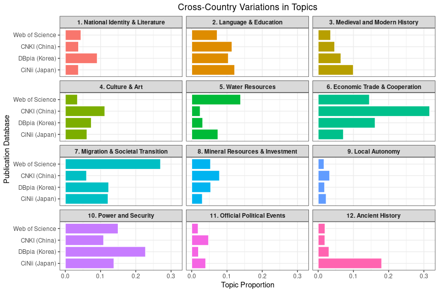

Replication of Central Asian Studies in East Asian Languages:
Quantitative Meta-Analysis
================
Gento Kato
November 3, 2023

# Preparation

``` r
## Clean Up Space
rm(list=ls())

# Set working directory
setwd(dirname(rstudioapi::getActiveDocumentContext()$path))

## Required Packages
library(stringr)
library(pbapply)
library(quanteda)
library(quanteda.textplots)
library(wordcloud)

## Import Data

## Web of Science ##
dws <- readRDS("wos/wos_res_230316.rds")
dws$country <- "Web of Science"
dws$id <- paste0("WS-",sprintf("%.5d",1:nrow(dws)))
dws$year <- dws$PY
dws$title <- dws$TI
dws$title_en <- tolower(dws$TI)
dws$title_eng <- "en"
dws <- subset(dws, year %in% 2000:2022)
dws$journal <- tolower(dws$JI)

## Japan ##
djp <- readRDS("japan/ca_articles_japan_230324.rds")
djp$country <- "Japan"
djp$id <- paste0("JP-",sprintf("%.5d",djp$id))
djp$year <- as.numeric(gsub("\\-.*$", "", djp$date))
djp$title_en <- tolower(djp$title_en)

## Korea ##
dkr <- readRDS("korea/ca_articles_korea_230326_key.rds")
dkr$country <- "Korea"
dkr$id <- paste0("KR-",sprintf("%.5d",dkr$id))
dkr$title_en <- tolower(dkr$title_en)

## China ##
dch <- readRDS("china/ca_articles_china_230326_ssh.rds")
dch$country <- "China"
dch$id <- paste0("CH-",sprintf("%.5d",dch$id))
dch$title_en <- tolower(dch$title_en)
dch$journal <- dch$src_literature
colnames(dch) <- names(dch)

## Combine Data ##
d <- rbind(dws[,c("id","country","year","title_en","title","journal")],
           dch[,c("id","country","year","title_en","title","journal")],
           dkr[,c("id","country","year","title_en","title","journal")],
           djp[,c("id","country","year","title_en","title","journal")])
d$country <- factor(d$country, 
                    levels = c("Web of Science","China",
                               "Korea","Japan"))
```

# Preprocess Dataset for Text Analysis

``` r
## Create Character Vector of Title + Abstract
tvec_tgt <- d$title_en %>% 
  str_squish() # clean unnecessary spacing & line breaks
head(tvec_tgt)
```

    ## [1] "ethics and journalism in central asia: a comparative study of kazakhstan, kyrgyzstan, tajikistan and uzbekistan"                           
    ## [2] "perceptions of foreign investors on the tourism market in central asia including kyrgyzstan, kazakhstan, uzbekistan, turkmenistan"         
    ## [3] "educational research in central asia: methodological and ethical dilemmas in kazakhstan, kyrgyzstan and tajikistan"                        
    ## [4] "evaluations of perestroika in post-soviet central asia: public views in contemporary uzbekistan, kazakhstan and kyrgyzstan"                
    ## [5] "impact of remittances and international migration on poverty in central asia: the cases of the kyrgyz republic, tajikistan, and uzbekistan"
    ## [6] "english in higher education in the kyrgyz republic, tajikistan, and uzbekistan"

``` r
## Some Adjustment to the text
## Central Asia Related
tvec_tgt <- gsub("asian", "asia", tvec_tgt)
tvec_tgt <- gsub("\\-asia", " asia", tvec_tgt)
tvec_tgt <- gsub("asia\\-", "asia ", tvec_tgt)
tvec_tgt <- gsub("asia('|)s", "asia", tvec_tgt)
tvec_tgt <- gsub("kazakhstani", "kazakh", tvec_tgt)
tvec_tgt <- gsub("kazakhstan", "kazakh", tvec_tgt)
tvec_tgt <- gsub("\\-kazakh", " kazakh", tvec_tgt)
tvec_tgt <- gsub("kazakh\\-", "kazakh ", tvec_tgt)
tvec_tgt <- gsub("kazakh('|)s", "kazakh", tvec_tgt)
tvec_tgt <- gsub("kyrgyzstani", "kyrgyz", tvec_tgt)
tvec_tgt <- gsub("kyrgyzstan", "kyrgyz", tvec_tgt)
tvec_tgt <- gsub("\\-kyrgyz", " kyrgyz", tvec_tgt)
tvec_tgt <- gsub("kyrgyz\\-", "kyrgyz ", tvec_tgt)
tvec_tgt <- gsub("kyrgyz('|)s", "kyrgyz", tvec_tgt)
tvec_tgt <- gsub("tajikistani", "tajik", tvec_tgt)
tvec_tgt <- gsub("tajikistan", "tajik", tvec_tgt)
tvec_tgt <- gsub("\\-tajik", " tajik", tvec_tgt)
tvec_tgt <- gsub("tajik\\-", "tajik ", tvec_tgt)
tvec_tgt <- gsub("tajik('|)s", "tajik", tvec_tgt)
tvec_tgt <- gsub("uzbekistani", "uzbek", tvec_tgt)
tvec_tgt <- gsub("uzbekistan", "uzbek", tvec_tgt)
tvec_tgt <- gsub("\\-uzbek", " uzbek", tvec_tgt)
tvec_tgt <- gsub("uzbek\\-", "uzbek ", tvec_tgt)
tvec_tgt <- gsub("uzbek('|)s", "uzbek", tvec_tgt)
tvec_tgt <- gsub("turkmenistani", "turkmen", tvec_tgt)
tvec_tgt <- gsub("turkmenistan", "turkmen", tvec_tgt)
tvec_tgt <- gsub("\\-turkmen", " turkmen", tvec_tgt)
tvec_tgt <- gsub("turkmen\\-", "turkmen ", tvec_tgt)
tvec_tgt <- gsub("turkmen('|)s", "turkmen", tvec_tgt)
tvec_tgt <- gsub("afghanistani", "afghan", tvec_tgt)
tvec_tgt <- gsub("afghanistan", "afghan", tvec_tgt)
tvec_tgt <- gsub("\\-afghan", " afghan", tvec_tgt)
tvec_tgt <- gsub("afghan\\-", "afghan ", tvec_tgt)
tvec_tgt <- gsub("afghan('|)s", "afghan", tvec_tgt)
## East Asia Related
tvec_tgt <- gsub("chinese", "china", tvec_tgt)
tvec_tgt <- gsub("\\-china", " china", tvec_tgt)
tvec_tgt <- gsub("china\\-", "china ", tvec_tgt)
tvec_tgt <- gsub("(^| )sino\\-", "china ", tvec_tgt)
tvec_tgt <- gsub("china('|)s", "china", tvec_tgt)
tvec_tgt <- gsub("japanese", "japan", tvec_tgt)
tvec_tgt <- gsub("\\-japan", " japan", tvec_tgt)
tvec_tgt <- gsub("japan\\-", "japan ", tvec_tgt)
tvec_tgt <- gsub("japan('|)s", "japan", tvec_tgt)
tvec_tgt <- gsub("korean", "korea", tvec_tgt)
tvec_tgt <- gsub("\\-korea", " korea", tvec_tgt)
tvec_tgt <- gsub("\\-south korea", "south korea", tvec_tgt)
tvec_tgt <- gsub("\\-north korea", "north korea", tvec_tgt)
tvec_tgt <- gsub("korea\\-", "korea ", tvec_tgt)
tvec_tgt <- gsub("korea('|)s", "korea", tvec_tgt)
tvec_tgt <- gsub("taiwanese", "taiwan", tvec_tgt)
tvec_tgt <- gsub("\\-taiwan", " taiwan", tvec_tgt)
tvec_tgt <- gsub("taiwan\\-", "taiwan ", tvec_tgt)
tvec_tgt <- gsub("taiwan('|)s", "taiwan", tvec_tgt)
tvec_tgt <- gsub("\\-xinjiang", " xinjiang", tvec_tgt)
tvec_tgt <- gsub("xinjiang\\-", "xinjiang ", tvec_tgt)
tvec_tgt <- gsub("xinjiang('|)s", "xinjiang", tvec_tgt)
tvec_tgt <- gsub("\\-uyghur", " uyghur", tvec_tgt)
tvec_tgt <- gsub("uyghur\\-", "uyghur ", tvec_tgt)
tvec_tgt <- gsub("uyghur('|)s", "uyghur", tvec_tgt)
tvec_tgt <- gsub("ili kazakh( |$)", "ili-kazakh ", tvec_tgt) # Ili-Kazakh separate from Kazakh
tvec_tgt <- gsub("ilikazakh( |$)", "ili-kazakh ", tvec_tgt) # Ili-Kazakh separate from Kazakh
tvec_tgt <- gsub("yili\\-kazakh( |$)", "ili-kazakh ", tvec_tgt) # Ili-Kazakh separate from Kazakh
tvec_tgt <- gsub("(^| )yili( |$)", " ili ", tvec_tgt)
tvec_tgt <- gsub("\\-yili", " ili", tvec_tgt)
tvec_tgt <- gsub("yili\\-", "ili ", tvec_tgt)
tvec_tgt <- gsub("ili('|)s", "ili", tvec_tgt)
tvec_tgt <- gsub("mongolian", "mongol", tvec_tgt)
tvec_tgt <- gsub("\\-mongol", " mongol", tvec_tgt)
tvec_tgt <- gsub("mongol\\-", "mongol ", tvec_tgt)
tvec_tgt <- gsub("mongol('|)s", "mongol", tvec_tgt)
## South Asia 
tvec_tgt <- gsub("indian", "india", tvec_tgt)
tvec_tgt <- gsub("\\-india", " india", tvec_tgt)
tvec_tgt <- gsub("india\\-", "india ", tvec_tgt)
tvec_tgt <- gsub("india('|)s", "india", tvec_tgt)
tvec_tgt <- gsub("pakistani", "pakistan", tvec_tgt)
tvec_tgt <- gsub("\\-pakistan", " pakistan", tvec_tgt)
tvec_tgt <- gsub("pakistan\\-", "pakistan ", tvec_tgt)
tvec_tgt <- gsub("pakistan('|)s", "pakistan", tvec_tgt)
#### No Bangladesh
tvec_tgt <- gsub("\\-bhutan", " bhutan", tvec_tgt)
tvec_tgt <- gsub("bhutan\\-", "bhutan ", tvec_tgt)
tvec_tgt <- gsub("bhutan('|)s", "bhutan", tvec_tgt)
tvec_tgt <- gsub("nepali", "nepal", tvec_tgt)
tvec_tgt <- gsub("\\-nepal", " nepal", tvec_tgt)
tvec_tgt <- gsub("nepal\\-", "nepal ", tvec_tgt)
tvec_tgt <- gsub("nepal('|)s", "nepal", tvec_tgt)
#### No Sri Lanka
## Southeast Asia
#### There is asean, no transformation
#### No Brunei
#### No Cambodia
#### No East Timor
#### No Indonesia
#### NO Laos
#### No Malaysia
#### No Myanmar
tvec_tgt <- gsub("philippino", "philippines", tvec_tgt)
tvec_tgt <- gsub("\\-philippines", " philippines", tvec_tgt)
tvec_tgt <- gsub("philippines\\-", "philippines ", tvec_tgt)
tvec_tgt <- gsub("philippines('|)s", "philippines", tvec_tgt)
tvec_tgt <- gsub("thailand", "thai", tvec_tgt)
tvec_tgt <- gsub("\\-thai", " thai", tvec_tgt)
tvec_tgt <- gsub("thai\\-", "thai ", tvec_tgt)
tvec_tgt <- gsub("thai('|)s", "thai", tvec_tgt)
tvec_tgt <- gsub("singaporean", "singapore", tvec_tgt)
tvec_tgt <- gsub("\\-singapore", " singapore", tvec_tgt)
tvec_tgt <- gsub("singapore\\-", "singapore ", tvec_tgt)
tvec_tgt <- gsub("singapore('|)s", "singapore", tvec_tgt)
tvec_tgt <- gsub("vietnamese", "vietnam", tvec_tgt)
tvec_tgt <- gsub("\\-vietnam", " vietnam", tvec_tgt)
tvec_tgt <- gsub("vietnam\\-", "vietnam ", tvec_tgt)
tvec_tgt <- gsub("vietnam('|)s", "vietnam", tvec_tgt)
## Russia and Post Soviet
tvec_tgt <- gsub("russian", "russia", tvec_tgt)
tvec_tgt <- gsub("\\-russia", " russia", tvec_tgt)
tvec_tgt <- gsub("russia\\-", "russia ", tvec_tgt)
tvec_tgt <- gsub("russia('|)s", "russia", tvec_tgt)
tvec_tgt <- gsub("\\-soviet", " soviet", tvec_tgt)
tvec_tgt <- gsub("soviet\\-", "soviet ", tvec_tgt)
tvec_tgt <- gsub("soviet('|)s", "soviet", tvec_tgt)
tvec_tgt <- gsub("(former|post) soviet", "post-soviet", tvec_tgt)
tvec_tgt <- gsub("belarusian", "belarus", tvec_tgt)
tvec_tgt <- gsub("\\-belarus", " belarus", tvec_tgt)
tvec_tgt <- gsub("belarus\\-", "belarus ", tvec_tgt)
tvec_tgt <- gsub("belarus'", "belarus", tvec_tgt)
tvec_tgt <- gsub("moldovan|moldovian", "moldova", tvec_tgt)
tvec_tgt <- gsub("\\-moldova", " moldova", tvec_tgt)
tvec_tgt <- gsub("moldova\\-", "moldova ", tvec_tgt)
tvec_tgt <- gsub("moldova('|)s", "moldova", tvec_tgt)
tvec_tgt <- gsub("ukrainian", "ukraine", tvec_tgt)
tvec_tgt <- gsub("\\-ukraine", " ukraine", tvec_tgt)
tvec_tgt <- gsub("ukraine\\-", "ukraine ", tvec_tgt)
tvec_tgt <- gsub("ukraine('|)s", "ukraine", tvec_tgt)
tvec_tgt <- gsub("armenian", "armenia", tvec_tgt)
tvec_tgt <- gsub("\\-armenia", " armenia", tvec_tgt)
tvec_tgt <- gsub("armenia\\-", "armenia ", tvec_tgt)
tvec_tgt <- gsub("armenia('|)s", "armenia", tvec_tgt)
tvec_tgt <- gsub("azerbaijani", "azerbaijan", tvec_tgt)
tvec_tgt <- gsub("\\-azerbaijan", " azerbaijan", tvec_tgt)
tvec_tgt <- gsub("azerbaijan\\-", "azerbaijan ", tvec_tgt)
tvec_tgt <- gsub("azerbaijan('|)s", "azerbaijan", tvec_tgt)
tvec_tgt <- gsub("georgian", "georgia", tvec_tgt)
tvec_tgt <- gsub("\\-georgia", " georgia", tvec_tgt)
tvec_tgt <- gsub("georgia\\-", "georgia ", tvec_tgt)
tvec_tgt <- gsub("georgia('|)s", "georgia", tvec_tgt)
## Middle East/West Asia (as they appear at least once)
tvec_tgt <- gsub("turkish", "turkey", tvec_tgt)
tvec_tgt <- gsub("\\-turkey", " turkey", tvec_tgt)
tvec_tgt <- gsub("turkey\\-", "turkey ", tvec_tgt)
tvec_tgt <- gsub("turkey('|)s", "turkey", tvec_tgt)
#### No Oman
tvec_tgt <- gsub("saudi arabian", "saudi arabia", tvec_tgt)
tvec_tgt <- gsub("\\-saudi( arabia|)", " saudi arabia", tvec_tgt)
tvec_tgt <- gsub("saudi( arabia|)\\-", "saudi arabia ", tvec_tgt)
tvec_tgt <- gsub("saudi( arabia|)('|)s", "saudi arabia", tvec_tgt)
#### uae appears, no transformation made
tvec_tgt <- gsub("iraqi", "iraq", tvec_tgt)
tvec_tgt <- gsub("\\-iraq", " iraq", tvec_tgt)
tvec_tgt <- gsub("iraq\\-", "iraq ", tvec_tgt)
tvec_tgt <- gsub("iraq('|)s", "iraq", tvec_tgt)
tvec_tgt <- gsub("israeli", "israel", tvec_tgt)
tvec_tgt <- gsub("\\-israel", " israel", tvec_tgt)
tvec_tgt <- gsub("israel\\-", "israel ", tvec_tgt)
tvec_tgt <- gsub("israel('|)s", "israel", tvec_tgt)
tvec_tgt <- gsub("jordanian", "jordan", tvec_tgt)
tvec_tgt <- gsub("\\-jordan", " jordan", tvec_tgt)
tvec_tgt <- gsub("jordan\\-", "jordan ", tvec_tgt)
tvec_tgt <- gsub("jordan('|)s", "jordan", tvec_tgt)
tvec_tgt <- gsub("syrian", "syria", tvec_tgt)
tvec_tgt <- gsub("\\-syria", " syria", tvec_tgt)
tvec_tgt <- gsub("syria\\-", "syria ", tvec_tgt)
tvec_tgt <- gsub("syria('|)s", "syria", tvec_tgt)
tvec_tgt <- gsub("iranian", "iran", tvec_tgt)
tvec_tgt <- gsub("\\-iran", " iran", tvec_tgt)
tvec_tgt <- gsub("iran\\-", "iran ", tvec_tgt)
tvec_tgt <- gsub("iran('|)s", "iran", tvec_tgt)
## West Related (according to Huntington's definition of western world)
tvec_tgt <- gsub("european", "europe", tvec_tgt)
tvec_tgt <- gsub("\\-europe", " europe", tvec_tgt)
tvec_tgt <- gsub("europe\\-", "europe ", tvec_tgt)
tvec_tgt <- gsub("europe('|)s", "europe", tvec_tgt)
tvec_tgt <- gsub("\\-eu( |$)", " eu ", tvec_tgt)
tvec_tgt <- gsub("eu\\-", "eu ", tvec_tgt)
tvec_tgt <- gsub("eu('|)s", "eu", tvec_tgt)
### Specific countries as they appear once or more
tvec_tgt <- gsub("u\\.s\\.( |$)", "usa ", tvec_tgt)
#### also search for america
tvec_tgt <- gsub("canadian", "canada", tvec_tgt)
tvec_tgt <- gsub("\\-canada", " canada", tvec_tgt)
tvec_tgt <- gsub("canada\\-", "canada ", tvec_tgt)
tvec_tgt <- gsub("canada('|)s", "canada", tvec_tgt)
tvec_tgt <- gsub("australian", "australia", tvec_tgt)
tvec_tgt <- gsub("\\-australia", " australia", tvec_tgt)
tvec_tgt <- gsub("australia\\-", "australia ", tvec_tgt)
tvec_tgt <- gsub("australia('|)s", "australia", tvec_tgt)
tvec_tgt <- gsub("french", "france", tvec_tgt)
tvec_tgt <- gsub("\\-france", " france", tvec_tgt)
tvec_tgt <- gsub("france\\-", "france ", tvec_tgt)
tvec_tgt <- gsub("france('|)(e|)s", "france", tvec_tgt)
tvec_tgt <- gsub("spanish", "spain", tvec_tgt)
tvec_tgt <- gsub("\\-spain", " spain", tvec_tgt)
tvec_tgt <- gsub("spain\\-", "spain ", tvec_tgt)
tvec_tgt <- gsub("spain('|)(e|)s", "spain", tvec_tgt)
tvec_tgt <- gsub("swedish", "sweden", tvec_tgt)
tvec_tgt <- gsub("\\-sweden", " sweden", tvec_tgt)
tvec_tgt <- gsub("sweden\\-", "sweden ", tvec_tgt)
tvec_tgt <- gsub("sweden('|)(e|)s", "sweden", tvec_tgt)
#### NO norway
tvec_tgt <- gsub("german", "germany", tvec_tgt)
tvec_tgt <- gsub("\\-germany", " germany", tvec_tgt)
tvec_tgt <- gsub("germany\\-", "germany ", tvec_tgt)
tvec_tgt <- gsub("germany('|)(e|)s", "germany", tvec_tgt)
#### No Finland
tvec_tgt <- gsub("italian", "italy", tvec_tgt)
tvec_tgt <- gsub("\\-italy", " italy", tvec_tgt)
tvec_tgt <- gsub("italy\\-", "italy ", tvec_tgt)
tvec_tgt <- gsub("italy('|)(e|)s", "italy", tvec_tgt)
tvec_tgt <- gsub("(^|)uk( |$)", " britain ", tvec_tgt)
tvec_tgt <- gsub("british", "britain", tvec_tgt)
tvec_tgt <- gsub("\\-britain", " britain", tvec_tgt)
tvec_tgt <- gsub("britain\\-", "britain ", tvec_tgt)
tvec_tgt <- gsub("britain('|)(e|)s", "britain", tvec_tgt)
#### No Iceland
#### No Portugal
tvec_tgt <- gsub("austrian", "austria", tvec_tgt)
tvec_tgt <- gsub("\\-austria", " austria", tvec_tgt)
tvec_tgt <- gsub("austria\\-", "austria ", tvec_tgt)
tvec_tgt <- gsub("austria('|)(e|)s", "austria", tvec_tgt)
#### No Ireland
#### No Denmark
#### No Swizerland 
#### No Netherlands
#### No Belgium
#### No Luxembourg
#### No Andorra
#### No Malta
#### No Liechtenstein
#### NO San Marino
#### No Monaco
#### No Vatican
#### No Cyprus
### Eastern Europe
tvec_tgt <- gsub("polish", "poland", tvec_tgt)
tvec_tgt <- gsub("\\-poland", " poland", tvec_tgt)
tvec_tgt <- gsub("poland\\-", "poland ", tvec_tgt)
tvec_tgt <- gsub("poland('|)(e|)s", "poland", tvec_tgt)
#### No Romania
tvec_tgt <- gsub("bulgarian", "bulgaria", tvec_tgt)
tvec_tgt <- gsub("\\-bulgaria", " bulgaria", tvec_tgt)
tvec_tgt <- gsub("bulgaria\\-", "bulgaria ", tvec_tgt)
tvec_tgt <- gsub("bulgaria('|)(e|)s", "bulgaria", tvec_tgt)
### NO Hungary
tvec_tgt <- gsub("\\-yugoslavia", " yugoslavia", tvec_tgt)
tvec_tgt <- gsub("yugoslavia\\-", "yugoslavia ", tvec_tgt)
tvec_tgt <- gsub("yugoslavia('|)(e|)s", "yugoslavia", tvec_tgt)
tvec_tgt <- gsub("serbian", "serbia", tvec_tgt)
tvec_tgt <- gsub("\\-serbia", " serbia", tvec_tgt)
tvec_tgt <- gsub("serbia\\-", "serbia ", tvec_tgt)
tvec_tgt <- gsub("serbia('|)(e|)s", "serbia", tvec_tgt)
#### Czech republic as it is
#### NO Lithuania
tvec_tgt <- gsub("estonian", "estonia", tvec_tgt)
tvec_tgt <- gsub("\\-estonia", " estonia", tvec_tgt)
tvec_tgt <- gsub("estonia\\-", "estonia ", tvec_tgt)
tvec_tgt <- gsub("estonia('|)(e|)s", "estonia", tvec_tgt)
tvec_tgt <- gsub("latvian", "latvia", tvec_tgt)
tvec_tgt <- gsub("\\-latvia", " latvia", tvec_tgt)
tvec_tgt <- gsub("latvia\\-", "latvia ", tvec_tgt)
tvec_tgt <- gsub("latvia('|)(e|)s", "latvia", tvec_tgt)
#### No Croatia
#### No Bosnia and Herzegovia
#### No Slovakia
tvec_tgt <- gsub("albanian", "albania", tvec_tgt)
tvec_tgt <- gsub("\\-albania", " albania", tvec_tgt)
tvec_tgt <- gsub("albania\\-", "albania ", tvec_tgt)
tvec_tgt <- gsub("albania('|)(e|)s", "albania", tvec_tgt)
#### No Macedonia
#### No Slovenia
#### No Montenegro
### Adjust regions within country (except for korea)
tvec_tgt <- gsub("northern", "north", tvec_tgt)
tvec_tgt <- gsub("southern", "south", tvec_tgt)
tvec_tgt <- gsub("western", "west", tvec_tgt)
tvec_tgt <- gsub("eastern", "east", tvec_tgt)
tvec_tgt <- gsub("(^| )west region", " west-region", tvec_tgt)
tvec_tgt <- gsub("(^| )south region", " south-region", tvec_tgt)
tvec_tgt <- gsub("(^| )north region", " north-region", tvec_tgt)
tvec_tgt <- gsub("(^| )east region", " east-region", tvec_tgt)
tvec_tgt <- gsub("east and central asia", "east asia and central asia", tvec_tgt)
tvec_tgt <- gsub("south and central asia", "south asia and central asia", tvec_tgt)
tvec_tgt <- gsub("west and central asia", "west asia and central asia", tvec_tgt)
tvec_tgt <- gsub("(north|south|west|east|northwest|northeast|southwest|southeast|central) central asia", "central asia", tvec_tgt)
tvec_tgt <- gsub("(north|south|west|east|northwest|northeast|southwest|southeast|central) kazakh", "kazakh", tvec_tgt)
tvec_tgt <- gsub("(north|south|west|east|northwest|northeast|southwest|southeast|central) kyrgyz", "kyrgyz", tvec_tgt)
tvec_tgt <- gsub("(north|south|west|east|northwest|northeast|southwest|southeast|central) tajik", "tajik", tvec_tgt)
tvec_tgt <- gsub("(north|south|west|east|northwest|northeast|southwest|southeast|central) uzbek", "uzbek", tvec_tgt)
tvec_tgt <- gsub("(north|south|west|east|northwest|northeast|southwest|southeast|central) turkmen", "turkmen", tvec_tgt)
tvec_tgt <- gsub("(north|south|west|east|northwest|northeast|southwest|southeast|central) xingiang", "xingiang", tvec_tgt)
tvec_tgt <- gsub("(north|south|west|east|northwest|northeast|southwest|southeast|central) mongol", "mongol", tvec_tgt)
tvec_tgt <- gsub("(north|south|west|east|northwest|northeast|southwest|southeast|central) afghan", "afghan", tvec_tgt)
tvec_tgt <- gsub("(north|south|east|northeast|southwest|southeast|central) china", "china", tvec_tgt)
tvec_tgt <- gsub("(north|south|west|east|northwest|northeast|southwest|southeast|central) japan", "japan", tvec_tgt)
tvec_tgt <- gsub("(north|south|west|east|northwest|northeast|southwest|southeast|central) taiwan", "taiwan", tvec_tgt)
tvec_tgt <- gsub("(north|south|west|east|northwest|northeast|southwest|southeast|central) india", "india", tvec_tgt)
tvec_tgt <- gsub("(north|south|west|east|northwest|northeast|southwest|southeast|central) pakistan", "pakistan", tvec_tgt)
tvec_tgt <- gsub("(north|south|west|east|northwest|northeast|southwest|southeast|central) nepal", "nepal", tvec_tgt)
tvec_tgt <- gsub("(north|south|west|east|northwest|northeast|southwest|southeast|central) bhutan", "bhutan", tvec_tgt)
tvec_tgt <- gsub("(north|south|west|east|northwest|northeast|southwest|southeast|central) philippines", "philippines", tvec_tgt)
tvec_tgt <- gsub("(north|south|west|east|northwest|northeast|southwest|southeast|central) thai", "thai", tvec_tgt)
tvec_tgt <- gsub("(north|south|west|east|northwest|northeast|southwest|southeast|central) vietnam", "vietnam", tvec_tgt)
tvec_tgt <- gsub("(north|south|west|east|northwest|northeast|southwest|southeast|central) russia", "russia", tvec_tgt)
tvec_tgt <- gsub("(north|south|west|east|northwest|northeast|southwest|southeast|central) soviet", "soviet", tvec_tgt)
tvec_tgt <- gsub("(north|south|west|east|northwest|northeast|southwest|southeast|central) post-soviet", "post-soviet", tvec_tgt)
tvec_tgt <- gsub("(north|south|west|east|northwest|northeast|southwest|southeast|central) belarus", "belarus", tvec_tgt)
tvec_tgt <- gsub("(north|south|west|east|northwest|northeast|southwest|southeast|central) moldova", "moldova", tvec_tgt)
tvec_tgt <- gsub("(north|south|west|east|northwest|northeast|southwest|southeast|central) ukraine", "ukraine", tvec_tgt)
tvec_tgt <- gsub("(north|south|west|east|northwest|northeast|southwest|southeast|central) armenia", "armenia", tvec_tgt)
tvec_tgt <- gsub("(north|south|west|east|northwest|northeast|southwest|southeast|central) azerbaijan", "azerbaijan", tvec_tgt)
tvec_tgt <- gsub("(north|south|west|east|northwest|northeast|southwest|southeast|central) georgia", "georgia", tvec_tgt)
tvec_tgt <- gsub("(north|south|west|east|northwest|northeast|southwest|southeast|central) iraq", "iraq", tvec_tgt)
tvec_tgt <- gsub("(north|south|west|east|northwest|northeast|southwest|southeast|central) israel", "israel", tvec_tgt)
tvec_tgt <- gsub("(north|south|west|east|northwest|northeast|southwest|southeast|central) jordan", "jordan", tvec_tgt)
tvec_tgt <- gsub("(north|south|west|east|northwest|northeast|southwest|southeast|central) syria", "syria", tvec_tgt)
tvec_tgt <- gsub("(north|south|west|east|northwest|northeast|southwest|southeast|central) iran", "iran", tvec_tgt)
tvec_tgt <- gsub("(north|south|west|east|northwest|northeast|southwest|southeast|central) usa", "usa", tvec_tgt)
tvec_tgt <- gsub("(north|south|west|east|northwest|northeast|southwest|southeast|central) canada", "canada", tvec_tgt)
tvec_tgt <- gsub("(north|south|west|east|northwest|northeast|southwest|southeast|central) australia", "australia", tvec_tgt)
tvec_tgt <- gsub("(north|south|west|east|northwest|northeast|southwest|southeast|central) france", "france", tvec_tgt)
tvec_tgt <- gsub("(north|south|west|east|northwest|northeast|southwest|southeast|central) spain", "spain", tvec_tgt)
tvec_tgt <- gsub("(north|south|west|east|northwest|northeast|southwest|southeast|central) sweden", "sweden", tvec_tgt)
tvec_tgt <- gsub("(north|south|west|east|northwest|northeast|southwest|southeast|central) germany", "germany", tvec_tgt)
tvec_tgt <- gsub("(north|south|west|east|northwest|northeast|southwest|southeast|central) italy", "italy", tvec_tgt)
tvec_tgt <- gsub("(north|south|west|east|northwest|northeast|southwest|southeast|central) britain", "britain", tvec_tgt)
tvec_tgt <- gsub("(north|south|west|east|northwest|northeast|southwest|southeast|central) austria", "austria", tvec_tgt)
tvec_tgt <- gsub("(north|south|west|east|northwest|northeast|southwest|southeast|central) poland", "poland", tvec_tgt)
tvec_tgt <- gsub("(north|south|west|east|northwest|northeast|southwest|southeast|central) romania", "romania", tvec_tgt)
tvec_tgt <- gsub("(north|south|west|east|northwest|northeast|southwest|southeast|central) bulgaria", "bulgaria", tvec_tgt)
tvec_tgt <- gsub("(north|south|west|east|northwest|northeast|southwest|southeast|central) yugoslavia", "yugoslavia", tvec_tgt)
tvec_tgt <- gsub("(north|south|west|east|northwest|northeast|southwest|southeast|central) serbia", "serbia", tvec_tgt)
tvec_tgt <- gsub("(north|south|west|east|northwest|northeast|southwest|southeast|central) estonia", "estonia", tvec_tgt)
tvec_tgt <- gsub("(north|south|west|east|northwest|northeast|southwest|southeast|central) latvia", "latvia", tvec_tgt)
tvec_tgt <- gsub("(north|south|west|east|northwest|northeast|southwest|southeast|central) albania", "albania", tvec_tgt)
## Other geographic names fix
tvec_tgt <- gsub("bukharan", "bukhara", tvec_tgt)
tvec_tgt <- gsub("china west", "china-west", tvec_tgt)
tvec_tgt <- gsub("northwest china", "northwest-china", tvec_tgt)
tvec_tgt <- gsub("(^| )west china", " west-china", tvec_tgt)
tvec_tgt <- gsub("(^| )west liao", " liao", tvec_tgt)
tvec_tgt <- gsub("(^| )west half", " west-half", tvec_tgt)
tvec_tgt <- gsub("(^| )west drilling", " western-drilling", tvec_tgt)
tvec_tgt <- gsub("(^| )west station", " station", tvec_tgt)
tvec_tgt <- gsub("(^| )west chu", " chu", tvec_tgt)
tvec_tgt <- gsub("(^| )american west( |$)", " america ", tvec_tgt)
tvec_tgt[grep("西部", d$title)][grep("(^| )west( |$)",tvec_tgt[grep("西部", d$title)])] <- 
  gsub("west", "china-west", tvec_tgt[grep("西部", d$title)][grep("(^| )west( |$)",tvec_tgt[grep("西部", d$title)])])
tvec_tgt[grep("西迁", d$title)][grep("(^| )west( |$)",tvec_tgt[grep("西迁", d$title)])] <- 
  gsub("xibe west", "xibe", tvec_tgt[grep("西迁", d$title)][grep("(^| )west( |$)",tvec_tgt[grep("西迁", d$title)])])
tvec_tgt[grep("西迁", d$title)][grep("(^| )west( |$)",tvec_tgt[grep("西迁", d$title)])] <- 
  gsub("west migration", "migration", tvec_tgt[grep("西迁", d$title)][grep("(^| )west( |$)",tvec_tgt[grep("西迁", d$title)])])
tvec_tgt[grep("西域", d$title)][grep("(^| )west( |$)",tvec_tgt[grep("西域", d$title)])] <- 
  gsub("west", "west-part", tvec_tgt[grep("西域", d$title)][grep("(^| )west( |$)",tvec_tgt[grep("西域", d$title)])])
tvec_tgt <- gsub("(^| )west-part asia", " west asia", tvec_tgt)
## Other fixes
tvec_tgt <- gsub("one belt\\-one road", "one belt one road", tvec_tgt) 
tvec_tgt <- gsub("belt (and|\\&) road", "one belt one road", tvec_tgt) 
tvec_tgt <- gsub("one belt (and|\\&) one road", "one belt one road", tvec_tgt) 
tvec_tgt <- gsub("belt road", "one belt one road", tvec_tgt) 
tvec_tgt <- gsub("opening to the west", "opening-to-the-west", tvec_tgt) 
tvec_tgt <- gsub("web site", "website", tvec_tgt)
tvec_tgt <- gsub("great powers", "great power", tvec_tgt)
tvec_tgt <- gsub("great games", "great game", tvec_tgt)
tvec_tgt <- gsub("great influences", "great influence", tvec_tgt)
tvec_tgt <- gsub("geopolitical and economic game", "geopolitical game and economic game", tvec_tgt)
tvec_tgt <- gsub("post\\-9\\/11", "post-9-11", tvec_tgt)

## Squish Everything
tvec_tgt <- str_squish(tvec_tgt)

## Generate Corpus
cs_tgt <- corpus(tvec_tgt, docnames=d$id)
head(cs_tgt)
```

    ## Corpus consisting of 6 documents.
    ## WS-00001 :
    ## "ethics and journalism in central asia: a comparative study o..."
    ## 
    ## WS-00002 :
    ## "perceptions of foreign investors on the tourism market in ce..."
    ## 
    ## WS-00003 :
    ## "educational research in central asia: methodological and eth..."
    ## 
    ## WS-00004 :
    ## "evaluations of perestroika in post-soviet central asia: publ..."
    ## 
    ## WS-00005 :
    ## "impact of remittances and international migration on poverty..."
    ## 
    ## WS-00006 :
    ## "english in higher education in the kyrgyz republic, tajik, a..."

``` r
## Generate Tokens
### Multi-word terms to be detected.
multiword <- c("central asia", "south korea", "north korea",
               "silk road", "economic belt", "higher education",
               "nuclear power", 
               "power industry","power sector",
               "power industries","power sectors",
               "one belt one road", "one belt", "hong kong",
               "prime minister", 
               "west asia", "east asia", "southeast asia", 
               "south asia",
               "middle east", "far east", "saudi arabia",
               "st petersburg",
               # "west europe", 
               "east europe", "central europe", 
               "west world", #"opening to west", 
               "west countries","west broadcasting", 
               #"west sky", "red west",
               "west fanned",
               "latin america", "north america", 
               "central america",
               "small game",
               "soft power","power politics","state power",
               "great power game","great game","big game",
               "great power","great influence contest",
               "power contest",
               "central asia game","geopolitical game",
               "security game","energy game", "strategic game",
               "economic game","military base game",
               "military game", "multi-state game",
               "russia american game","russia us game",
               "usa russia game", "political game",
               "energy cooperation game","geostrategic game",
               "chess game") 
tk_tgt <- tokens(cs_tgt, remove_punct = TRUE) %>% 
  tokens_compound(pattern=phrase(multiword))

## Keywords in Context (show some examples)
head(kwic(tk_tgt, "central_asia"))
```

    ## Keyword-in-context with 6 matches.                                                                          
    ##   [WS-00001, 5]                  ethics and journalism in | central_asia |
    ##  [WS-00002, 10]                  on the tourism market in | central_asia |
    ##   [WS-00003, 4]                   educational research in | central_asia |
    ##   [WS-00004, 6] evaluations of perestroika in post-soviet | central_asia |
    ##  [WS-00005, 10]     international migration on poverty in | central_asia |
    ##   [WS-00007, 5]    microfinance institution activities in | central_asia |
    ##                                        
    ##  a comparative study of kazakh         
    ##  including kyrgyz kazakh uzbek turkmen 
    ##  methodological and ethical dilemmas in
    ##  public views in contemporary uzbek    
    ##  the cases of the kyrgyz               
    ##  a case study of tajik

``` r
head(kwic(tk_tgt, "kazakh"))
```

    ## Keyword-in-context with 6 matches.                                                                      
    ##  [WS-00001, 10]         central_asia a comparative study of | kazakh |
    ##  [WS-00002, 13]     market in central_asia including kyrgyz | kazakh |
    ##  [WS-00003, 10]      methodological and ethical dilemmas in | kazakh |
    ##  [WS-00004, 12]          public views in contemporary uzbek | kazakh |
    ##   [WS-00008, 8]              survey of business students in | kazakh |
    ##  [WS-00011, 14] nationalising authoritarianism in uzbek and | kazakh |
    ##                        
    ##  kyrgyz tajik and uzbek
    ##  uzbek turkmen         
    ##  kyrgyz and tajik      
    ##  and kyrgyz            
    ##  kyrgyz and uzbek      
    ## 

``` r
head(kwic(tk_tgt, "ili-kazakh"))
```

    ## Keyword-in-context with 6 matches.                                                                        
    ##  [CH-00007, 12]          windows of traditional houses in | ili-kazakh |
    ##   [CH-00155, 9]        strategy of tourism development in | ili-kazakh |
    ##  [CH-00458, 15] the context of one_belt_one_road --taking | ili-kazakh |
    ##  [CH-00485, 17]                of farmers and herdsmen in | ili-kazakh |
    ##  [CH-00489, 20]             regions taking kuitun city of | ili-kazakh |
    ##  [CH-00628, 11]            quality changes in yining city | ili-kazakh |
    ##                                           
    ##  autonomous prefecture                    
    ##  autonomous prefecture--nilek county as an
    ##  autonomous prefecture as an example      
    ##  autonomous prefecture prefecture as an   
    ##  autonomous prefecture of xinjiang uygur  
    ##  autonomous prefecture

``` r
head(kwic(tk_tgt, "uzbek"))
```

    ## Keyword-in-context with 6 matches.                                                                                     
    ##  [WS-00001, 14]                of kazakh kyrgyz tajik and | uzbek |                  
    ##  [WS-00002, 14]   in central_asia including kyrgyz kazakh | uzbek | turkmen          
    ##  [WS-00004, 11] central_asia public views in contemporary | uzbek | kazakh and kyrgyz
    ##  [WS-00005, 19]             the kyrgyz republic tajik and | uzbek |                  
    ##  [WS-00006, 10]             the kyrgyz republic tajik and | uzbek |                  
    ##  [WS-00007, 12]                   case study of tajik and | uzbek |

``` r
head(kwic(tk_tgt, "road"))
```

    ## Keyword-in-context with 6 matches.                                                       
    ##  [WS-00849, 12] security concerns and the long | road |
    ##   [WS-01391, 4]                  let's hit the | road |
    ##   [WS-01473, 4]       macroeconomic effects of | road |
    ##   [WS-01938, 4]        socio-economic costs of | road |
    ##   [WS-02409, 4]    the alternative north-south | road |
    ##   [WS-02503, 3]                     border and | road |
    ##                                                  
    ##  of capacity building                            
    ##  environmental hazards materialities and mobility
    ##  corridor investment in kazakh general           
    ##  crashes in middle-income countries applying     
    ##  in kyrgyz                                       
    ##  regimes in central_asia ordering disorder

``` r
head(kwic(tk_tgt, "situation"))
```

    ## Keyword-in-context with 6 matches.                                                                   
    ##  [WS-01200, 12] policy evolution and the contemporary | situation |
    ##   [WS-01373, 8]                use and trade in uzbek | situation |
    ##  [WS-01974, 14]          the example of the religious | situation |
    ##   [WS-02068, 5]             the social and historical | situation |
    ##   [WS-02648, 5]        livestock production in kazakh | situation |
    ##  [WS-02761, 19]      ancient practices to the present | situation |
    ##                                      
    ##                                      
    ##  and potential impacts of market     
    ##  in kazakh                           
    ##  in the nineteenth-century kazakh and
    ##  problems and possible solutions     
    ## 

``` r
head(kwic(tk_tgt, "belt"), 30)
```

    ## Keyword-in-context with 5 matches.                                                                        
    ##  [CH-01392, 14]                           on the docking of the | belt |
    ##  [CH-05453, 15]                    the context of silk_road and | belt |
    ##  [CH-06871, 15] central_asia new silk_road economic development | belt |
    ##   [CH-11226, 7] central_asia new silk_road economic development | belt |
    ##   [KR-00477, 3]                                          a gold | belt |
    ##                                     
    ##  and league                         
    ##                                     
    ##  an analysis of how lanzhou         
    ##  concept                            
    ##  buckle of nangnang and central_asia

``` r
head(kwic(tk_tgt, "political"))
```

    ## Keyword-in-context with 6 matches.                                                             
    ##  [WS-00172, 2]                              the | political |
    ##  [WS-00315, 2]                              the | political |
    ##  [WS-00369, 6] interethnic tensions in kyrgyz a | political |
    ##  [WS-00378, 3]                  economic swings | political |
    ##  [WS-00442, 5]   internet authorship social and | political |
    ##  [WS-00476, 3]                    civil society | political |
    ##                                           
    ##  role of clans in central_asia            
    ##  logic of cadre rotation in               
    ##  geographic perspective                   
    ##  instability and migration in kyrgyz      
    ##  implications within kyrgyz               
    ##  stability and state_power in central_asia

``` r
head(kwic(tk_tgt, "relations"))
```

    ## Keyword-in-context with 6 matches.                                                          
    ##  [WS-00032, 4]          china statist energy | relations |
    ##  [WS-00187, 7] energy factor in iran turkmen | relations |
    ##  [WS-00225, 2]                      pakistan | relations |
    ##  [WS-00527, 2]                      troubled | relations |
    ##  [WS-00565, 2]                       foreign | relations |
    ##  [WS-00591, 2]                 intercultural | relations |
    ##                                      
    ##  with turkmen and kazakh             
    ##                                      
    ##  with central_asia is past prologue  
    ##  mobility and exchange in post-soviet
    ##  in central_asia a comparison between
    ##  in georgia and tajik a

``` r
head(kwic(tk_tgt, "characteristics"))
```

    ## Keyword-in-context with 6 matches.                                                                            
    ##   [WS-00255, 1]                                          | characteristics |
    ##   [WS-00635, 5]                 coming home patterns and | characteristics |
    ##  [WS-01088, 12]         the impact of culture innovation | characteristics |
    ##   [WS-01100, 7]   socialism to capitalism with communist | characteristics |
    ##   [WS-01735, 4]                         the dynamics and | characteristics |
    ##   [WS-01802, 8] canal governance and system-level design | characteristics |
    ##                                             
    ##  of industrial structure evolution and      
    ##  of return migration in kyrgyz              
    ##  and concerns about order fulfilment        
    ##  the building of a post-socialist           
    ##  of aeolian dust in dryland                 
    ##  of large-scale irrigation infrastructure in

``` r
head(kwic(tk_tgt, "system"))
```

    ## Keyword-in-context with 6 matches.                                                                         
    ##   [WS-00460, 3]                            learning management | system |
    ##   [WS-00577, 4]              planning water-food-ecology nexus | system |
    ##   [WS-00707, 8] productivity in a post-soviet higher_education | system |
    ##  [WS-00772, 10]            and transition to the parliamentary | system |
    ##   [WS-00867, 2]                                            the | system |
    ##   [WS-01007, 5]                   the determinants of economic | system |
    ##                                           
    ##  implementation a case study in           
    ##  under uncertainty tradeoffs and synergies
    ##  a case from central_asia                 
    ##                                           
    ##  of social identities in tajik            
    ##  legitimacy in kazakh

``` r
head(kwic(tk_tgt, "current"))
```

    ## Keyword-in-context with 6 matches.                                                                
    ##  [WS-00708, 11] central_asia analysis of the reasons | current |
    ##   [WS-00857, 2]                                  the | current |
    ##   [WS-00935, 2]                                  the | current |
    ##   [WS-01000, 1]                                      | current |
    ##   [WS-01353, 4]                  perspectives on the | current |
    ##   [WS-01943, 2]                                  the | current |
    ##                                              
    ##  state and perspectives                      
    ##  status and future of central_asia           
    ##  status of lifestyle and occupations         
    ##  legal challenges to institutional governance
    ##  state of foreign trade between              
    ##  practice of the natural sacred

``` r
head(kwic(tk_tgt, "role"))
```

    ## Keyword-in-context with 6 matches.                                                                                  
    ##  [WS-00020, 2]                  the | role | of party interest articulation in    
    ##  [WS-00103, 2]                  the | role | of authority in the collective       
    ##  [WS-00148, 3]           russia new | role | in central_asia                      
    ##  [WS-00172, 3]        the political | role | of clans in central_asia             
    ##  [WS-00278, 5] the us interests and | role | in central_asia after k2             
    ##  [WS-00330, 2]                  the | role | of trade facilitation in central_asia

``` r
head(kwic(tk_tgt, "influence"))
```

    ## Keyword-in-context with 6 matches.                                                                               
    ##   [WS-00226, 8]               in central_asia economic factors of | influence |
    ##   [WS-00350, 3]                                        spheres of | influence |
    ##   [WS-00424, 1]                                                   | influence |
    ##   [WS-00429, 7] shanghai co-operation organization china changing | influence |
    ##  [WS-00582, 11]                    analysis of the global context | influence |
    ##   [WS-00624, 2]                                         confucian | influence |
    ##                                 
    ##                                 
    ##  as negotiated hegemony the case
    ##  of land and water rights       
    ##  in central_asia                
    ##  in central_asia                
    ##  the place of soft_power in

``` r
head(kwic(tk_tgt, "higher"))
```

    ## Keyword-in-context with 5 matches.                                                        
    ##   [WS-01780, 1]                               | higher |
    ##  [WS-02137, 17]     teachers in the system of | higher |
    ##   [WS-02612, 2]                      systemic | higher |
    ##   [CH-05607, 2]                        kyrgyz | higher |
    ##   [CH-05631, 6] the real dilemma of reforming | higher |
    ##                                                      
    ##  wages vs social and legal                           
    ##  pedagogical education in kazakh                     
    ##  educational crises international assistance programs
    ##  economic freedom                                    
    ##  vocational education in kazakh under

``` r
head(kwic(tk_tgt, "evaluation"))
```

    ## Keyword-in-context with 6 matches.                                                                      
    ##   [WS-00099, 2]                           accessibility | evaluation |
    ##   [WS-00215, 1]                                         | evaluation |
    ##   [WS-00295, 1]                                         | evaluation |
    ##   [WS-00590, 2]                           comprehensive | evaluation |
    ##  [WS-00599, 13] project in central_asia description and | evaluation |
    ##   [WS-00745, 3]                                tajik an | evaluation |
    ##                                                          
    ##  of top university websites a                            
    ##  of development potential of cropland                    
    ##  of sustainability awareness in uzbek                    
    ##  and sustainable development of water-energy-food-ecology
    ##                                                          
    ##  of terrorism and counter-terrorism policies

``` r
head(kwic(tk_tgt, "site"))
```

    ## Keyword-in-context with 6 matches.                                                             
    ##   [WS-01551, 9]        dul-dul at petroglyphs as the | site |
    ##   [WS-01885, 9]           art the landscapes of holy | site |
    ##  [WS-02064, 16] study of aksu-jabagly world heritage | site |
    ##   [CH-01136, 7]            brief of m11-2 at sazagan | site |
    ##   [CH-01137, 8]          of the west buddhist temple | site |
    ##  [CH-01667, 15]      ancestral people of the sazagan | site |
    ##                                      
    ##  of transformation and interaction in
    ##  pilgrimage in the republic of       
    ##  kazakh                              
    ##  samarkand uzbek                     
    ##  of the ancient city of              
    ##  in samarkand uzbek

``` r
head(kwic(tk_tgt, "east"))
```

    ## Keyword-in-context with 6 matches.                                                               
    ##   [WS-00598, 7] dala'il al-khayrat in central_asia and | east |
    ##  [WS-01739, 19]              china relations in the eu | east |
    ##  [WS-01890, 12]       in kazakh foreign policy looking | east |
    ##   [WS-01940, 4]                       evolution of the | east |
    ##  [WS-02757, 19]                the trade and prices in | east |
    ##   [CH-01529, 9]            rethinking the study of the | east |
    ##                                            
    ##  turkestan some research leads             
    ##  neighbourhood and central_asia            
    ##  or west                                   
    ##  central eurasia hydrocarbon energy complex
    ##  turkestan and adjacent regions of         
    ##  dryads in central_asia

``` r
tail(kwic(tk_tgt, "western"),10)
```

    ## Keyword-in-context with 0 matches.

``` r
head(kwic(sample(tk_tgt), "east"))
```

    ## Keyword-in-context with 6 matches.                                                                    
    ##   [CH-02431, 7] ethical characteristics of the central_asia | east |
    ##   [CH-09254, 9]      value and significance of central_asia | east |
    ##   [WS-00598, 7]      dala'il al-khayrat in central_asia and | east |
    ##   [CH-04598, 5]                         rizhao to create an | east |
    ##  [CH-02430, 18]              of the historical geography of | east |
    ##  [WS-01890, 12]            in kazakh foreign policy looking | east |
    ##                                   
    ##  dryas                            
    ##  dryas literature                 
    ##  turkestan some research leads    
    ##  sea port in central_asia         
    ##  great food mesopotamia persia and
    ##  or west

``` r
head(kwic(sample(tk_tgt), "system"),50)
```

    ## Keyword-in-context with 50 matches.                                                                                
    ##   [CH-05358, 5]                                     on the mutual aid | system |
    ##   [CH-05475, 5]                                  review of kazakh tax | system |
    ##   [CH-10519, 3]                                        primitive cult | system |
    ##   [CH-12283, 2]                                               banking | system |
    ##   [CH-12283, 7]                system and foreign exchange management | system |
    ##   [WS-00577, 4]                     planning water-food-ecology nexus | system |
    ##   [CH-03908, 9]                               the media and the press | system |
    ##   [CH-01977, 5]                  expatriate human resource management | system |
    ##   [CH-06389, 2]                                                   the | system |
    ##   [WS-01582, 6]                     legacy effect of soviet budgeting | system |
    ##   [CH-03825, 5]                            strategic steps and policy | system |
    ##  [WS-00772, 10]                   and transition to the parliamentary | system |
    ##   [CH-01371, 6]                  study of drip irrigation cultivation | system |
    ##   [CH-05329, 4]                                    overview of kazakh | system |
    ##   [KR-00555, 4]                            establishment of political | system |
    ##   [CH-05614, 7]                          of the press and publication | system |
    ##   [CH-00631, 9]                          the reform of uzbek economic | system |
    ##   [CH-03511, 6]                        study on the traditional legal | system |
    ##   [CH-00901, 6]                        the change of kazakh political | system |
    ##   [JP-00478, 7]            reform in central_asia countries electoral | system |
    ##   [WS-01415, 9]                        oecd research on the education | system |
    ##   [KR-00195, 2]                                                   the | system |
    ##   [CH-05697, 5]                                        a study of the | system |
    ##  [CH-04591, 10]                  countries evaluation of student loan | system |
    ##  [CH-06214, 15]                          demise of the kazakh amingal | system |
    ##   [CH-08568, 8]                       look at the economic litigation | system |
    ##   [KR-00106, 9]                        changing nature of the mahalla | system |
    ##  [CH-10821, 12]                    the national press and publication | system |
    ##   [CH-01744, 2]                                                   the | system |
    ##  [CH-00006, 12]                   shift to a centralized presidential | system |
    ##   [CH-12851, 5]                                reform of the economic | system |
    ##   [CH-07560, 6]                     legal reflections on the marriage | system |
    ##  [JP-00678, 10]                      situation of wife's rights legal | system |
    ##  [WS-01859, 11]                           parliament of kazakh in the | system |
    ##  [CH-03840, 16]                translators in xinjiang public service | system |
    ##  [CH-07794, 10]                     of reforming the health insurance | system |
    ##   [WS-01066, 4]                            kazakh national innovation | system |
    ##   [CH-00465, 7]                    of the national intelligence legal | system |
    ##   [CH-11702, 4]                                    positioning of the | system |
    ##   [CH-12272, 9]           of kazakh literature specialized collection | system |
    ##   [WS-02466, 6]     implementing the shared environmental information | system |
    ##  [CH-12410, 11]                   and implications for china security | system |
    ##   [CH-00219, 6]                    exploration of kazakh energy legal | system |
    ##   [CH-07478, 4]                                            sco in the | system |
    ##   [WS-01463, 1]                                                       | system |
    ##   [CH-02270, 8]                      insights of the investment legal | system |
    ##   [CH-12927, 9]                economic transition for china economic | system |
    ##   [CH-00187, 3]                                         kazakh patent | system |
    ##   [CH-06199, 8]                  evolution of the national innovation | system |
    ##  [CH-09435, 17] anti-money laundering and counter-terrorist financing | system |
    ##                                                
    ##  in the traditional kazakh legal               
    ##                                                
    ##  and the beginning of kazakh                   
    ##  and foreign exchange management system        
    ##  in kazakh                                     
    ##  under uncertainty tradeoffs and synergies     
    ##  in kazakh                                     
    ##  for engineering projects in kazakh            
    ##  of religious administration in kyrgyz         
    ##  on public capital budgeting cases             
    ##  construction for energy cooperation between   
    ##                                                
    ##  model for cotton in kazakh                    
    ##  of technical trade measures                   
    ##  in uzbek and long-term domination             
    ##  in uzbek and prospects                        
    ##                                                
    ##  of kazakh                                     
    ##  in the transition of power                    
    ##  design and its consequences under             
    ##  of kazakh                                     
    ##  of culture and art financing                  
    ##  of religious administration in uzbek          
    ##  design and lessons learned from               
    ##  in xinjiang                                   
    ##  in uzbek                                      
    ##  in uzbek                                      
    ##  advanced collective the ili-kazakh autonomous 
    ##  of policing in tajik and                      
    ##  kazakh 1995 parliamentary crisis              
    ##  in uzbek                                      
    ##  of kazakh in xinjiang                         
    ##  and operation in contemporary uzbek           
    ##  of checks and balances                        
    ##                                                
    ##  in kazakh                                     
    ##  an analysis of innovative performance         
    ##  of kazakh from the legislative                
    ##  structure and functions of local              
    ##                                                
    ##  seis and environmental policies in            
    ##                                                
    ##                                                
    ##  of international organizations in central_asia
    ##  modernization of general secondary education  
    ##  of the republic of uzbek                      
    ##  reform                                        
    ##  explained                                     
    ##  in kazakh                                     
    ##  in central_asia

``` r
# ## Stem Tokens (Not used, but for reference)
# SnowballC::getStemLanguages()
# tk_tgt_stemmed <- tokens_wordstem(tk_tgt, language="english")
# head(kwic(tk_tgt_stemmed, "evalu"))

## Document Feature Matrix with All Words
dfm_tgt <-  dfm(tk_tgt) %>% 
  dfm_remove(stopwords("english"))
dfm_tgt[1:5,1:5]
```

    ## Document-feature matrix of: 5 documents, 5 features (64.00% sparse) and 0 docvars.
    ##           features
    ## docs       ethics journalism central_asia comparative study
    ##   WS-00001      1          1            1           1     1
    ##   WS-00002      0          0            1           0     0
    ##   WS-00003      0          0            1           0     0
    ##   WS-00004      0          0            1           0     0
    ##   WS-00005      0          0            1           0     0

# Detecting Research Sites

``` r
## Count total number of keyword appearance per document
d$key_central_asia <- ((dfm_tgt[,c("central_asia")])>0)*1
d$key_kazakh <- 
  (rowSums(dfm_tgt[,which(colnames(dfm_tgt)%in%
                                          c("kazakh", "astana", "nur-sultan", 
                                            "almaty", "shymkent", 
                                            "aktobe", "karaganda", 
                                            "taraz", "semey", "pavlodar", "oskemen",
                                            "kostanay", "kyzylorda", "petropavl"))])>0)*1
d$key_kyrgyz <- 
  (rowSums(dfm_tgt[,which(colnames(dfm_tgt)%in% 
                                          c("kyrgyz", "bishkek", "osh"))])>0)*1
d$key_tajik <- 
  (rowSums(dfm_tgt[,which(colnames(dfm_tgt)%in% 
                                          c("tajik", "dushanbe"))])>0)*1
d$key_uzbek <- 
  (rowSums(dfm_tgt[,which(colnames(dfm_tgt)%in%
                                          c("uzbek", "tashkent", "samarkand", 
                                            "namangan", "andijan", "nukus", 
                                            "fergana", "bukhara", "qarshi", 
                                            "kokand", "margilan"))])>0)*1
d$key_turkmen <- 
  (rowSums(dfm_tgt[,which(colnames(dfm_tgt)%in% 
                                          c("turkmen", "ashgabat", 
                                            "turkmenabat", "dasoguz"))])>0)*1

d$key_east_asia <- 
  (rowSums(dfm_tgt[,c("east_asia","far_east")])>0)*1
d$key_china <- 
  (rowSums(dfm_tgt[,c("china","beijing","shanghai","hong_kong", "guangzhou",
                      "chengdu", "tianjin", "chongqing", "wuhan", "xian", "xi'an",
                      "hangzhou", "harbin", "dalian", "qingdao", "hefei", "xiamen",
                      "fuzhou", "changzhou", "lanzhou", "tibet", "fujian", "guangdong",
                      "gansu", "guizhou", "henan", "hubei", "hebei", "heilongjiang",
                      "jiangsu", "liaoning", "qinghai", "sichuan", "shandong",
                      "shaanxi", "shanxi", "yunnan", "zhejiang")])>0)*1
d$key_xinjiang <- 
  (rowSums(dfm_tgt[,c("xinjiang","uyghur","ili-kazakh","ili",
                    "china-west","northwest-china","west-china",
                    "urumqi", "karamay", "aksu", "altay", 
                    "alashankou", "changji", "fukang", "hotan", 
                    "kashgar", "shihezi", "tacheng", "yining")])>0)*1
d$key_japan <- 
  (rowSums(dfm_tgt[,c("japan","tokyo", "hokkaido", "nara")])>0)*1
d$key_korea <- 
  (rowSums(dfm_tgt[,c("south_korea", "korea", 
                      "seoul", "daegu", "gwangju")])>0)*1
d$key_taiwan <- 
  (rowSums(dfm_tgt[,c("taiwan")])>0)*1
d$key_north_korea <- 
  (rowSums(dfm_tgt[,c("north_korea")])>0)*1
d$key_mongol <- 
  (rowSums(dfm_tgt[,c("mongol")])>0)*1
d$key_afghan <- 
  (rowSums(dfm_tgt[,c("afghan")])>0)*1
d$key_south_asia <- 
  (rowSums(dfm_tgt[,c("south_asia","india","pakistan","nepal","bhutan")])>0)*1
d$key_southeast_asia <- 
  (rowSums(dfm_tgt[,c("southeast_asia","asean","philippines","thai","singapore","vietnam")])>0)*1
d$key_middle_east <- 
  (rowSums(dfm_tgt[,c("middle_east", "west_asia",
                      "iraq","israel","jordan","syria","iran",
                      "turkey", #"oman",
                      "saudi_arabia")])>0)*1
d$key_russia <- (rowSums(dfm_tgt[,c("russia",
                                    "russia_american_game",
                                    "russia_us_game",
                                    "usa_russia_game",
                                    "moscow", "st_petersburg", "chelyabinsk",
                                    "volgograd", "vladivostok")])>0)*1
d$key_soviet <- 
  (rowSums(dfm_tgt[,c("post-soviet", "cis",
                      "soviet","belarus","moldova",
                      "ukraine","armenia","azerbaijan","georgia",
                      "estonia","latvia")])>0)*1


d$key_west <- 
  (rowSums(dfm_tgt[,c("usa","us","america","american","americans",
                    "canada","australia",
                    "europe","eu", #"west_europe",
                    "france","spain","sweden","germany",
                    "italy","britain", "austria",
                    "west_world", "opening-to-the-west",
                    "west_countries","west_broadcasting",
                    #"west_sky","red_west",
                    "west_fanned",
                    "russia_american_game","russia_us_game",
                    "usa_russia_game")])>0)*1
d$key_east_europe <- 
  (rowSums(dfm_tgt[,c("east_europe", "poland",
                    "bulgaria","yugoslavia",
                    "serbia","czech","albania")])>0)*1
d$key_great_game <- 
  (rowSums(dfm_tgt[,c("great_power_game","great_game","big_game",
                      "great_power","great_influence_contest",
                      # "power_contest",
                      "central_asia_game","geopolitical_game",
                      "security_game","energy_game",
                      "strategic_game",
                      "economic_game","military_base_game",
                      "military_game","multi-state_game",
                      "russia_american_game","russia_us_game",
                      "usa_russia_game","political_game",
                      "energy_cooperation_game",
                      "geostrategic_game")])>0)*1

## Generate Annual Dataset for plotting 
keydt <- data.frame(country = levels(d$country))
## Add key-count average per country
keydt$central_asia <- tapply(d$key_central_asia, d$country, mean)
keydt$kazakh <- tapply(d$key_kazakh, d$country, mean)
keydt$kyrgyz <- tapply(d$key_kyrgyz, d$country, mean)
keydt$tajik <- tapply(d$key_tajik, d$country, mean)
keydt$uzbek <- tapply(d$key_uzbek, d$country, mean)
keydt$turkmen <- tapply(d$key_turkmen, d$country, mean)
## East Asia
keydt$east_asia <- tapply(d$key_east_asia, d$country, mean)
keydt$china <- tapply(d$key_china, d$country, mean)
keydt$xinjiang <- tapply(d$key_xinjiang, d$country, mean)
keydt$mongol <- tapply(d$key_mongol, d$country, mean)
keydt$japan <- tapply(d$key_japan, d$country, mean)
keydt$korea <- tapply(d$key_korea, d$country, mean)
keydt$north_korea <- tapply(d$key_north_korea, d$country, mean)
keydt$taiwan <- tapply(d$key_taiwan, d$country, mean)
## Middle East & South Asia
keydt$south_asia <- tapply(d$key_south_asia, d$country, mean)
keydt$southeast_asia <- tapply(d$key_southeast_asia, d$country, mean)
keydt$afghan <- tapply(d$key_afghan, d$country, mean)
keydt$middle_east <- tapply(d$key_middle_east, d$country, mean)
## Post Soviet & East Europe & West
keydt$great_game <- tapply(d$key_great_game, d$country, mean)
keydt$russia <- tapply(d$key_russia, d$country, mean)
keydt$soviet <- tapply(d$key_soviet, d$country, mean)
keydt$east_europe <- tapply(d$key_east_europe, d$country, mean)
keydt$west <- tapply(d$key_west, d$country, mean)

require(reshape2)
keydt_long <- melt(keydt, id = "country")
keydt_long$country <- factor(keydt_long$country, 
                             levels = rev(unique(keydt_long$country)),
                             labels = rev(c("Web of Science", 
                                            "CNKI (China)",
                                            "DBpia (Korea)",
                                            "CiNii (Japan)")))
keydt_long$variable <- 
  factor(keydt_long$variable, levels=(unique(keydt_long$variable)),
         labels = (c("Central Asia\n(as a region)", "Kazakhstan", 
                     "Kyrgyz", "Tajikistan", 
                      "Uzbekistan", "Turkmenistan",
                     "East Asia\n(as a region)",
                     "China", "Xinjiang\n(China-West)",
                     "Mongol", 
                     "Japan", "Korea\n(South Korea)", 
                     "North Korea","Taiwan",
                     "South Asia", "Southeast Asia", 
                     "Afghanistan", "Middle East",
                     "Great Game",
                     "Russia", "(Post-)Soviet",
                     "East Europe", "West")))
```

## Figure 1

``` r
## Plot Central Asia ##
```

``` r
require(ggplot2)
ggplot(subset(keydt_long, variable%in%
                c("Central Asia\n(as a region)",
                  "Kazakhstan", "Kyrgyz",
                  "Tajikistan", "Uzbekistan",
                  "Turkmenistan") & 
                !country %in% "TCI (Taiwan)"), aes(x=country, y=value)) + 
  geom_col() + 
  coord_flip(ylim = c(0, 0.65)) + 
  facet_wrap(vars(variable)) + 
  labs(y = "Propotion of article titles contatining keywords",
       x = "Publication Database",
       title = "Cross-National Variations of \n Central Asian Studies' Research Sites",
       caption = "Note: Keywords for each country include name of the country and its major cities.") + 
  theme_bw() + 
  theme(legend.position = c(0.75,0.8),
        legend.background = element_rect(color="black"),
        plot.title = element_text(hjust=0.5),
        plot.caption = element_text(hjust=1, size=8))
```

<!-- -->

``` r
ggsave("cv_central_asia.png", width = 7, height = 4.5)
```

## Figure 2

``` r
## Plot East Asia ##
```

``` r
require(ggplot2)
ggplot(subset(keydt_long, variable%in%
                c("East Asia\n(as a region)",
                  "China", "Xinjiang\n(China-West)",
                  "Mongolia", 
                  "Korea\n(South Korea)", 
                  #"North Korea",
                  "Japan")#, 
                  #"Taiwan")
                  ), 
       aes(x=country, y=value)) + 
  geom_col() + 
  coord_flip(ylim = c(0, 0.325)) + 
  facet_wrap(vars(variable)) + 
  labs(y = "Propotion of article titles contatining keywords",
       x = "Publication Database",
       title = "Cross-National Variations of East Asian Countries'\nPresence in Central Asian Studies",
       caption = "Note: Keyword is each country's name (for Korea, it includes 'Korea' and 'South Korea,' but not 'North Korea.')") + 
  theme_bw() + 
  theme(legend.position = c(0.75,0.8),
        legend.background = element_rect(color="black"),
        plot.title = element_text(hjust=0.5),
        plot.caption = element_text(hjust=1, size=8))
```

<!-- -->

``` r
ggsave("cv_east_asia.png", width = 7, height = 4.5)

## Plot South/West/Southeast Asia (not in the chapter) ##

# require(ggplot2)
# ggplot(subset(keydt_long, variable%in%
#                 c("South Asia", "Southeast Asia", 
#                   "Afghanistan", "Middle East")), 
#        aes(x=country, y=value)) + 
#   geom_col() + 
#   coord_flip(ylim = c(0, 0.025)) + 
#   facet_wrap(vars(variable)) + 
#   labs(y = "Propotion of article titles contatining keywords",
#        x = "Publication Database",
#        title = "Cross-National Variations of Other Asian Countries'\nPresence in Central Asian Studies",
#        caption = "Note: Keyword is each country's name (for Korea, it includes 'Korea' and 'South Korea,' but not 'North Korea.')") + 
#   theme_bw() + 
#   theme(legend.position = c(0.75,0.8),
#         legend.background = element_rect(color="black"),
#         plot.title = element_text(hjust=0.5),
#         plot.caption = element_text(hjust=1, size=8))
# 
# ggsave("cv_other_asia.png", width = 7, height = 4.5)
```

## Figure 3

``` r
## Plot Post-Soviet + West ##
```

``` r
require(ggplot2)
ggplot(subset(keydt_long, variable%in%
                c("Great Game",
                  "Russia", "(Post-)Soviet",
                  "East Europe", "West")), 
       aes(x=country, y=value)) + 
  geom_col() + 
  coord_cartesian(xlim=c(0, 0.13)) +
  coord_flip() + 
  facet_wrap(vars(variable)) + 
  labs(y = "Propotion of article titles contatining keywords",
       x = "Publication Database",
       title = "Cross-National Variations of Post-Communist and Western Countries'\nPresence in Central Asian Studies",
       caption = "Note: Keywords are country's name or region's name + country's names in a region.") + 
  theme_bw() + 
  theme(legend.position = c(0.75,0.8),
        legend.background = element_rect(color="black"),
        plot.title = element_text(hjust=0.5),
        plot.caption = element_text(hjust=1, size=8))
```

    ## Coordinate system already present. Adding new coordinate system, which will replace
    ## the existing one.

<!-- -->

``` r
ggsave("cv_power_countries.png", width = 7, height = 4.5)
```

# Identifying Topics

``` r
## Generate Tokens
### Multi-word terms to be detected.
multiword_clean <- c("central asia", "south korea", "north korea",
               "silk road", "economic belt", "higher education",
               "nuclear power", 
               "power industry","power sector",
               "power industries","power sectors",
               "one belt one road", "one belt", "hong kong",
               "prime minister", 
               "west asia", "east asia", "southeast asia", 
               "south asia",
               "middle east", "far east", "saudi arabia",
               "st petersburg",
               # "west europe", 
               "east europe", "central europe", 
               "west world", #"opening to west", 
               "west countries","west broadcasting", 
               #"west sky", "red west",
               "west fanned",
               "latin america", "north america", 
               "central america")#,
               # "small game",
               # "soft power","power politics","state power",
               # "great power game","great game","big game",
               # "great power","great influence contest",
               # "power contest",
               # "central asia game","geopolitical game",
               # "security game","energy game", "strategic game",
               # "economic game","military base game",
               # "military game", "multi-state game",
               # "russia american game","russia us game",
               # "usa russia game", "political game",
               # "energy cooperation game","geostrategic game",
               # "chess game") 
## Recreate the Document Removing More Stop Words
addstop <- c(# Generic research related words
             "analysis", "study",  "example",
             "case", "situation","perspective","context",
             "research","based","republic","review",
             "characteristics", 
             "factors","studies",
             "survey","problems","region","regions",
             "among","status","model","brief","implications",
             "role","challenge","challenges",
             "introduction","features","formation","issues","use",
             "structure","first","process","discussion",
             "held","evaluation","overview","assessment","toward",
             "patterns","preliminary","significance","post-9-11",
             "impact","effects",
             "focusing","exploring","taking","building",
             # Border-line words (not removed)
             "relations","system","systems",
             "state","states","country","countries","five",
             "new","current","prospects",
             "policy","policies","countermeasures",
             ## Central Asia
             "central_asia","asia",
             "kazakh", "astana", "nur-sultan", 
             "almaty", "shymkent", 
             "aktobe", "karaganda", "taraz", 
             "semey", "pavlodar", "oskemen",
             "kostanay", "kyzylorda", "petropavl",
             "kyrgyz", "bishkek", "osh",
             "tajik", "dushanbe",
             "uzbek", "tashkent", "samarkand", "namangan",
             "andijan", "nukus",
             "fergana", "bukhara", "qarshi", "kokand", "margilan",
             "turkmen", "ashgabat", "turkmenabat", "dasoguz",
             ## Other central asia related regions
             "turkic", "urals","han","dungan","hui",
             ## East asia and others
             "east_asia","far_east","china","beijing",
             "shanghai","hong_kong","guangzhou",
             "chengdu", "tianjin", "chongqing", "wuhan", "xian", "xi'an",
             "hangzhou", "harbin", "dalian", "qingdao", "hefei", "xiamen",
             "fuzhou", "changzhou", "lanzhou", "tibet", "fujian", "guangdong",
             "gansu", "guizhou", "henan", "hubei", "hebei", "heilongjiang",
             "jiangsu", "liaoning", "qinghai", "sichuan", "shandong",
             "shaanxi", "shanxi", "yunnan", "zhejiang", 
             "xinjiang","uyghur",
             "ili-kazakh","china-west","northwest-china","ili",
             "west-china",
             "urumqi", "karamay", "aksu", "altay", 
             "alashankou", "changji", "fukang", "hotan", 
             "kashgar", "shihezi", "tacheng", "yining",
             "japan","tokyo","hokkaido", "nara", 
             "south_korea", 
             "korea", "seoul", "daegu", "gwangju", 
             "taiwan","north_korea",
             "mongol","afghan","south_asia","india",
             "pakistan","nepal","bhutan", "southeast_asia",
             "asean","philippines","thai","singapore",
             "vietnam","russia","post-soviet","soviet",
             "st_petersburg",
             "belarus","moldova",
             "ukraine","armenia","azerbaijan","georgia",
             "middle_east", "west_asia",
             "iraq","israel","jordan","syria","iran",
             "turkey", "saudi_arabia","usa",
             "america","american","americans",
             "canada","australia",
             "europe","eu",
             "france","spain","sweden","germany",
             "italy","britain", "austria",
             "west_world", "opening-to-the-west",
             "west_countries","west_broadcasting",
             # "west_sky", "red_west",
             "west_fanned", 
             "east_europe", "poland",
             "bulgaria","yugoslavia",
             "serbia","czech","estonia","latvia","albania")

## Cleaned Tokens
tk_tgt_clean <- tokens(cs_tgt, remove_punct = TRUE) %>% 
  tokens_compound(pattern=phrase(multiword_clean)) %>% 
  tokens_remove(c(stopwords("english"),addstop))
  
## Document Feature Matrix with All Words
dfm_tgt_clean <-  dfm(tk_tgt_clean) 
dfm_tgt_clean[1:5,1:5]
```

    ## Document-feature matrix of: 5 documents, 5 features (80.00% sparse) and 0 docvars.
    ##           features
    ## docs       ethics journalism comparative perceptions foreign
    ##   WS-00001      1          1           1           0       0
    ##   WS-00002      0          0           0           1       1
    ##   WS-00003      0          0           0           0       0
    ##   WS-00004      0          0           0           0       0
    ##   WS-00005      0          0           0           0       0

``` r
## Top Words
topfeatures(dfm_tgt_clean, 50)  # top words
```

    ##       cooperation       development          economic             trade 
    ##              1088              1048               956               861 
    ##     international          language         silk_road            energy 
    ##               511               489               457               417 
    ## one_belt_one_road          students        investment          cultural 
    ##               411               388               371               367 
    ##          strategy           culture           foreign          security 
    ##               355               333               312               309 
    ##               oil            ethnic          regional      construction 
    ##               295               289               288               282 
    ##         education          national         political     economic_belt 
    ##               279               275               271               271 
    ##            social      agricultural            market       comparative 
    ##               265               240               236               234 
    ##             water               gas           history           changes 
    ##               214               204               203               195 
    ##         financial              folk        strategies         strategic 
    ##               187               179               172               171 
    ##        autonomous        management         resources        literature 
    ##               166               164               161               159 
    ##             power          industry       environment          dynamics 
    ##               158               157               155               154 
    ##          identity          teaching            change           economy 
    ##               152               151               150               150 
    ##        transition         migration 
    ##               144               143

``` r
# write.csv(as.data.frame(topfeatures(dfm_tgt, 3000)), "popularwordslist.csv")  # top words

## Visualize through Wordcloud (not implemented)
# set.seed(130)
# textplot_wordcloud(dfm_tgt_clean, min_count = 50, #random_order = FALSE,
#                    # max_size = 14,
#                    # rotation = .25, 
#                    color = RColorBrewer::brewer.pal(8,"Dark2"))

## Topic Analysis ##

## Prepare Data for the Analysis
dt_tgt_clean <- data.frame(
  id = unlist(lapply(1:length(tk_tgt_clean), 
                     function(i) rep(names(tk_tgt_clean)[i],length(tk_tgt_clean[[i]])))),
  token = unlist(tk_tgt_clean)
)
dim(dt_tgt_clean)
```

    ## [1] 68877     2

``` r
head(dt_tgt_clean)
```

    ##                 id       token
    ## WS-000011 WS-00001      ethics
    ## WS-000012 WS-00001  journalism
    ## WS-000013 WS-00001 comparative
    ## WS-000021 WS-00002 perceptions
    ## WS-000022 WS-00002     foreign
    ## WS-000023 WS-00002   investors

``` r
## Estimate Biterm Topic Model ##

library(BTM)

## Code file to implement BTM model (Slightly revised the one from Bitterman et al. 2020)
source("BTM_grid_rev.R") 

## Run BTM model for a specificed number of topics (not implemented)

# ntopics <- 8
# set.seed(100)
# tgt_btm_fit8 <- BTM(dt_tgt_clean, k = ntopics, trace=100, window = 50)
# saveRDS(tgt_btm_fit, "topic_analysis_fit8.rds")
# # tgt_btm_fit <- readRDS("topic_analysis_fit.rds")

## Grid Search

klist <- 6:16 # range of k based on preliminary examinations
# for each k, BTM_grid returns best model (coherence * exclusivity) w.r.t. alpha and seed
# *The code below TAKES TIME to be executed.
```

``` r
btm_gridsearch <- BTM_grid(dt_tgt_clean,
                        convert(dfm_tgt_clean, to = "topicmodels"),
                        klist, window = 50, iter=1000)
```

``` r
## evaluation metrics ##
```

``` r
require(ggplot2) 
ggplot(btm_gridsearch$params_bestk,
       aes(x=k)) + 
  geom_point(aes(y=combinedstat, shape="1"), size=2.5) + 
  geom_line(aes(y=combinedstat, linetype="1")) + 
  geom_point(aes(y=scale(exclusivity), shape="2"), size=2.5, alpha=0.7) + 
  geom_line(aes(y=scale(exclusivity), linetype="2")) + 
  geom_point(aes(y=scale(coherence), shape="3"), size=2.5, alpha=0.7) + 
  geom_line(aes(y=scale(coherence), linetype="3")) + 
  scale_shape_discrete(name="Topic Quality", 
                       labels=c("Combined Statistics",
                                "Exclusivity (Standardized)",
                                "Coherence (Standardized)")) +
  scale_linetype_discrete(name="Topic Quality", 
                          labels=c("Combined Statistics",
                                   "Exclusivity (Standardized)",
                                   "Coherence (Standardized)")) +
  theme_bw()
```

<!-- -->

``` r
ggsave("btm_gridsearch_plot.png", width=7, height=5)
```

Based on the figure above, combined statistics of exclusivity and
coherence (the solid line with circle points) show a significant
improvement between K = 10 and K = 11, but not a lot of improvement
between 11 and 16. After the qualitative assessment of the identified
topics of K=11 or above, it is decided to use 12 topics. K=12 is chosen
because (1) the topic quality based on exclusivity and coherence
statistics is sufficiently high, and (2) the identified topics are
relatively easy to interpret.

``` r
## Use 12 topics
ntopics <- 12

## Topic labels (manually given)
if (ntopics==12) {
  topiclabs = c("1. National Identity & Literature",
                "2. Language & Education",
                "3. Medieval and Modern History",
                "4. Culture & Art",
                "5. Water Resources",
                "6. Economic Trade & Cooperation",
                "7. Migration & Societal Transition",
                "8. Mineral Resources & Investment",
                "9. Local Autonomy",
                "10. Power and Security",
                "11. Official Political Events",
                "12. Ancient History")
}

# set.seed(100)
tgt_btm_fit <- 
  btm_gridsearch$models_bestk[[which(btm_gridsearch$params_bestk$k==ntopics)]]
```

## Figure 4

``` r
## Plot Model Results
library(textplot)
library(ggraph)
library(concaveman)
set.seed(251)
plot(tgt_btm_fit,
    top_n = 6,
    labels = as.character(c(1:ntopics)),
    title = "Biterm topic model",
    subtitle = "K = 12, 1,000 Training Iterations")
```

<!-- -->

``` r
ggsave("topic_network.png", width=8, height=5)
```

## Figure 5

``` r
## In ggplot
tadt <- data.frame(topic = NA, 
                   prop = colMeans(predict(tgt_btm_fit, dt_tgt_clean)))

# topiclabset <- 
#   sapply(1:ntopics, function(i) {
#     paste0("Topic ", i, " (",(round(tadt$prop[i]*100,1)),"%): ", 
#            paste(terms(tgt_btm_fit, top_n = 5)[[i]]$token, collapse=", "))
#   })
# topiclabset
topiclabset <-
  sapply(1:ntopics, function(i) {
    paste0(topiclabs[i], " (",(round(tadt$prop[i]*100,1)),"%)")#,
           # paste(terms(tgt_btm_fit, top_n = 5)[[i]]$token, collapse=", "))
  })
topiclabset
```

    ##  [1] "1. National Identity & Literature (4.3%)"  
    ##  [2] "2. Language & Education (10.5%)"           
    ##  [3] "3. Medieval and Modern History (4.9%)"     
    ##  [4] "4. Culture & Art (9.1%)"                   
    ##  [5] "5. Water Resources (5.1%)"                 
    ##  [6] "6. Economic Trade & Cooperation (25.7%)"   
    ##  [7] "7. Migration & Societal Transition (11.2%)"
    ##  [8] "8. Mineral Resources & Investment (6.9%)"  
    ##  [9] "9. Local Autonomy (2.8%)"                  
    ## [10] "10. Power and Security (12.7%)"            
    ## [11] "11. Official Political Events (3.9%)"      
    ## [12] "12. Ancient History (2.9%)"

``` r
tadt$topic <- factor(topiclabset, levels=topiclabset)

require(dplyr)
tadtlab <- tadt %>% 
  mutate(csum = rev(cumsum(rev(prop))), 
         pos = prop/2 + lead(csum, 1),
         pos = if_else(is.na(pos), prop/2, pos))
```

``` r
require(ggplot2)
ggplot(tadt, aes(x="", y=prop, fill=topic)) +
  geom_bar(stat="identity", width=1, 
           color="white", alpha=0.8) + 
  scale_fill_brewer(name = "", type="qual", palette=3) +
  coord_polar("y", start=0, direction = -1) +
  geom_text(data = tadtlab, 
                  aes(y = pos, x = "", label=c(1:12)),
                  nudge_x = 0.3, hjust = 0.2,
                  show.legend = FALSE) + 
  labs(title = "The Distribution of Topics") + 
  theme_void() + 
  theme(plot.title = element_text(hjust=0),
        plot.background = element_rect(fill="white", color=NA))
```

<!-- -->

``` r
ggsave("topic_dist.png", width = 8.2, height = 5.125)

# head(tgt_btm_fit$phi[,1])
# apply(tgt_btm_fit$phi, 2, function(k) paste0( paste(round(sort(k, decreasing = TRUE)[1:5]*100,2),collapse="%, "),"%"))
# apply(tgt_btm_fit$phi, 2, function(k) paste(names(sort(k, decreasing = TRUE)[1:10]),collapse=", "))
```

## Figure 6

``` r
## Topic by Document
tgt_btm_pred <- predict(tgt_btm_fit, dt_tgt_clean)
colMeans(tgt_btm_pred)
```

    ##  [1] 0.04273648 0.10519389 0.04859098 0.09075590 0.05125155 0.25725965 0.11183298
    ##  [8] 0.06935987 0.02793473 0.12717489 0.03932259 0.02858649

``` r
tgt_btm_pred <- data.frame(id = row.names(tgt_btm_pred),
                           tgt_btm_pred)
head(tgt_btm_pred)
```

    ##                id           X1          X2           X3           X4           X5
    ## CH-00001 CH-00001 8.593103e-06 0.017217834 6.089452e-06 8.433709e-07 3.986663e-02
    ## CH-00002 CH-00002 1.034627e-02 0.022193569 6.286562e-04 2.838302e-05 6.516114e-05
    ## CH-00005 CH-00005 3.134235e-06 0.002063365 7.119216e-05 2.096695e-04 7.893883e-03
    ## CH-00006 CH-00006 8.728118e-04 0.001842121 5.176777e-05 3.445290e-05 5.276020e-03
    ## CH-00007 CH-00007 2.160440e-03 0.001905337 2.318270e-03 7.443068e-01 2.197989e-05
    ## CH-00008 CH-00008 2.597570e-03 0.045672864 4.855607e-03 4.807196e-02 6.706779e-05
    ##                   X6           X7           X8           X9         X10         X11
    ## CH-00001 0.905838391 0.0193603909 8.682536e-03 5.357737e-05 0.002466964 0.006487289
    ## CH-00002 0.556269896 0.0163665061 6.595507e-02 2.226079e-02 0.001782914 0.304029922
    ## CH-00005 0.308674421 0.1035495652 4.635874e-01 5.768891e-03 0.098717438 0.009433350
    ## CH-00006 0.001486704 0.0348234853 4.372064e-05 5.695326e-05 0.949677295 0.005547918
    ## CH-00007 0.003015713 0.0004225988 3.783062e-02 2.022677e-01 0.003162895 0.001528627
    ## CH-00008 0.036971888 0.0268912663 1.204366e-03 7.192480e-01 0.003379111 0.110982651
    ##                   X12
    ## CH-00001 1.086026e-05
    ## CH-00002 7.286346e-05
    ## CH-00005 2.766391e-05
    ## CH-00006 2.867507e-04
    ## CH-00007 1.059049e-03
    ## CH-00008 5.768739e-05

``` r
length(unique(tgt_btm_pred$id))
```

    ## [1] 12870

``` r
length(unique(d$id))
```

    ## [1] 12926

``` r
## Combine Metadata with Topic Proportions
## And Get Cross National Variations
require(tidyr)
require(dplyr)
dim(d[,c("id","country","year")])
```

    ## [1] 12926     3

``` r
length(unique(tgt_btm_pred$id))
```

    ## [1] 12870

``` r
dscvdt <- merge(d[,c("id","country","year")], tgt_btm_pred, by = "id") %>% 
  pivot_longer(cols=paste0("X",c(1:ntopics)),
               names_to='topic',
               values_to='prop') %>% 
  group_by(country, topic) %>% summarise(prop = mean(prop)) 
```

    ## `summarise()` has grouped output by 'country'. You can override using the `.groups`
    ## argument.

``` r
dscvdt$topic <- as.factor(as.numeric(gsub("X","",dscvdt$topic)))
dscvdt$country <- factor(dscvdt$country, 
                             levels = rev(unique(dscvdt$country)),
                             labels = rev(c("Web of Science", 
                                            "CNKI (China)",
                                            "DBpia (Korea)",
                                            "CiNii (Japan)")))
head(dscvdt)
```

    ## # A tibble: 6 × 3
    ## # Groups:   country [1]
    ##   country        topic   prop
    ##   <fct>          <fct>  <dbl>
    ## 1 Web of Science 1     0.0445
    ## 2 Web of Science 10    0.150 
    ## 3 Web of Science 11    0.0183
    ## 4 Web of Science 12    0.0196
    ## 5 Web of Science 2     0.0724
    ## 6 Web of Science 3     0.0356

``` r
dscvdt$Topics <- factor(dscvdt$topic, labels=topiclabs)
```

``` r
## Plot Cross National Variations
require(ggplot2)
ggplot(dscvdt, aes(x=country)) + 
  #geom_line(aes(y=prop, color=topic)) + 
  # geom_point(aes(y=prop, shape=topic, color=topic), size=3) + 
  geom_col(aes(y=prop, fill=Topics), color="white") + 
  coord_flip() + 
  facet_wrap(vars(Topics), ncol = 3) + 
  scale_color_brewer(name = "Topic", type="qual", palette=3,
                    labels = paste0("Topic ", c(1:ntopics))) + 
  scale_shape_manual(name = "Topic", 
                     values = c(1:ntopics)-1,
                     labels = paste0("Topic ", c(1:ntopics))) + 
  labs(x = "Publication Database", 
       y = "Topic Proportion",
       title = "Cross-Country Variations in Topics") + 
  theme_bw() + 
  theme(legend.position = "none", 
        plot.title = element_text(hjust=0.5),
        strip.text = element_text(face = "bold"))
```

<!-- -->

``` r
ggsave("topic_cv.png", width = 9, height = 6)
```

## Generating Examples

``` r
## Generate Some Examples

sort(tgt_btm_pred$X1, decreasing = TRUE)[1:100]
```

    ##   [1] 0.9994672 0.9994560 0.9989006 0.9985659 0.9985531 0.9975912 0.9969324 0.9969225
    ##   [9] 0.9962704 0.9962614 0.9941061 0.9930309 0.9928165 0.9926158 0.9904868 0.9894902
    ##  [17] 0.9889931 0.9882383 0.9881435 0.9879345 0.9875858 0.9861234 0.9856403 0.9854239
    ##  [25] 0.9852583 0.9838758 0.9829435 0.9828361 0.9823228 0.9771043 0.9768126 0.9766111
    ##  [33] 0.9757452 0.9748045 0.9746700 0.9727791 0.9727465 0.9709648 0.9698409 0.9695516
    ##  [41] 0.9686369 0.9677214 0.9676136 0.9662404 0.9652935 0.9637008 0.9618386 0.9604853
    ##  [49] 0.9587813 0.9579847 0.9578859 0.9577017 0.9576968 0.9574113 0.9553467 0.9524331
    ##  [57] 0.9512004 0.9511802 0.9503761 0.9497924 0.9497924 0.9488404 0.9464494 0.9457086
    ##  [65] 0.9424709 0.9423659 0.9420663 0.9416896 0.9392314 0.9385962 0.9385962 0.9375490
    ##  [73] 0.9354066 0.9348500 0.9346815 0.9335784 0.9330469 0.9328047 0.9318151 0.9314588
    ##  [81] 0.9287321 0.9279718 0.9279538 0.9272780 0.9265722 0.9261737 0.9258903 0.9254307
    ##  [89] 0.9250421 0.9247260 0.9242652 0.9224510 0.9214770 0.9191941 0.9183831 0.9180875
    ##  [97] 0.9168605 0.9167247 0.9166043 0.9153309

``` r
tmp <- tgt_btm_pred$id[order(tgt_btm_pred$X1, decreasing = TRUE)][1:100]
cbind(tmp,d$title_en[match(tmp,d$id)])
```

    ##        tmp       
    ##   [1,] "CH-01552"
    ##   [2,] "CH-03994"
    ##   [3,] "CH-10166"
    ##   [4,] "WS-00179"
    ##   [5,] "CH-09573"
    ##   [6,] "KR-00669"
    ##   [7,] "KR-00398"
    ##   [8,] "CH-11274"
    ##   [9,] "CH-01628"
    ##  [10,] "CH-03090"
    ##  [11,] "CH-07973"
    ##  [12,] "CH-01629"
    ##  [13,] "KR-00607"
    ##  [14,] "KR-00698"
    ##  [15,] "CH-05612"
    ##  [16,] "WS-00551"
    ##  [17,] "KR-00481"
    ##  [18,] "WS-02686"
    ##  [19,] "CH-03503"
    ##  [20,] "CH-06610"
    ##  [21,] "CH-10883"
    ##  [22,] "CH-07827"
    ##  [23,] "KR-00703"
    ##  [24,] "KR-00701"
    ##  [25,] "KR-00160"
    ##  [26,] "CH-10502"
    ##  [27,] "CH-04097"
    ##  [28,] "CH-10372"
    ##  [29,] "KR-00238"
    ##  [30,] "KR-00615"
    ##  [31,] "CH-07195"
    ##  [32,] "CH-10607"
    ##  [33,] "KR-00299"
    ##  [34,] "CH-11713"
    ##  [35,] "CH-10612"
    ##  [36,] "CH-12008"
    ##  [37,] "KR-00530"
    ##  [38,] "CH-00565"
    ##  [39,] "CH-10884"
    ##  [40,] "WS-02636"
    ##  [41,] "CH-09351"
    ##  [42,] "CH-12322"
    ##  [43,] "CH-00969"
    ##  [44,] "WS-01258"
    ##  [45,] "KR-00527"
    ##  [46,] "CH-07588"
    ##  [47,] "WS-01407"
    ##  [48,] "WS-00225"
    ##  [49,] "WS-02412"
    ##  [50,] "CH-03159"
    ##  [51,] "WS-02538"
    ##  [52,] "WS-02702"
    ##  [53,] "WS-02341"
    ##  [54,] "WS-02307"
    ##  [55,] "CH-00147"
    ##  [56,] "CH-11199"
    ##  [57,] "WS-02681"
    ##  [58,] "CH-12175"
    ##  [59,] "CH-03606"
    ##  [60,] "CH-01959"
    ##  [61,] "CH-03117"
    ##  [62,] "CH-11412"
    ##  [63,] "CH-10606"
    ##  [64,] "CH-00039"
    ##  [65,] "CH-11346"
    ##  [66,] "CH-11569"
    ##  [67,] "CH-09041"
    ##  [68,] "WS-01896"
    ##  [69,] "CH-08609"
    ##  [70,] "CH-09704"
    ##  [71,] "CH-09720"
    ##  [72,] "KR-00468"
    ##  [73,] "WS-00108"
    ##  [74,] "CH-07297"
    ##  [75,] "WS-02626"
    ##  [76,] "CH-02387"
    ##  [77,] "WS-02715"
    ##  [78,] "CH-03436"
    ##  [79,] "CH-03079"
    ##  [80,] "CH-00741"
    ##  [81,] "CH-08026"
    ##  [82,] "CH-05860"
    ##  [83,] "CH-11472"
    ##  [84,] "CH-06164"
    ##  [85,] "CH-01048"
    ##  [86,] "CH-09665"
    ##  [87,] "WS-01329"
    ##  [88,] "WS-01449"
    ##  [89,] "KR-00892"
    ##  [90,] "CH-00015"
    ##  [91,] "CH-07763"
    ##  [92,] "KR-00301"
    ##  [93,] "CH-01107"
    ##  [94,] "WS-00638"
    ##  [95,] "WS-01603"
    ##  [96,] "CH-07969"
    ##  [97,] "CH-11471"
    ##  [98,] "JP-00620"
    ##  [99,] "CH-11532"
    ## [100,] "CH-12376"
    ##                                                                                                                                                                                                                                                                                                                                                              
    ##   [1,] "exploring the creation of the novel of the kazakh writer aikbayr mijti in china"                                                                                                                                                                                                                                                                     
    ##   [2,] "on the chinese writing of kazakh writer yerkesi"                                                                                                                                                                                                                                                                                                     
    ##   [3,] "the worries of the wise - a review of kazakh writer zhumabai bilal's fiction"                                                                                                                                                                                                                                                                        
    ##   [4,] "creativity and sorrow in kyrgyzstan"                                                                                                                                                                                                                                                                                                                 
    ##   [5,] "review of the satirical novel of kazakh writer xaymurati"                                                                                                                                                                                                                                                                                            
    ##   [6,] "a study on folktales of hong beom do, a goryeoin in central asia"                                                                                                                                                                                                                                                                                    
    ##   [7,] "an aspect of reception of the korean classics by kareisky dramatist han, jin in kazakhstan"                                                                                                                                                                                                                                                          
    ##   [8,] "a case of progressive muscular dystrophy in a kazakh pediatric patient"                                                                                                                                                                                                                                                                              
    ##   [9,] "the writer of kyrgyzstan - from the films of tolomosh okiyev"                                                                                                                                                                                                                                                                                        
    ##  [10,] "a brief introduction to the novel writing of kazakh writer uladzhan ahebaiti"                                                                                                                                                                                                                                                                        
    ##  [11,] "on the materialized and activated non-verbal symbols of kazakhs"                                                                                                                                                                                                                                                                                     
    ##  [12,] "review of turkmenistan film directors' creativity"                                                                                                                                                                                                                                                                                                   
    ##  [13,] "aspect and meaning of kareisky drama’s reception of korean classics in kazakhstan"                                                                                                                                                                                                                                                                   
    ##  [14,] "2017-2018 central asian film studies"                                                                                                                                                                                                                                                                                                                
    ##  [15,] "destiny playing:a study of aesthetics of xinjiang kazakh film \"flowers"                                                                                                                                                                                                                                                                             
    ##  [16,] "on shame the efficacy of exclaiming uiat! in kyrgyzstan"                                                                                                                                                                                                                                                                                             
    ##  [17,] "a study on the kim-byeonghwa's narrative-story(folktales), hero of the uzbekistan- korean"                                                                                                                                                                                                                                                           
    ##  [18,] "motherhood, patriotism, and ethnicity: soviet kazakhstan and the 1936 abortion ban"                                                                                                                                                                                                                                                                  
    ##  [19,] "feel the beauty of kazakh nation from the movie \"flowers"                                                                                                                                                                                                                                                                                           
    ##  [20,] "nermat kelmubetov, a contemporary writer from kazakhstan"                                                                                                                                                                                                                                                                                            
    ##  [21,] "showing the destiny and truth of kazakh women: a review of the novel writing of kazakh women writer aveshan"                                                                                                                                                                                                                                         
    ##  [22,] "a brief analysis of kazakh film \"flowers"                                                                                                                                                                                                                                                                                                           
    ##  [23,] "a study on the 2017-2018 central asian cinema"                                                                                                                                                                                                                                                                                                       
    ##  [24,] "koryoin painter vladimir ahn’s motherland for uzbekistan and the korean peninsula"                                                                                                                                                                                                                                                                   
    ##  [25,] "the state of diaspora artists in central asia"                                                                                                                                                                                                                                                                                                       
    ##  [26,] "five countries in central asia: not so far away"                                                                                                                                                                                                                                                                                                     
    ##  [27,] "the nature of kyrgyz thetaз and its long-distance binding phenomenon"                                                                                                                                                                                                                                                                                
    ##  [28,] "riding non-stop with a heavy load--a review of the novel writing of kazakh tacheng writers"                                                                                                                                                                                                                                                          
    ##  [29,] "2008-2009 central asian film studies - the aesthetics of desire to \"erase boundaries\" or \"cross boundaries\""                                                                                                                                                                                                                                     
    ##  [30,] "hong bum do's life in central asia"                                                                                                                                                                                                                                                                                                                  
    ##  [31,] "a brief introduction to the periodic characteristics of kazakh personal names"                                                                                                                                                                                                                                                                       
    ##  [32,] "persistently exploring the world of children's hearts - a review of kazakh writer xamus' fiction writing"                                                                                                                                                                                                                                            
    ##  [33,] "a study on literature of korean's emigration in russia and central asia: overcome diaspora and oblivion to restoration of memory"                                                                                                                                                                                                                    
    ##  [34,] "exploiting the soul of kazakhs: a review of kazakh women writers' writings by hajia"                                                                                                                                                                                                                                                                 
    ##  [35,] "famous kazakh writer and literary theorist mr. urazanbai yegobai passed away"                                                                                                                                                                                                                                                                        
    ##  [36,] "an overview of contemporary kazakh prose writing"                                                                                                                                                                                                                                                                                                    
    ##  [37,] "a study on the central asian cinema 2014-2015"                                                                                                                                                                                                                                                                                                       
    ##  [38,] "zhao kezhi speaks with kazakhstan's interior minister turgumbayev by phone"                                                                                                                                                                                                                                                                          
    ##  [39,] "morpheme system and auxiliary morphemes in kazakh"                                                                                                                                                                                                                                                                                                   
    ##  [40,] "soviet koreans in uzbekistan in the first year after deportation in 1937"                                                                                                                                                                                                                                                                            
    ##  [41,] "the explorer of kazakh national spirit - the novel creation of kazakh writer aikbayr mijti"                                                                                                                                                                                                                                                          
    ##  [42,] "problems of standardization of chinese translations of kazakh personal names"                                                                                                                                                                                                                                                                        
    ##  [43,] "zhao kezhi speaks by phone with tajikistan's interior minister rahimzoda"                                                                                                                                                                                                                                                                            
    ##  [44,] "prosecuting child abusers, respecting victims: a contrast of approaches in the uk, tajikistan and tanzania"                                                                                                                                                                                                                                          
    ##  [45,] "korean society’s identities and awareness about hong beom-do in central asia(1937~1964)"                                                                                                                                                                                                                                                             
    ##  [46,] "stretching the depth and breadth of life with love--analysis of the works of kazakh female writer yerkesi"                                                                                                                                                                                                                                           
    ##  [47,] "de-stalinization and the failure of soviet identity building in kazakhstan"                                                                                                                                                                                                                                                                          
    ##  [48,] "pakistan's relations with central asia: is past prologue?"                                                                                                                                                                                                                                                                                           
    ##  [49,] "organized crime in kazakhstan"                                                                                                                                                                                                                                                                                                                       
    ##  [50,] "the kazakh \"guzheng\"-jetgen"                                                                                                                                                                                                                                                                                                                       
    ##  [51,] "reclamation lack of awareness and post-mining mismanagement in kyrgyzstan"                                                                                                                                                                                                                                                                           
    ##  [52,] "reclaiming national literary heritage: the rehabilitation of abdurauf fitrat and abdulhamid sulaymon cholpan in uzbekistan"                                                                                                                                                                                                                          
    ##  [53,] "post-soviet nostalgia in uzbekistan"                                                                                                                                                                                                                                                                                                                 
    ##  [54,] "russian women travelers in central asia and india"                                                                                                                                                                                                                                                                                                   
    ##  [55,] "kazakhstan's daughter-in-law luna: chinese community is very warm"                                                                                                                                                                                                                                                                                   
    ##  [56,] "a look at the brick factory in tashkent, uzbekistan"                                                                                                                                                                                                                                                                                                 
    ##  [57,] "selectivity in recalling the soviet past in uzbekistan re-collecting, reflecting and re-imagining"                                                                                                                                                                                                                                                   
    ##  [58,] "a kazakh herdsman's long journey to the olympics"                                                                                                                                                                                                                                                                                                    
    ##  [59,] "what makes a sheep live forever--analysis of the original kazakh film \"the eternal sheep"                                                                                                                                                                                                                                                           
    ##  [60,] "national museum of the republic of kazakhstan"                                                                                                                                                                                                                                                                                                       
    ##  [61,] "national museum of the republic of kazakhstan"                                                                                                                                                                                                                                                                                                       
    ##  [62,] "cultural strengths and confusions of diverse perspectives: from the writings of kazakh women writers hajia and yerkesi"                                                                                                                                                                                                                              
    ##  [63,] "self-consciousness of the life consciousness of kazakh women writers"                                                                                                                                                                                                                                                                                
    ##  [64,] "the national memory of kazakhstan in the diaspora complex - a study of rustan abdulashev's films"                                                                                                                                                                                                                                                    
    ##  [65,] "ice and fire emotions, cold and warm life - on kazakh writer kong gai's novel writing"                                                                                                                                                                                                                                                               
    ##  [66,] "the dongkan koukou koukou in central asian cultural context"                                                                                                                                                                                                                                                                                         
    ##  [67,] "the \"discrete community\":uighurs in central asia"                                                                                                                                                                                                                                                                                                  
    ##  [68,] "debating gender and kazakhness: memory and voice in poetic duel aytis between china and kazakhstan"                                                                                                                                                                                                                                                  
    ##  [69,] "uzbekistan with a unique atmosphere"                                                                                                                                                                                                                                                                                                                 
    ##  [70,] "on the free spirit of kazakh mythology"                                                                                                                                                                                                                                                                                                              
    ##  [71,] "on the free spirit of kazakh mythology"                                                                                                                                                                                                                                                                                                              
    ##  [72,] "a study on literature of korean’s emigration in russia and central asia: overcome diaspora and oblivion to restoration of memory(3)"                                                                                                                                                                                                                 
    ##  [73,] "keeping central asia stable"                                                                                                                                                                                                                                                                                                                         
    ##  [74,] "from closed ethnic cultural psychology to modernity writing--talking about xinjiang kazakh female writer ye'er keshi huurmanbek"                                                                                                                                                                                                                     
    ##  [75,] "narratives of exclusion observations on a youth-led lgbt rights group in kyrgyzstan"                                                                                                                                                                                                                                                                 
    ##  [76,] "the fusion of tradition and modernity - the unique community self-government in uzbekistan: \"mahalia\""                                                                                                                                                                                                                                             
    ##  [77,] "'there are few plants, but they are growing, and quickly': foliage and the aesthetics of landscape in russian central asia, 1854-1914"                                                                                                                                                                                                               
    ##  [78,] "characteristics of central asian hui literary criticism"                                                                                                                                                                                                                                                                                             
    ##  [79,] "keeping up with the times, writing - contemporary kazakh writer uladzhan ahebaiti's creation"                                                                                                                                                                                                                                                        
    ##  [80,] "decade of central asian cinema (2010-2020)"                                                                                                                                                                                                                                                                                                          
    ##  [81,] "on the identity of the kazakh chiefs who attacked the turks at lake balkhash"                                                                                                                                                                                                                                                                        
    ##  [82,] "the recasting of kazakh women's spirit in the new era - on the writing of women in aves khan's distant horizons"                                                                                                                                                                                                                                     
    ##  [83,] "stretching out her deep life experience--review of kazakh female writer yerkesi's creation"                                                                                                                                                                                                                                                          
    ##  [84,] "the soul of the nation in the trauma of history and the hidden concern of reality--a review of the short and medium stories of the kazakh writer zhehemujiang votarbaev"                                                                                                                                                                             
    ##  [85,] "exploring the translation techniques of familiar rhetorical devices in chinese and kazakh--the kazakh translation of \"dream of the red chamber\" as an example"                                                                                                                                                                                     
    ##  [86,] "lyricism standing between history and modernity--interpreting the middle-grade novel \"the well of god\" by kazakh writer xayimurati"                                                                                                                                                                                                                
    ##  [87,] "fatima gabitova: repression, subjectivity and historical memory in soviet kazakhstan"                                                                                                                                                                                                                                                                
    ##  [88,] "timurid monuments as seen by the russian painter vasily vasilyevich vereshchagin (1842-1904): documentation of the cultural heritage in central asia"                                                                                                                                                                                                
    ##  [89,] "a study on central asian cinema in 2022 - focusing on the movies 〈home for sale〉 and 〈the scent of the wormwood〉 -"                                                                                                                                                                                                                              
    ##  [90,] "a review of the kazakh translation of \"dream of the red chamber\" and its research"                                                                                                                                                                                                                                                                 
    ##  [91,] "construction of a cdna library for skin tissue ablation between chinese merino superfine type and kazakh wool capsule flourishing stage"                                                                                                                                                                                                             
    ##  [92,] "beyond diaspora and oblivion to the restoration of memory:  studies in the literatures of korean exile in russia and central asia (2) - mikhail park, literary world studies."                                                                                                                                                                       
    ##  [93,] "self-redemption of women in the colonial context - on the long novel \"ahobirek\" in kazakhstan"                                                                                                                                                                                                                                                     
    ##  [94,] "stuff of boundaries? kyrgyz-russian marriages and the actualization of ethnic difference"                                                                                                                                                                                                                                                            
    ##  [95,] "multiple narratives of il/legality and im/morality: the case of small-scale hashish harvesting in kyrgyzstan"                                                                                                                                                                                                                                        
    ##  [96,] "character names of kazakh magic stories"                                                                                                                                                                                                                                                                                                             
    ##  [97,] "aesthetic implications of the creativity of kazakh women writers in xinjiang ii: unique female culture: from the creativity of kazakh women writers hajia and yerkesi"                                                                                                                                                                               
    ##  [98,] "introduction to the study of children in kazakhstan(2)demographic dynamics and children's rights in the republic of kazakhstan after independence(2)-current situation of infants and child carecurrent situation of infants and child care in the republic of kazakhstan after independence(2) )-current situation concerning infants and childcare"
    ##  [99,] "the phenomenon of multiple transliteration of kazakh personal names and its standardization--a concurrent comment on the phonetic correspondence table of kazakh personal names in chinese characters"                                                                                                                                               
    ## [100,] "zhuzhou electric locomotives married to uzbekistan--the first locomotive exported to uzbekistan came off the line at zhuzhou electric locomotive factory"

``` r
cbind(tmp,d$title[match(tmp,d$id)])
```

    ##        tmp       
    ##   [1,] "CH-01552"
    ##   [2,] "CH-03994"
    ##   [3,] "CH-10166"
    ##   [4,] "WS-00179"
    ##   [5,] "CH-09573"
    ##   [6,] "KR-00669"
    ##   [7,] "KR-00398"
    ##   [8,] "CH-11274"
    ##   [9,] "CH-01628"
    ##  [10,] "CH-03090"
    ##  [11,] "CH-07973"
    ##  [12,] "CH-01629"
    ##  [13,] "KR-00607"
    ##  [14,] "KR-00698"
    ##  [15,] "CH-05612"
    ##  [16,] "WS-00551"
    ##  [17,] "KR-00481"
    ##  [18,] "WS-02686"
    ##  [19,] "CH-03503"
    ##  [20,] "CH-06610"
    ##  [21,] "CH-10883"
    ##  [22,] "CH-07827"
    ##  [23,] "KR-00703"
    ##  [24,] "KR-00701"
    ##  [25,] "KR-00160"
    ##  [26,] "CH-10502"
    ##  [27,] "CH-04097"
    ##  [28,] "CH-10372"
    ##  [29,] "KR-00238"
    ##  [30,] "KR-00615"
    ##  [31,] "CH-07195"
    ##  [32,] "CH-10607"
    ##  [33,] "KR-00299"
    ##  [34,] "CH-11713"
    ##  [35,] "CH-10612"
    ##  [36,] "CH-12008"
    ##  [37,] "KR-00530"
    ##  [38,] "CH-00565"
    ##  [39,] "CH-10884"
    ##  [40,] "WS-02636"
    ##  [41,] "CH-09351"
    ##  [42,] "CH-12322"
    ##  [43,] "CH-00969"
    ##  [44,] "WS-01258"
    ##  [45,] "KR-00527"
    ##  [46,] "CH-07588"
    ##  [47,] "WS-01407"
    ##  [48,] "WS-00225"
    ##  [49,] "WS-02412"
    ##  [50,] "CH-03159"
    ##  [51,] "WS-02538"
    ##  [52,] "WS-02702"
    ##  [53,] "WS-02341"
    ##  [54,] "WS-02307"
    ##  [55,] "CH-00147"
    ##  [56,] "CH-11199"
    ##  [57,] "WS-02681"
    ##  [58,] "CH-12175"
    ##  [59,] "CH-03606"
    ##  [60,] "CH-01959"
    ##  [61,] "CH-03117"
    ##  [62,] "CH-11412"
    ##  [63,] "CH-10606"
    ##  [64,] "CH-00039"
    ##  [65,] "CH-11346"
    ##  [66,] "CH-11569"
    ##  [67,] "CH-09041"
    ##  [68,] "WS-01896"
    ##  [69,] "CH-08609"
    ##  [70,] "CH-09704"
    ##  [71,] "CH-09720"
    ##  [72,] "KR-00468"
    ##  [73,] "WS-00108"
    ##  [74,] "CH-07297"
    ##  [75,] "WS-02626"
    ##  [76,] "CH-02387"
    ##  [77,] "WS-02715"
    ##  [78,] "CH-03436"
    ##  [79,] "CH-03079"
    ##  [80,] "CH-00741"
    ##  [81,] "CH-08026"
    ##  [82,] "CH-05860"
    ##  [83,] "CH-11472"
    ##  [84,] "CH-06164"
    ##  [85,] "CH-01048"
    ##  [86,] "CH-09665"
    ##  [87,] "WS-01329"
    ##  [88,] "WS-01449"
    ##  [89,] "KR-00892"
    ##  [90,] "CH-00015"
    ##  [91,] "CH-07763"
    ##  [92,] "KR-00301"
    ##  [93,] "CH-01107"
    ##  [94,] "WS-00638"
    ##  [95,] "WS-01603"
    ##  [96,] "CH-07969"
    ##  [97,] "CH-11471"
    ##  [98,] "JP-00620"
    ##  [99,] "CH-11532"
    ## [100,] "CH-12376"
    ##                                                                                                                                                                                                                               
    ##   [1,] "探究我国哈萨克族作家艾克拜尔·米吉提小说创作"                                                                                                                                                                          
    ##   [2,] "论哈萨克族作家叶尔克西的汉语创作"                                                                                                                                                                                     
    ##   [3,] "智者的忧虑——哈萨克族作家朱玛拜·比拉勒小说创作述评"                                                                                                                                                                    
    ##   [4,] "CREATIVITY AND SORROW IN KYRGYZSTAN"                                                                                                                                                                                  
    ##   [5,] "评哈萨克族作家夏依穆拉提的讽刺小说"                                                                                                                                                                                   
    ##   [6,] "중앙아시아 고려인의 홍범도 서사담 연구"                                                                                                                                                                               
    ##   [7,] "카자흐스탄 고려인 극작가 한진의 고전 수용 양상"                                                                                                                                                                       
    ##   [8,] "1例哈萨克族小儿进行性肌营养不良"                                                                                                                                                                                      
    ##   [9,] "吉尔吉斯斯坦的书写者——从托洛莫什·欧基耶夫电影出发"                                                                                                                                                                    
    ##  [10,] "哈萨克族作家乌拉孜汗·阿合买提小说创作简论"                                                                                                                                                                            
    ##  [11,] "论哈萨克族物化、活动化的非语言符号"                                                                                                                                                                                   
    ##  [12,] "土库曼斯坦电影导演创作述评"                                                                                                                                                                                           
    ##  [13,] "카자흐스탄 고려인 희곡의 고전 수용 양상과 의미"                                                                                                                                                                       
    ##  [14,] "2017-2018 중앙아시아 영화 연구"                                                                                                                                                                                       
    ##  [15,] "命运弹唱:新疆哈萨克族题材电影《鲜花》审美研究"                                                                                                                                                                        
    ##  [16,] "ON SHAME THE EFFICACY OF EXCLAIMING UIAT! IN KYRGYZSTAN"                                                                                                                                                              
    ##  [17,] "우즈벡 고려인 영웅, 김병화 서사담 연구"                                                                                                                                                                               
    ##  [18,] "MOTHERHOOD, PATRIOTISM, AND ETHNICITY: SOVIET KAZAKHSTAN AND THE 1936 ABORTION BAN"                                                                                                                                   
    ##  [19,] "从电影《鲜花》感受哈萨克民族之美"                                                                                                                                                                                     
    ##  [20,] "哈萨克斯坦当代作家涅玛特·凯勒穆别托夫"                                                                                                                                                                                
    ##  [21,] "展现哈萨克妇女的命运与本真——哈萨克族女作家阿维斯汗小说创作述评"                                                                                                                                                       
    ##  [22,] "哈萨克族电影《鲜花》简析"                                                                                                                                                                                             
    ##  [23,] "2017-2018 중앙아시아 영화 연구"                                                                                                                                                                                       
    ##  [24,] "고려인 화가 안 블라지미르의 우즈베키스탄과 한반도를 향한 모국성"                                                                                                                                                      
    ##  [25,] "중앙아시아지역 재외동포 예술가 현황"                                                                                                                                                                                  
    ##  [26,] "中亚五国:并不遥远的国度"                                                                                                                                                                                              
    ##  [27,] "吉尔吉斯语θз的性质及其长距离约束现象"                                                                                                                                                                                 
    ##  [28,] "驮着重负不停地驰骋——哈萨克族塔城籍作家小说创作述评"                                                                                                                                                                   
    ##  [29,] "2008-2009 중앙아시아영화 연구  - “경계 지우기” 혹은 “경계 넘기” 욕망의 미학"                                                                                                                                          
    ##  [30,] "홍범도의 중앙아시아에서의 생활"                                                                                                                                                                                       
    ##  [31,] "浅谈哈萨克族人名的时代特征"                                                                                                                                                                                           
    ##  [32,] "执着地探索童心世界——哈萨克族作家夏木斯小说创作述评"                                                                                                                                                                   
    ##  [33,] "디아스포라와 망각을 넘어 기억의 복원으로: 러시아 및 중앙아시아 한인 망명문학 연구(1)  - ‘포석 조명희’를 중심으로-"                                                                                                    
    ##  [34,] "开掘哈萨克人的魂——哈萨克女作家哈依霞创作述评"                                                                                                                                                                         
    ##  [35,] "著名哈萨克族作家、文艺理论家乌拉赞拜·叶高拜先生逝世"                                                                                                                                                                  
    ##  [36,] "哈萨克当代散文创作概观"                                                                                                                                                                                               
    ##  [37,] "2014-2015 중앙아시아 영화 연구 Ⅰ"                                                                                                                                                                                     
    ##  [38,] "赵克志同哈萨克斯坦内务部部长图尔古姆巴耶夫通电话"                                                                                                                                                                     
    ##  [39,] "哈萨克语的语素系统与辅助语素"                                                                                                                                                                                         
    ##  [40,] "SOVIET KOREANS IN UZBEKISTAN IN THE FIRST YEAR AFTER DEPORTATION IN 1937"                                                                                                                                             
    ##  [41,] "哈萨克族民族精神的探索者——哈萨克族作家艾克拜尔·米吉提的小说创作"                                                                                                                                                      
    ##  [42,] "哈萨克人名汉译规范化问题"                                                                                                                                                                                             
    ##  [43,] "赵克志同塔吉克斯坦内务部部长拉希姆佐达通电话"                                                                                                                                                                         
    ##  [44,] "PROSECUTING CHILD ABUSERS, RESPECTING VICTIMS: A CONTRAST OF APPROACHES IN THE UK, TAJIKISTAN AND TANZANIA"                                                                                                           
    ##  [45,] "중앙아시아 고려인사회의 정체성과 홍범도 인식(1937~1964)"                                                                                                                                                              
    ##  [46,] "用爱舒展生命的深度和广度——试析哈萨克女作家叶尔克西的作品"                                                                                                                                                             
    ##  [47,] "DE-STALINIZATION AND THE FAILURE OF SOVIET IDENTITY BUILDING IN KAZAKHSTAN"                                                                                                                                           
    ##  [48,] "PAKISTAN'S RELATIONS WITH CENTRAL ASIA: IS PAST PROLOGUE?"                                                                                                                                                            
    ##  [49,] "ORGANIZED CRIME IN KAZAKHSTAN"                                                                                                                                                                                        
    ##  [50,] "哈萨克族的“古筝”——杰特根"                                                                                                                                                                                             
    ##  [51,] "RECLAMATION LACK OF AWARENESS AND POST-MINING MISMANAGEMENT IN KYRGYZSTAN"                                                                                                                                            
    ##  [52,] "RECLAIMING NATIONAL LITERARY HERITAGE: THE REHABILITATION OF ABDURAUF FITRAT AND ABDULHAMID SULAYMON CHOLPAN IN UZBEKISTAN"                                                                                           
    ##  [53,] "POST-SOVIET NOSTALGIA IN UZBEKISTAN"                                                                                                                                                                                  
    ##  [54,] "RUSSIAN WOMEN TRAVELERS IN CENTRAL ASIA AND INDIA"                                                                                                                                                                    
    ##  [55,] "哈萨克斯坦媳妇露娜：中国社区很温暖"                                                                                                                                                                                   
    ##  [56,] "乌兹别克斯坦塔什干砖厂见闻"                                                                                                                                                                                           
    ##  [57,] "SELECTIVITY IN RECALLING THE SOVIET PAST IN UZBEKISTAN RE-COLLECTING, REFLECTING AND RE-IMAGINING"                                                                                                                    
    ##  [58,] "迎奥运  一位哈萨克牧民的万里长征路"                                                                                                                                                                                   
    ##  [59,] "羊何以永生——赏析哈萨克原生态电影《永生羊》"                                                                                                                                                                           
    ##  [60,] "哈萨克斯坦共和国国家博物馆"                                                                                                                                                                                           
    ##  [61,] "哈萨克斯坦共和国国家博物馆"                                                                                                                                                                                           
    ##  [62,] "多元视角的文化优势与困惑——从哈萨克女作家哈依霞、叶尔克西的创作谈起"                                                                                                                                                   
    ##  [63,] "哈萨克女作家生命意识的自觉"                                                                                                                                                                                           
    ##  [64,] "流民情结中的哈萨克斯坦民族记忆——鲁斯坦·阿卜杜拉舍夫电影研究"                                                                                                                                                          
    ##  [65,] "冰火情怀  冷暖人生——论哈萨克族作家孔盖的小说创作"                                                                                                                                                                     
    ##  [66,] "中亚文化语境中的东干口歌口溜"                                                                                                                                                                                         
    ##  [67,] "“离散族群”:中亚维吾尔人"                                                                                                                                                                                              
    ##  [68,] "DEBATING GENDER AND KAZAKHNESS: MEMORY AND VOICE IN POETIC DUEL AYTIS BETWEEN CHINA AND KAZAKHSTAN"                                                                                                                   
    ##  [69,] "风情别具的乌兹别克斯坦"                                                                                                                                                                                               
    ##  [70,] "论哈萨克神话的自由精神"                                                                                                                                                                                               
    ##  [71,] "论哈萨克神话的自由精神"                                                                                                                                                                                               
    ##  [72,] "디아스포라와 망각을 넘어 기억의 복원으로: 러시아 및 중앙아시아 한인 망명문학 연구(3) - ‘3시기 작가’의 ‘정체성문제’를 중심으로"                                                                                        
    ##  [73,] "KEEPING CENTRAL ASIA STABLE"                                                                                                                                                                                          
    ##  [74,] "从封闭的民族文化心理走向现代性写作——谈新疆哈萨克女作家叶儿克西·胡尔曼别克"                                                                                                                                            
    ##  [75,] "NARRATIVES OF EXCLUSION OBSERVATIONS ON A YOUTH-LED LGBT RIGHTS GROUP IN KYRGYZSTAN"                                                                                                                                  
    ##  [76,] "传统与现代的融合——乌兹别克斯坦独特的社区自治:“玛哈利亚”"                                                                                                                                                              
    ##  [77,] "'THERE ARE FEW PLANTS, BUT THEY ARE GROWING, AND QUICKLY': FOLIAGE AND THE AESTHETICS OF LANDSCAPE IN RUSSIAN CENTRAL ASIA, 1854-1914"                                                                                
    ##  [78,] "中亚回族文学批评的特点"                                                                                                                                                                                               
    ##  [79,] "与时俱进,笔耕不辍——哈萨克族当代作家乌拉孜汗·阿合买提创作谈"                                                                                                                                                           
    ##  [80,] "中亚电影十年(2010—2020)"                                                                                                                                                                                              
    ##  [81,] "论在巴尔喀什湖攻击土尔扈特人的哈萨克首领的身份"                                                                                                                                                                       
    ##  [82,] "新时期哈萨克女性精神的重铸——论阿维斯汗《遥远的地平线》中的女性书写"                                                                                                                                                   
    ##  [83,] "舒展自己深沉的生命体验——哈萨克族女作家叶尔克西创作述评"                                                                                                                                                               
    ##  [84,] "历史创伤与现实隐忧中的民族精魂——评哈萨克斯坦作家热合木江·沃塔尔巴耶夫的中短篇小说"                                                                                                                                    
    ##  [85,] "汉语和哈萨克语中熟语修辞手法的翻译技巧探究——以《红楼梦》哈萨克语译本为例"                                                                                                                                             
    ##  [86,] "站在历史与现代之间的抒写——解读哈萨克族作家夏依木拉提的中篇小说《神井》"                                                                                                                                               
    ##  [87,] "FATIMA GABITOVA: REPRESSION, SUBJECTIVITY AND HISTORICAL MEMORY IN SOVIET KAZAKHSTAN"                                                                                                                                 
    ##  [88,] "TIMURID MONUMENTS AS SEEN BY THE RUSSIAN PAINTER VASILY VASILYEVICH VERESHCHAGIN (1842-1904): DOCUMENTATION OF THE CULTURAL HERITAGE IN CENTRAL ASIA"                                                                 
    ##  [89,] "2022 중앙아시아 영화 연구 - 제 27회 부산국제영화제 출품작 《집 팝니다》와 《쑥의 향기》를 중심으로 -"                                                                                                                 
    ##  [90,] "《红楼梦》哈萨克文译本及其研究综述"                                                                                                                                                                                   
    ##  [91,] "中国美利奴超细型与哈萨克羊毛囊兴盛期皮肤组织消减cDNA文库的构建"                                                                                                                                                       
    ##  [92,] "디아스포라와 망각을 넘어 기억의 복원으로:  러시아 및 중앙아시아 한인 망명문학 연구(2)  - 미하일 박(Михаил Пак) 문학세계 연구 -"                                                                                       
    ##  [93,] "殖民语境下女性的自我救赎——论哈萨克斯坦长篇小说《阿荷碧蕾克》"                                                                                                                                                         
    ##  [94,] "STUFF OF BOUNDARIES? KYRGYZ-RUSSIAN MARRIAGES AND THE ACTUALIZATION OF ETHNIC DIFFERENCE"                                                                                                                             
    ##  [95,] "MULTIPLE NARRATIVES OF IL/LEGALITY AND IM/MORALITY: THE CASE OF SMALL-SCALE HASHISH HARVESTING IN KYRGYZSTAN"                                                                                                         
    ##  [96,] "哈萨克魔法故事的人物角色名"                                                                                                                                                                                           
    ##  [97,] "新疆哈萨克女作家创作审美意蕴之二:独特的女性文化——从哈萨克女作家哈依霞、叶尔克西的创作谈起"                                                                                                                            
    ##  [98,] "カザフスタン子ども学研究序説(2)独立後のカザフスタン共和国の人口動態と子どもの権利(2)―乳幼児と保育をめぐる現状―乳幼児と保育をめぐる現状独立後のカザフスタン共和国の人口動態と子どもの権利(2)―乳幼児と保育をめぐる現状―"
    ##  [99,] "哈萨克人名一名多译现象及规范化——兼评《哈萨克人名汉字音译对应表》"                                                                                                                                                     
    ## [100,] "株洲电力机车远嫁乌兹别克斯坦——首台出口乌兹别克斯坦机车在株洲电力机车厂下线"

``` r
sort(tgt_btm_pred$X2, decreasing = TRUE)[1:100]
```

    ##   [1] 0.9999413 0.9999375 0.9997828 0.9996705 0.9996279 0.9994337 0.9994320 0.9993119
    ##   [9] 0.9992777 0.9992598 0.9991951 0.9991886 0.9990787 0.9989012 0.9987575 0.9987411
    ##  [17] 0.9987006 0.9986936 0.9985655 0.9985478 0.9985457 0.9984206 0.9983813 0.9981125
    ##  [25] 0.9980845 0.9980648 0.9980127 0.9979482 0.9979161 0.9979142 0.9979011 0.9979011
    ##  [33] 0.9979002 0.9978451 0.9977936 0.9977928 0.9975599 0.9974836 0.9974303 0.9973835
    ##  [41] 0.9972817 0.9967577 0.9966967 0.9965564 0.9964323 0.9963880 0.9962835 0.9962529
    ##  [49] 0.9962450 0.9961845 0.9960338 0.9958677 0.9958671 0.9958594 0.9958519 0.9958519
    ##  [57] 0.9957007 0.9956720 0.9956353 0.9955743 0.9954123 0.9950867 0.9949299 0.9947868
    ##  [65] 0.9947735 0.9947680 0.9946370 0.9946354 0.9945251 0.9942037 0.9941395 0.9940163
    ##  [73] 0.9939902 0.9939855 0.9939485 0.9936830 0.9936607 0.9935412 0.9935034 0.9934618
    ##  [81] 0.9934570 0.9933192 0.9929477 0.9928793 0.9928652 0.9926787 0.9925791 0.9925312
    ##  [89] 0.9924060 0.9923823 0.9922203 0.9921553 0.9918358 0.9916910 0.9916857 0.9916647
    ##  [97] 0.9915200 0.9915174 0.9915010 0.9913363

``` r
tmp <- tgt_btm_pred$id[order(tgt_btm_pred$X2, decreasing = TRUE)][1:100]
cbind(tmp,d$title_en[match(tmp,d$id)])
```

    ##        tmp       
    ##   [1,] "CH-12239"
    ##   [2,] "CH-07728"
    ##   [3,] "CH-08971"
    ##   [4,] "CH-04829"
    ##   [5,] "WS-00933"
    ##   [6,] "CH-08258"
    ##   [7,] "WS-02288"
    ##   [8,] "CH-03417"
    ##   [9,] "CH-05249"
    ##  [10,] "CH-04456"
    ##  [11,] "CH-09129"
    ##  [12,] "WS-02230"
    ##  [13,] "CH-06757"
    ##  [14,] "CH-12696"
    ##  [15,] "CH-11049"
    ##  [16,] "CH-07641"
    ##  [17,] "CH-00784"
    ##  [18,] "WS-01314"
    ##  [19,] "CH-07056"
    ##  [20,] "CH-12087"
    ##  [21,] "CH-01160"
    ##  [22,] "CH-11768"
    ##  [23,] "CH-11717"
    ##  [24,] "CH-00856"
    ##  [25,] "CH-08493"
    ##  [26,] "CH-01632"
    ##  [27,] "CH-00757"
    ##  [28,] "CH-08017"
    ##  [29,] "CH-08872"
    ##  [30,] "WS-02223"
    ##  [31,] "CH-09127"
    ##  [32,] "CH-09332"
    ##  [33,] "CH-02798"
    ##  [34,] "CH-13021"
    ##  [35,] "CH-06658"
    ##  [36,] "CH-13269"
    ##  [37,] "CH-07613"
    ##  [38,] "CH-10115"
    ##  [39,] "CH-04644"
    ##  [40,] "CH-07680"
    ##  [41,] "CH-08246"
    ##  [42,] "CH-09663"
    ##  [43,] "CH-06292"
    ##  [44,] "CH-12706"
    ##  [45,] "CH-07647"
    ##  [46,] "CH-06569"
    ##  [47,] "CH-04072"
    ##  [48,] "WS-00538"
    ##  [49,] "CH-11080"
    ##  [50,] "WS-01112"
    ##  [51,] "KR-00624"
    ##  [52,] "CH-07590"
    ##  [53,] "CH-10795"
    ##  [54,] "CH-07557"
    ##  [55,] "JP-00182"
    ##  [56,] "JP-00184"
    ##  [57,] "JP-00261"
    ##  [58,] "CH-06820"
    ##  [59,] "CH-05685"
    ##  [60,] "CH-11722"
    ##  [61,] "CH-03519"
    ##  [62,] "JP-00267"
    ##  [63,] "CH-02460"
    ##  [64,] "CH-07298"
    ##  [65,] "CH-04603"
    ##  [66,] "CH-11904"
    ##  [67,] "CH-07191"
    ##  [68,] "CH-00758"
    ##  [69,] "CH-08044"
    ##  [70,] "CH-13159"
    ##  [71,] "CH-11282"
    ##  [72,] "CH-12524"
    ##  [73,] "CH-07371"
    ##  [74,] "WS-00601"
    ##  [75,] "CH-09926"
    ##  [76,] "CH-07614"
    ##  [77,] "CH-06177"
    ##  [78,] "KR-00804"
    ##  [79,] "CH-08094"
    ##  [80,] "CH-02911"
    ##  [81,] "KR-00784"
    ##  [82,] "KR-00636"
    ##  [83,] "JP-00451"
    ##  [84,] "CH-09055"
    ##  [85,] "CH-06992"
    ##  [86,] "CH-10698"
    ##  [87,] "CH-09820"
    ##  [88,] "CH-06329"
    ##  [89,] "CH-06628"
    ##  [90,] "CH-09110"
    ##  [91,] "JP-00413"
    ##  [92,] "WS-01657"
    ##  [93,] "CH-03738"
    ##  [94,] "CH-01775"
    ##  [95,] "KR-00514"
    ##  [96,] "KR-00589"
    ##  [97,] "CH-09400"
    ##  [98,] "CH-07055"
    ##  [99,] "WS-00183"
    ## [100,] "CH-01889"
    ##                                                                                                                                                                                            
    ##   [1,] "analysis of the current situation of chinese language use among kazakh students in urumqi"                                                                                         
    ##   [2,] "survey analysis of chinese learners' chinese learning situation in kyrgyzstan"                                                                                                     
    ##   [3,] "a sociolinguistic perspective on teaching chinese to central asian students in xinjiang"                                                                                           
    ##   [4,] "a survey on the current situation of chinese language teachers in central asia - kyrgyzstan as an example"                                                                         
    ##   [5,] "language use among secondary school students in kazakhstan"                                                                                                                        
    ##   [6,] "a survey and analysis of chinese character bias among central asian students in xinjiang"                                                                                          
    ##   [7,] "influencing the status of teaching in central asia"                                                                                                                                
    ##   [8,] "an analysis of kazakh students' mental state in bilingual teaching"                                                                                                                
    ##   [9,] "an acoustic analysis of chinese tone acquisition among elementary school students in the kazakh region of xinjiang"                                                                
    ##  [10,] "a review of the study of chinese phonological acquisition bias among central asian and russian students"                                                                           
    ##  [11,] "analysis of bias in teaching spoken kazakh classroom"                                                                                                                              
    ##  [12,] "bilingual education in central asia"                                                                                                                                               
    ##  [13,] "a survey and analysis of the language situation of kazakh college students in xinjiang"                                                                                            
    ##  [14,] "chinese complements and their expressions in kazakh"                                                                                                                               
    ##  [15,] "the characteristics of chinese antonyms from the bias of kazakhs in acquiring chinese antonyms"                                                                                    
    ##  [16,] "an acoustic study of chinese single-character tone acquisition bias among central asian students"                                                                                  
    ##  [17,] "analysis of chinese sequencing errors among central asian dungan students in a multilingual context"                                                                               
    ##  [18,] "multilingual education in the republic of kazakhstan: problems and prospects"                                                                                                      
    ##  [19,] "analysis of chinese tone acquisition bias of chinese students from central asia to china"                                                                                          
    ##  [20,] "analysis and countermeasures of chinese misspellings among uyghur and kazakh students"                                                                                             
    ##  [21,] "status of chinese language teaching in kazakhstan and suggestions"                                                                                                                 
    ##  [22,] "features of the chabchal kazakh language"                                                                                                                                          
    ##  [23,] "a study of word stress in kazakh"                                                                                                                                                  
    ##  [24,] "a study of the tone bias of chinese students from central asia at intermediate level"                                                                                              
    ##  [25,] "a study on the chinese learning characteristics of central asian students in xinjiang"                                                                                             
    ##  [26,] "the communicative competence of central asian students in chinese from the perspective of word and grammatical biases"                                                             
    ##  [27,] "a preliminary study on the features of kazakh zero-form grammar"                                                                                                                   
    ##  [28,] "survey on chinese language learning status of central asian students in urumqi universities"                                                                                       
    ##  [29,] "corresponding expressions of chinese double-objective sentences and kazakh"                                                                                                        
    ##  [30,] "teaching english in turkmenistan"                                                                                                                                                  
    ##  [31,] "outline of the features of kazakh grammatical structure (below)"                                                                                                                   
    ##  [32,] "outline of the features of kazakh grammatical structure (above)"                                                                                                                   
    ##  [33,] "the current situation of chinese language teaching in the south kazakhstan region of kazakhstan"                                                                                   
    ##  [34,] "a study on the situation of mathematics education in kazakh region"                                                                                                                
    ##  [35,] "a study of chinese language curriculum in primary and secondary schools in tajikistan"                                                                                             
    ##  [36,] "teaching chinese in kyrgyzstan's universities"                                                                                                                                     
    ##  [37,] "an acoustic study on the acoustic acquisition bias of chinese bisyllabic words among central asian students"                                                                       
    ##  [38,] "bias of kazakh students' acquisition of chinese existential sentences and countermeasures"                                                                                         
    ##  [39,] "analysis of stroke errors in chinese characters written by international students in central asia"                                                                                 
    ##  [40,] "a survey on the use of chinese verbs by international students in central asia"                                                                                                    
    ##  [41,] "the corresponding expressions of the chinese word \"yes\" in the kazakh language"                                                                                                  
    ##  [42,] "corresponding expressions of chinese subject-predicate statements and kazakh"                                                                                                      
    ##  [43,] "analysis of chinese vocabulary biases of central asian and russian students"                                                                                                       
    ##  [44,] "analysis of kazakh students' bias in learning chinese resultative complements"                                                                                                     
    ##  [45,] "analysis of chinese vowel deviations of international students in kazakhstan"                                                                                                      
    ##  [46,] "a preliminary study on teaching chinese tones to international students in central asia"                                                                                           
    ##  [47,] "a study on the language usage of kazakh college students--a case study of mincao min kazakh college students in xinjiang normal university"                                        
    ##  [48,] "universities of the kyrgyz republic on the web: accessibility and usability"                                                                                                       
    ##  [49,] "analysis of kazakh students' preposition bias in learning chinese"                                                                                                                 
    ##  [50,] "intercultural communicative competence in english language teaching in kazakhstan"                                                                                                 
    ##  [51,] "investigating the effects of korean voiceless vowelization on vowel discrimination in korean learners: focusing on uzbek korean learners' vowel /ㅣ/ and /ㅡ/ substitution errors."
    ##  [52,] "a study on the motivation of non-academic students in central asia to study in china"                                                                                              
    ##  [53,] "a preliminary study on teaching spoken kazakh"                                                                                                                                     
    ##  [54,] "a study of confusing words in chinese for central asian and russian students"                                                                                                      
    ##  [55,] "localism and the state - soviet personnel policy and its impact in uzbekistan and tajikistan"                                                                                      
    ##  [56,] "localism and the state: soviet personnel policy and its impact in uzbekistan and tajikistan."                                                                                      
    ##  [57,] "on pidgin creole languages and code-switching and russian as lingua franca in central asia"                                                                                        
    ##  [58,] "a survey on the quality of language learning for kazakh elementary school students"                                                                                                
    ##  [59,] "a survey on the language usage of kazakh university students in xinjiang"                                                                                                          
    ##  [60,] "analysis of kazakh students' bias in learning chinese negative structure"                                                                                                          
    ##  [61,] "an analysis of the teaching quality of kazakh students learning language"                                                                                                          
    ##  [62,] "on auxiliary verbs expressing giving and receiving in kyrgyz"                                                                                                                      
    ##  [63,] "a study on the bias of chinese consonant acquisition among kazakh primary school students from the perspective of contrastive analysis"                                            
    ##  [64,] "an analysis of the characteristics and related factors of chinese language learning among chinese students in central asia: the case of kazakh students"                           
    ##  [65,] "a survey on the current situation of english learning among kazakh secondary school students in the altay region of xinjiang"                                                      
    ##  [66,] "teaching chinese language to international students in the eastern kazakhstan"                                                                                                     
    ##  [67,] "analysis of the kazakh adjective ab-ab overlapping tense"                                                                                                                          
    ##  [68,] "semantic study of the kazakh verb \"bol-\""                                                                                                                                        
    ##  [69,] "a study on the motivation of chinese language learning among central asian students at elementary level"                                                                           
    ##  [70,] "study of the dungan language and chinese language teaching in the kyrgyz republic"                                                                                                 
    ##  [71,] "an analysis of the bias in the acquisition of kazakh chinese \"zhuyi\" sentences"                                                                                                  
    ##  [72,] "overlapping means in kazakh"                                                                                                                                                       
    ##  [73,] "survey on fatigue of kazakh college students in a university in xinjiang"                                                                                                          
    ##  [74,] "occupational burnout in oncologists in kazakhstan"                                                                                                                                 
    ##  [75,] "analysis of chinese connecting component bias among uyghur and kazakh students"                                                                                                    
    ##  [76,] "cultivation of kazakh language specialists and board-based curriculum"                                                                                                             
    ##  [77,] "analysis of chinese character learning bias and teaching chinese characters to international students in central asia"                                                             
    ##  [78,] "a study on the error patterns of grammar categories in the writing of beginner korean learners in uzbekistan"                                                                      
    ##  [79,] "the interference of native language with the acquisition of chinese phonetics among international students from the eastern kazakhstan"                                            
    ##  [80,] "xi'an lianhu notary solves problems for kyrgyzstan students"                                                                                                                       
    ##  [81,] "a study on vod korean language classes provided by universities in brazil, indonesia, kazakhstan, japan, and senegal."                                                             
    ##  [82,] "a study on the acculturation of korean teachers in uzbekistan"                                                                                                                     
    ##  [83,] "syllabus and teacher training of non-native speaking teachers in kyrgyz universities"                                                                                              
    ##  [84,] "a study on proofreading of kazakh corpus based on 2-gram language model"                                                                                                           
    ##  [85,] "a survey on language attitudes and language abilities of kazakh college students in xinjiang in kazakh, chinese and english"                                                       
    ##  [86,] "the vowel system of the central asian quranic commentary"                                                                                                                          
    ##  [87,] "a survey and analysis of chinese character learning characteristics of international students in central asia"                                                                     
    ##  [88,] "study on the study adaptation of central asian students in xinjiang universities"                                                                                                  
    ##  [89,] "analysis of chinese punctuation errors of international students in central asia"                                                                                                  
    ##  [90,] "analysis of the difficulties in acquiring chinese vowels for uyghur and kazakh students"                                                                                           
    ##  [91,] "misuse of giving and receiving intransitive verbs by kyrgyz learners of japanese"                                                                                                  
    ##  [92,] "using the mother tongue in foreign-language learning: secondary school students in kazakhstan"                                                                                     
    ##  [93,] "a survey of the language situation of kazakh university students in kazakhstan"                                                                                                    
    ##  [94,] "difficulties and countermeasures for han chinese students learning kyrgyz phonetics"                                                                                               
    ##  [95,] "a study on the characteristics of korean stops by uzbekistan korean language learners"                                                                                             
    ##  [96,] "a study on the contrastive analysis of korean and uzbek monophthongs."                                                                                                             
    ##  [97,] "from fermogram to kazakh grammatical categories"                                                                                                                                   
    ##  [98,] "a study on the current situation of chinese language learning among students of universities in kyrgyzstan - a case study of osh state university"                                 
    ##  [99,] "\"i'm a salesman and my client is china\": language learning motivation, multicultural attitudes, and multilingualism among university students in kazakhstan and uzbekistan"      
    ## [100,] "the necessity of \"trilingual\" policy in kazakhstan"

``` r
cbind(tmp,d$title[match(tmp,d$id)])
```

    ##        tmp       
    ##   [1,] "CH-12239"
    ##   [2,] "CH-07728"
    ##   [3,] "CH-08971"
    ##   [4,] "CH-04829"
    ##   [5,] "WS-00933"
    ##   [6,] "CH-08258"
    ##   [7,] "WS-02288"
    ##   [8,] "CH-03417"
    ##   [9,] "CH-05249"
    ##  [10,] "CH-04456"
    ##  [11,] "CH-09129"
    ##  [12,] "WS-02230"
    ##  [13,] "CH-06757"
    ##  [14,] "CH-12696"
    ##  [15,] "CH-11049"
    ##  [16,] "CH-07641"
    ##  [17,] "CH-00784"
    ##  [18,] "WS-01314"
    ##  [19,] "CH-07056"
    ##  [20,] "CH-12087"
    ##  [21,] "CH-01160"
    ##  [22,] "CH-11768"
    ##  [23,] "CH-11717"
    ##  [24,] "CH-00856"
    ##  [25,] "CH-08493"
    ##  [26,] "CH-01632"
    ##  [27,] "CH-00757"
    ##  [28,] "CH-08017"
    ##  [29,] "CH-08872"
    ##  [30,] "WS-02223"
    ##  [31,] "CH-09127"
    ##  [32,] "CH-09332"
    ##  [33,] "CH-02798"
    ##  [34,] "CH-13021"
    ##  [35,] "CH-06658"
    ##  [36,] "CH-13269"
    ##  [37,] "CH-07613"
    ##  [38,] "CH-10115"
    ##  [39,] "CH-04644"
    ##  [40,] "CH-07680"
    ##  [41,] "CH-08246"
    ##  [42,] "CH-09663"
    ##  [43,] "CH-06292"
    ##  [44,] "CH-12706"
    ##  [45,] "CH-07647"
    ##  [46,] "CH-06569"
    ##  [47,] "CH-04072"
    ##  [48,] "WS-00538"
    ##  [49,] "CH-11080"
    ##  [50,] "WS-01112"
    ##  [51,] "KR-00624"
    ##  [52,] "CH-07590"
    ##  [53,] "CH-10795"
    ##  [54,] "CH-07557"
    ##  [55,] "JP-00182"
    ##  [56,] "JP-00184"
    ##  [57,] "JP-00261"
    ##  [58,] "CH-06820"
    ##  [59,] "CH-05685"
    ##  [60,] "CH-11722"
    ##  [61,] "CH-03519"
    ##  [62,] "JP-00267"
    ##  [63,] "CH-02460"
    ##  [64,] "CH-07298"
    ##  [65,] "CH-04603"
    ##  [66,] "CH-11904"
    ##  [67,] "CH-07191"
    ##  [68,] "CH-00758"
    ##  [69,] "CH-08044"
    ##  [70,] "CH-13159"
    ##  [71,] "CH-11282"
    ##  [72,] "CH-12524"
    ##  [73,] "CH-07371"
    ##  [74,] "WS-00601"
    ##  [75,] "CH-09926"
    ##  [76,] "CH-07614"
    ##  [77,] "CH-06177"
    ##  [78,] "KR-00804"
    ##  [79,] "CH-08094"
    ##  [80,] "CH-02911"
    ##  [81,] "KR-00784"
    ##  [82,] "KR-00636"
    ##  [83,] "JP-00451"
    ##  [84,] "CH-09055"
    ##  [85,] "CH-06992"
    ##  [86,] "CH-10698"
    ##  [87,] "CH-09820"
    ##  [88,] "CH-06329"
    ##  [89,] "CH-06628"
    ##  [90,] "CH-09110"
    ##  [91,] "JP-00413"
    ##  [92,] "WS-01657"
    ##  [93,] "CH-03738"
    ##  [94,] "CH-01775"
    ##  [95,] "KR-00514"
    ##  [96,] "KR-00589"
    ##  [97,] "CH-09400"
    ##  [98,] "CH-07055"
    ##  [99,] "WS-00183"
    ## [100,] "CH-01889"
    ##                                                                                                                                                                                      
    ##   [1,] "乌鲁木齐市哈萨克族学生使用汉语现状分析"                                                                                                                                      
    ##   [2,] "吉尔吉斯斯坦汉语学习者汉语学习情况调查分析"                                                                                                                                  
    ##   [3,] "新疆中亚留学生汉语教学的社会语言学透视"                                                                                                                                      
    ##   [4,] "中亚地区汉语师资现状调查——以吉尔吉斯斯坦为例"                                                                                                                                
    ##   [5,] "LANGUAGE USE AMONG SECONDARY SCHOOL STUDENTS IN KAZAKHSTAN"                                                                                                                  
    ##   [6,] "新疆中亚留学生汉字偏误调查分析"                                                                                                                                              
    ##   [7,] "INFLUENCING THE STATUS OF TEACHING IN CENTRAL ASIA"                                                                                                                          
    ##   [8,] "双语教学中哈萨克族学生的心理状态浅析"                                                                                                                                        
    ##   [9,] "新疆哈萨克地区小学生汉语声调习得的声学分析"                                                                                                                                  
    ##  [10,] "中亚及俄罗斯留学生汉语语音习得偏误研究综述"                                                                                                                                  
    ##  [11,] "哈萨克语口语课堂教学偏误分析"                                                                                                                                                
    ##  [12,] "BILINGUAL EDUCATION IN CENTRAL ASIA"                                                                                                                                         
    ##  [13,] "新疆哈萨克族大学生语言状况调查分析"                                                                                                                                          
    ##  [14,] "汉语补语及其在哈萨克语中的表达方式"                                                                                                                                          
    ##  [15,] "从哈萨克族习得汉语反义词的偏误反观汉语反义词的特点"                                                                                                                          
    ##  [16,] "中亚留学生汉语单字调习得偏误的声学研究"                                                                                                                                      
    ##  [17,] "多语背景下中亚东干族留学生汉语语序偏误分析"                                                                                                                                  
    ##  [18,] "MULTILINGUAL EDUCATION IN THE REPUBLIC OF KAZAKHSTAN: PROBLEMS AND PROSPECTS"                                                                                                
    ##  [19,] "中亚来华留学生汉语声调习得偏误分析"                                                                                                                                          
    ##  [20,] "维吾尔、哈萨克族学生汉语错别字问题分析与对策"                                                                                                                                
    ##  [21,] "哈萨克斯坦汉语教学状况及建议"                                                                                                                                                
    ##  [22,] "察布查尔哈萨克语的特点"                                                                                                                                                      
    ##  [23,] "哈萨克语的词重音研究"                                                                                                                                                        
    ##  [24,] "中级汉语水平中亚留学生双字调声调偏误研究"                                                                                                                                    
    ##  [25,] "新疆中亚留学生的汉语学习特点研究"                                                                                                                                            
    ##  [26,] "从词语、语法偏误看中亚留学生的汉语交际能力"                                                                                                                                  
    ##  [27,] "哈萨克语零形式语法特点初探"                                                                                                                                                  
    ##  [28,] "乌鲁木齐高校中亚留学生汉语学习状况调查"                                                                                                                                      
    ##  [29,] "汉语双宾语句与哈萨克语的对应表达"                                                                                                                                            
    ##  [30,] "TEACHING ENGLISH IN TURKMENISTAN"                                                                                                                                            
    ##  [31,] "哈萨克语语法结构特点概要(下)"                                                                                                                                                
    ##  [32,] "哈萨克语语法结构特点概要(上)"                                                                                                                                                
    ##  [33,] "哈萨克斯坦国南哈萨克斯坦州的汉语教学现状"                                                                                                                                    
    ##  [34,] "哈萨克地区数学教育情况调查研究"                                                                                                                                              
    ##  [35,] "塔吉克斯坦中小学汉语课程设置调查研究"                                                                                                                                        
    ##  [36,] "吉尔吉斯斯坦高校中的汉语教学"                                                                                                                                                
    ##  [37,] "中亚留学生汉语双音节词声调习得偏误的声学研究"                                                                                                                                
    ##  [38,] "哈萨克族学生习得汉语存现句的偏误及对策"                                                                                                                                      
    ##  [39,] "中亚留学生汉字书写笔画偏误分析"                                                                                                                                              
    ##  [40,] "中亚留学生汉语动量词使用情况调查分析"                                                                                                                                        
    ##  [41,] "汉语“是”字句在哈萨克语中的对应表达"                                                                                                                                          
    ##  [42,] "汉语主谓谓语句与哈萨克语的对应表达"                                                                                                                                          
    ##  [43,] "中亚、俄罗斯学生汉语词汇偏误分析"                                                                                                                                            
    ##  [44,] "哈萨克族学生学习汉语结果补语的偏误分析"                                                                                                                                      
    ##  [45,] "哈萨克斯坦留学生汉语声母偏误分析"                                                                                                                                            
    ##  [46,] "中亚留学生汉语声调教学初探"                                                                                                                                                  
    ##  [47,] "哈萨克族大学生语言使用状况调查研究——以新疆师范大学民考民哈萨克族大学生为例"                                                                                                  
    ##  [48,] "UNIVERSITIES OF THE KYRGYZ REPUBLIC ON THE WEB: ACCESSIBILITY AND USABILITY"                                                                                                 
    ##  [49,] "哈萨克族学生学习汉语介词偏误分析"                                                                                                                                            
    ##  [50,] "INTERCULTURAL COMMUNICATIVE COMPETENCE IN ENGLISH LANGUAGE TEACHING IN KAZAKHSTAN"                                                                                           
    ##  [51,] "한국어 학습자의 모음 변별에 한국어 무성 모음화가 미치는 영향 연구: 우즈베키스탄 한국어 학습자의 모음 /ㅣ/와 /ㅡ/ 대치 오류를 중심으로"                                       
    ##  [52,] "中亚来华留学生中非学历生留学动机调查研究"                                                                                                                                    
    ##  [53,] "哈萨克语口语教学初探"                                                                                                                                                        
    ##  [54,] "中亚及俄罗斯学生汉语易混淆词研究"                                                                                                                                            
    ##  [55,] "地方主義と国家 - ウズベキスタンとタジキスタンにおけるソビエト人事政策とその影響 -"                                                                                           
    ##  [56,] "地方主義と国家-ウズベキスタンとタジキスタンにおけるソビエト人事政策とその影響-"                                                                                              
    ##  [57,] "ピジン・クレオール言語とコードスイッチングおよび中央アジアのリングァフランカとしてのロシア語について"                                                                        
    ##  [58,] "关于“哈萨克族小学生学习语文的教学质量”调查报告"                                                                                                                              
    ##  [59,] "新疆哈萨克大学生语言使用状况调查"                                                                                                                                            
    ##  [60,] "哈萨克族学生学习汉语否定结构的偏误分析"                                                                                                                                      
    ##  [61,] "浅析哈萨克族学生学习语文的教学质量"                                                                                                                                          
    ##  [62,] "キルギス語の授受を表わす補助動詞について"                                                                                                                                    
    ##  [63,] "对比分析视角下的哈萨克族小学生汉语辅音习得偏误研究"                                                                                                                          
    ##  [64,] "中亚留学生汉语学习特征及相关因素浅析——以哈萨克斯坦学生为例"                                                                                                                  
    ##  [65,] "新疆阿勒泰地区哈萨克族“民考民”中学生英语学习现状调查"                                                                                                                        
    ##  [66,] "对哈萨克斯坦东干留学生的汉语教学"                                                                                                                                            
    ##  [67,] "浅析哈萨克语形容词AB-AB重叠式"                                                                                                                                               
    ##  [68,] "哈萨克语动词“bol-”的语义研究"                                                                                                                                                
    ##  [69,] "初级阶段中亚留学生汉语学习动机调查研究"                                                                                                                                      
    ##  [70,] "吉尔吉斯斯坦共和国的东干语及汉语教学研究"                                                                                                                                    
    ##  [71,] "哈萨克族汉语“把字句”习得的偏误分析"                                                                                                                                          
    ##  [72,] "哈萨克语的重叠手段"                                                                                                                                                          
    ##  [73,] "新疆某高校哈萨克族大学生疲劳状况调查"                                                                                                                                        
    ##  [74,] "OCCUPATIONAL BURNOUT IN ONCOLOGISTS IN KAZAKHSTAN"                                                                                                                           
    ##  [75,] "维吾尔、哈萨克族学生汉语连接成分偏误分析"                                                                                                                                    
    ##  [76,] "哈萨克语专门人才培养与板块化课程设置"                                                                                                                                        
    ##  [77,] "中亚留学生汉字学习偏误分析与汉字教学"                                                                                                                                        
    ##  [78,] "우즈베키스탄 초급 학습자 작문에 나타난 문법 범주별 오류 양상 연구"                                                                                                           
    ##  [79,] "哈萨克斯坦东干留学生母语对习得汉语语音的干扰"                                                                                                                                
    ##  [80,] "西安莲湖公证为吉尔吉斯斯坦学生解难题"                                                                                                                                        
    ##  [81,] "VOD형 한국어 강의 평가 항목 간 상관관계 분석 연구 - 브라질, 인도네시아, 카자흐스탄, 일본, 세네갈 대학을 중심으로 -"                                                          
    ##  [82,] "우즈베키스탄 거주 한국인 교원들의 문화적응에 관한 연구"                                                                                                                      
    ##  [83,] "〔調査報告〕キルギスの大学におけるシラパスと非母語話者教師の教師研修について"                                                                                                
    ##  [84,] "基于2-gram语言模型的哈萨克文语料库校对研究"                                                                                                                                  
    ##  [85,] "新疆哈萨克族大学生哈、汉、英三语语言态度及语言能力调查"                                                                                                                      
    ##  [86,] "中亚《古兰经注释》的元音系统"                                                                                                                                                
    ##  [87,] "中亚留学生汉字学习特点调查分析"                                                                                                                                              
    ##  [88,] "新疆高校的中亚留学生学习适应性研究"                                                                                                                                          
    ##  [89,] "中亚留学生汉语标点符号偏误分析"                                                                                                                                              
    ##  [90,] "维吾尔、哈萨克族学生汉语声母习得难点分析"                                                                                                                                    
    ##  [91,] "キルギス人日本語学習者の授受本動詞の誤用について"                                                                                                                            
    ##  [92,] "USING THE MOTHER TONGUE IN FOREIGN-LANGUAGE LEARNING: SECONDARY SCHOOL STUDENTS IN KAZAKHSTAN"                                                                               
    ##  [93,] "哈萨克斯坦哈萨克族大学生语言状况调查"                                                                                                                                        
    ##  [94,] "汉族学生学习吉尔吉斯语语音的难点及对策"                                                                                                                                      
    ##  [95,] "우즈베키스탄 학습자의 한국어 파열음 특성 분석"                                                                                                                               
    ##  [96,] "한국어와 우즈베크어 단모음 체계 대조 분석 연구"                                                                                                                              
    ##  [97,] "从菲尔墨格语法到哈萨克语格范畴"                                                                                                                                              
    ##  [98,] "吉尔吉斯斯坦高校学生汉语学习现状调查研究——以奥什国立大学为例"                                                                                                                
    ##  [99,] "\"I'M A SALESMAN AND MY CLIENT IS CHINA\": LANGUAGE LEARNING MOTIVATION, MULTICULTURAL ATTITUDES, AND MULTILINGUALISM AMONG UNIVERSITY STUDENTS IN KAZAKHSTAN AND UZBEKISTAN"
    ## [100,] "浅析哈萨克斯坦“三语”政策的必要性"

``` r
sort(tgt_btm_pred$X3, decreasing = TRUE)[1:100]
```

    ##   [1] 0.9994964 0.9994381 0.9989911 0.9988169 0.9982793 0.9979423 0.9969334 0.9966157
    ##   [9] 0.9964097 0.9949676 0.9946978 0.9945031 0.9937308 0.9933451 0.9932831 0.9922339
    ##  [17] 0.9920555 0.9920555 0.9907496 0.9905924 0.9905889 0.9905236 0.9899240 0.9891988
    ##  [25] 0.9889197 0.9886139 0.9880461 0.9857701 0.9855111 0.9845655 0.9839499 0.9839499
    ##  [33] 0.9834219 0.9833737 0.9828333 0.9828333 0.9820633 0.9806818 0.9806225 0.9803898
    ##  [41] 0.9797923 0.9797628 0.9779074 0.9778300 0.9776506 0.9768711 0.9755236 0.9743173
    ##  [49] 0.9739520 0.9739520 0.9735371 0.9719332 0.9712192 0.9708551 0.9707043 0.9706039
    ##  [57] 0.9701786 0.9694729 0.9679939 0.9679168 0.9669768 0.9660059 0.9649870 0.9628589
    ##  [65] 0.9624840 0.9615875 0.9609331 0.9604913 0.9603121 0.9597237 0.9590571 0.9590546
    ##  [73] 0.9588921 0.9586947 0.9575621 0.9556251 0.9551161 0.9544788 0.9543393 0.9540921
    ##  [81] 0.9537213 0.9535608 0.9527617 0.9518640 0.9506446 0.9497871 0.9495926 0.9489382
    ##  [89] 0.9487616 0.9487256 0.9485666 0.9483975 0.9483732 0.9481966 0.9467876 0.9464150
    ##  [97] 0.9460375 0.9447717 0.9441544 0.9437206

``` r
tmp <- tgt_btm_pred$id[order(tgt_btm_pred$X3, decreasing = TRUE)][1:100]
cbind(tmp,d$title_en[match(tmp,d$id)])
```

    ##        tmp       
    ##   [1,] "CH-13055"
    ##   [2,] "JP-00254"
    ##   [3,] "CH-07454"
    ##   [4,] "CH-09980"
    ##   [5,] "CH-04350"
    ##   [6,] "KR-00105"
    ##   [7,] "CH-07162"
    ##   [8,] "CH-11030"
    ##   [9,] "WS-02390"
    ##  [10,] "CH-11857"
    ##  [11,] "WS-02215"
    ##  [12,] "WS-02436"
    ##  [13,] "CH-11026"
    ##  [14,] "CH-12346"
    ##  [15,] "CH-11283"
    ##  [16,] "CH-06310"
    ##  [17,] "JP-00382"
    ##  [18,] "JP-00397"
    ##  [19,] "CH-01307"
    ##  [20,] "CH-06775"
    ##  [21,] "JP-00290"
    ##  [22,] "KR-00847"
    ##  [23,] "JP-00520"
    ##  [24,] "CH-11000"
    ##  [25,] "CH-04351"
    ##  [26,] "CH-03459"
    ##  [27,] "CH-00891"
    ##  [28,] "CH-07815"
    ##  [29,] "CH-06899"
    ##  [30,] "KR-00085"
    ##  [31,] "CH-12754"
    ##  [32,] "CH-12969"
    ##  [33,] "CH-09770"
    ##  [34,] "WS-01333"
    ##  [35,] "CH-11979"
    ##  [36,] "CH-12244"
    ##  [37,] "CH-05878"
    ##  [38,] "WS-00451"
    ##  [39,] "CH-11851"
    ##  [40,] "JP-00579"
    ##  [41,] "CH-07193"
    ##  [42,] "CH-00456"
    ##  [43,] "CH-10733"
    ##  [44,] "CH-09475"
    ##  [45,] "CH-00792"
    ##  [46,] "WS-02514"
    ##  [47,] "CH-04442"
    ##  [48,] "WS-02328"
    ##  [49,] "CH-13248"
    ##  [50,] "CH-13367"
    ##  [51,] "CH-12640"
    ##  [52,] "KR-00834"
    ##  [53,] "CH-10272"
    ##  [54,] "JP-00469"
    ##  [55,] "CH-09040"
    ##  [56,] "KR-00505"
    ##  [57,] "CH-05585"
    ##  [58,] "CH-11197"
    ##  [59,] "CH-03959"
    ##  [60,] "CH-08964"
    ##  [61,] "CH-07429"
    ##  [62,] "CH-08415"
    ##  [63,] "KR-00868"
    ##  [64,] "CH-05665"
    ##  [65,] "CH-10871"
    ##  [66,] "CH-10371"
    ##  [67,] "WS-02713"
    ##  [68,] "KR-00058"
    ##  [69,] "CH-13173"
    ##  [70,] "KR-00891"
    ##  [71,] "WS-00885"
    ##  [72,] "CH-07565"
    ##  [73,] "CH-06038"
    ##  [74,] "JP-00143"
    ##  [75,] "JP-00624"
    ##  [76,] "JP-00560"
    ##  [77,] "KR-00091"
    ##  [78,] "KR-00369"
    ##  [79,] "WS-01537"
    ##  [80,] "CH-04003"
    ##  [81,] "CH-10744"
    ##  [82,] "WS-01830"
    ##  [83,] "JP-00575"
    ##  [84,] "CH-00070"
    ##  [85,] "CH-07860"
    ##  [86,] "CH-06916"
    ##  [87,] "CH-13277"
    ##  [88,] "CH-13135"
    ##  [89,] "WS-01098"
    ##  [90,] "CH-04349"
    ##  [91,] "CH-08838"
    ##  [92,] "CH-12817"
    ##  [93,] "CH-03316"
    ##  [94,] "CH-03542"
    ##  [95,] "WS-01229"
    ##  [96,] "JP-00124"
    ##  [97,] "CH-07387"
    ##  [98,] "CH-10294"
    ##  [99,] "CH-09341"
    ## [100,] "JP-00542"
    ##                                                                                                                                                                                                                                           
    ##   [1,] "central asians in chang'an, sui and tang dynasties"                                                                                                                                                                               
    ##   [2,] "on the characteristics of documents in the tang dynasty in central asia"                                                                                                                                                          
    ##   [3,] "on the khanate of khiva in central asia"                                                                                                                                                                                          
    ##   [4,] "on the essence of relations between central asian states and russia in the 16th and 17th centuries"                                                                                                                               
    ##   [5,] "pre-islamic central asian coins in circulation"                                                                                                                                                                                   
    ##   [6,] "pronoun jeo and jeone in the goryeo dialect of central asian korean"                                                                                                                                                              
    ##   [7,] "jesus nirvana - manichaeism's reliance on buddhism in central asia"                                                                                                                                                               
    ##   [8,] "on the relationship between ming and timurid dynasty in central asia"                                                                                                                                                             
    ##   [9,] "slavery and bondage in central asia and russia: fourteenth-nineteenth centuries"                                                                                                                                                  
    ##  [10,] "the awakening - a central asian sufi cloistered practitioner"                                                                                                                                                                     
    ##  [11,] "central asia grows wobbly"                                                                                                                                                                                                        
    ##  [12,] "dangerous divisions: peace-building in the borderlands of post-soviet central asia"                                                                                                                                               
    ##  [13,] "on the rule of the safar dynasty in central asia"                                                                                                                                                                                 
    ##  [14,] "a discussion of the defense system established by the tang dynasty in central asia"                                                                                                                                               
    ##  [15,] "the role of the shibani dynasty in the formation of the uzbeks in central asia"                                                                                                                                                   
    ##  [16,] "on the vassal states of the qing dynasty: an example of the relationship between the qing court and the central asian \"vassals\""                                                                                                
    ##  [17,] "the tang dynasty's expansion into central asia and sogdian warriors : focusing on the \"shida tombstone"                                                                                                                          
    ##  [18,] "the tang dynasty's expansion into central asia and sogdian warriors: focusing on the shida tombstone"                                                                                                                             
    ##  [19,] "analysis of the establishment and characteristics of the vassal system in central asia during the qing dynasty"                                                                                                                   
    ##  [20,] "the codes enacted during the kazakh khanate and their impact"                                                                                                                                                                     
    ##  [21,] "bamiyan glazed pottery and uzbek pottery"                                                                                                                                                                                         
    ##  [22,] "the four oirad confederation and khoid aristocracy on the seventeenth-century central asian steppe"                                                                                                                               
    ##  [23,] "linking pre-islamic iran and central asia: zoroastrianism, hermeticism, and buddhism over temporalism"                                                                                                                            
    ##  [24,] "on the expansion of the safar dynasty in central asia"                                                                                                                                                                            
    ##  [25,] "kazakhstan says prehistoric pyramids found"                                                                                                                                                                                       
    ##  [26,] "a discussion on cui yingying as a \"chinese restaurant hu\" in central asia"                                                                                                                                                      
    ##  [27,] "the battle of baggage day: the final setback for the arab empire in central asia"                                                                                                                                                 
    ##  [28,] "umayyad viceroyalty in central asia"                                                                                                                                                                                              
    ##  [29,] "the significance of the tang dynasty's aggressive expansion into central asia - the impact of the battle of tanos on the tang dynasty in central asia"                                                                            
    ##  [30,] "a study on kipchak dialect of central asia(kara kalpak region with uzbek dialect)"                                                                                                                                                
    ##  [31,] "timurid dynasty envoys to china in central asia"                                                                                                                                                                                  
    ##  [32,] "timurid dynasty envoys to china in central asia"                                                                                                                                                                                  
    ##  [33,] "review of \"kaidu and the rise of the mongol state [voghodai khanate] in central asia"                                                                                                                                            
    ##  [34,] "burial of a hunnic period noblewoman at karakabak, mangystau, kazakhstan"                                                                                                                                                         
    ##  [35,] "preface to the study of the east asian languages of central asia"                                                                                                                                                                 
    ##  [36,] "preface to \"studies on the dungan languages of central asia"                                                                                                                                                                     
    ##  [37,] "introduction to the study of the history of relations between the tang dynasty and the nine surnames of hu in central asia"                                                                                                       
    ##  [38,] "polychrome style in mangystau, kazakhstan"                                                                                                                                                                                        
    ##  [39,] "comparison of the \"military-government\" system of the qing dynasty in xinjiang and the tsarist russia in kazakhstan"                                                                                                            
    ##  [40,] "prehistoric caves and rockshelters in the machy valley, surkhandarya, south uzbekistan"                                                                                                                                           
    ##  [41,] "homology and dispersion:the origin of the sixty-two kazakh caoeners and the han and tang daguerreotypes"                                                                                                                          
    ##  [42,] "uzbekistan: state archive opens jewish historical archives"                                                                                                                                                                       
    ##  [43,] "kazakh historical research (i) - golden horde"                                                                                                                                                                                    
    ##  [44,] "russian orthodox church in five central asian countries"                                                                                                                                                                          
    ##  [45,] "qing dynasty xinjiang kazakh horses transferred to the mainland for examination"                                                                                                                                                  
    ##  [46,] "lord salisbury, secret intelligence and british policy toward russia and central asia, 1874-1878"                                                                                                                                 
    ##  [47,] "a brief description of pottery shapes and ornamentation in prehistoric xinjiang and central asia"                                                                                                                                 
    ##  [48,] "civilization and russification in tsarist central asia, 1860-1917"                                                                                                                                                                
    ##  [49,] "the situation in tajikistan at the turn of the century"                                                                                                                                                                           
    ##  [50,] "characteristics and prospects of the situation in central asia at the turn of the century"                                                                                                                                        
    ##  [51,] "the \"sweat-blooded bmw\" comes from the western sky--the secret story of turkmenistan's bmw in china"                                                                                                                            
    ##  [52,] "the dörböd aristocracy, four oirad confederation, and zunghar empire in the early modern central asian steppe"                                                                                                                    
    ##  [53,] "northwest indian maitreya bodhisattva's dhyana alienation in the caves of central asia and its influence on the mogao caves"                                                                                                      
    ##  [54,] "the politics of \"alien\" images: the case of the qing dynasty and central asia in the 18th and 19th centuries (lecture notes of the toyo bunka lecture series: \"challenging the unknown in asia: people, objects, and images\")"
    ##  [55,] "tribes of the kyrgyz people of central asia"                                                                                                                                                                                      
    ##  [56,] "on the function of discourse markers museuk, museu, museugeo and museun in the goryeo dialect of korea in central asia"                                                                                                           
    ##  [57,] "the impact of yelu dashi's westward migration on central asia"                                                                                                                                                                    
    ##  [58,] "the bohai kingdom and the central asian suthenian civilization"                                                                                                                                                                   
    ##  [59,] "on tsarist russia's rule in central asia"                                                                                                                                                                                         
    ##  [60,] "a living fossil of shaanxi dialect in the late qing dynasty - review of professor lin tao's study of shaanxi dialect of the hui people in central asia"                                                                           
    ##  [61,] "a study of the evolution of the relationship between the tang dynasty and the nine surnames of the hu in central asia - focusing on the tribute of the nine surnames of the hu in central asia"                                   
    ##  [62,] "the umayyad war for central asia with the tang dynasty"                                                                                                                                                                           
    ##  [63,] "regional characteristics of the colonial rule and administrative divisions of the russian empire in the early 19<sup>th</sup> - early 20<sup>th</sup> centuries in central asia"                                                  
    ##  [64,] "tsaidam kazakhs through tibet into kashmir examination"                                                                                                                                                                           
    ##  [65,] "relations between the kazakh khanate and imperial russia in the middle of the 18th and 19th centuries"                                                                                                                            
    ##  [66,] "the date of death of kazakh duke hasmukhan in the late qing dynasty and the year of birth of his eldest son jingsi khan"                                                                                                          
    ##  [67,] "the space-time continuum of the 'dangerous' body: lesbian, gay, bisexual and transgender securityscapes in kyrgyzstan"                                                                                                            
    ##  [68,] "a study on the contacts between koguryo and central asia in the 6th-7th century"                                                                                                                                                  
    ##  [69,] "a survey of the american geographic explorer huntington's central asian collection"                                                                                                                                               
    ##  [70,] "kazakhstan: esg documents"                                                                                                                                                                                                        
    ##  [71,] "'don't become a lost specimen!': polygyny and motivational interconnectivity in kyrgyzstan"                                                                                                                                       
    ##  [72,] "uzbekistan's tortuous relationship with csto"                                                                                                                                                                                     
    ##  [73,] "a study of the relations between amursana and kazakh abulai khan in the period 1755-1758"                                                                                                                                         
    ##  [74,] "qing dynasty draft historical documents and research on the history of central asia: on the publication of qing dynasty zhong-ha relations: a compilation of drafts"                                                              
    ##  [75,] "roman and east roman coins and imitation coins excavated in the kyrgyz republic"                                                                                                                                                  
    ##  [76,] "central asia: kazakh steppe and turkestan"                                                                                                                                                                                        
    ##  [77,] "research on the forced displacement of korean people in central asia"                                                                                                                                                             
    ##  [78,] "the postal relay routes in eastern central asia during the mongol empire"                                                                                                                                                         
    ##  [79,] "buying into brand borat: kazakhstan's cautious embrace of its unwanted \"son\""                                                                                                                                                   
    ##  [80,] "rethinking the origins of buddhism - buddhism: from china to india via central asia, china's han dynasty west and back to china (mainland)"                                                                                       
    ##  [81,] "on the relationship between manichaeism, christianity and buddhism in central asia - review of \"the collision of christianity, gnosticism and buddhism on the silk road"                                                         
    ##  [82,] "a two-stage factorial-analysis-based input-output model for virtual-water quantification and metabolic-network identification in kyrgyzstan"                                                                                      
    ##  [83,] "<fieldwork news>hello, kazakhstan!: cafe hopping in almaty"                                                                                                                                                                       
    ##  [84,] "from the han pictographs to the dunhuang murals - a celebration of the circulation of images in china and central asia"                                                                                                           
    ##  [85,] "analysis of homophones and homophonic phenomena in kazakh"                                                                                                                                                                        
    ##  [86,] "tufan in central asia: a history of the contests between tufan, turkic, eclipse, and tang dynasties in the early middle ages\" published in chinese"                                                                              
    ##  [87,] "analysis of lead isotope ratios of lead pigments in wall paintings in china and central asia"                                                                                                                                     
    ##  [88,] "a wide range of information, condensed historical materials - on the occasion of the publication of the chinese edition of the historical and geographical documents of central asia in the 16th-18th centuries"                  
    ##  [89,] "from 'mercy' to 'banner of labour': the bukharan jewish press in late tsarist and early soviet central asia"                                                                                                                      
    ##  [90,] "the \"xixing yuanbao\" found in kyrgyzstan and the year of western liao"                                                                                                                                                          
    ##  [91,] "i ask how many songs of plum blossoms have fallen from the wind overnight full of guanshan--after reading \"ancient central asian coins (pre-islamic dynasty)"                                                                    
    ##  [92,] "u.s. planes roar in central asia"                                                                                                                                                                                                 
    ##  [93,] "\"the tomb of khotun\"--an examination of the traffic between khitan and central asia in the early eleventh century"                                                                                                              
    ##  [94,] "jia pingliang's kazakh \"son\""                                                                                                                                                                                                   
    ##  [95,] "forced migrants from central asia in terms of archival documents (1991-2002): a case study of the chelyabinsk region"                                                                                                             
    ##  [96,] "russia as a particularist empire : policies of christianization and military conscription in central asia"                                                                                                                        
    ##  [97,] "review of \"studies in central asian dungan studies\" edited by professor hu zhenhua"                                                                                                                                             
    ##  [98,] "on the relations between three central asian khanates and russia in the 16th and 17th centuries"                                                                                                                                  
    ##  [99,] "on the function of the \"an\" sung to \"ana\" by the kazakhs in xinjiang"                                                                                                                                                         
    ## [100,] "<book reviews>kim gyuntae and kang hyunmo. migration and their life of koryo saram in uzbekistan. seoul: geulnulim, 2015, 284 p."

``` r
cbind(tmp,d$title[match(tmp,d$id)])
```

    ##        tmp       
    ##   [1,] "CH-13055"
    ##   [2,] "JP-00254"
    ##   [3,] "CH-07454"
    ##   [4,] "CH-09980"
    ##   [5,] "CH-04350"
    ##   [6,] "KR-00105"
    ##   [7,] "CH-07162"
    ##   [8,] "CH-11030"
    ##   [9,] "WS-02390"
    ##  [10,] "CH-11857"
    ##  [11,] "WS-02215"
    ##  [12,] "WS-02436"
    ##  [13,] "CH-11026"
    ##  [14,] "CH-12346"
    ##  [15,] "CH-11283"
    ##  [16,] "CH-06310"
    ##  [17,] "JP-00382"
    ##  [18,] "JP-00397"
    ##  [19,] "CH-01307"
    ##  [20,] "CH-06775"
    ##  [21,] "JP-00290"
    ##  [22,] "KR-00847"
    ##  [23,] "JP-00520"
    ##  [24,] "CH-11000"
    ##  [25,] "CH-04351"
    ##  [26,] "CH-03459"
    ##  [27,] "CH-00891"
    ##  [28,] "CH-07815"
    ##  [29,] "CH-06899"
    ##  [30,] "KR-00085"
    ##  [31,] "CH-12754"
    ##  [32,] "CH-12969"
    ##  [33,] "CH-09770"
    ##  [34,] "WS-01333"
    ##  [35,] "CH-11979"
    ##  [36,] "CH-12244"
    ##  [37,] "CH-05878"
    ##  [38,] "WS-00451"
    ##  [39,] "CH-11851"
    ##  [40,] "JP-00579"
    ##  [41,] "CH-07193"
    ##  [42,] "CH-00456"
    ##  [43,] "CH-10733"
    ##  [44,] "CH-09475"
    ##  [45,] "CH-00792"
    ##  [46,] "WS-02514"
    ##  [47,] "CH-04442"
    ##  [48,] "WS-02328"
    ##  [49,] "CH-13248"
    ##  [50,] "CH-13367"
    ##  [51,] "CH-12640"
    ##  [52,] "KR-00834"
    ##  [53,] "CH-10272"
    ##  [54,] "JP-00469"
    ##  [55,] "CH-09040"
    ##  [56,] "KR-00505"
    ##  [57,] "CH-05585"
    ##  [58,] "CH-11197"
    ##  [59,] "CH-03959"
    ##  [60,] "CH-08964"
    ##  [61,] "CH-07429"
    ##  [62,] "CH-08415"
    ##  [63,] "KR-00868"
    ##  [64,] "CH-05665"
    ##  [65,] "CH-10871"
    ##  [66,] "CH-10371"
    ##  [67,] "WS-02713"
    ##  [68,] "KR-00058"
    ##  [69,] "CH-13173"
    ##  [70,] "KR-00891"
    ##  [71,] "WS-00885"
    ##  [72,] "CH-07565"
    ##  [73,] "CH-06038"
    ##  [74,] "JP-00143"
    ##  [75,] "JP-00624"
    ##  [76,] "JP-00560"
    ##  [77,] "KR-00091"
    ##  [78,] "KR-00369"
    ##  [79,] "WS-01537"
    ##  [80,] "CH-04003"
    ##  [81,] "CH-10744"
    ##  [82,] "WS-01830"
    ##  [83,] "JP-00575"
    ##  [84,] "CH-00070"
    ##  [85,] "CH-07860"
    ##  [86,] "CH-06916"
    ##  [87,] "CH-13277"
    ##  [88,] "CH-13135"
    ##  [89,] "WS-01098"
    ##  [90,] "CH-04349"
    ##  [91,] "CH-08838"
    ##  [92,] "CH-12817"
    ##  [93,] "CH-03316"
    ##  [94,] "CH-03542"
    ##  [95,] "WS-01229"
    ##  [96,] "JP-00124"
    ##  [97,] "CH-07387"
    ##  [98,] "CH-10294"
    ##  [99,] "CH-09341"
    ## [100,] "JP-00542"
    ##                                                                                                                                                                                                               
    ##   [1,] "隋唐长安中亚人考索"                                                                                                                                                                                   
    ##   [2,] "唐代中央アジアにおける帖式文書の性格をめぐって"                                                                                                                                                       
    ##   [3,] "论中亚希瓦汗国"                                                                                                                                                                                       
    ##   [4,] "论16至17世纪中亚国家与俄国关系的实质"                                                                                                                                                                 
    ##   [5,] "前伊斯兰时期中亚钱币流通"                                                                                                                                                                             
    ##   [6,] "중앙아시아 고려말의 대명사 ‘저’와 ‘저네’"                                                                                                                                                             
    ##   [7,] "耶稣涅槃——中亚摩尼教对佛教的依托"                                                                                                                                                                     
    ##   [8,] "论明与中亚帖木儿王朝的关系"                                                                                                                                                                           
    ##   [9,] "SLAVERY AND BONDAGE IN CENTRAL ASIA AND RUSSIA: FOURTEENTH-NINETEENTH CENTURIES"                                                                                                                      
    ##  [10,] "觉醒——一个中亚苏非隐修者"                                                                                                                                                                             
    ##  [11,] "CENTRAL ASIA GROWS WOBBLY"                                                                                                                                                                            
    ##  [12,] "DANGEROUS DIVISIONS: PEACE-BUILDING IN THE BORDERLANDS OF POST-SOVIET CENTRAL ASIA"                                                                                                                   
    ##  [13,] "论萨法尔王朝在中亚的统治"                                                                                                                                                                             
    ##  [14,] "唐朝在中亚建立的防御体系述论"                                                                                                                                                                         
    ##  [15,] "昔班尼王朝在中亚乌兹别克族形成中的作用"                                                                                                                                                               
    ##  [16,] "论清朝的藩属国——以清廷与中亚“藩属”关系为例"                                                                                                                                                           
    ##  [17,] "唐の中央アジア進出とソグド系武人 : 「史多墓誌」を中心に"                                                                                                                                              
    ##  [18,] "唐の中央アジア進出とソグド系武人―「史多墓誌」を中心に―"                                                                                                                                               
    ##  [19,] "清代中亚藩属体制的建立及其特点分析"                                                                                                                                                                   
    ##  [20,] "哈萨克汗国时期颁布的法典及其影响"                                                                                                                                                                     
    ##  [21,] "バーミヤーン産施釉陶器とウズベキスタン陶器"                                                                                                                                                           
    ##  [22,] "17세기 중앙아시아초원의 4오이라드연합과 호이드"                                                                                                                                                       
    ##  [23,] "イスラーム以前のイランと中央アジアを結ぶもの：時間論を巡るゾロアスター教とヘルメス主義と仏教"                                                                                                         
    ##  [24,] "论萨法尔王朝在中亚的扩张"                                                                                                                                                                             
    ##  [25,] "哈萨克斯坦称发现史前金字塔"                                                                                                                                                                           
    ##  [26,] "关于崔莺莺乃中亚“酒家胡”的讨论"                                                                                                                                                                       
    ##  [27,] "行李日之战：阿拉伯帝国在中亚的最后挫折"                                                                                                                                                               
    ##  [28,] "倭玛亚王朝在中亚的总督统治"                                                                                                                                                                           
    ##  [29,] "唐朝积极向中亚地区进取的意义——怛罗斯战役对唐朝在中亚地区的影响"                                                                                                                                       
    ##  [30,] "중앙아시아의 큽착방언 연구(카라칼팍스탄 지역의 우즈벡 방언을 중심으로)"                                                                                                                               
    ##  [31,] "中亚帖木儿王朝的来华使臣"                                                                                                                                                                             
    ##  [32,] "中亚帖木儿王朝的来华使臣"                                                                                                                                                                             
    ##  [33,] "《海都与中亚蒙古国家[窝阔台汗国]的兴起》评述"                                                                                                                                                         
    ##  [34,] "BURIAL OF A HUNNIC PERIOD NOBLEWOMAN AT KARAKABAK, MANGYSTAU, KAZAKHSTAN"                                                                                                                             
    ##  [35,] "《中亚东干语言研究》序"                                                                                                                                                                               
    ##  [36,] "《中亚东干语研究》序"                                                                                                                                                                                 
    ##  [37,] "《唐朝与中亚九姓胡关系史研究》简介"                                                                                                                                                                   
    ##  [38,] "POLYCHROME STYLE IN MANGYSTAU, KAZAKHSTAN"                                                                                                                                                            
    ##  [39,] "清朝在新疆与沙俄在哈萨克斯坦的“军政合一”管理体制比较"                                                                                                                                                 
    ##  [40,] "PREHISTORIC CAVES AND ROCKSHELTERS IN THE MACHY VALLEY, SURKHANDARYA, SOUTH UZBEKISTAN"                                                                                                               
    ##  [41,] "同源与散落:哈萨克族六十二阔恩尔与汉唐大曲的渊源"                                                                                                                                                      
    ##  [42,] "乌兹别克斯坦：国家档案馆开放犹太历史档案"                                                                                                                                                             
    ##  [43,] "哈萨克历史研究(一)——金帐汗国"                                                                                                                                                                         
    ##  [44,] "俄罗斯东正教在中亚五国"                                                                                                                                                                               
    ##  [45,] "清代新疆哈萨克马调拨内地考述"                                                                                                                                                                         
    ##  [46,] "LORD SALISBURY, SECRET INTELLIGENCE AND BRITISH POLICY TOWARD RUSSIA AND CENTRAL ASIA, 1874-1878"                                                                                                     
    ##  [47,] "略述史前新疆与中亚地区陶器造型及纹饰"                                                                                                                                                                 
    ##  [48,] "CIVILIZATION AND RUSSIFICATION IN TSARIST CENTRAL ASIA, 1860-1917"                                                                                                                                    
    ##  [49,] "世纪之交的塔吉克斯坦形势"                                                                                                                                                                             
    ##  [50,] "世纪之交的中亚形势特点及前景"                                                                                                                                                                         
    ##  [51,] "西天“飞”来“汗血宝马”——土库曼斯坦宝马在中国的秘闻"                                                                                                                                                     
    ##  [52,] "17~18세기 두르부드의 盛衰와 중앙아시아초원의 통치체제 변동"                                                                                                                                           
    ##  [53,] "西北印弥勒菩萨在中亚石窟的大小乘异化及其对莫高窟的影响"                                                                                                                                               
    ##  [54,] "「異人」イメージの政治性：一八-一九世紀の清王朝と中央アジアの事例から (東洋文化講座・シリーズ「アジアの未知への挑戦 : 人・モノ・イメージをめぐって」講演録)"                                          
    ##  [55,] "中亚吉尔吉斯民族的部落"                                                                                                                                                                               
    ##  [56,] "중앙아시아 고려말 의문사의 담화 기능"                                                                                                                                                                 
    ##  [57,] "耶律大石西迁对中亚地区的影响"                                                                                                                                                                         
    ##  [58,] "渤海国与中亚粟特文明考述"                                                                                                                                                                             
    ##  [59,] "论沙俄在中亚的统治"                                                                                                                                                                                   
    ##  [60,] "清末陕西方言的活化石——林涛教授《中亚回族陕西话研究》评介"                                                                                                                                             
    ##  [61,] "唐朝与中亚九姓胡关系演变考述——以中亚九姓胡朝贡为中心"                                                                                                                                                 
    ##  [62,] "倭玛亚王朝与唐朝争夺中亚的战争"                                                                                                                                                                       
    ##  [63,] "19-20세기 초 러시아 제국의 중앙아시아 식민통치와 행정 구획의 지역별 특징"                                                                                                                             
    ##  [64,] "柴达木哈萨克族经西藏入克什米尔考"                                                                                                                                                                     
    ##  [65,] "18—19世纪中叶哈萨克汗国与帝俄的关系"                                                                                                                                                                  
    ##  [66,] "清末哈萨克公爵哈斯木汗病卒日期及其长子精思汗出生年份考"                                                                                                                                               
    ##  [67,] "THE SPACE-TIME CONTINUUM OF THE 'DANGEROUS' BODY: LESBIAN, GAY, BISEXUAL AND TRANSGENDER SECURITYSCAPES IN KYRGYZSTAN"                                                                                
    ##  [68,] "6-7세기 고구려와 중앙아시아 교섭에 관한 연구"                                                                                                                                                         
    ##  [69,] "美国地理探险家亨廷顿中亚收集品调查记"                                                                                                                                                                 
    ##  [70,] "카자흐스탄: ESG 문서"                                                                                                                                                                                 
    ##  [71,] "'DON'T BECOME A LOST SPECIMEN!': POLYGYNY AND MOTIVATIONAL INTERCONNECTIVITY IN KYRGYZSTAN"                                                                                                           
    ##  [72,] "乌兹别克斯坦与集安组织的曲折关系"                                                                                                                                                                     
    ##  [73,] "1755-1758年间阿睦尔撒纳与哈萨克阿布赉汗关系考"                                                                                                                                                        
    ##  [74,] "清代〓案史料と中央アジア史研究-『清代中哈関係〓案彙編』の出版に寄せて-"                                                                                                                               
    ##  [75,] "キルギス共和国出土ローマ・東ローマ帝国貨幣と模倣貨"                                                                                                                                                   
    ##  [76,] "中央アジア：カザフ草原とトルキスタン"                                                                                                                                                                 
    ##  [77,] "중앙아시아 고려인 강제이주에 관한 연구"                                                                                                                                                               
    ##  [78,] "몽골帝國期 東部 중앙아시아 驛站 교통로의 변천"                                                                                                                                                        
    ##  [79,] "BUYING INTO BRAND BORAT: KAZAKHSTAN'S CAUTIOUS EMBRACE OF ITS UNWANTED \"SON\""                                                                                                                       
    ##  [80,] "对佛教起源的再思考——佛教:从中国传到印度经中亚、中国汉代西域再回到中国(内地)"                                                                                                                          
    ##  [81,] "论中亚摩尼教、基督教、佛教之关系——评《丝绸之路上基督教、诺斯替教和佛教之碰撞》"                                                                                                                       
    ##  [82,] "A TWO-STAGE FACTORIAL-ANALYSIS-BASED INPUT-OUTPUT MODEL FOR VIRTUAL-WATER QUANTIFICATION AND METABOLIC-NETWORK IDENTIFICATION IN KYRGYZSTAN"                                                          
    ##  [83,] "<フィールドワーク便り>こんにちは, カザフスタン! --アルマトゥのカフェ巡り--"                                                                                                                           
    ##  [84,] "从汉画像石到敦煌壁画——一种颂扬图像在中国与中亚的流传"                                                                                                                                                 
    ##  [85,] "哈萨克语同音词与同音现象分析"                                                                                                                                                                         
    ##  [86,] "《吐蕃在中亚:中古早期吐蕃、突厥、大食、唐朝争夺史》汉文版出版"                                                                                                                                        
    ##  [87,] "中国及中亚壁画含铅颜料铅同位素比值分析"                                                                                                                                                               
    ##  [88,] "广博的信息,浓缩的史料——写在中文版《16-18世纪中亚历史地理文献》出版之际"                                                                                                                               
    ##  [89,] "FROM 'MERCY' TO 'BANNER OF LABOUR': THE BUKHARAN JEWISH PRESS IN LATE TSARIST AND EARLY SOVIET CENTRAL ASIA"                                                                                          
    ##  [90,] "吉尔吉斯发现的“续兴元宝”与西辽年号考"                                                                                                                                                                 
    ##  [91,] "借问落梅凡几曲  从风一夜满关山——《古中亚币(前伊斯兰王朝)》读后感"                                                                                                                                     
    ##  [92,] "美机在中亚轰鸣"                                                                                                                                                                                       
    ##  [93,] "“可敦墓”考——兼论十一世纪初期契丹与中亚之交通"                                                                                                                                                         
    ##  [94,] "贾平良的哈萨克族“儿子”"                                                                                                                                                                               
    ##  [95,] "FORCED MIGRANTS FROM CENTRAL ASIA IN TERMS OF ARCHIVAL DOCUMENTS (1991-2002): A CASE STUDY OF THE CHELYABINSK REGION"                                                                                 
    ##  [96,] "「個別主義の帝国」ロシアの中央アジア政策 : 正教化と兵役の問題を中心に"                                                                                                                                
    ##  [97,] "评胡振华教授主编的《中亚东干学研究》"                                                                                                                                                                 
    ##  [98,] "论16～17世纪中亚三个汗国与俄国的关系"                                                                                                                                                                 
    ##  [99,] "论新疆哈萨克族唱给“阿纳”的“安”的功能"                                                                                                                                                                 
    ## [100,] "<書評>キム ギュンテ・カン ヒョンテ. 『ウズベキスタン・コリョ・サラムの移住と生活』ソウル : グルヌリム, 2015年, 284 p. (김균태, 강현모. 『우즈베키스탄 고려인의 이주와 삶』서울 : 글누림, 2015, 284p.)"

``` r
sort(tgt_btm_pred$X4, decreasing = TRUE)[1:100]
```

    ##   [1] 0.9999310 0.9999310 0.9999039 0.9998953 0.9998814 0.9997780 0.9996981 0.9994849
    ##   [9] 0.9993995 0.9993911 0.9990655 0.9989438 0.9987238 0.9985899 0.9985684 0.9984423
    ##  [17] 0.9983562 0.9982746 0.9978343 0.9978095 0.9978080 0.9977298 0.9975520 0.9974974
    ##  [25] 0.9974274 0.9972370 0.9972140 0.9970938 0.9970714 0.9969887 0.9969188 0.9968722
    ##  [33] 0.9968473 0.9967993 0.9967656 0.9966320 0.9965613 0.9965613 0.9964956 0.9963901
    ##  [41] 0.9960058 0.9956627 0.9956627 0.9956086 0.9956001 0.9954460 0.9953142 0.9953075
    ##  [49] 0.9952365 0.9951811 0.9951811 0.9951637 0.9949771 0.9948004 0.9944504 0.9941179
    ##  [57] 0.9940128 0.9940128 0.9939368 0.9937157 0.9936392 0.9936357 0.9936357 0.9931891
    ##  [65] 0.9930849 0.9927201 0.9926165 0.9924862 0.9921425 0.9921392 0.9920488 0.9919156
    ##  [73] 0.9918920 0.9918316 0.9915336 0.9914678 0.9911789 0.9910068 0.9909968 0.9908453
    ##  [81] 0.9907754 0.9905024 0.9903730 0.9900274 0.9898390 0.9898098 0.9897672 0.9896513
    ##  [89] 0.9894932 0.9892382 0.9890806 0.9890639 0.9883800 0.9881900 0.9879191 0.9878818
    ##  [97] 0.9878800 0.9878668 0.9876783 0.9876783

``` r
tmp <- tgt_btm_pred$id[order(tgt_btm_pred$X4, decreasing = TRUE)][1:100]
cbind(tmp,d$title_en[match(tmp,d$id)])
```

    ##        tmp       
    ##   [1,] "CH-00919"
    ##   [2,] "CH-02136"
    ##   [3,] "CH-08284"
    ##   [4,] "CH-01329"
    ##   [5,] "CH-07467"
    ##   [6,] "CH-06062"
    ##   [7,] "CH-08783"
    ##   [8,] "KR-00065"
    ##   [9,] "CH-04953"
    ##  [10,] "CH-02383"
    ##  [11,] "CH-07480"
    ##  [12,] "CH-07858"
    ##  [13,] "CH-10139"
    ##  [14,] "CH-10303"
    ##  [15,] "CH-06150"
    ##  [16,] "CH-08340"
    ##  [17,] "CH-12655"
    ##  [18,] "KR-00543"
    ##  [19,] "CH-08217"
    ##  [20,] "CH-10376"
    ##  [21,] "CH-12165"
    ##  [22,] "CH-04762"
    ##  [23,] "CH-12393"
    ##  [24,] "CH-08316"
    ##  [25,] "CH-02720"
    ##  [26,] "CH-09071"
    ##  [27,] "CH-06030"
    ##  [28,] "CH-00755"
    ##  [29,] "CH-08869"
    ##  [30,] "CH-06930"
    ##  [31,] "CH-02737"
    ##  [32,] "CH-06512"
    ##  [33,] "CH-03866"
    ##  [34,] "CH-13231"
    ##  [35,] "JP-00538"
    ##  [36,] "CH-01389"
    ##  [37,] "CH-07988"
    ##  [38,] "CH-12785"
    ##  [39,] "CH-03387"
    ##  [40,] "CH-04083"
    ##  [41,] "CH-04439"
    ##  [42,] "CH-04869"
    ##  [43,] "CH-08341"
    ##  [44,] "CH-03627"
    ##  [45,] "CH-08944"
    ##  [46,] "CH-08368"
    ##  [47,] "CH-07247"
    ##  [48,] "CH-02003"
    ##  [49,] "CH-09961"
    ##  [50,] "CH-07870"
    ##  [51,] "CH-09678"
    ##  [52,] "CH-05721"
    ##  [53,] "CH-12462"
    ##  [54,] "CH-03865"
    ##  [55,] "CH-02794"
    ##  [56,] "KR-00203"
    ##  [57,] "CH-09342"
    ##  [58,] "CH-09857"
    ##  [59,] "CH-04448"
    ##  [60,] "CH-05394"
    ##  [61,] "CH-11780"
    ##  [62,] "CH-05269"
    ##  [63,] "CH-11355"
    ##  [64,] "CH-11735"
    ##  [65,] "CH-06921"
    ##  [66,] "CH-01334"
    ##  [67,] "WS-00072"
    ##  [68,] "CH-06231"
    ##  [69,] "CH-03070"
    ##  [70,] "CH-12020"
    ##  [71,] "CH-08174"
    ##  [72,] "CH-10879"
    ##  [73,] "CH-02935"
    ##  [74,] "CH-11001"
    ##  [75,] "CH-11594"
    ##  [76,] "CH-04522"
    ##  [77,] "CH-11484"
    ##  [78,] "JP-00540"
    ##  [79,] "CH-05950"
    ##  [80,] "CH-12802"
    ##  [81,] "KR-00695"
    ##  [82,] "CH-02937"
    ##  [83,] "CH-11344"
    ##  [84,] "CH-01856"
    ##  [85,] "CH-07386"
    ##  [86,] "CH-01934"
    ##  [87,] "CH-03338"
    ##  [88,] "CH-02784"
    ##  [89,] "KR-00680"
    ##  [90,] "CH-02829"
    ##  [91,] "CH-10665"
    ##  [92,] "CH-04094"
    ##  [93,] "WS-00525"
    ##  [94,] "CH-05611"
    ##  [95,] "CH-11749"
    ##  [96,] "CH-04390"
    ##  [97,] "CH-12552"
    ##  [98,] "CH-06571"
    ##  [99,] "CH-11908"
    ## [100,] "CH-12601"
    ##                                                                                                                                                                                         
    ##   [1,] "a review of kazakh folk song studies"                                                                                                                                           
    ##   [2,] "overview of folk song studies in central asia and kyrgyzstan"                                                                                                                   
    ##   [3,] "on the musical characteristics of kazakh aytes"                                                                                                                                 
    ##   [4,] "a review of research on the kazakh musical instrument kubuz"                                                                                                                    
    ##   [5,] "felt houses of kazakhs"                                                                                                                                                         
    ##   [6,] "exploring the characteristics of kazakh folk art in china"                                                                                                                      
    ##   [7,] "on the model of ayites in kazakh folklore"                                                                                                                                      
    ##   [8,] "a study on the epic 'manas' of the former soviet central asia"                                                                                                                  
    ##   [9,] "the five scrolls and kazakh folk tales"                                                                                                                                         
    ##  [10,] "a brief discussion on the singing characteristics of kazakh folk songs"                                                                                                         
    ##  [11,] "a preliminary study on kazakh horse sports in xinjiang"                                                                                                                         
    ##  [12,] "the rhyme characteristics of the kazakh narrative poem \"caozkurpexi and bayansuro"                                                                                             
    ##  [13,] "the use of kazakh folk animal medicine"                                                                                                                                         
    ##  [14,] "a brief discussion of kazakh folk song \"mayra"                                                                                                                                 
    ##  [15,] "musical instruments in central asia kyrgyzstan"                                                                                                                                 
    ##  [16,] "overview of long kazakh folk poems"                                                                                                                                             
    ##  [17,] "on the grassland lyric poems of kazakh poet xia kan"                                                                                                                            
    ##  [18,] "research on the turk nomad heroic epics of central asia, dede korkut kitabı"                                                                                                    
    ##  [19,] "kazakh folk singing artist - tirmechi"                                                                                                                                          
    ##  [20,] "kazakh felt houses and their geometric structure"                                                                                                                               
    ##  [21,] "wedding culture of kazakhs"                                                                                                                                                     
    ##  [22,] "a study on the transmission of kazakh wedding rituals in xinjiang"                                                                                                              
    ##  [23,] "kazakh folk singing artist sari seri"                                                                                                                                           
    ##  [24,] "kinds of kazakh ayites"                                                                                                                                                         
    ##  [25,] "analysis and study of melodic structure of central asian kyrgyz folk songs"                                                                                                     
    ##  [26,] "on the singing technique of kazakh folk songs--take \"a lovely rose\" as an example"                                                                                            
    ##  [27,] "the artistic characteristics of the kazakh kosai embroidery in xinjiang"                                                                                                        
    ##  [28,] "about the musical culture of the uyghurs of kazakhstan"                                                                                                                         
    ##  [29,] "rhythmic features of the kazakh narrative poem \"caozkurpexi and bayansuro\" in the version of qohen"                                                                           
    ##  [30,] "an analysis of the art of \"ayites\" of kazakhs in xinjiang"                                                                                                                    
    ##  [31,] "a brief introduction to the xinjiang kazakh folk dance \"burktebi"                                                                                                              
    ##  [32,] "playing kazakh folk music"                                                                                                                                                      
    ##  [33,] "oral \"corpse tales\" of kazakh folklore"                                                                                                                                       
    ##  [34,] "kazakh poetry duet"                                                                                                                                                             
    ##  [35,] "dietary survey in the western region of the republic of kazakhstan"                                                                                                             
    ##  [36,] "transplantation and borrowing: the transmission of northwest chinese folk tales among the dungans in central asia"                                                              
    ##  [37,] "kazakh felt house"                                                                                                                                                              
    ##  [38,] "kazakh felt house"                                                                                                                                                              
    ##  [39,] "a study of kazakh folk songs from a feminist perspective"                                                                                                                       
    ##  [40,] "felt embroidery and cloth embroidery of kazakhs"                                                                                                                                
    ##  [41,] "a preliminary study on kazakh patterns in kazakh clothing items"                                                                                                                
    ##  [42,] "research on kyrgyz dungan wedding customs"                                                                                                                                      
    ##  [43,] "kazakh wedding customs"                                                                                                                                                         
    ##  [44,] "the artistic characteristics of kazakh embroidery in balikun, xinjiang"                                                                                                         
    ##  [45,] "kazakh folk beliefs and customs"                                                                                                                                                
    ##  [46,] "the flame of vengeance\" on kazakh folk songs"                                                                                                                                  
    ##  [47,] "a glimpse of kazakh folk elegy"                                                                                                                                                 
    ##  [48,] "a study of the tuning characteristics of the kazakh akhen aytes - taking the kazakhs of the ili region as an example"                                                           
    ##  [49,] "rhythmic features in the oral compositions of kazakh folk artists"                                                                                                              
    ##  [50,] "overview of kazakh folk music"                                                                                                                                                  
    ##  [51,] "on kazakh folk music"                                                                                                                                                           
    ##  [52,] "analysis of kazakh folk songs in jimnai county, altay"                                                                                                                          
    ##  [53,] "choral metre of central asian dungan folk songs"                                                                                                                                
    ##  [54,] "a study of the types of kazakh folk fantasy tales (previous)"                                                                                                                   
    ##  [55,] "the ryute-like genera of the central asian instrument ecoregion"                                                                                                                
    ##  [56,] "a study on folk festival \"navruz\" of central asia"                                                                                                                            
    ##  [57,] "the echo of the kazakh folk song \"mayra\" on the accordion keys"                                                                                                               
    ##  [58,] "the echo of the kazakh folk song \"mayra\" on the accordion keys"                                                                                                               
    ##  [59,] "yasir tenwazi - the founder of the dungan culture in central asia"                                                                                                              
    ##  [60,] "features of the art of traditional kazakh singing"                                                                                                                              
    ##  [61,] "kazakh dombra artist baisanbul dunambay"                                                                                                                                        
    ##  [62,] "study of kazakh folk culture in the altay region"                                                                                                                               
    ##  [63,] "a brief discussion of kazakh folk culture"                                                                                                                                      
    ##  [64,] "a brief discussion on the forbidden acts in kazakh shamanism beliefs--justifying"                                                                                               
    ##  [65,] "study on the folk embroidery art of kazakhs in xinjiang"                                                                                                                        
    ##  [66,] "the culture of kazakh felt houses in the benediction"                                                                                                                           
    ##  [67,] "alignments and realignments in central asia: the rationale and implications of uzbekistan's rapprochement with russia"                                                          
    ##  [68,] "singing based on art or based on life--the kazakh folk song \"a lovely rose\" as an example"                                                                                    
    ##  [69,] "a glimpse of kazakh flower felt culture in xinjiang"                                                                                                                            
    ##  [70,] "on kazakh folk heroic epic"                                                                                                                                                     
    ##  [71,] "characteristics and research overview of kazakh aken aytes"                                                                                                                     
    ##  [72,] "the current status of research on kazakh akan singing--a review of literature on kazakh akan singing"                                                                           
    ##  [73,] "a wonderful flower blooming in ethnic art--exploring the characteristics of kazakh akan singing"                                                                                
    ##  [74,] "on kazakh folk beliefs"                                                                                                                                                         
    ##  [75,] "kazakh folk art event \"akan duet\""                                                                                                                                            
    ##  [76,] "a brief discussion of the poetry composed orally by kazakh folk artists - tielmai"                                                                                              
    ##  [77,] "a wonderful poet in the world's chinese poetry: a treatise on the central asian dungan poet yasir shivako"                                                                      
    ##  [78,] "stringed instruments of central asia"                                                                                                                                           
    ##  [79,] "on the characteristics of the song structure of kazakh folk songs"                                                                                                              
    ##  [80,] "kyrgyzstan, where \"manas\" is a classic"                                                                                                                                       
    ##  [81,] "traditional heritage of kyrgyzstan nomads : ala-kiyiz, shyrdak felt carpets"                                                                                                    
    ##  [82,] "analysis of kazakh dance \"black walking horse\""                                                                                                                               
    ##  [83,] "introduction to the study of kazakh epic singers"                                                                                                                               
    ##  [84,] "analysis of kazakh traditional singing and artistry"                                                                                                                            
    ##  [85,] "the poetry and russian culture of the central asian dungan poet yassir tenvazi"                                                                                                 
    ##  [86,] "a study of the musical form of kazakh akhen aytes"                                                                                                                              
    ##  [87,] "an ontological study of the kazakh \"gal-gal\" aytes"                                                                                                                           
    ##  [88,] "an inquiry into the protection and inheritance of kazakh characteristic culture--review of \"inheritance methods and singing traditions--a study on kazakh folk singing artists"
    ##  [89,] "a study on the intertextuality of heroic epics between oğuz turks and uzbek: focusing on \"bamsı beyrek\" and \"alpomish\""                                                     
    ##  [90,] "a preliminary study of the kazakh splendid weaving process"                                                                                                                     
    ##  [91,] "central asian hui and the oral folk song \"hua'er\" - a study of central asian hui folk culture in kyrgyzstan"                                                                  
    ##  [92,] "exploring the influence of chinese tea on central asia"                                                                                                                         
    ##  [93,] "claiming heritage: the manas epic between china and kyrgyzstan"                                                                                                                 
    ##  [94,] "structural features of the janak version of the kazakh narrative poem \"caozkulpexi and bayansuro"                                                                              
    ##  [95,] "the role of kazakh baks in the transmission of their folklore"                                                                                                                  
    ##  [96,] "a preliminary study of the tea drinking culture of the kazakhs in xinjiang"                                                                                                     
    ##  [97,] "composition features of kazakh idioms"                                                                                                                                          
    ##  [98,] "on the custom of shangpan in kazakh folk culture"                                                                                                                               
    ##  [99,] "grassland \"pearl\" kazakh felt house"                                                                                                                                          
    ## [100,] "grassland \"pearl\" kazakh felt house"

``` r
cbind(tmp,d$title[match(tmp,d$id)])
```

    ##        tmp       
    ##   [1,] "CH-00919"
    ##   [2,] "CH-02136"
    ##   [3,] "CH-08284"
    ##   [4,] "CH-01329"
    ##   [5,] "CH-07467"
    ##   [6,] "CH-06062"
    ##   [7,] "CH-08783"
    ##   [8,] "KR-00065"
    ##   [9,] "CH-04953"
    ##  [10,] "CH-02383"
    ##  [11,] "CH-07480"
    ##  [12,] "CH-07858"
    ##  [13,] "CH-10139"
    ##  [14,] "CH-10303"
    ##  [15,] "CH-06150"
    ##  [16,] "CH-08340"
    ##  [17,] "CH-12655"
    ##  [18,] "KR-00543"
    ##  [19,] "CH-08217"
    ##  [20,] "CH-10376"
    ##  [21,] "CH-12165"
    ##  [22,] "CH-04762"
    ##  [23,] "CH-12393"
    ##  [24,] "CH-08316"
    ##  [25,] "CH-02720"
    ##  [26,] "CH-09071"
    ##  [27,] "CH-06030"
    ##  [28,] "CH-00755"
    ##  [29,] "CH-08869"
    ##  [30,] "CH-06930"
    ##  [31,] "CH-02737"
    ##  [32,] "CH-06512"
    ##  [33,] "CH-03866"
    ##  [34,] "CH-13231"
    ##  [35,] "JP-00538"
    ##  [36,] "CH-01389"
    ##  [37,] "CH-07988"
    ##  [38,] "CH-12785"
    ##  [39,] "CH-03387"
    ##  [40,] "CH-04083"
    ##  [41,] "CH-04439"
    ##  [42,] "CH-04869"
    ##  [43,] "CH-08341"
    ##  [44,] "CH-03627"
    ##  [45,] "CH-08944"
    ##  [46,] "CH-08368"
    ##  [47,] "CH-07247"
    ##  [48,] "CH-02003"
    ##  [49,] "CH-09961"
    ##  [50,] "CH-07870"
    ##  [51,] "CH-09678"
    ##  [52,] "CH-05721"
    ##  [53,] "CH-12462"
    ##  [54,] "CH-03865"
    ##  [55,] "CH-02794"
    ##  [56,] "KR-00203"
    ##  [57,] "CH-09342"
    ##  [58,] "CH-09857"
    ##  [59,] "CH-04448"
    ##  [60,] "CH-05394"
    ##  [61,] "CH-11780"
    ##  [62,] "CH-05269"
    ##  [63,] "CH-11355"
    ##  [64,] "CH-11735"
    ##  [65,] "CH-06921"
    ##  [66,] "CH-01334"
    ##  [67,] "WS-00072"
    ##  [68,] "CH-06231"
    ##  [69,] "CH-03070"
    ##  [70,] "CH-12020"
    ##  [71,] "CH-08174"
    ##  [72,] "CH-10879"
    ##  [73,] "CH-02935"
    ##  [74,] "CH-11001"
    ##  [75,] "CH-11594"
    ##  [76,] "CH-04522"
    ##  [77,] "CH-11484"
    ##  [78,] "JP-00540"
    ##  [79,] "CH-05950"
    ##  [80,] "CH-12802"
    ##  [81,] "KR-00695"
    ##  [82,] "CH-02937"
    ##  [83,] "CH-11344"
    ##  [84,] "CH-01856"
    ##  [85,] "CH-07386"
    ##  [86,] "CH-01934"
    ##  [87,] "CH-03338"
    ##  [88,] "CH-02784"
    ##  [89,] "KR-00680"
    ##  [90,] "CH-02829"
    ##  [91,] "CH-10665"
    ##  [92,] "CH-04094"
    ##  [93,] "WS-00525"
    ##  [94,] "CH-05611"
    ##  [95,] "CH-11749"
    ##  [96,] "CH-04390"
    ##  [97,] "CH-12552"
    ##  [98,] "CH-06571"
    ##  [99,] "CH-11908"
    ## [100,] "CH-12601"
    ##                                                                                                                                    
    ##   [1,] "哈萨克族民歌研究综述"                                                                                                      
    ##   [2,] "中亚吉尔吉斯斯坦民间歌曲研究概述"                                                                                          
    ##   [3,] "论哈萨克族阿依特斯的音乐特征"                                                                                              
    ##   [4,] "哈萨克族乐器库布孜的研究综述"                                                                                              
    ##   [5,] "哈萨克族的毡房"                                                                                                            
    ##   [6,] "中国哈萨克族民间美术的特征探析"                                                                                            
    ##   [7,] "论哈萨克民间传说中的阿依特斯样模"                                                                                          
    ##   [8,] "구 소련 중앙아시아 구비 영웅서사시 ‘마나스’ 연구 서설"                                                                     
    ##   [9,] "《五卷书》与哈萨克民间故事"                                                                                                
    ##  [10,] "略论哈萨克族民歌的演唱特征"                                                                                                
    ##  [11,] "新疆哈萨克族马上体育运动初探"                                                                                              
    ##  [12,] "哈萨克族叙事诗《阔孜库尔佩西与芭艳苏露》的韵律特点"                                                                        
    ##  [13,] "哈萨克族民间动物药的用法"                                                                                                  
    ##  [14,] "浅谈哈萨克民歌《玛依拉》"                                                                                                  
    ##  [15,] "中亚吉尔吉斯斯坦乐器"                                                                                                      
    ##  [16,] "哈萨克族民间长诗概况"                                                                                                      
    ##  [17,] "论哈萨克族诗人夏侃的草原抒情诗"                                                                                            
    ##  [18,] "중앙아시아 튀르크계 유목민 영웅 서사시『데데 코르쿠트의 서』 고찰"                                                         
    ##  [19,] "哈萨克族民间演唱艺人——铁尔麦奇"                                                                                            
    ##  [20,] "哈萨克毡房及其几何体结构"                                                                                                  
    ##  [21,] "哈萨克族的婚俗文化"                                                                                                        
    ##  [22,] "新疆哈萨克族婚礼仪式传播研究"                                                                                              
    ##  [23,] "哈萨克族民间演唱艺人萨里—赛里"                                                                                             
    ##  [24,] "哈萨克族阿依特斯的种类"                                                                                                    
    ##  [25,] "中亚吉尔吉斯斯坦民间歌曲旋律结构的分析与研究"                                                                              
    ##  [26,] "论哈萨克族民歌的演唱技法——以《可爱的一朵玫瑰花》为例"                                                                      
    ##  [27,] "浅谈新疆哈萨克族柯赛绣的艺术特色"                                                                                          
    ##  [28,] "关于哈萨克斯坦维吾尔人的音乐文化"                                                                                          
    ##  [29,] "哈萨克族叙事诗《阔孜库尔佩西与芭艳苏露》之《乔汗版本》的节奏特色"                                                          
    ##  [30,] "新疆哈萨克族“阿依特斯”艺术的样模探析"                                                                                      
    ##  [31,] "浅谈新疆哈萨克族民俗舞蹈“布尔克特毕”"                                                                                      
    ##  [32,] "弹起哈萨克族民乐"                                                                                                          
    ##  [33,] "哈萨克族民间的口头《尸语故事》"                                                                                            
    ##  [34,] "哈萨克族诗歌对唱"                                                                                                          
    ##  [35,] "カザフスタン共和国西部地方での食生活調査"                                                                                  
    ##  [36,] "移植与借用:中国西北民间故事在中亚地区东干人中的传播"                                                                       
    ##  [37,] "哈萨克毡房"                                                                                                                
    ##  [38,] "哈萨克毡房"                                                                                                                
    ##  [39,] "女性主义视角下的哈萨克民歌研究"                                                                                            
    ##  [40,] "指尖上的“非遗”:哈萨克族毡绣与布绣艺术"                                                                                     
    ##  [41,] "哈萨克服饰品中哈萨克图案纹样初探"                                                                                          
    ##  [42,] "吉尔吉斯斯坦东干族婚俗调研"                                                                                                
    ##  [43,] "哈萨克族婚俗"                                                                                                              
    ##  [44,] "新疆巴里坤哈萨克族刺绣的艺术特色"                                                                                          
    ##  [45,] "哈萨克民间信仰及习俗"                                                                                                      
    ##  [46,] "《复仇的火焰》对哈萨克族民歌的借鉴"                                                                                        
    ##  [47,] "哈萨克族民间挽歌一瞥"                                                                                                      
    ##  [48,] "哈萨克族阿肯阿依特斯的曲调特征研究——以伊犁地区的哈萨克族为例"                                                              
    ##  [49,] "哈萨克族民间艺人口头创作中的韵律特点"                                                                                      
    ##  [50,] "哈萨克族民间音乐概述"                                                                                                      
    ##  [51,] "论哈萨克族民族音乐"                                                                                                        
    ##  [52,] "阿勒泰吉木乃县哈萨克民歌解析"                                                                                              
    ##  [53,] "中亚东干民歌的唱词格律"                                                                                                    
    ##  [54,] "哈萨克民间幻想故事类型研究之一(上篇)"                                                                                      
    ##  [55,] "中亚乐器生态区系的琉特类属"                                                                                                
    ##  [56,] "중앙아시아의 전통축제 ‘나브루즈’ 고찰"                                                                                     
    ##  [57,] "哈萨克民歌《玛依拉》在手风琴键上的回响"                                                                                    
    ##  [58,] "哈萨克民歌《玛依拉》在手风琴键上的回响"                                                                                    
    ##  [59,] "雅斯尔·十娃子——中亚东干族文化的奠基者"                                                                                     
    ##  [60,] "哈萨克传统唱法演唱艺术特色"                                                                                                
    ##  [61,] "哈萨克族冬不拉艺术家白山布·杜南拜"                                                                                         
    ##  [62,] "阿勒泰地区哈萨克族民俗文化的研究"                                                                                          
    ##  [63,] "略论哈萨克族的民俗文化"                                                                                                    
    ##  [64,] "浅谈哈萨克族萨满教信仰中的禁忌行为——禳解"                                                                                  
    ##  [65,] "新疆哈萨克族民间刺绣艺术研究"                                                                                              
    ##  [66,] "祝辞中的哈萨克族毡房文化"                                                                                                  
    ##  [67,] "ALIGNMENTS AND REALIGNMENTS IN CENTRAL ASIA: THE RATIONALE AND IMPLICATIONS OF UZBEKISTAN'S RAPPROCHEMENT WITH RUSSIA"     
    ##  [68,] "歌唱基于艺术还是基于生活——以哈萨克族民歌《可爱的一朵玫瑰花》为例"                                                          
    ##  [69,] "新疆哈萨克族花毡文化管窥"                                                                                                  
    ##  [70,] "论哈萨克民间英雄史诗"                                                                                                      
    ##  [71,] "哈萨克族阿肯阿依特斯的特点及研究概况"                                                                                      
    ##  [72,] "哈萨克族阿肯弹唱的研究现状——哈萨克族阿肯弹唱文献综述"                                                                      
    ##  [73,] "民族艺术中绽放的一枝奇葩——哈萨克族阿肯弹唱特征探讨"                                                                        
    ##  [74,] "论哈萨克族民间信仰"                                                                                                        
    ##  [75,] "哈萨克族民间艺术盛会“阿肯对唱会”"                                                                                          
    ##  [76,] "浅谈哈萨克族民间艺人口头创作的诗歌——铁尔麦"                                                                                
    ##  [77,] "世界华语诗苑中的奇葩——中亚东干诗人雅斯尔·十娃子论"                                                                         
    ##  [78,] "中央アジアの弦楽器"                                                                                                        
    ##  [79,] "论哈萨克族民歌的曲式结构特征"                                                                                              
    ##  [80,] "奉《玛纳斯》为经典的吉尔吉斯斯坦"                                                                                          
    ##  [81,] "키르기스스탄 유목민의 전통문화유산"                                                                                        
    ##  [82,] "浅析哈萨克族舞蹈“黑走马”"                                                                                                  
    ##  [83,] "哈萨克族史诗歌手研究概说"                                                                                                  
    ##  [84,] "哈萨克传统唱法及艺术性分析"                                                                                                
    ##  [85,] "中亚东干诗人雅斯尔·十娃子的诗歌与俄罗斯文化"                                                                               
    ##  [86,] "哈萨克族阿肯阿依特斯的音乐形态研究"                                                                                        
    ##  [87,] "哈萨克族《加尔—加尔》阿依特斯的本体研究"                                                                                   
    ##  [88,] "哈萨克族特色文化的保护与传承探究——评《传承方式与演唱传统——哈萨克族民间演唱艺人调查研究》"                                  
    ##  [89,] "오우즈 투르크와 우즈베크 영웅서사시의 상호텍스트성 연구: 「밤스 베이렉(BAMSI BEYREK)」과 『알퍼므쉬(Alpomish)』를 중심으로"
    ##  [90,] "哈萨克族芨芨草编织工艺初探"                                                                                                
    ##  [91,] "中亚回族与口传民歌“花儿”——吉尔吉斯斯坦中亚回族民俗文化考察"                                                                
    ##  [92,] "中国茶对中亚的影响探析"                                                                                                    
    ##  [93,] "CLAIMING HERITAGE: THE MANAS EPIC BETWEEN CHINA AND KYRGYZSTAN"                                                            
    ##  [94,] "哈萨克族叙事诗《阔孜库尔佩西与芭艳苏露》的贾纳克版本结构特征"                                                              
    ##  [95,] "哈萨克族巴克思在其民间文学传承中的作用"                                                                                    
    ##  [96,] "新疆哈萨克族饮茶文化初探"                                                                                                  
    ##  [97,] "哈萨克惯用语的构成特征"                                                                                                    
    ##  [98,] "论哈萨克族民俗文化中的上盘习俗"                                                                                            
    ##  [99,] "草原“珍珠”哈萨克毡房"                                                                                                      
    ## [100,] "草原“珍珠”哈萨克毡房"

``` r
sort(tgt_btm_pred$X5, decreasing = TRUE)[1:100]
```

    ##   [1] 0.9983830 0.9982873 0.9977271 0.9974402 0.9969892 0.9963904 0.9958370 0.9958370
    ##   [9] 0.9951748 0.9950417 0.9949437 0.9943721 0.9942989 0.9937411 0.9920460 0.9920460
    ##  [17] 0.9920460 0.9918390 0.9917113 0.9908270 0.9906202 0.9896661 0.9890177 0.9885696
    ##  [25] 0.9878486 0.9876059 0.9874452 0.9859420 0.9856745 0.9854494 0.9854494 0.9843443
    ##  [33] 0.9835648 0.9830380 0.9820233 0.9811239 0.9804488 0.9800390 0.9798699 0.9798355
    ##  [41] 0.9796780 0.9795573 0.9788251 0.9783674 0.9780605 0.9780162 0.9777430 0.9772500
    ##  [49] 0.9771647 0.9771508 0.9764499 0.9758550 0.9720190 0.9715591 0.9711255 0.9703832
    ##  [57] 0.9703832 0.9700009 0.9696731 0.9673757 0.9667781 0.9665109 0.9663159 0.9655662
    ##  [65] 0.9651843 0.9650122 0.9650036 0.9649269 0.9648623 0.9646590 0.9637573 0.9631025
    ##  [73] 0.9626768 0.9618608 0.9609545 0.9600907 0.9593920 0.9556062 0.9551957 0.9525998
    ##  [81] 0.9525046 0.9524238 0.9465732 0.9465137 0.9426981 0.9424719 0.9424542 0.9418069
    ##  [89] 0.9417579 0.9415622 0.9400007 0.9395993 0.9383016 0.9370440 0.9369925 0.9355278
    ##  [97] 0.9352116 0.9338565 0.9332151 0.9320759

``` r
tmp <- tgt_btm_pred$id[order(tgt_btm_pred$X5, decreasing = TRUE)][1:100]
cbind(tmp,d$title_en[match(tmp,d$id)])
```

    ##        tmp       
    ##   [1,] "CH-09588"
    ##   [2,] "WS-00434"
    ##   [3,] "WS-01697"
    ##   [4,] "WS-02515"
    ##   [5,] "WS-01410"
    ##   [6,] "WS-00893"
    ##   [7,] "JP-00271"
    ##   [8,] "JP-00272"
    ##   [9,] "WS-00554"
    ##  [10,] "CH-12098"
    ##  [11,] "WS-02429"
    ##  [12,] "WS-01128"
    ##  [13,] "WS-00739"
    ##  [14,] "WS-02654"
    ##  [15,] "JP-00183"
    ##  [16,] "JP-00185"
    ##  [17,] "JP-00193"
    ##  [18,] "WS-01986"
    ##  [19,] "WS-00286"
    ##  [20,] "CH-05347"
    ##  [21,] "WS-00836"
    ##  [22,] "WS-02405"
    ##  [23,] "WS-01108"
    ##  [24,] "WS-00970"
    ##  [25,] "WS-00505"
    ##  [26,] "WS-01076"
    ##  [27,] "WS-00243"
    ##  [28,] "WS-01947"
    ##  [29,] "JP-00067"
    ##  [30,] "JP-00243"
    ##  [31,] "JP-00258"
    ##  [32,] "WS-01906"
    ##  [33,] "CH-07067"
    ##  [34,] "WS-00471"
    ##  [35,] "CH-09911"
    ##  [36,] "WS-01213"
    ##  [37,] "WS-00940"
    ##  [38,] "WS-02553"
    ##  [39,] "CH-07882"
    ##  [40,] "CH-01113"
    ##  [41,] "WS-00058"
    ##  [42,] "JP-00134"
    ##  [43,] "WS-01261"
    ##  [44,] "WS-00463"
    ##  [45,] "WS-01992"
    ##  [46,] "JP-00304"
    ##  [47,] "CH-00212"
    ##  [48,] "CH-12327"
    ##  [49,] "WS-00469"
    ##  [50,] "WS-02704"
    ##  [51,] "WS-00918"
    ##  [52,] "CH-05273"
    ##  [53,] "CH-00595"
    ##  [54,] "WS-02644"
    ##  [55,] "JP-00209"
    ##  [56,] "CH-07296"
    ##  [57,] "CH-07796"
    ##  [58,] "WS-01734"
    ##  [59,] "WS-02748"
    ##  [60,] "CH-09891"
    ##  [61,] "WS-01928"
    ##  [62,] "WS-01090"
    ##  [63,] "WS-01840"
    ##  [64,] "CH-04313"
    ##  [65,] "CH-04889"
    ##  [66,] "WS-00959"
    ##  [67,] "WS-01713"
    ##  [68,] "WS-00724"
    ##  [69,] "JP-00125"
    ##  [70,] "WS-01369"
    ##  [71,] "WS-00089"
    ##  [72,] "WS-00177"
    ##  [73,] "WS-01918"
    ##  [74,] "WS-00702"
    ##  [75,] "WS-00159"
    ##  [76,] "WS-01778"
    ##  [77,] "WS-00577"
    ##  [78,] "CH-09029"
    ##  [79,] "WS-00648"
    ##  [80,] "WS-00877"
    ##  [81,] "WS-00727"
    ##  [82,] "WS-01324"
    ##  [83,] "CH-08078"
    ##  [84,] "WS-00774"
    ##  [85,] "WS-00982"
    ##  [86,] "WS-00802"
    ##  [87,] "CH-11981"
    ##  [88,] "WS-02089"
    ##  [89,] "WS-01354"
    ##  [90,] "CH-10010"
    ##  [91,] "WS-00973"
    ##  [92,] "WS-02178"
    ##  [93,] "WS-00983"
    ##  [94,] "WS-01843"
    ##  [95,] "WS-01495"
    ##  [96,] "WS-00366"
    ##  [97,] "WS-01737"
    ##  [98,] "WS-00827"
    ##  [99,] "WS-01913"
    ## [100,] "WS-01489"
    ##                                                                                                                                                                                                        
    ##   [1,] "water conflicts between uzbekistan and tajikistan"                                                                                                                                             
    ##   [2,] "monitoring variations of inland lakes in the arid region of central asia"                                                                                                                      
    ##   [3,] "how attractive are short-term cdm forestations in arid regions? the case of irrigated croplands in uzbekistan"                                                                                 
    ##   [4,] "lake and sea basins in kazakhstan"                                                                                                                                                             
    ##   [5,] "salt-affected soils under rice-based irrigation agriculture in southern kazakhstan"                                                                                                            
    ##   [6,] "rebound effects in irrigated agriculture in uzbekistan: a stakeholder-based assessment"                                                                                                        
    ##   [7,] "confirmation crossing of kurgan in the turgen river fan, kazakhstan -fy2008- (in japanese)"                                                                                                    
    ##   [8,] "confirmation crossing of kurgan in the turgen river fan, kazakhstan -fy2008- (in japanese)"                                                                                                    
    ##   [9,] "spatial and temporal variability of water productivity in the syr darya basin, central asia"                                                                                                   
    ##  [10,] "china and japan \"narrowly meet\" in central asia?"                                                                                                                                            
    ##  [11,] "introduction and status of storms in central asia and their environmental problems"                                                                                                            
    ##  [12,] "reconstructing irrigation at otrar oasis, kazakhstan, ad 800-1700"                                                                                                                             
    ##  [13,] "legalized rent-seeking: eminent domain in kazakhstan"                                                                                                                                          
    ##  [14,] "'adapting to demands' allocation, scheduling and delivery of irrigation water in khorezm, uzbekistan"                                                                                          
    ##  [15,] "water management policies and inter-country relations in the central asian region: current status, challenges and prospects"                                                                   
    ##  [16,] "water management policies and inter-country relations in the central asian region: current status, challenges and prospects"                                                                   
    ##  [17,] "water management policies and inter-country relations in the central asian region: current status, challenges and prospects"                                                                   
    ##  [18,] "impact of water availability on land and water productivity: a temporal and spatial analysis of the case study region khorezm, uzbekistan"                                                     
    ##  [19,] "russian policy in central asia: supporting, balancing, coercing, or imposing?"                                                                                                                 
    ##  [20,] "spatial and temporal characteristics of precipitation and air temperature in tajikistan"                                                                                                       
    ##  [21,] "climate-driven change of nitrogen retention-attenuation near irrigated fields: multi-model projections for central asia"                                                                       
    ##  [22,] "tajikistan: from drug-insurgency to drug-state nexus"                                                                                                                                          
    ##  [23,] "analysis of the water demand-supply gap and scarcity index in lower amu darya river basin, central asia"                                                                                       
    ##  [24,] "conjunctive water management under multiple uncertainties: a case study of the amu darya river basin, central asia"                                                                            
    ##  [25,] "issues of water users' associations for sustainable irrigation and drainage in central asia"                                                                                                   
    ##  [26,] "variation of groundwater salinity in the partially irrigated amudarya river delta, uzbekistan"                                                                                                 
    ##  [27,] "reconceptualizing water management in khorezm, uzbekistan"                                                                                                                                     
    ##  [28,] "potential of nine multipurpose tree species to reduce saline groundwater tables in the lower amu darya river region of uzbekistan"                                                             
    ##  [29,] "embroidered cloth (suzani) in central asia"                                                                                                                                                    
    ##  [30,] "interviews with suburban residents of semipalatinsk, republic of kazakhstan, regarding damage from nuclear testing"                                                                            
    ##  [31,] "interviews with suburban residents of semipalatinsk, republic of kazakhstan, regarding damage from nuclear testing"                                                                            
    ##  [32,] "a bi-level chance-constrained programming method for quantifying the effectiveness of water-trading to water-food-ecology nexus in amu darya river basin of central asia"                      
    ##  [33,] "remote sensing monitoring of drought in a typical oasis in turkmenistan based on temperature vegetation drought index"                                                                         
    ##  [34,] "water-energy nexus in central asia's lift irrigation schemes: multi-level linkages"                                                                                                            
    ##  [35,] "khusmayi: the first kazakh to land in antarctica"                                                                                                                                              
    ##  [36,] "salt-induced land and water degradation in the aral sea basin: a challenge to sustainable agriculture in central asia"                                                                         
    ##  [37,] "spatial and temporal variation and driving factors of wetland in the amu darya river delta, central asia"                                                                                      
    ##  [38,] "reintegration before disarmament the case of post-conflict reintegration in tajikistan"                                                                                                        
    ##  [39,] "issyk-kul, the brightest jewel of kyrgyzstan"                                                                                                                                                  
    ##  [40,] "biological and trophic characterization of brine worm eggs in the main salt lakes of kazakhstan and russia"                                                                                    
    ##  [41,] "water reservoirs, irrigation and sedimentation in central asia: a first-cut assessment for uzbekistan"                                                                                         
    ##  [42,] "an attempt to clarify the actual condition of radiation exposure in the suburbs of semipalatinsk nuclear test site, republic of kazakhstan: through a survey of radiation exposure testimonies"
    ##  [43,] "from integrated pest management to indiscriminate pesticide use in kazakhstan"                                                                                                                 
    ##  [44,] "modelling policy alternatives toward managed aquifer recharge in the fergana valley, central asia"                                                                                             
    ##  [45,] "soil salinity dynamics in irrigated fields and its effects on paddy based rotation systems in southern kazakhstan"                                                                             
    ##  [46,] "water resource problems in the lake valkhash basin of central asia"                                                                                                                            
    ##  [47,] "particle size characteristics and spatial heterogeneity of agricultural soils in the territory of kazakhstan in the syrdarya river basin"                                                      
    ##  [48,] "cotton farming in central asia"                                                                                                                                                                
    ##  [49,] "groundwater resources use and management in the amu darya river basin (central asia)"                                                                                                          
    ##  [50,] "aeolian transport of dust and sand in the deserts of kazakhstan"                                                                                                                               
    ##  [51,] "on pumps and paradigms: water scarcity and technology adoption in uzbekistan"                                                                                                                  
    ##  [52,] "kazakh neighbor's pasture"                                                                                                                                                                     
    ##  [53,] "study on the lower limit of the effective reservoir properties of carbonates in the amu darya block of turkmenistan"                                                                           
    ##  [54,] "scenarios of ghg emissions from fuel combustion in kazakhstan"                                                                                                                                 
    ##  [55,] "analysis of total productivity of wheat farmers in northern kazakhstan"                                                                                                                        
    ##  [56,] "analysis of water resources problems in uzbekistan"                                                                                                                                            
    ##  [57,] "impact of water resources issues on state relations in uzbekistan"                                                                                                                             
    ##  [58,] "impacts of irrigation efficiency on agricultural water-land nexus system management under multiple uncertainties-a case study in amu darya river basin, central asia"                          
    ##  [59,] "implication of alien species introduction to loss of fish biodiversity and livelihoods on issyk-kul lake in kyrgyzstan"                                                                        
    ##  [60,] "effects of feeding cottonseed hulls on water intake, urination, fecal excretion and related indexes in kazakh sheep"                                                                           
    ##  [61,] "environmental monitoring of the sustainability and productivity of the agroecosystem of oilseeds in south-east kazakhstan"                                                                     
    ##  [62,] "conjunctive use of surface and groundwater in central asia area: a case study of the tailan river basin"                                                                                       
    ##  [63,] "optimal allocation of surface water resources at the provincial level in the uzbekistan region of the amudarya river basin"                                                                    
    ##  [64,] "characteristics of spatial and temporal variability of extreme precipitation events in tajikistan in 1901-2013"                                                                                
    ##  [65,] "spatial and temporal variation characteristics of summer vegetation cover in tajikistan in 2000-2014"                                                                                          
    ##  [66,] "distribution patterns of soluble salts and gypsum in soils under large-scale irrigation agriculture in central asia"                                                                           
    ##  [67,] "assessing the potential of trees for afforestation of degraded landscapes in the aral sea basin of uzbekistan"                                                                                 
    ##  [68,] "identification of the effective water availability from streamflows in the zerafshan river basin, central asia"                                                                                
    ##  [69,] "an attempt to clarify nuclear damage in semipalatinsk, republic of kazakhstan : through a questionnaire survey"                                                                                
    ##  [70,] "examining the determinants of energy-related carbon emissions in central asia: country-level lmdi and ekc analysis during different phases"                                                    
    ##  [71,] "seasonal quality profile and production of foliage from trees grown on degraded cropland in arid uzbekistan, central asia"                                                                     
    ##  [72,] "crouching dragon, hungry tigers: china and central asia"                                                                                                                                       
    ##  [73,] "application of hec-ras (2d) for flood hazard maps generation for yesil (ishim) river in kazakhstan"                                                                                            
    ##  [74,] "irrigation management in the pamirs in tajikistan: a man's domain?"                                                                                                                            
    ##  [75,] "water governance in central asia: a luhmannian perspective"                                                                                                                                    
    ##  [76,] "extended stirpat model-based driving factor analysis of energy-related co2 emissions in kazakhstan"                                                                                            
    ##  [77,] "planning water-food-ecology nexus system under uncertainty: tradeoffs and synergies in central asia"                                                                                           
    ##  [78,] "water disputes in central asia and their impact on state relations"                                                                                                                            
    ##  [79,] "trading capitals? bourdieu, land and water in rural uzbekistan"                                                                                                                                
    ##  [80,] "income-based projections of water footprint of food consumption in uzbekistan"                                                                                                                 
    ##  [81,] "small-scale irrigation self-governance in a mountain region of tajikistan"                                                                                                                     
    ##  [82,] "limiting factors and environmental adaptability for staple crops in kazakhstan"                                                                                                                
    ##  [83,] "an analysis of the causes of water problems in central asia"                                                                                                                                   
    ##  [84,] "evaluation of furrow irrigation practices in fergana valley of uzbekistan"                                                                                                                     
    ##  [85,] "study on the utilization efficiency of land and water resources in the aral sea basin, central asia"                                                                                           
    ##  [86,] "remote sensing-based land surface change identification and prediction in the aral sea bed, central asia"                                                                                      
    ##  [87,] "improving nuclear safeguards in kazakhstan"                                                                                                                                                    
    ##  [88,] "the laws of formation of groundwater resources on the territory of kazakhstan at the expense of surface and groundwater"                                                                       
    ##  [89,] "mass balance of saline lakes considering inflow loads of rivers and groundwater: the case of lake issyk-kul, central asia"                                                                     
    ##  [90,] "water disputes in central asia and the way to resolve them through water marketization"                                                                                                        
    ##  [91,] "an assessment of the potential and impacts of winter water banking in the sokh aquifer, central asia"                                                                                          
    ##  [92,] "the influence of seepage from canals and paddy fields on the groundwater level of neighboring rotation cropping fields: a case study from the lower ili river basin, kazakhstan"               
    ##  [93,] "steering the poverty-environment nexus in central asia: a metagovernance analysis of the poverty-environment initiative (pei)"                                                                 
    ##  [94,] "optimization of the thermal insulation level of residential buildings in the almaty region of kazakhstan"                                                                                      
    ##  [95,] "alternative water allocation in kyrgyzstan: lessons from the lower colorado river basin and new south wales"                                                                                   
    ##  [96,] "the feminization of agriculture in post-soviet tajikistan"                                                                                                                                     
    ##  [97,] "effects of large scale irrigation on drinking water quality in the bukhara and kashkadarya provinces of uzbekistan"                                                                            
    ##  [98,] "coping with changing water resources: the case of the syr darya river basin in central asia"                                                                                                   
    ##  [99,] "a coevolutionary perspective on the adoption of sustainable land use practices: the case of afforestation on degraded croplands in uzbekistan"                                                 
    ## [100,] "water patterns in the landscape of khorezm, uzbekistan: a gis approach to socio-physical research"

``` r
cbind(tmp,d$title[match(tmp,d$id)])
```

    ##        tmp       
    ##   [1,] "CH-09588"
    ##   [2,] "WS-00434"
    ##   [3,] "WS-01697"
    ##   [4,] "WS-02515"
    ##   [5,] "WS-01410"
    ##   [6,] "WS-00893"
    ##   [7,] "JP-00271"
    ##   [8,] "JP-00272"
    ##   [9,] "WS-00554"
    ##  [10,] "CH-12098"
    ##  [11,] "WS-02429"
    ##  [12,] "WS-01128"
    ##  [13,] "WS-00739"
    ##  [14,] "WS-02654"
    ##  [15,] "JP-00183"
    ##  [16,] "JP-00185"
    ##  [17,] "JP-00193"
    ##  [18,] "WS-01986"
    ##  [19,] "WS-00286"
    ##  [20,] "CH-05347"
    ##  [21,] "WS-00836"
    ##  [22,] "WS-02405"
    ##  [23,] "WS-01108"
    ##  [24,] "WS-00970"
    ##  [25,] "WS-00505"
    ##  [26,] "WS-01076"
    ##  [27,] "WS-00243"
    ##  [28,] "WS-01947"
    ##  [29,] "JP-00067"
    ##  [30,] "JP-00243"
    ##  [31,] "JP-00258"
    ##  [32,] "WS-01906"
    ##  [33,] "CH-07067"
    ##  [34,] "WS-00471"
    ##  [35,] "CH-09911"
    ##  [36,] "WS-01213"
    ##  [37,] "WS-00940"
    ##  [38,] "WS-02553"
    ##  [39,] "CH-07882"
    ##  [40,] "CH-01113"
    ##  [41,] "WS-00058"
    ##  [42,] "JP-00134"
    ##  [43,] "WS-01261"
    ##  [44,] "WS-00463"
    ##  [45,] "WS-01992"
    ##  [46,] "JP-00304"
    ##  [47,] "CH-00212"
    ##  [48,] "CH-12327"
    ##  [49,] "WS-00469"
    ##  [50,] "WS-02704"
    ##  [51,] "WS-00918"
    ##  [52,] "CH-05273"
    ##  [53,] "CH-00595"
    ##  [54,] "WS-02644"
    ##  [55,] "JP-00209"
    ##  [56,] "CH-07296"
    ##  [57,] "CH-07796"
    ##  [58,] "WS-01734"
    ##  [59,] "WS-02748"
    ##  [60,] "CH-09891"
    ##  [61,] "WS-01928"
    ##  [62,] "WS-01090"
    ##  [63,] "WS-01840"
    ##  [64,] "CH-04313"
    ##  [65,] "CH-04889"
    ##  [66,] "WS-00959"
    ##  [67,] "WS-01713"
    ##  [68,] "WS-00724"
    ##  [69,] "JP-00125"
    ##  [70,] "WS-01369"
    ##  [71,] "WS-00089"
    ##  [72,] "WS-00177"
    ##  [73,] "WS-01918"
    ##  [74,] "WS-00702"
    ##  [75,] "WS-00159"
    ##  [76,] "WS-01778"
    ##  [77,] "WS-00577"
    ##  [78,] "CH-09029"
    ##  [79,] "WS-00648"
    ##  [80,] "WS-00877"
    ##  [81,] "WS-00727"
    ##  [82,] "WS-01324"
    ##  [83,] "CH-08078"
    ##  [84,] "WS-00774"
    ##  [85,] "WS-00982"
    ##  [86,] "WS-00802"
    ##  [87,] "CH-11981"
    ##  [88,] "WS-02089"
    ##  [89,] "WS-01354"
    ##  [90,] "CH-10010"
    ##  [91,] "WS-00973"
    ##  [92,] "WS-02178"
    ##  [93,] "WS-00983"
    ##  [94,] "WS-01843"
    ##  [95,] "WS-01495"
    ##  [96,] "WS-00366"
    ##  [97,] "WS-01737"
    ##  [98,] "WS-00827"
    ##  [99,] "WS-01913"
    ## [100,] "WS-01489"
    ##                                                                                                                                                                                         
    ##   [1,] "乌兹别克斯坦和塔吉克斯坦之间的水资源矛盾"                                                                                                                                       
    ##   [2,] "MONITORING VARIATIONS OF INLAND LAKES IN THE ARID REGION OF CENTRAL ASIA"                                                                                                       
    ##   [3,] "HOW ATTRACTIVE ARE SHORT-TERM CDM FORESTATIONS IN ARID REGIONS? THE CASE OF IRRIGATED CROPLANDS IN UZBEKISTAN"                                                                  
    ##   [4,] "LAKE AND SEA BASINS IN KAZAKHSTAN"                                                                                                                                              
    ##   [5,] "SALT-AFFECTED SOILS UNDER RICE-BASED IRRIGATION AGRICULTURE IN SOUTHERN KAZAKHSTAN"                                                                                             
    ##   [6,] "REBOUND EFFECTS IN IRRIGATED AGRICULTURE IN UZBEKISTAN: A STAKEHOLDER-BASED ASSESSMENT"                                                                                         
    ##   [7,] "カザフスタン・トゥルゲン川扇状地でのクルガンの確認踏査-2008年度-"                                                                                                               
    ##   [8,] "カザフスタン・トゥルゲン川扇状地でのクルガンの確認踏査-2008年度-"                                                                                                               
    ##   [9,] "SPATIAL AND TEMPORAL VARIABILITY OF WATER PRODUCTIVITY IN THE SYR DARYA BASIN, CENTRAL ASIA"                                                                                    
    ##  [10,] "中日“狭路相逢”在中亚?"                                                                                                                                                          
    ##  [11,] "INTRODUCTION AND STATUS OF STORMS IN CENTRAL ASIA AND THEIR ENVIRONMENTAL PROBLEMS"                                                                                             
    ##  [12,] "RECONSTRUCTING IRRIGATION AT OTRAR OASIS, KAZAKHSTAN, AD 800-1700"                                                                                                              
    ##  [13,] "LEGALIZED RENT-SEEKING: EMINENT DOMAIN IN KAZAKHSTAN"                                                                                                                           
    ##  [14,] "'ADAPTING TO DEMANDS' ALLOCATION, SCHEDULING AND DELIVERY OF IRRIGATION WATER IN KHOREZM, UZBEKISTAN"                                                                           
    ##  [15,] "中央アジア地域における水管理政策と諸国間関係 : 現状、課題と展望"                                                                                                                
    ##  [16,] "中央アジア地域における水管理政策と諸国間関係 : 現状、課題と展望"                                                                                                                
    ##  [17,] "中央アジア地域における水管理政策と諸国間関係 : 現状、課題と展望"                                                                                                                
    ##  [18,] "IMPACT OF WATER AVAILABILITY ON LAND AND WATER PRODUCTIVITY: A TEMPORAL AND SPATIAL ANALYSIS OF THE CASE STUDY REGION KHOREZM, UZBEKISTAN"                                      
    ##  [19,] "RUSSIAN POLICY IN CENTRAL ASIA: SUPPORTING, BALANCING, COERCING, OR IMPOSING?"                                                                                                  
    ##  [20,] "塔吉克斯坦降水量和气温时空变化特征"                                                                                                                                             
    ##  [21,] "CLIMATE-DRIVEN CHANGE OF NITROGEN RETENTION-ATTENUATION NEAR IRRIGATED FIELDS: MULTI-MODEL PROJECTIONS FOR CENTRAL ASIA"                                                        
    ##  [22,] "TAJIKISTAN: FROM DRUG-INSURGENCY TO DRUG-STATE NEXUS"                                                                                                                           
    ##  [23,] "ANALYSIS OF THE WATER DEMAND-SUPPLY GAP AND SCARCITY INDEX IN LOWER AMU DARYA RIVER BASIN, CENTRAL ASIA"                                                                        
    ##  [24,] "CONJUNCTIVE WATER MANAGEMENT UNDER MULTIPLE UNCERTAINTIES: A CASE STUDY OF THE AMU DARYA RIVER BASIN, CENTRAL ASIA"                                                             
    ##  [25,] "ISSUES OF WATER USERS' ASSOCIATIONS FOR SUSTAINABLE IRRIGATION AND DRAINAGE IN CENTRAL ASIA"                                                                                    
    ##  [26,] "VARIATION OF GROUNDWATER SALINITY IN THE PARTIALLY IRRIGATED AMUDARYA RIVER DELTA, UZBEKISTAN"                                                                                  
    ##  [27,] "RECONCEPTUALIZING WATER MANAGEMENT IN KHOREZM, UZBEKISTAN"                                                                                                                      
    ##  [28,] "POTENTIAL OF NINE MULTIPURPOSE TREE SPECIES TO REDUCE SALINE GROUNDWATER TABLES IN THE LOWER AMU DARYA RIVER REGION OF UZBEKISTAN"                                              
    ##  [29,] "中央アジアの刺繍布（スザニ）について"                                                                                                                                           
    ##  [30,] "カザフスタン共和国セミパラチンスク核実験被害に関する近郊住民インタビュー"                                                                                                       
    ##  [31,] "カザフスタン共和国セミパラチンスク核実験被害に関する近郊住民インタビュー"                                                                                                       
    ##  [32,] "A BI-LEVEL CHANCE-CONSTRAINED PROGRAMMING METHOD FOR QUANTIFYING THE EFFECTIVENESS OF WATER-TRADING TO WATER-FOOD-ECOLOGY NEXUS IN AMU DARYA RIVER BASIN OF CENTRAL ASIA"       
    ##  [33,] "基于温度植被干旱指数的土库曼斯坦典型绿洲干旱遥感监测"                                                                                                                           
    ##  [34,] "WATER-ENERGY NEXUS IN CENTRAL ASIA'S LIFT IRRIGATION SCHEMES: MULTI-LEVEL LINKAGES"                                                                                             
    ##  [35,] "胡斯马义:哈萨克族登陆南极第一人"                                                                                                                                                
    ##  [36,] "SALT-INDUCED LAND AND WATER DEGRADATION IN THE ARAL SEA BASIN: A CHALLENGE TO SUSTAINABLE AGRICULTURE IN CENTRAL ASIA"                                                          
    ##  [37,] "SPATIAL AND TEMPORAL VARIATION AND DRIVING FACTORS OF WETLAND IN THE AMU DARYA RIVER DELTA, CENTRAL ASIA"                                                                       
    ##  [38,] "REINTEGRATION BEFORE DISARMAMENT THE CASE OF POST-CONFLICT REINTEGRATION IN TAJIKISTAN"                                                                                         
    ##  [39,] "吉尔吉斯斯坦的璀璨明珠——伊塞克湖"                                                                                                                                               
    ##  [40,] "哈萨克斯坦和俄罗斯主要盐湖卤虫卵生物学和营养学特性分析"                                                                                                                         
    ##  [41,] "WATER RESERVOIRS, IRRIGATION AND SEDIMENTATION IN CENTRAL ASIA: A FIRST-CUT ASSESSMENT FOR UZBEKISTAN"                                                                          
    ##  [42,] "カザフスタン共和国セミパラチンスク核実験場近郊における被曝実態解明の試み:被曝証言調査を通して"                                                                                  
    ##  [43,] "FROM INTEGRATED PEST MANAGEMENT TO INDISCRIMINATE PESTICIDE USE IN KAZAKHSTAN"                                                                                                  
    ##  [44,] "MODELLING POLICY ALTERNATIVES TOWARD MANAGED AQUIFER RECHARGE IN THE FERGANA VALLEY, CENTRAL ASIA"                                                                              
    ##  [45,] "SOIL SALINITY DYNAMICS IN IRRIGATED FIELDS AND ITS EFFECTS ON PADDY BASED ROTATION SYSTEMS IN SOUTHERN KAZAKHSTAN"                                                              
    ##  [46,] "中央アジアのバルハシ湖流域における水資源問題"                                                                                                                                   
    ##  [47,] "锡尔河流域哈萨克斯坦境内农田土壤粒度特征及空间异质性"                                                                                                                           
    ##  [48,] "中亚的棉花种植业"                                                                                                                                                               
    ##  [49,] "GROUNDWATER RESOURCES USE AND MANAGEMENT IN THE AMU DARYA RIVER BASIN (CENTRAL ASIA)"                                                                                           
    ##  [50,] "AEOLIAN TRANSPORT OF DUST AND SAND IN THE DESERTS OF KAZAKHSTAN"                                                                                                                
    ##  [51,] "ON PUMPS AND PARADIGMS: WATER SCARCITY AND TECHNOLOGY ADOPTION IN UZBEKISTAN"                                                                                                   
    ##  [52,] "哈萨克邻居家的牧场"                                                                                                                                                             
    ##  [53,] "土库曼斯坦阿姆河右岸区块碳酸盐岩有效储层物性下限研究"                                                                                                                           
    ##  [54,] "SCENARIOS OF GHG EMISSIONS FROM FUEL COMBUSTION IN KAZAKHSTAN"                                                                                                                  
    ##  [55,] "カザフスタン共和国北部における小麦農家の総合生産性分析"                                                                                                                         
    ##  [56,] "乌兹别克斯坦水资源问题探析"                                                                                                                                                     
    ##  [57,] "水资源问题对乌兹别克斯坦国家关系的影响"                                                                                                                                         
    ##  [58,] "IMPACTS OF IRRIGATION EFFICIENCY ON AGRICULTURAL WATER-LAND NEXUS SYSTEM MANAGEMENT UNDER MULTIPLE UNCERTAINTIES-A CASE STUDY IN AMU DARYA RIVER BASIN, CENTRAL ASIA"           
    ##  [59,] "IMPLICATION OF ALIEN SPECIES INTRODUCTION TO LOSS OF FISH BIODIVERSITY AND LIVELIHOODS ON ISSYK-KUL LAKE IN KYRGYZSTAN"                                                         
    ##  [60,] "饲喂棉籽壳对哈萨克羊饮水量、排尿量、排粪量及相关指标的影响"                                                                                                                     
    ##  [61,] "ENVIRONMENTAL MONITORING OF THE SUSTAINABILITY AND PRODUCTIVITY OF THE AGROECOSYSTEM OF OILSEEDS IN SOUTH-EAST KAZAKHSTAN"                                                      
    ##  [62,] "CONJUNCTIVE USE OF SURFACE AND GROUNDWATER IN CENTRAL ASIA AREA: A CASE STUDY OF THE TAILAN RIVER BASIN"                                                                        
    ##  [63,] "OPTIMAL ALLOCATION OF SURFACE WATER RESOURCES AT THE PROVINCIAL LEVEL IN THE UZBEKISTAN REGION OF THE AMUDARYA RIVER BASIN"                                                     
    ##  [64,] "1901—2013年塔吉克斯坦极端降水事件时空变化特征"                                                                                                                                  
    ##  [65,] "2000-2014年塔吉克斯坦夏季植被覆盖时空变化特征"                                                                                                                                  
    ##  [66,] "DISTRIBUTION PATTERNS OF SOLUBLE SALTS AND GYPSUM IN SOILS UNDER LARGE-SCALE IRRIGATION AGRICULTURE IN CENTRAL ASIA"                                                            
    ##  [67,] "ASSESSING THE POTENTIAL OF TREES FOR AFFORESTATION OF DEGRADED LANDSCAPES IN THE ARAL SEA BASIN OF UZBEKISTAN"                                                                  
    ##  [68,] "IDENTIFICATION OF THE EFFECTIVE WATER AVAILABILITY FROM STREAMFLOWS IN THE ZERAFSHAN RIVER BASIN, CENTRAL ASIA"                                                                 
    ##  [69,] "カザフスタン共和国セミパラチンスクにおける核被害解明の試み : アンケート調査を通して"                                                                                            
    ##  [70,] "EXAMINING THE DETERMINANTS OF ENERGY-RELATED CARBON EMISSIONS IN CENTRAL ASIA: COUNTRY-LEVEL LMDI AND EKC ANALYSIS DURING DIFFERENT PHASES"                                     
    ##  [71,] "SEASONAL QUALITY PROFILE AND PRODUCTION OF FOLIAGE FROM TREES GROWN ON DEGRADED CROPLAND IN ARID UZBEKISTAN, CENTRAL ASIA"                                                      
    ##  [72,] "CROUCHING DRAGON, HUNGRY TIGERS: CHINA AND CENTRAL ASIA"                                                                                                                        
    ##  [73,] "APPLICATION OF HEC-RAS (2D) FOR FLOOD HAZARD MAPS GENERATION FOR YESIL (ISHIM) RIVER IN KAZAKHSTAN"                                                                             
    ##  [74,] "IRRIGATION MANAGEMENT IN THE PAMIRS IN TAJIKISTAN: A MAN'S DOMAIN?"                                                                                                             
    ##  [75,] "WATER GOVERNANCE IN CENTRAL ASIA: A LUHMANNIAN PERSPECTIVE"                                                                                                                     
    ##  [76,] "EXTENDED STIRPAT MODEL-BASED DRIVING FACTOR ANALYSIS OF ENERGY-RELATED CO2 EMISSIONS IN KAZAKHSTAN"                                                                             
    ##  [77,] "PLANNING WATER-FOOD-ECOLOGY NEXUS SYSTEM UNDER UNCERTAINTY: TRADEOFFS AND SYNERGIES IN CENTRAL ASIA"                                                                            
    ##  [78,] "中亚水资源争议及其对国家关系的影响"                                                                                                                                             
    ##  [79,] "TRADING CAPITALS? BOURDIEU, LAND AND WATER IN RURAL UZBEKISTAN"                                                                                                                 
    ##  [80,] "INCOME-BASED PROJECTIONS OF WATER FOOTPRINT OF FOOD CONSUMPTION IN UZBEKISTAN"                                                                                                  
    ##  [81,] "SMALL-SCALE IRRIGATION SELF-GOVERNANCE IN A MOUNTAIN REGION OF TAJIKISTAN"                                                                                                      
    ##  [82,] "LIMITING FACTORS AND ENVIRONMENTAL ADAPTABILITY FOR STAPLE CROPS IN KAZAKHSTAN"                                                                                                 
    ##  [83,] "中亚水资源问题难解之原因探析"                                                                                                                                                   
    ##  [84,] "EVALUATION OF FURROW IRRIGATION PRACTICES IN FERGANA VALLEY OF UZBEKISTAN"                                                                                                      
    ##  [85,] "STUDY ON THE UTILIZATION EFFICIENCY OF LAND AND WATER RESOURCES IN THE ARAL SEA BASIN, CENTRAL ASIA"                                                                            
    ##  [86,] "REMOTE SENSING-BASED LAND SURFACE CHANGE IDENTIFICATION AND PREDICTION IN THE ARAL SEA BED, CENTRAL ASIA"                                                                       
    ##  [87,] "改善哈萨克斯坦核保障"                                                                                                                                                           
    ##  [88,] "THE LAWS OF FORMATION OF GROUNDWATER RESOURCES ON THE TERRITORY OF KAZAKHSTAN AT THE EXPENSE OF SURFACE AND GROUNDWATER"                                                        
    ##  [89,] "MASS BALANCE OF SALINE LAKES CONSIDERING INFLOW LOADS OF RIVERS AND GROUNDWATER: THE CASE OF LAKE ISSYK-KUL, CENTRAL ASIA"                                                      
    ##  [90,] "中亚水资源纠纷及通过水资源市场化的解决途径"                                                                                                                                     
    ##  [91,] "AN ASSESSMENT OF THE POTENTIAL AND IMPACTS OF WINTER WATER BANKING IN THE SOKH AQUIFER, CENTRAL ASIA"                                                                           
    ##  [92,] "THE INFLUENCE OF SEEPAGE FROM CANALS AND PADDY FIELDS ON THE GROUNDWATER LEVEL OF NEIGHBORING ROTATION CROPPING FIELDS: A CASE STUDY FROM THE LOWER ILI RIVER BASIN, KAZAKHSTAN"
    ##  [93,] "STEERING THE POVERTY-ENVIRONMENT NEXUS IN CENTRAL ASIA: A METAGOVERNANCE ANALYSIS OF THE POVERTY-ENVIRONMENT INITIATIVE (PEI)"                                                  
    ##  [94,] "OPTIMIZATION OF THE THERMAL INSULATION LEVEL OF RESIDENTIAL BUILDINGS IN THE ALMATY REGION OF KAZAKHSTAN"                                                                       
    ##  [95,] "ALTERNATIVE WATER ALLOCATION IN KYRGYZSTAN: LESSONS FROM THE LOWER COLORADO RIVER BASIN AND NEW SOUTH WALES"                                                                    
    ##  [96,] "THE FEMINIZATION OF AGRICULTURE IN POST-SOVIET TAJIKISTAN"                                                                                                                      
    ##  [97,] "EFFECTS OF LARGE SCALE IRRIGATION ON DRINKING WATER QUALITY IN THE BUKHARA AND KASHKADARYA PROVINCES OF UZBEKISTAN"                                                             
    ##  [98,] "COPING WITH CHANGING WATER RESOURCES: THE CASE OF THE SYR DARYA RIVER BASIN IN CENTRAL ASIA"                                                                                    
    ##  [99,] "A COEVOLUTIONARY PERSPECTIVE ON THE ADOPTION OF SUSTAINABLE LAND USE PRACTICES: THE CASE OF AFFORESTATION ON DEGRADED CROPLANDS IN UZBEKISTAN"                                  
    ## [100,] "WATER PATTERNS IN THE LANDSCAPE OF KHOREZM, UZBEKISTAN: A GIS APPROACH TO SOCIO-PHYSICAL RESEARCH"

``` r
sort(tgt_btm_pred$X6, decreasing = TRUE)[1:300]
```

    ##   [1] 0.9999916 0.9999916 0.9999539 0.9999263 0.9999241 0.9999228 0.9998547 0.9998547
    ##   [9] 0.9998547 0.9998492 0.9997222 0.9996148 0.9996137 0.9995783 0.9995585 0.9995498
    ##  [17] 0.9995053 0.9995053 0.9994908 0.9994766 0.9994610 0.9994445 0.9994430 0.9994249
    ##  [25] 0.9994133 0.9994133 0.9993319 0.9993207 0.9992864 0.9992788 0.9991997 0.9991878
    ##  [33] 0.9991818 0.9991818 0.9991818 0.9991818 0.9991574 0.9990836 0.9990836 0.9990716
    ##  [41] 0.9990333 0.9989653 0.9989615 0.9989224 0.9989224 0.9989224 0.9989224 0.9988851
    ##  [49] 0.9988748 0.9988526 0.9988526 0.9988526 0.9988364 0.9988066 0.9988066 0.9988066
    ##  [57] 0.9987791 0.9987791 0.9987191 0.9987191 0.9986763 0.9986311 0.9986095 0.9985857
    ##  [65] 0.9985804 0.9985653 0.9985040 0.9984720 0.9984720 0.9984720 0.9984470 0.9983943
    ##  [73] 0.9983471 0.9983378 0.9980566 0.9980120 0.9979578 0.9979495 0.9978951 0.9978412
    ##  [81] 0.9978412 0.9978412 0.9978412 0.9978250 0.9977996 0.9977899 0.9977073 0.9977073
    ##  [89] 0.9975681 0.9975531 0.9975408 0.9975288 0.9975237 0.9974658 0.9974362 0.9974032
    ##  [97] 0.9973125 0.9972417 0.9972417 0.9971905 0.9971272 0.9971172 0.9968511 0.9968511
    ## [105] 0.9966975 0.9966467 0.9966008 0.9965212 0.9965212 0.9965149 0.9965036 0.9964361
    ## [113] 0.9964328 0.9963196 0.9961811 0.9961798 0.9961266 0.9961125 0.9960901 0.9960096
    ## [121] 0.9959672 0.9958142 0.9957829 0.9957829 0.9957829 0.9957829 0.9957829 0.9957829
    ## [129] 0.9957829 0.9957829 0.9957829 0.9957829 0.9957829 0.9957829 0.9957829 0.9957829
    ## [137] 0.9957829 0.9956580 0.9956580 0.9955951 0.9955951 0.9955858 0.9954372 0.9953821
    ## [145] 0.9953332 0.9953332 0.9953332 0.9952946 0.9951919 0.9951748 0.9951743 0.9951743
    ## [153] 0.9950692 0.9950451 0.9950194 0.9949808 0.9949651 0.9949453 0.9949193 0.9948095
    ## [161] 0.9948095 0.9948095 0.9947959 0.9947959 0.9947959 0.9947959 0.9947959 0.9947959
    ## [169] 0.9947672 0.9947672 0.9946506 0.9945739 0.9945739 0.9944495 0.9943004 0.9942503
    ## [177] 0.9941664 0.9940711 0.9940578 0.9939569 0.9939470 0.9939243 0.9939228 0.9938731
    ## [185] 0.9938322 0.9937958 0.9937314 0.9937314 0.9937314 0.9937207 0.9937088 0.9936214
    ## [193] 0.9934243 0.9934017 0.9931103 0.9930965 0.9929574 0.9929469 0.9929407 0.9929093
    ## [201] 0.9928708 0.9928292 0.9928196 0.9927787 0.9926715 0.9926210 0.9924874 0.9924874
    ## [209] 0.9924119 0.9924057 0.9921697 0.9920455 0.9920419 0.9920419 0.9920419 0.9920267
    ## [217] 0.9920221 0.9920066 0.9920024 0.9919752 0.9919752 0.9919752 0.9919538 0.9918550
    ## [225] 0.9918445 0.9918384 0.9917615 0.9917416 0.9916956 0.9916956 0.9916274 0.9916260
    ## [233] 0.9915673 0.9915553 0.9914713 0.9913879 0.9912735 0.9911702 0.9911470 0.9910381
    ## [241] 0.9910133 0.9910078 0.9909140 0.9909140 0.9908991 0.9908728 0.9908543 0.9907247
    ## [249] 0.9906367 0.9905883 0.9905520 0.9905253 0.9904844 0.9904683 0.9904683 0.9904683
    ## [257] 0.9904683 0.9904683 0.9904683 0.9904683 0.9904683 0.9903054 0.9902892 0.9902299
    ## [265] 0.9902160 0.9902007 0.9901851 0.9901838 0.9901831 0.9900818 0.9900216 0.9899677
    ## [273] 0.9899433 0.9898305 0.9897938 0.9897682 0.9896949 0.9896949 0.9896949 0.9896949
    ## [281] 0.9896949 0.9896949 0.9896949 0.9896350 0.9895488 0.9895488 0.9895236 0.9893929
    ## [289] 0.9892495 0.9892495 0.9891354 0.9890474 0.9889818 0.9889495 0.9889350 0.9889049
    ## [297] 0.9886772 0.9885987 0.9885373 0.9885361

``` r
tmp <- tgt_btm_pred$id[order(tgt_btm_pred$X6, decreasing = TRUE)][1:300]
cbind(tmp,d$title_en[match(tmp,d$id)])
```

    ##        tmp       
    ##   [1,] "CH-05059"
    ##   [2,] "CH-10526"
    ##   [3,] "CH-05580"
    ##   [4,] "CH-00964"
    ##   [5,] "WS-00205"
    ##   [6,] "WS-00330"
    ##   [7,] "CH-00517"
    ##   [8,] "CH-01961"
    ##   [9,] "CH-03174"
    ##  [10,] "CH-03717"
    ##  [11,] "CH-11244"
    ##  [12,] "CH-02187"
    ##  [13,] "CH-00816"
    ##  [14,] "CH-04056"
    ##  [15,] "CH-03545"
    ##  [16,] "CH-06905"
    ##  [17,] "CH-00369"
    ##  [18,] "CH-05200"
    ##  [19,] "CH-10099"
    ##  [20,] "CH-06215"
    ##  [21,] "CH-08032"
    ##  [22,] "CH-04331"
    ##  [23,] "KR-00508"
    ##  [24,] "CH-11745"
    ##  [25,] "CH-00579"
    ##  [26,] "CH-07958"
    ##  [27,] "CH-04736"
    ##  [28,] "CH-11414"
    ##  [29,] "CH-06099"
    ##  [30,] "CH-03683"
    ##  [31,] "CH-03652"
    ##  [32,] "CH-04000"
    ##  [33,] "CH-00202"
    ##  [34,] "CH-01513"
    ##  [35,] "CH-05291"
    ##  [36,] "CH-05418"
    ##  [37,] "CH-11382"
    ##  [38,] "CH-02735"
    ##  [39,] "WS-00944"
    ##  [40,] "CH-07407"
    ##  [41,] "CH-06013"
    ##  [42,] "CH-07885"
    ##  [43,] "CH-02504"
    ##  [44,] "CH-00864"
    ##  [45,] "CH-02285"
    ##  [46,] "CH-02357"
    ##  [47,] "CH-04196"
    ##  [48,] "CH-02826"
    ##  [49,] "CH-05654"
    ##  [50,] "CH-04151"
    ##  [51,] "CH-04750"
    ##  [52,] "CH-06941"
    ##  [53,] "CH-05080"
    ##  [54,] "CH-02624"
    ##  [55,] "CH-05513"
    ##  [56,] "CH-06841"
    ##  [57,] "CH-03083"
    ##  [58,] "CH-03364"
    ##  [59,] "CH-03861"
    ##  [60,] "CH-03900"
    ##  [61,] "CH-00893"
    ##  [62,] "CH-03382"
    ##  [63,] "CH-10407"
    ##  [64,] "CH-03777"
    ##  [65,] "CH-11169"
    ##  [66,] "CH-08120"
    ##  [67,] "CH-12854"
    ##  [68,] "CH-12017"
    ##  [69,] "CH-12881"
    ##  [70,] "CH-12906"
    ##  [71,] "CH-02999"
    ##  [72,] "CH-02156"
    ##  [73,] "CH-02738"
    ##  [74,] "CH-05155"
    ##  [75,] "CH-05491"
    ##  [76,] "WS-02480"
    ##  [77,] "CH-03811"
    ##  [78,] "WS-02259"
    ##  [79,] "KR-00122"
    ##  [80,] "CH-04558"
    ##  [81,] "CH-05688"
    ##  [82,] "CH-06495"
    ##  [83,] "CH-06542"
    ##  [84,] "CH-10151"
    ##  [85,] "CH-05133"
    ##  [86,] "CH-10858"
    ##  [87,] "CH-02432"
    ##  [88,] "CH-08476"
    ##  [89,] "CH-05843"
    ##  [90,] "CH-00426"
    ##  [91,] "CH-02967"
    ##  [92,] "CH-09125"
    ##  [93,] "CH-09507"
    ##  [94,] "CH-03354"
    ##  [95,] "CH-04940"
    ##  [96,] "CH-05720"
    ##  [97,] "CH-00314"
    ##  [98,] "CH-00477"
    ##  [99,] "CH-04857"
    ## [100,] "CH-09545"
    ## [101,] "CH-09798"
    ## [102,] "CH-12911"
    ## [103,] "CH-04174"
    ## [104,] "CH-05197"
    ## [105,] "CH-01494"
    ## [106,] "JP-00385"
    ## [107,] "CH-04986"
    ## [108,] "CH-02015"
    ## [109,] "CH-02122"
    ## [110,] "CH-08662"
    ## [111,] "CH-09329"
    ## [112,] "CH-00648"
    ## [113,] "CH-02265"
    ## [114,] "CH-09442"
    ## [115,] "CH-00753"
    ## [116,] "CH-03096"
    ## [117,] "CH-12982"
    ## [118,] "CH-00049"
    ## [119,] "CH-04459"
    ## [120,] "CH-02846"
    ## [121,] "CH-09452"
    ## [122,] "CH-01411"
    ## [123,] "CH-01097"
    ## [124,] "CH-04172"
    ## [125,] "CH-04515"
    ## [126,] "CH-05542"
    ## [127,] "CH-05897"
    ## [128,] "CH-06797"
    ## [129,] "CH-07625"
    ## [130,] "CH-07889"
    ## [131,] "CH-09081"
    ## [132,] "CH-09978"
    ## [133,] "CH-10850"
    ## [134,] "CH-11288"
    ## [135,] "CH-11846"
    ## [136,] "CH-12905"
    ## [137,] "CH-13077"
    ## [138,] "CH-04146"
    ## [139,] "CH-04594"
    ## [140,] "CH-00245"
    ## [141,] "CH-02581"
    ## [142,] "CH-03790"
    ## [143,] "CH-06050"
    ## [144,] "CH-12850"
    ## [145,] "CH-04016"
    ## [146,] "CH-08290"
    ## [147,] "CH-09920"
    ## [148,] "CH-03052"
    ## [149,] "CH-02326"
    ## [150,] "WS-00210"
    ## [151,] "CH-03829"
    ## [152,] "CH-06139"
    ## [153,] "CH-06796"
    ## [154,] "CH-02542"
    ## [155,] "CH-08628"
    ## [156,] "CH-12168"
    ## [157,] "CH-10251"
    ## [158,] "CH-05676"
    ## [159,] "CH-11053"
    ## [160,] "CH-00332"
    ## [161,] "CH-00333"
    ## [162,] "CH-00334"
    ## [163,] "CH-02934"
    ## [164,] "CH-05196"
    ## [165,] "CH-06866"
    ## [166,] "CH-09089"
    ## [167,] "CH-10906"
    ## [168,] "CH-11423"
    ## [169,] "CH-04130"
    ## [170,] "CH-04274"
    ## [171,] "CH-08263"
    ## [172,] "JP-00489"
    ## [173,] "JP-00521"
    ## [174,] "CH-00566"
    ## [175,] "CH-03544"
    ## [176,] "CH-06960"
    ## [177,] "CH-04874"
    ## [178,] "CH-09073"
    ## [179,] "CH-08947"
    ## [180,] "WS-00372"
    ## [181,] "CH-02822"
    ## [182,] "CH-01501"
    ## [183,] "CH-00408"
    ## [184,] "CH-00637"
    ## [185,] "CH-05189"
    ## [186,] "CH-07459"
    ## [187,] "CH-02847"
    ## [188,] "CH-02848"
    ## [189,] "CH-03420"
    ## [190,] "WS-01689"
    ## [191,] "CH-00575"
    ## [192,] "CH-03251"
    ## [193,] "CH-02301"
    ## [194,] "CH-05137"
    ## [195,] "CH-01595"
    ## [196,] "CH-12141"
    ## [197,] "CH-09086"
    ## [198,] "CH-05434"
    ## [199,] "CH-05325"
    ## [200,] "CH-07422"
    ## [201,] "CH-02865"
    ## [202,] "CH-04870"
    ## [203,] "CH-10043"
    ## [204,] "CH-02579"
    ## [205,] "CH-03447"
    ## [206,] "KR-00146"
    ## [207,] "CH-01989"
    ## [208,] "CH-04659"
    ## [209,] "WS-01116"
    ## [210,] "CH-04492"
    ## [211,] "CH-02572"
    ## [212,] "KR-00617"
    ## [213,] "CH-09651"
    ## [214,] "CH-09835"
    ## [215,] "CH-11537"
    ## [216,] "CH-05804"
    ## [217,] "CH-11786"
    ## [218,] "CH-10633"
    ## [219,] "CH-08808"
    ## [220,] "CH-09936"
    ## [221,] "CH-10973"
    ## [222,] "CH-11102"
    ## [223,] "CH-03066"
    ## [224,] "CH-05652"
    ## [225,] "CH-04988"
    ## [226,] "CH-00668"
    ## [227,] "CH-05029"
    ## [228,] "CH-05866"
    ## [229,] "CH-01732"
    ## [230,] "CH-02034"
    ## [231,] "CH-05807"
    ## [232,] "CH-00975"
    ## [233,] "CH-05608"
    ## [234,] "CH-01055"
    ## [235,] "CH-08193"
    ## [236,] "CH-00323"
    ## [237,] "CH-06109"
    ## [238,] "CH-12316"
    ## [239,] "CH-03011"
    ## [240,] "CH-08652"
    ## [241,] "CH-00448"
    ## [242,] "CH-03418"
    ## [243,] "CH-09775"
    ## [244,] "CH-09922"
    ## [245,] "CH-02068"
    ## [246,] "CH-01442"
    ## [247,] "CH-08075"
    ## [248,] "CH-11431"
    ## [249,] "CH-05058"
    ## [250,] "CH-09712"
    ## [251,] "CH-03413"
    ## [252,] "CH-02336"
    ## [253,] "CH-04707"
    ## [254,] "CH-00137"
    ## [255,] "CH-02376"
    ## [256,] "CH-03171"
    ## [257,] "CH-03370"
    ## [258,] "CH-06234"
    ## [259,] "CH-06469"
    ## [260,] "CH-06745"
    ## [261,] "CH-08478"
    ## [262,] "CH-07962"
    ## [263,] "CH-03479"
    ## [264,] "CH-10923"
    ## [265,] "WS-00160"
    ## [266,] "CH-04171"
    ## [267,] "CH-02139"
    ## [268,] "CH-01726"
    ## [269,] "CH-01338"
    ## [270,] "CH-05781"
    ## [271,] "CH-02982"
    ## [272,] "CH-02914"
    ## [273,] "CH-02051"
    ## [274,] "CH-04648"
    ## [275,] "CH-11230"
    ## [276,] "CH-03792"
    ## [277,] "CH-01666"
    ## [278,] "CH-03907"
    ## [279,] "CH-07777"
    ## [280,] "CH-09361"
    ## [281,] "CH-10639"
    ## [282,] "CH-12177"
    ## [283,] "CH-13350"
    ## [284,] "CH-02662"
    ## [285,] "CH-02256"
    ## [286,] "CH-08672"
    ## [287,] "CH-00780"
    ## [288,] "CH-04999"
    ## [289,] "CH-02406"
    ## [290,] "CH-03899"
    ## [291,] "CH-04272"
    ## [292,] "CH-03882"
    ## [293,] "CH-08309"
    ## [294,] "CH-02333"
    ## [295,] "CH-03144"
    ## [296,] "CH-00883"
    ## [297,] "CH-00596"
    ## [298,] "CH-02683"
    ## [299,] "CH-02010"
    ## [300,] "CH-06147"
    ##                                                                                                                                                                                                                                                     
    ##   [1,] "analysis of the current situation of rmb regionalization in central asia and countermeasures"                                                                                                                                               
    ##   [2,] "study on the regionalization of rmb in central asia"                                                                                                                                                                                        
    ##   [3,] "analysis of the competitiveness of china's trade with kazakhstan"                                                                                                                                                                           
    ##   [4,] "study on the competitiveness and complementarity of trade between china and five central asian countries"                                                                                                                                   
    ##   [5,] "the impact of infrastructure on trade in central asia"                                                                                                                                                                                      
    ##   [6,] "the role of trade facilitation in central asia a gravity model"                                                                                                                                                                             
    ##   [7,] "analysis of the complementarity of trade between kyrgyzstan and china"                                                                                                                                                                      
    ##   [8,] "analysis of trade complementarity between gansu and kazakhstan"                                                                                                                                                                             
    ##   [9,] "analysis of trade complementarity between china and five central asian countries"                                                                                                                                                           
    ##  [10,] "study on trade facilitation between xinjiang and central asian countries"                                                                                                                                                                   
    ##  [11,] "study on trade competitiveness and trade complementarity between xinjiang, china and central asian countries"                                                                                                                               
    ##  [12,] "building the \"china-central asia-west asia\" economic corridor"                                                                                                                                                                            
    ##  [13,] "\"study on rmb regionalization in central asia under the framework of \"one belt, one road"                                                                                                                                                 
    ##  [14,] "study of monetary cooperation between china and kazakhstan"                                                                                                                                                                                 
    ##  [15,] "prospects of cooperation between china and central asian countries from the perspective of regionalization"                                                                                                                                 
    ##  [16,] "analysis of the feasibility of trade cooperation between xinjiang and five central asian countries"                                                                                                                                         
    ##  [17,] "\"study on trade complementarity between china and kyrgyzstan in the context of \"one belt, one road"                                                                                                                                       
    ##  [18,] "\"study on trade complementarity between china and central asian countries in the context of \"one belt, one road"                                                                                                                          
    ##  [19,] "analysis of trade complementarities between china and kazakhstan"                                                                                                                                                                           
    ##  [20,] "central asia - japanese bilateral and multilateral relations and their implications for china"                                                                                                                                              
    ##  [21,] "problems of vegetable trade between china and central asian countries"                                                                                                                                                                      
    ##  [22,] "swot analysis of trade facilitation between china and central asia and countermeasures research"                                                                                                                                            
    ##  [23,] "competitiveness analysis in kazakhstan export pattern"                                                                                                                                                                                      
    ##  [24,] "analysis and evaluation of regional competitiveness of xinjiang and kazakhstan"                                                                                                                                                             
    ##  [25,] "study of competitiveness and complementarity of agricultural trade between china and kazakhstan"                                                                                                                                            
    ##  [26,] "analysis of competitiveness and complementarity of agricultural trade between china and five central asian countries"                                                                                                                       
    ##  [27,] "analysis of china's trade pattern with russia and central asia"                                                                                                                                                                             
    ##  [28,] "an empirical study of trade competitiveness and trade complementarity between xinjiang, china and central asian countries"                                                                                                                  
    ##  [29,] "analysis of the impact of kazakhstan's wto accession on china-kazakhstan trade cooperation and countermeasures"                                                                                                                             
    ##  [30,] "impact of trade facilitation in central asian neighboring countries on china's export trade"                                                                                                                                                
    ##  [31,] "analysis of bilateral trade characteristics and intra-industry trade between china and five central asian countries"                                                                                                                        
    ##  [32,] "xiamen china-europe and central asia trains to explore countermeasures"                                                                                                                                                                     
    ##  [33,] "analysis of trade cooperation between china and central asian countries"                                                                                                                                                                    
    ##  [34,] "study on trade cooperation between xinjiang and kazakhstan"                                                                                                                                                                                 
    ##  [35,] "study on trade cooperation between china and five central asian countries"                                                                                                                                                                  
    ##  [36,] "analysis of trade cooperation between china and five central asian countries"                                                                                                                                                               
    ##  [37,] "facilitation of transportation between china and central asian countries"                                                                                                                                                                   
    ##  [38,] "study of competitiveness of agricultural trade between turkmenistan and china"                                                                                                                                                              
    ##  [39,] "competitiveness of agricultural trade between kazakhstan and china"                                                                                                                                                                         
    ##  [40,] "analysis of agricultural trade between china and central asian countries based on gravity model"                                                                                                                                            
    ##  [41,] "complementarity analysis of agricultural trade between china and five central asian countries"                                                                                                                                              
    ##  [42,] "agricultural trade characteristics and trade competitiveness of five central asian countries"                                                                                                                                               
    ##  [43,] "\"study on the economic and trade effects of trade facilitation between china and five central asian countries in the context of \"one belt, one road"                                                                                      
    ##  [44,] "analysis of china's trade with five central asian countries in the context of the belt and road"                                                                                                                                            
    ##  [45,] "\"study on trade relations between china and central asian countries in the context of \"one belt, one road"                                                                                                                                
    ##  [46,] "a study of trade among five central asian countries in the context of belt and road"                                                                                                                                                        
    ##  [47,] "the impact of \"one belt, one road\" on china's trade with central asia and countermeasures"                                                                                                                                                
    ##  [48,] "\"study on the bilateral trade impact of china's fdi to five central asian countries in the context of \"one belt, one road"                                                                                                                
    ##  [49,] "a study on the development of rmb regionalization - a case study of five central asian countries"                                                                                                                                           
    ##  [50,] "prospects of the \"silk road economic belt\" between china and central asian countries"                                                                                                                                                     
    ##  [51,] "silk road economic belt and china's central asia policy"                                                                                                                                                                                    
    ##  [52,] "central asia on the silk road economic belt"                                                                                                                                                                                                
    ##  [53,] "an empirical analysis of the impact of trade facilitation on china-central asian countries' trade"                                                                                                                                          
    ##  [54,] "analysis of the economic effects of cross-border rmb circulation between xinjiang, china and central asian countries"                                                                                                                       
    ##  [55,] "exploring the economic effects of cross-border rmb circulation between xinjiang, china and central asian countries"                                                                                                                         
    ##  [56,] "analysis of the economic effects of cross-border rmb circulation between xinjiang, china and central asian countries"                                                                                                                       
    ##  [57,] "\"analysis of trade potential between china and five central asian countries in the context of \"one belt, one road"                                                                                                                        
    ##  [58,] "\"study on the trade potential of china and turkmenistan in the context of \"one belt, one road"                                                                                                                                            
    ##  [59,] "analysis of complementarity and competitiveness of trade between china and five central asian countries in the context of \"silk road economic belt"                                                                                        
    ##  [60,] "study on the competitiveness and complementarity of trade between china and five central asian countries in the context of \"silk road economic belt"                                                                                       
    ##  [61,] "analysis of the trade effects of china and five central asian countries - based on an expanded trade gravity model"                                                                                                                         
    ##  [62,] "study on the current situation of cross-border circulation of rmb in kazakhstan"                                                                                                                                                            
    ##  [63,] "feasibility analysis of rmb circulation in five central asian countries"                                                                                                                                                                    
    ##  [64,] "exploring the system of china-central asia interconnection under the silk road economic belt"                                                                                                                                               
    ##  [65,] "from the western trade corridor to central asia"                                                                                                                                                                                            
    ##  [66,] "analysis of the factors influencing kazakhstan's export trade"                                                                                                                                                                              
    ##  [67,] "geo-economic cooperation between kazakhstan and xinjiang, china"                                                                                                                                                                            
    ##  [68,] "economic and trade relations between xinjiang and kazakhstan"                                                                                                                                                                               
    ##  [69,] "economic and trade relations between china and five central asian countries"                                                                                                                                                                
    ##  [70,] "economic and trade relations between xinjiang and central asian countries"                                                                                                                                                                  
    ##  [71,] "on monetary cooperation between china and central asia under the threshold of \"one belt"                                                                                                                                                   
    ##  [72,] "exploring the evolutionary features of monetary policy and its impact in central asian countries"                                                                                                                                           
    ##  [73,] "\"study on the evaluation of china-central asia trade under the framework of \"one belt, one road"                                                                                                                                          
    ##  [74,] "\"discussion on commodity trade relations between china and five central asian countries in the context of \"one belt, one road"                                                                                                            
    ##  [75,] "livestock trade between china and five central asian countries: an empirical study based on gravity model"                                                                                                                                  
    ##  [76,] "the chinese economic \"offensive\" in post-karimov uzbekistan"                                                                                                                                                                              
    ##  [77,] "study on trade complementarity between china and central asian countries in the context of silk road economic belt"                                                                                                                         
    ##  [78,] "japan's strategic thinking toward central asia"                                                                                                                                                                                             
    ##  [79,] "china's trade strategy with south korea and implications for the region"                                                                                                                                                                    
    ##  [80,] "exploring agricultural trade patterns between china and five central asian countries"                                                                                                                                                       
    ##  [81,] "a study of agricultural trade patterns between china and five central asian countries"                                                                                                                                                      
    ##  [82,] "analysis of the current situation of agricultural trade between china and tajikistan"                                                                                                                                                       
    ##  [83,] "analysis of agricultural trade between xinjiang and central asia"                                                                                                                                                                           
    ##  [84,] "analysis of competitiveness in economic and trade cooperation between china's xinjiang and central asian countries"                                                                                                                         
    ##  [85,] "\"analysis of trade cooperation between china and kazakhstan in the context of \"one belt, one road"                                                                                                                                        
    ##  [86,] "coinage and monetary systems in central asia"                                                                                                                                                                                               
    ##  [87,] "empirical analysis of trade relations between china and five central asian countries"                                                                                                                                                       
    ##  [88,] "empirical analysis of trade relations between china and five central asian countries"                                                                                                                                                       
    ##  [89,] "analysis of the current status of china's xinjiang promotion of rmb regionalization in five central asian countries"                                                                                                                        
    ##  [90,] "\"study on the competitiveness and complementarity of agricultural trade between china and five central asian countries in the context of \"one belt and one road"                                                                          
    ##  [91,] "analysis of the trade impact of china and japan's exports to five central asian countries"                                                                                                                                                  
    ##  [92,] "analysis of china's trade and investment characteristics with kyrgyzstan"                                                                                                                                                                   
    ##  [93,] "analysis of the current situation and prospects of attracting fdi in kazakhstan"                                                                                                                                                            
    ##  [94,] "analysis of the factors influencing trade between china and central asian countries in the context of \"silk road economic belt\"-based on trade gravity model"                                                                             
    ##  [95,] "study on the evaluation of the efficiency of monetary policy in kazakhstan"                                                                                                                                                                 
    ##  [96,] "analysis of the competitive advantages of xinjiang's trade with central asian countries"                                                                                                                                                    
    ##  [97,] "study of bilateral trade cooperation between china and kazakhstan"                                                                                                                                                                          
    ##  [98,] "analysis of trade and commodity patterns between china and central asian countries"                                                                                                                                                         
    ##  [99,] "analysis of commodity trade structure between china and five central asian countries"                                                                                                                                                       
    ## [100,] "exploring the necessity of geo-economic cooperation between xinjiang and five central asian countries"                                                                                                                                      
    ## [101,] "a study on bilateral trade flows between central asia and xinjiang based on trade gravity model"                                                                                                                                            
    ## [102,] "kazakhstan's economic situation and investment attraction policy"                                                                                                                                                                           
    ## [103,] "the impact of the \"silk road economic belt\" on the trade between china and five central asian countries"                                                                                                                                  
    ## [104,] "china's policy on trade with central asia in the perspective of silk road economic belt"                                                                                                                                                    
    ## [105,] "feasibility study of ppp cooperation in infrastructure between china and kazakhstan"                                                                                                                                                        
    ## [106,] "shuttle trade in central asia: implications for trade policy"                                                                                                                                                                               
    ## [107,] "\"mutually beneficial economic and trade cooperation between china and central asian countries in the context of \"silk road economic belt"                                                                                                 
    ## [108,] "\"analysis of economic and trade cooperation between china and central asian countries in the context of \"one belt, one road"                                                                                                              
    ## [109,] "\"economic and trade cooperation between china and central asian countries under the perspective of \"one belt, one road"                                                                                                                   
    ## [110,] "feasibility and countermeasures of financial cooperation between china's xinjiang and central asian countries"                                                                                                                              
    ## [111,] "brief analysis of the customs clearance process of import trade of the republic of kazakhstan"                                                                                                                                              
    ## [112,] "study on the regionalization of rmb in central asia in the context of trade frictions - based on the analysis of energy cooperation to promote the path"                                                                                    
    ## [113,] "\"study on the competitiveness and complementarity of trade cooperation between china and central asia under the belt and road initiative"                                                                                                  
    ## [114,] "study on expanding bilateral trade between china and five central asian countries - based on xinjiang's perspective"                                                                                                                        
    ## [115,] "\"analysis of the current situation of china's outward fdi in five central asian countries in the context of \"one belt, one road"                                                                                                          
    ## [116,] "obstacles and countermeasures of chinese investment in kazakhstan"                                                                                                                                                                          
    ## [117,] "economic and trade relations between the corps and five central asian countries"                                                                                                                                                            
    ## [118,] "analysis of foreign trade structure and trade policy of uzbekistan"                                                                                                                                                                         
    ## [119,] "current economic situation in uzbekistan and proposals for bilateral cooperation"                                                                                                                                                           
    ## [120,] "study on the competitiveness, complementarity and export potential of china's trade with five central asian countries"                                                                                                                      
    ## [121,] "analysis of kazakhstan's interests in the sco"                                                                                                                                                                                              
    ## [122,] "\"study on the trade effects of china's ofdi to five central asian countries in the context of \"one belt, one road"                                                                                                                        
    ## [123,] "study on economic and trade cooperation between xinjiang and central asian countries"                                                                                                                                                       
    ## [124,] "current situation and prospects of china's economic and trade cooperation in central asia"                                                                                                                                                  
    ## [125,] "current situation and prospects of economic and trade cooperation between xinjiang and five central asian countries"                                                                                                                        
    ## [126,] "research on economic and trade cooperation between china and central asian countries"                                                                                                                                                       
    ## [127,] "current situation, problems and countermeasures of economic and trade cooperation between china and five central asian countries"                                                                                                           
    ## [128,] "analysis of the current situation of economic and trade cooperation between xinjiang, china and kyrgyzstan"                                                                                                                                 
    ## [129,] "current situation and prospects of economic and trade cooperation between xinjiang, china and kazakhstan"                                                                                                                                   
    ## [130,] "analysis of china's economic and trade cooperation in kazakhstan"                                                                                                                                                                           
    ## [131,] "features of economic and trade cooperation between china and central asian countries"                                                                                                                                                       
    ## [132,] "china xinjiang and central asia economic and trade cooperation perspective"                                                                                                                                                                 
    ## [133,] "economic and trade cooperation between china and kyrgyzstan"                                                                                                                                                                                
    ## [134,] "economic and trade cooperation between china and central asian countries and prospects"                                                                                                                                                     
    ## [135,] "review and prospects of economic and trade cooperation relations between xinjiang, china and five central asian countries"                                                                                                                  
    ## [136,] "status and role of xinjiang in the economic and trade cooperation between china and five central asian countries"                                                                                                                           
    ## [137,] "on the economic and trade cooperation relations between china and five central asian countries"                                                                                                                                             
    ## [138,] "study on trade cooperation between china and five central asian countries on the silk road economic belt"                                                                                                                                   
    ## [139,] "study on trade cooperation between china and five central asian countries in the context of silk road economic belt"                                                                                                                        
    ## [140,] "analysis of commodity structure of china's exports with kyrgyzstan"                                                                                                                                                                         
    ## [141,] "analysis of the commodity structure of china's exports to uzbekistan"                                                                                                                                                                       
    ## [142,] "complementary and competitive analysis of trade between china and kazakhstan"                                                                                                                                                               
    ## [143,] "study on factors influencing trade facilitation between china and central asian neighboring countries"                                                                                                                                      
    ## [144,] "analysis of the complementarity of economic cooperation between five central asian countries and xinjiang, china"                                                                                                                           
    ## [145,] "study on the development of trade facilitation between xinjiang, china and kazakhstan"                                                                                                                                                      
    ## [146,] "exploring the development of trade facilitation between xinjiang and central asian countries"                                                                                                                                               
    ## [147,] "trade facilitation development in central asian countries and its evaluation"                                                                                                                                                               
    ## [148,] "the situation in central asia and \"one belt, one road\" cooperation"                                                                                                                                                                       
    ## [149,] "economic and trade cooperation between china and central asian countries in the context of \"one belt, one road\": current situation, mechanism and prospects"                                                                              
    ## [150,] "the china-pakistan economic corridor gateway to central asia"                                                                                                                                                                               
    ## [151,] "study on economic and trade cooperation between china and central asia from the perspective of silk road economic belt"                                                                                                                     
    ## [152,] "discussion on countermeasures for economic and trade cooperation between xinjiang and central asian countries in the context of building the silk road economic belt"                                                                       
    ## [153,] "a study on xinjiang's labor export to central asia"                                                                                                                                                                                         
    ## [154,] "the construction of silk road economic belt and the prospects of rmb regionalization - a study of central asia as an example"                                                                                                               
    ## [155,] "a preliminary study on rmb regionalization in border trade between xinjiang, china and five central asian countries"                                                                                                                        
    ## [156,] "free economic zone in kyrgyzstan"                                                                                                                                                                                                           
    ## [157,] "strategic thinking on economic and trade relations between xinjiang and central asia"                                                                                                                                                       
    ## [158,] "shaanxi and central asia in the \"new silk road\" perspective of trade relations to explore"                                                                                                                                                
    ## [159,] "building kashgar's position as the center of gravity in the south asian economic circle in central asia"                                                                                                                                    
    ## [160,] "bilateral trade between china and kazakhstan in 2021"                                                                                                                                                                                       
    ## [161,] "bilateral trade between china and uzbekistan in 2021"                                                                                                                                                                                       
    ## [162,] "bilateral trade between china and kyrgyzstan in 2021"                                                                                                                                                                                       
    ## [163,] "analysis of the foreign trade situation of uzbekistan"                                                                                                                                                                                      
    ## [164,] "research and analysis on the current situation of foreign trade between xinjiang and five central asian countries"                                                                                                                          
    ## [165,] "analysis of the foreign trade situation between xinjiang, china and the five central asian countries and russia"                                                                                                                            
    ## [166,] "uzbekistan's foreign trade policy and its implications for china"                                                                                                                                                                           
    ## [167,] "current foreign trade policies of central asian countries and their evaluation"                                                                                                                                                             
    ## [168,] "foreign trade policy of five central asian countries"                                                                                                                                                                                       
    ## [169,] "exploring the factors influencing china's investment in central asia"                                                                                                                                                                       
    ## [170,] "exploring the factors influencing investment in china and central asia"                                                                                                                                                                     
    ## [171,] "characteristics and competitive analysis of vegetable trade between xinjiang and central asian countries"                                                                                                                                   
    ## [172,] "central asian economic sanctions swinging between china and russia"                                                                                                                                                                         
    ## [173,] "central asian economic sanctions swinging between china and russia"                                                                                                                                                                         
    ## [174,] "study on optimization of economic and trade cooperation mechanism between china and five central asian countries in the context of silk road economic belt"                                                                                 
    ## [175,] "study on the structure of trade in manufactured goods between china and kazakhstan - based on the background of \"silk road economic belt"                                                                                                  
    ## [176,] "analysis of economic and trade cooperation between xinjiang and central asian countries in china and the problems existing"                                                                                                                 
    ## [177,] "study on bilateral trade between gansu province and kazakhstan based on gravity model"                                                                                                                                                      
    ## [178,] "analysis of agricultural cooperation and complementarity between xinjiang and central asian countries"                                                                                                                                      
    ## [179,] "analysis of mutual competitiveness of agricultural trade between china and kyrgyzstan"                                                                                                                                                      
    ## [180,] "electricity demand in kazakhstan"                                                                                                                                                                                                           
    ## [181,] "trade effects of chinese direct investment in five central asian countries - a study based on the perspective of silk road economic belt"                                                                                                   
    ## [182,] "\"study on patent cooperation mechanism between china and five central asian countries under \"one belt and one road"                                                                                                                       
    ## [183,] "study on trade relations between china and central asian trade partners in the context of \"silk road economic belt\" construction"                                                                                                         
    ## [184,] "study on the impact of trade facilitation in central asian countries on china's agricultural export trade in xinjiang"                                                                                                                      
    ## [185,] "impact of silk road economic belt construction on trade complementarity between china and five central asian countries"                                                                                                                     
    ## [186,] "empirical analysis of the trade effects of chinese direct investment in tajikistan"                                                                                                                                                         
    ## [187,] "\"study on economic cooperation between china and uzbekistan in the perspective of \"silk road economic belt"                                                                                                                               
    ## [188,] "\"study on economic cooperation between china and central asia in the context of \"silk road economic belt"                                                                                                                                 
    ## [189,] "study on economic cooperation between china and turkmenistan under the new silk road economic belt"                                                                                                                                         
    ## [190,] "kazakhstan trade with its partners and the role of tenge: an asymmetric analysis"                                                                                                                                                           
    ## [191,] "\"research on new energy trade cooperation between china and five central asian countries in the context of \"one belt and one road"                                                                                                        
    ## [192,] "study of the economic effects of china and kyrgyzstan based on gtap model"                                                                                                                                                                  
    ## [193,] "\"anti-extremism cooperation between china and central asian countries under the framework of \"one belt, one road"                                                                                                                         
    ## [194,] "measurement and analysis of bilateral trade costs between china and five central asian countries"                                                                                                                                           
    ## [195,] "current situation and prospects of economic and trade cooperation between china and central asian countries under \"one belt one road\" initiative"                                                                                         
    ## [196,] "the economic situation of five central asian countries and their prospects for economic and trade cooperation with xinjiang, china"                                                                                                         
    ## [197,] "current situation, problems and suggestions of economic and trade cooperation between china and central asian countries"                                                                                                                    
    ## [198,] "analysis of the potential of bilateral economic and trade cooperation between china and central asian countries"                                                                                                                            
    ## [199,] "obstacles to u.s. economic cooperation with central asia and implications for china"                                                                                                                                                        
    ## [200,] "analysis of fdi in central asian countries and chinese investment in central asian countries"                                                                                                                                               
    ## [201,] "japan's export trade status and initiatives to five central asian countries and the implications for china"                                                                                                                                 
    ## [202,] "the challenges and paths of the silk road economic belt in central asia"                                                                                                                                                                    
    ## [203,] "study on industrial complementarity and competitiveness between xinjiang and central asian countries - based on foreign trade perspective"                                                                                                  
    ## [204,] "study on china's direct investment pattern in central asia and its influencing factors"                                                                                                                                                     
    ## [205,] "analysis of trade complementarity between shaanxi and five central asian countries in the context of silk road strategy"                                                                                                                    
    ## [206,] "economic cooperation initiative with central asia: focusing on kazakhstan"                                                                                                                                                                  
    ## [207,] "prospects of agricultural trade between china and central asian countries in the context of \"one belt, one road"                                                                                                                           
    ## [208,] "\"study on agricultural trade between china and five central asian countries in the context of \"one belt and one road"                                                                                                                     
    ## [209,] "sometimes, winners lose: economic disparity and indigenization in kazakhstan"                                                                                                                                                               
    ## [210,] "research on investment barriers in kazakhstan and china's countermeasures in the context of silk road economic belt"                                                                                                                        
    ## [211,] "kazakhstan trade data"                                                                                                                                                                                                                      
    ## [212,] "​a study on the china-central asia trade relations within the silk road economic belt"                                                                                                                                                       
    ## [213,] "xinjiang's positioning and countermeasures in the economic and trade cooperation between china and central asia"                                                                                                                            
    ## [214,] "xinjiang's positioning and countermeasures in the economic and trade cooperation between china and central asia"                                                                                                                            
    ## [215,] "positioning of china's xinjiang in the economic and trade cooperation between china and central asian countries"                                                                                                                            
    ## [216,] "\"study on the deepening of energy cooperation in central asian countries under the framework of \"silk road economic belt"                                                                                                                 
    ## [217,] "kashgar buzi south asia central asia economic circle"                                                                                                                                                                                       
    ## [218,] "analysis of the feasibility of establishing an economic and trade cooperation zone in kyrgyzstan in china"                                                                                                                                  
    ## [219,] "empirical analysis of economic complementarity between xinjiang, china and kazakhstan"                                                                                                                                                      
    ## [220,] "a brief discussion of china's counter-terrorism cooperation in central asia"                                                                                                                                                                
    ## [221,] "review of counter-terrorism cooperation between china and central asian countries"                                                                                                                                                          
    ## [222,] "russian-chinese counter-terrorism cooperation in central asia"                                                                                                                                                                              
    ## [223,] "the impact of chinese direct investment in central asia on bilateral trade - a research perspective based on the silk road economic belt"                                                                                                   
    ## [224,] "analysis of the constraints of economic and trade cooperation between china and kyrgyzstan"                                                                                                                                                 
    ## [225,] "analysis of trade barriers between xinjiang and five central asian countries"                                                                                                                                                               
    ## [226,] "study on the trade effects of infrastructure between china and five central asian countries under the \"belt and road\" initiative"                                                                                                         
    ## [227,] "\"new silk road\" on the impact of trade between china and central asia and countermeasures research"                                                                                                                                       
    ## [228,] "analysis of the growth of textile fiber trade between china and five central asian countries - based on cms perspective"                                                                                                                    
    ## [229,] "\"energy cooperation between china and turkmenistan in the context of \"silk road economic belt"                                                                                                                                            
    ## [230,] "exploring energy cooperation between china's xinjiang and central asia in the context of silk road economic belt"                                                                                                                           
    ## [231,] "on strengthening economic and trade cooperation between xinjiang and kazakhstan under the wto framework"                                                                                                                                    
    ## [232,] "analysis of japan's economic and trade strategy for central asia"                                                                                                                                                                           
    ## [233,] "trade between china and central asia heats up"                                                                                                                                                                                              
    ## [234,] "study on the construction of logistics facilitation in lianyungang for central asia"                                                                                                                                                        
    ## [235,] "u.s. steps up strategic deployment in central asia"                                                                                                                                                                                         
    ## [236,] "the impact of china's trade with five central asian countries on china's economic growth in the context of \"one belt, one road\""                                                                                                          
    ## [237,] "on the complementarity of energy cooperation between china and central asian countries"                                                                                                                                                     
    ## [238,] "current situation and potential of economic and trade cooperation between xinjiang and kazakhstan"                                                                                                                                          
    ## [239,] "study on monetary cooperation in core regions in the context of \"one belt\"-based on the perspective of central asia"                                                                                                                      
    ## [240,] "the current situation of china's direct investment in central asian countries and countermeasures thinking"                                                                                                                                 
    ## [241,] "study on the level of trade facilitation between xinjiang, china and kazakhstan"                                                                                                                                                            
    ## [242,] "an empirical analysis of industrial cooperation between china and central asia in the new silk road economic belt"                                                                                                                          
    ## [243,] "an empirical study of kazakhstan's foreign trade based on trade gravity model"                                                                                                                                                              
    ## [244,] "empirical study of the trade gravity model of kazakhstan's foreign trade"                                                                                                                                                                   
    ## [245,] "literature review of chinese investment in five central asian countries"                                                                                                                                                                    
    ## [246,] "the impact of the construction of the \"new silk road\" economic belt on economic and trade cooperation between china and central asia"                                                                                                     
    ## [247,] "complementarity analysis of agricultural trade between china and 5 central asian countries"                                                                                                                                                 
    ## [248,] "xinjiang and central asia and neighboring countries market research"                                                                                                                                                                        
    ## [249,] "current situation and challenges of economic, trade and financial cooperation between china and central asia"                                                                                                                               
    ## [250,] "analysis of the motivation of energy cooperation between xinjiang and central asia"                                                                                                                                                         
    ## [251,] "a study of state governance in kazakhstan based on swot analysis"                                                                                                                                                                           
    ## [252,] "study of the interconnected railroad corridor between china and kazakhstan"                                                                                                                                                                 
    ## [253,] "a study on the regionalization of rmb in the periphery under the framework of \"silk road economic belt\"-based on the perspective of central asia"                                                                                         
    ## [254,] "discussion on financial cooperation between china and central asian countries"                                                                                                                                                              
    ## [255,] "research and analysis of financial cooperation between china (xinjiang) and central asian countries"                                                                                                                                        
    ## [256,] "a brief discussion of financial cooperation between china and central asian countries"                                                                                                                                                      
    ## [257,] "study of financial cooperation between china and kazakhstan"                                                                                                                                                                                
    ## [258,] "current situation and prospects of financial cooperation between china and central asian countries"                                                                                                                                         
    ## [259,] "discussion on financial cooperation between xinjiang and five central asian countries"                                                                                                                                                      
    ## [260,] "study on financial cooperation between xinjiang and central asian countries"                                                                                                                                                                
    ## [261,] "financial cooperation between xinjiang and central asia region"                                                                                                                                                                             
    ## [262,] "a study of the current situation of non-energy industries in kazakhstan"                                                                                                                                                                    
    ## [263,] "study on the path of establishing a free trade zone in kazakhstan by china"                                                                                                                                                                 
    ## [264,] "reflections on the economic complementarity between china (xinjiang) and the neighboring regions of central asian countries"                                                                                                                
    ## [265,] "one belt one road (obor) initiative in central asia: the study of obor on china and central asia agricultural trade"                                                                                                                        
    ## [266,] "current situation, obstacles and countermeasures of economic, trade and financial cooperation between china and five central asian countries"                                                                                               
    ## [267,] "\"a study on financial cooperation between xinjiang and five central asian countries under the belt and road initiative"                                                                                                                    
    ## [268,] "exploring bilateral relations between china and uzbekistan in the new era"                                                                                                                                                                  
    ## [269,] "study on industrial cooperation between shaanxi and five central asian countries"                                                                                                                                                           
    ## [270,] "an analysis of energy cooperation between china (xinjiang) and central asian countries under adb's carec mechanism"                                                                                                                         
    ## [271,] "study on the construction of china-central asia free trade area"                                                                                                                                                                            
    ## [272,] "a review of the risks facing the silk road economic belt in central asia"                                                                                                                                                                   
    ## [273,] "obstacles and countermeasures to the deepening of bilateral economic and trade cooperation between china and five central asian countries - based on the background perspective of accelerating the construction of silk road economic belt"
    ## [274,] "some thoughts on building a china-central asia free trade area - based on the strategic framework of \"silk road economic belt"                                                                                                             
    ## [275,] "on the development of xinjiang's trade with five central asian countries"                                                                                                                                                                   
    ## [276,] "central asian transport integration and the harmonization of silk road economic belt policies"                                                                                                                                              
    ## [277,] "exploring the prospects of economic cooperation between china and tajikistan"                                                                                                                                                               
    ## [278,] "economic cooperation between china and central asian countries: problems and countermeasures"                                                                                                                                               
    ## [279,] "india's economic cooperation with central asia: review and prospects"                                                                                                                                                                       
    ## [280,] "on economic cooperation between xinjiang and central asian countries"                                                                                                                                                                       
    ## [281,] "survey on the prospects of economic cooperation between shihezi region and kazakhstan"                                                                                                                                                      
    ## [282,] "economic cooperation between china and central asia"                                                                                                                                                                                        
    ## [283,] "economic cooperation between china and five central asian countries in the new situation"                                                                                                                                                   
    ## [284,] "problems of economic and trade cooperation between china and central asian countries and optimization of the path"                                                                                                                          
    ## [285,] "study on the development of bilateral trade between china and kazakhstan"                                                                                                                                                                   
    ## [286,] "study on the development of bilateral trade between china and kazakhstan"                                                                                                                                                                   
    ## [287,] "opportunities and challenges of economic and trade cooperation between china and uzbekistan under the \"belt and road\" initiative"                                                                                                         
    ## [288,] "feasibility study of financial cooperation between china and central asian countries based on economic cycle synchronization"                                                                                                               
    ## [289,] "silk road economic belt and china's central asia strategy"                                                                                                                                                                                  
    ## [290,] "the new situation in central asia and china's central asia strategy in the context of \"silk road economic belt"                                                                                                                            
    ## [291,] "\"empirical analysis and implications of china's trade potential with central asia in the context of \"silk road economic belt"                                                                                                             
    ## [292,] "efficiency of china's direct investment in five central asian countries and countermeasures"                                                                                                                                                
    ## [293,] "an empirical analysis of the complementarity of agricultural trade between china and central asian countries"                                                                                                                               
    ## [294,] "new opportunities and challenges for economic and trade cooperation between china and kazakhstan"                                                                                                                                           
    ## [295,] "analysis of the factors influencing the upgrading of trade cooperation between china's xinjiang and central asian countries in the context of the construction of the silk road economic belt"                                              
    ## [296,] "analysis of trade security between china and kazakhstan on the \"silk road\" economic belt"                                                                                                                                                 
    ## [297,] "xinjiang's direct investment in central asia under the \"belt and road\" initiative"                                                                                                                                                        
    ## [298,] "study on the mechanism of \"capacity cooperation\" on regional currency circulation--also, the mechanism of realization of currency circulation in central asia"                                                                            
    ## [299,] "study on the motivation of chinese direct investment in five central asian countries under the perspective of silk road economic belt"                                                                                                      
    ## [300,] "path options for deepening economic and trade cooperation between china and kazakhstan in the context of asymmetric interdependence"

``` r
cbind(tmp,d$title[match(tmp,d$id)])
```

    ##        tmp       
    ##   [1,] "CH-05059"
    ##   [2,] "CH-10526"
    ##   [3,] "CH-05580"
    ##   [4,] "CH-00964"
    ##   [5,] "WS-00205"
    ##   [6,] "WS-00330"
    ##   [7,] "CH-00517"
    ##   [8,] "CH-01961"
    ##   [9,] "CH-03174"
    ##  [10,] "CH-03717"
    ##  [11,] "CH-11244"
    ##  [12,] "CH-02187"
    ##  [13,] "CH-00816"
    ##  [14,] "CH-04056"
    ##  [15,] "CH-03545"
    ##  [16,] "CH-06905"
    ##  [17,] "CH-00369"
    ##  [18,] "CH-05200"
    ##  [19,] "CH-10099"
    ##  [20,] "CH-06215"
    ##  [21,] "CH-08032"
    ##  [22,] "CH-04331"
    ##  [23,] "KR-00508"
    ##  [24,] "CH-11745"
    ##  [25,] "CH-00579"
    ##  [26,] "CH-07958"
    ##  [27,] "CH-04736"
    ##  [28,] "CH-11414"
    ##  [29,] "CH-06099"
    ##  [30,] "CH-03683"
    ##  [31,] "CH-03652"
    ##  [32,] "CH-04000"
    ##  [33,] "CH-00202"
    ##  [34,] "CH-01513"
    ##  [35,] "CH-05291"
    ##  [36,] "CH-05418"
    ##  [37,] "CH-11382"
    ##  [38,] "CH-02735"
    ##  [39,] "WS-00944"
    ##  [40,] "CH-07407"
    ##  [41,] "CH-06013"
    ##  [42,] "CH-07885"
    ##  [43,] "CH-02504"
    ##  [44,] "CH-00864"
    ##  [45,] "CH-02285"
    ##  [46,] "CH-02357"
    ##  [47,] "CH-04196"
    ##  [48,] "CH-02826"
    ##  [49,] "CH-05654"
    ##  [50,] "CH-04151"
    ##  [51,] "CH-04750"
    ##  [52,] "CH-06941"
    ##  [53,] "CH-05080"
    ##  [54,] "CH-02624"
    ##  [55,] "CH-05513"
    ##  [56,] "CH-06841"
    ##  [57,] "CH-03083"
    ##  [58,] "CH-03364"
    ##  [59,] "CH-03861"
    ##  [60,] "CH-03900"
    ##  [61,] "CH-00893"
    ##  [62,] "CH-03382"
    ##  [63,] "CH-10407"
    ##  [64,] "CH-03777"
    ##  [65,] "CH-11169"
    ##  [66,] "CH-08120"
    ##  [67,] "CH-12854"
    ##  [68,] "CH-12017"
    ##  [69,] "CH-12881"
    ##  [70,] "CH-12906"
    ##  [71,] "CH-02999"
    ##  [72,] "CH-02156"
    ##  [73,] "CH-02738"
    ##  [74,] "CH-05155"
    ##  [75,] "CH-05491"
    ##  [76,] "WS-02480"
    ##  [77,] "CH-03811"
    ##  [78,] "WS-02259"
    ##  [79,] "KR-00122"
    ##  [80,] "CH-04558"
    ##  [81,] "CH-05688"
    ##  [82,] "CH-06495"
    ##  [83,] "CH-06542"
    ##  [84,] "CH-10151"
    ##  [85,] "CH-05133"
    ##  [86,] "CH-10858"
    ##  [87,] "CH-02432"
    ##  [88,] "CH-08476"
    ##  [89,] "CH-05843"
    ##  [90,] "CH-00426"
    ##  [91,] "CH-02967"
    ##  [92,] "CH-09125"
    ##  [93,] "CH-09507"
    ##  [94,] "CH-03354"
    ##  [95,] "CH-04940"
    ##  [96,] "CH-05720"
    ##  [97,] "CH-00314"
    ##  [98,] "CH-00477"
    ##  [99,] "CH-04857"
    ## [100,] "CH-09545"
    ## [101,] "CH-09798"
    ## [102,] "CH-12911"
    ## [103,] "CH-04174"
    ## [104,] "CH-05197"
    ## [105,] "CH-01494"
    ## [106,] "JP-00385"
    ## [107,] "CH-04986"
    ## [108,] "CH-02015"
    ## [109,] "CH-02122"
    ## [110,] "CH-08662"
    ## [111,] "CH-09329"
    ## [112,] "CH-00648"
    ## [113,] "CH-02265"
    ## [114,] "CH-09442"
    ## [115,] "CH-00753"
    ## [116,] "CH-03096"
    ## [117,] "CH-12982"
    ## [118,] "CH-00049"
    ## [119,] "CH-04459"
    ## [120,] "CH-02846"
    ## [121,] "CH-09452"
    ## [122,] "CH-01411"
    ## [123,] "CH-01097"
    ## [124,] "CH-04172"
    ## [125,] "CH-04515"
    ## [126,] "CH-05542"
    ## [127,] "CH-05897"
    ## [128,] "CH-06797"
    ## [129,] "CH-07625"
    ## [130,] "CH-07889"
    ## [131,] "CH-09081"
    ## [132,] "CH-09978"
    ## [133,] "CH-10850"
    ## [134,] "CH-11288"
    ## [135,] "CH-11846"
    ## [136,] "CH-12905"
    ## [137,] "CH-13077"
    ## [138,] "CH-04146"
    ## [139,] "CH-04594"
    ## [140,] "CH-00245"
    ## [141,] "CH-02581"
    ## [142,] "CH-03790"
    ## [143,] "CH-06050"
    ## [144,] "CH-12850"
    ## [145,] "CH-04016"
    ## [146,] "CH-08290"
    ## [147,] "CH-09920"
    ## [148,] "CH-03052"
    ## [149,] "CH-02326"
    ## [150,] "WS-00210"
    ## [151,] "CH-03829"
    ## [152,] "CH-06139"
    ## [153,] "CH-06796"
    ## [154,] "CH-02542"
    ## [155,] "CH-08628"
    ## [156,] "CH-12168"
    ## [157,] "CH-10251"
    ## [158,] "CH-05676"
    ## [159,] "CH-11053"
    ## [160,] "CH-00332"
    ## [161,] "CH-00333"
    ## [162,] "CH-00334"
    ## [163,] "CH-02934"
    ## [164,] "CH-05196"
    ## [165,] "CH-06866"
    ## [166,] "CH-09089"
    ## [167,] "CH-10906"
    ## [168,] "CH-11423"
    ## [169,] "CH-04130"
    ## [170,] "CH-04274"
    ## [171,] "CH-08263"
    ## [172,] "JP-00489"
    ## [173,] "JP-00521"
    ## [174,] "CH-00566"
    ## [175,] "CH-03544"
    ## [176,] "CH-06960"
    ## [177,] "CH-04874"
    ## [178,] "CH-09073"
    ## [179,] "CH-08947"
    ## [180,] "WS-00372"
    ## [181,] "CH-02822"
    ## [182,] "CH-01501"
    ## [183,] "CH-00408"
    ## [184,] "CH-00637"
    ## [185,] "CH-05189"
    ## [186,] "CH-07459"
    ## [187,] "CH-02847"
    ## [188,] "CH-02848"
    ## [189,] "CH-03420"
    ## [190,] "WS-01689"
    ## [191,] "CH-00575"
    ## [192,] "CH-03251"
    ## [193,] "CH-02301"
    ## [194,] "CH-05137"
    ## [195,] "CH-01595"
    ## [196,] "CH-12141"
    ## [197,] "CH-09086"
    ## [198,] "CH-05434"
    ## [199,] "CH-05325"
    ## [200,] "CH-07422"
    ## [201,] "CH-02865"
    ## [202,] "CH-04870"
    ## [203,] "CH-10043"
    ## [204,] "CH-02579"
    ## [205,] "CH-03447"
    ## [206,] "KR-00146"
    ## [207,] "CH-01989"
    ## [208,] "CH-04659"
    ## [209,] "WS-01116"
    ## [210,] "CH-04492"
    ## [211,] "CH-02572"
    ## [212,] "KR-00617"
    ## [213,] "CH-09651"
    ## [214,] "CH-09835"
    ## [215,] "CH-11537"
    ## [216,] "CH-05804"
    ## [217,] "CH-11786"
    ## [218,] "CH-10633"
    ## [219,] "CH-08808"
    ## [220,] "CH-09936"
    ## [221,] "CH-10973"
    ## [222,] "CH-11102"
    ## [223,] "CH-03066"
    ## [224,] "CH-05652"
    ## [225,] "CH-04988"
    ## [226,] "CH-00668"
    ## [227,] "CH-05029"
    ## [228,] "CH-05866"
    ## [229,] "CH-01732"
    ## [230,] "CH-02034"
    ## [231,] "CH-05807"
    ## [232,] "CH-00975"
    ## [233,] "CH-05608"
    ## [234,] "CH-01055"
    ## [235,] "CH-08193"
    ## [236,] "CH-00323"
    ## [237,] "CH-06109"
    ## [238,] "CH-12316"
    ## [239,] "CH-03011"
    ## [240,] "CH-08652"
    ## [241,] "CH-00448"
    ## [242,] "CH-03418"
    ## [243,] "CH-09775"
    ## [244,] "CH-09922"
    ## [245,] "CH-02068"
    ## [246,] "CH-01442"
    ## [247,] "CH-08075"
    ## [248,] "CH-11431"
    ## [249,] "CH-05058"
    ## [250,] "CH-09712"
    ## [251,] "CH-03413"
    ## [252,] "CH-02336"
    ## [253,] "CH-04707"
    ## [254,] "CH-00137"
    ## [255,] "CH-02376"
    ## [256,] "CH-03171"
    ## [257,] "CH-03370"
    ## [258,] "CH-06234"
    ## [259,] "CH-06469"
    ## [260,] "CH-06745"
    ## [261,] "CH-08478"
    ## [262,] "CH-07962"
    ## [263,] "CH-03479"
    ## [264,] "CH-10923"
    ## [265,] "WS-00160"
    ## [266,] "CH-04171"
    ## [267,] "CH-02139"
    ## [268,] "CH-01726"
    ## [269,] "CH-01338"
    ## [270,] "CH-05781"
    ## [271,] "CH-02982"
    ## [272,] "CH-02914"
    ## [273,] "CH-02051"
    ## [274,] "CH-04648"
    ## [275,] "CH-11230"
    ## [276,] "CH-03792"
    ## [277,] "CH-01666"
    ## [278,] "CH-03907"
    ## [279,] "CH-07777"
    ## [280,] "CH-09361"
    ## [281,] "CH-10639"
    ## [282,] "CH-12177"
    ## [283,] "CH-13350"
    ## [284,] "CH-02662"
    ## [285,] "CH-02256"
    ## [286,] "CH-08672"
    ## [287,] "CH-00780"
    ## [288,] "CH-04999"
    ## [289,] "CH-02406"
    ## [290,] "CH-03899"
    ## [291,] "CH-04272"
    ## [292,] "CH-03882"
    ## [293,] "CH-08309"
    ## [294,] "CH-02333"
    ## [295,] "CH-03144"
    ## [296,] "CH-00883"
    ## [297,] "CH-00596"
    ## [298,] "CH-02683"
    ## [299,] "CH-02010"
    ## [300,] "CH-06147"
    ##                                                                                                                             
    ##   [1,] "人民币中亚区域化现状及对策分析"                                                                                     
    ##   [2,] "中亚人民币区域化问题研究"                                                                                           
    ##   [3,] "中国对哈萨克斯坦贸易竞争力分析"                                                                                     
    ##   [4,] "中国与中亚五国贸易竞争性与互补性研究"                                                                               
    ##   [5,] "THE IMPACT OF INFRASTRUCTURE ON TRADE IN CENTRAL ASIA"                                                              
    ##   [6,] "THE ROLE OF TRADE FACILITATION IN CENTRAL ASIA A GRAVITY MODEL"                                                     
    ##   [7,] "吉尔吉斯斯坦与中国贸易的互补性分析"                                                                                 
    ##   [8,] "甘肃与哈萨克斯坦贸易互补性分析"                                                                                     
    ##   [9,] "中国与中亚五国贸易互补性分析"                                                                                       
    ##  [10,] "新疆与中亚国家贸易便利化研究"                                                                                       
    ##  [11,] "中国新疆与中亚诸国贸易竞争力与贸易互补性研究"                                                                       
    ##  [12,] "共建“中国-中亚-西亚”经济走廊"                                                                                       
    ##  [13,] "“一带一路”框架下人民币中亚区域化研究"                                                                               
    ##  [14,] "中国与哈萨克斯坦货币合作研究"                                                                                       
    ##  [15,] "地区化视角下中国与中亚国家合作前景探析"                                                                             
    ##  [16,] "新疆与中亚五国贸易合作可行性浅析"                                                                                   
    ##  [17,] "“一带一路”背景下中国与吉尔吉斯斯坦贸易互补性研究"                                                                   
    ##  [18,] "“一带一路”背景下我国与中亚国家贸易互补性研究"                                                                       
    ##  [19,] "中国与哈萨克斯坦贸易互补性分析"                                                                                     
    ##  [20,] "中亚——日本双边、多边关系及其对中国的启示"                                                                           
    ##  [21,] "中国与中亚国家的蔬菜贸易问题"                                                                                       
    ##  [22,] "中国与中亚贸易便利化的SWOT分析及对策研究"                                                                           
    ##  [23,] "카자흐스탄의 수출산업 경쟁력 분석"                                                                                  
    ##  [24,] "新疆与哈萨克斯坦区域竞争力分析与评价"                                                                               
    ##  [25,] "中国与哈萨克斯坦农产品贸易的竞争性和互补性研究"                                                                     
    ##  [26,] "中国与中亚五国农产品贸易竞争性和互补性分析"                                                                         
    ##  [27,] "中国与俄罗斯及中亚地区的贸易格局分析"                                                                               
    ##  [28,] "中国新疆与中亚诸国贸易竞争力与贸易互补性的实证研究"                                                                 
    ##  [29,] "浅析哈萨克斯坦“入世”对中哈贸易合作的影响及对策"                                                                     
    ##  [30,] "中亚周边国家贸易便利化对中国出口贸易的影响"                                                                         
    ##  [31,] "中国与中亚五国双边贸易特征及产业内贸易分析"                                                                         
    ##  [32,] "厦门中欧、中亚班列开行对策的探讨"                                                                                   
    ##  [33,] "中国与中亚国家贸易合作分析"                                                                                         
    ##  [34,] "新疆与哈萨克斯坦贸易合作研究"                                                                                       
    ##  [35,] "中国与中亚五国贸易合作研究"                                                                                         
    ##  [36,] "中国与中亚五国贸易合作情况分析"                                                                                     
    ##  [37,] "中国与中亚国家交通便利化"                                                                                           
    ##  [38,] "土库曼斯坦与中国农产品贸易的竞争性研究"                                                                             
    ##  [39,] "COMPETITIVENESS OF AGRICULTURAL TRADE BETWEEN KAZAKHSTAN AND CHINA"                                                 
    ##  [40,] "基于引力模型分析中国与中亚国家农产品贸易"                                                                           
    ##  [41,] "中国与中亚五国农产品贸易互补性分析"                                                                                 
    ##  [42,] "中亚五国农产品贸易特征及贸易竞争性"                                                                                 
    ##  [43,] "“一带一路”背景下中国与中亚五国贸易便利化的经贸效应研究"                                                             
    ##  [44,] "一带一路背景下中国与中亚五国的贸易分析"                                                                             
    ##  [45,] "“一带一路”背景下我国与中亚国家贸易关系研究"                                                                         
    ##  [46,] "一带一路背景下中亚五国贸易研究"                                                                                     
    ##  [47,] "“一带一路”对中国与中亚贸易的影响及对策研究"                                                                         
    ##  [48,] "“一带一路”背景下中国对中亚五国FDI的双边贸易影响研究"                                                                
    ##  [49,] "人民币区域化发展研究——以中亚五国为例"                                                                               
    ##  [50,] "中国与中亚国家共建“丝绸之路经济带”的前景"                                                                           
    ##  [51,] "丝绸之路经济带与中国的中亚政策"                                                                                     
    ##  [52,] "丝绸之路经济带上的中亚"                                                                                             
    ##  [53,] "贸易便利化对中国—中亚各国贸易影响的实证分析"                                                                        
    ##  [54,] "中国新疆与中亚国家人民币跨境流通的经济效应分析"                                                                     
    ##  [55,] "探讨中国新疆与中亚国家人民币跨境流通的经济效应"                                                                     
    ##  [56,] "中国新疆与中亚国家人民币跨境流通的经济效应分析"                                                                     
    ##  [57,] "“一带一路”背景下中国与中亚五国贸易潜力分析"                                                                         
    ##  [58,] "“一带一路”背景下中国与土库曼斯坦贸易潜力研究"                                                                       
    ##  [59,] "中国与中亚五国贸易互补性与竞争性分析——以“丝绸之路经济带”为背景"                                                     
    ##  [60,] "中国与中亚五国贸易的竞争性和互补性研究——以“丝绸之路经济带”为背景"                                                   
    ##  [61,] "中国和中亚五国的贸易效应分析——基于拓展的贸易引力模型"                                                               
    ##  [62,] "人民币在哈萨克斯坦跨境流通现状研究"                                                                                 
    ##  [63,] "人民币在中亚五国流通的可行性分析"                                                                                   
    ##  [64,] "丝绸之路经济带下中国与中亚互联互通的制度探析"                                                                       
    ##  [65,] "从西部商贸通道驰向中亚"                                                                                             
    ##  [66,] "哈萨克斯坦出口贸易的影响因素分析"                                                                                   
    ##  [67,] "哈萨克斯坦与中国新疆的地缘经济合作"                                                                                 
    ##  [68,] "新疆与哈萨克斯坦的经贸关系"                                                                                         
    ##  [69,] "中国与中亚五国的经贸关系"                                                                                           
    ##  [70,] "新疆与中亚国家的经贸关系"                                                                                           
    ##  [71,] "论“一带”视阈下中国与中亚货币合作"                                                                                   
    ##  [72,] "中亚国家货币政策的演变特征及其影响探究"                                                                             
    ##  [73,] "“一带一路”框架下中国——中亚五国贸易评价研究"                                                                         
    ##  [74,] "“一带一路”背景下中国与中亚五国商品贸易关系探讨"                                                                     
    ##  [75,] "中国与中亚五国的畜产品贸易:基于引力模型的实证研究"                                                                  
    ##  [76,] "THE CHINESE ECONOMIC \"OFFENSIVE\" IN POST-KARIMOV UZBEKISTAN"                                                      
    ##  [77,] "丝绸之路经济带背景下中国与中亚国家贸易互补性研究"                                                                   
    ##  [78,] "JAPAN'S STRATEGIC THINKING TOWARD CENTRAL ASIA"                                                                     
    ##  [79,] "주요국의 대중앙아시아 통상전략 및 시사점"                                                                           
    ##  [80,] "中国与中亚五国农产品贸易模式探究"                                                                                   
    ##  [81,] "中国与中亚五国农产品贸易模式研究"                                                                                   
    ##  [82,] "中国与塔吉克斯坦农产品贸易现状分析"                                                                                 
    ##  [83,] "新疆与中亚农产品贸易浅析"                                                                                           
    ##  [84,] "中国新疆与中亚国家经贸合作中的竞争力分析"                                                                           
    ##  [85,] "“一带一路”背景下中国与哈萨克斯坦的贸易合作分析"                                                                     
    ##  [86,] "中亚的钱币和货币制度"                                                                                               
    ##  [87,] "中国与中亚五国贸易关系的实证分析"                                                                                   
    ##  [88,] "中国与中亚五国贸易关系的实证分析"                                                                                   
    ##  [89,] "中国新疆推动中亚五国人民币区域化现状分析"                                                                           
    ##  [90,] "“一带一路”背景下中国与中亚五国农产品贸易竞争性与互补性研究"                                                         
    ##  [91,] "中日对中亚五国出口的贸易影响分析"                                                                                   
    ##  [92,] "中国对吉尔吉斯斯坦贸易及投资特征分析"                                                                               
    ##  [93,] "哈萨克斯坦吸引外国直接投资的现状与前景分析"                                                                         
    ##  [94,] "“丝绸之路经济带”背景下中国与中亚国家贸易影响因素的分析——基于贸易引力模型"                                           
    ##  [95,] "哈萨克斯坦货币政策的效率评价研究"                                                                                   
    ##  [96,] "新疆对中亚国家贸易的竞争优势分析"                                                                                   
    ##  [97,] "中国与哈萨克斯坦双边贸易合作研究"                                                                                   
    ##  [98,] "中国与中亚地区国家贸易与商品格局分析"                                                                               
    ##  [99,] "中国与中亚五国商品贸易结构分析"                                                                                     
    ## [100,] "新疆与中亚五国开展地缘经济合作必要性探析"                                                                           
    ## [101,] "基于贸易引力模型的中亚与新疆双边贸易流量研究"                                                                       
    ## [102,] "哈萨克斯坦经济现状与引资政策"                                                                                       
    ## [103,] "共建“丝绸之路经济带”对中国与中亚五国贸易影响"                                                                       
    ## [104,] "丝绸之路经济带视野下与中亚地区贸易往来的中国策"                                                                     
    ## [105,] "中国与哈萨克斯坦基础设施PPP合作的可行性研究"                                                                        
    ## [106,] "中央アジアのシャトル交易―貿易政策への含意―"                                                                         
    ## [107,] "“丝绸之路经济带”背景下中国与中亚国家的经贸互利合作"                                                                 
    ## [108,] "“一带一路”背景下中国与中亚国家的经贸合作分析"                                                                       
    ## [109,] "“一带一路”视域下中国与中亚国家的经贸合作"                                                                           
    ## [110,] "中国新疆与中亚国家金融合作的可行性及对策"                                                                           
    ## [111,] "哈萨克斯坦共和国进口贸易通关流程简析"                                                                               
    ## [112,] "贸易摩擦背景下人民币中亚区域化研究——基于能源合作推动路径分析"                                                       
    ## [113,] "“一带一路”倡议下中国与中亚地区贸易合作的竞争性与互补性研究"                                                         
    ## [114,] "扩大中国与中亚五国双边贸易研究——基于新疆的视角"                                                                     
    ## [115,] "“一带一路”背景下中国对中亚五国对外直接投资现状分析"                                                                 
    ## [116,] "中国在哈萨克斯坦投资的障碍和对策"                                                                                   
    ## [117,] "兵团与中亚五国的经贸关系"                                                                                           
    ## [118,] "乌兹别克斯坦对外贸易结构及贸易政策分析"                                                                             
    ## [119,] "当前乌兹别克斯坦经济形势及双边合作建议"                                                                             
    ## [120,] "中国与中亚五国贸易竞争性、互补性和出口潜力研究"                                                                     
    ## [121,] "浅析哈萨克斯坦在上合组织的利益立足点"                                                                               
    ## [122,] "“一带一路”背景下中国对中亚五国OFDI的贸易效应研究"                                                                   
    ## [123,] "新疆与中亚国家经贸合作研究"                                                                                         
    ## [124,] "中国中亚经贸合作现状及前景展望"                                                                                     
    ## [125,] "新疆与中亚五国的经贸合作现状及前景展望"                                                                             
    ## [126,] "中国与中亚国家经贸合作研究"                                                                                         
    ## [127,] "我国和中亚五国经贸合作现状、问题与对策"                                                                             
    ## [128,] "中国新疆与吉尔吉斯斯坦经贸合作现状分析"                                                                             
    ## [129,] "中国新疆与哈萨克斯坦经贸合作现状及展望"                                                                             
    ## [130,] "中国在哈萨克斯坦的经贸合作分析"                                                                                     
    ## [131,] "中国与中亚国家经贸合作的特征"                                                                                       
    ## [132,] "中国新疆与中亚经贸合作透视"                                                                                         
    ## [133,] "中国与吉尔吉斯斯坦的经贸合作"                                                                                       
    ## [134,] "中国与中亚国家经贸合作和前景"                                                                                       
    ## [135,] "中国新疆与中亚五国经贸合作关系的回顾和展望"                                                                         
    ## [136,] "新疆在中国与中亚五国经贸合作中的地位和作用"                                                                         
    ## [137,] "论我国与中亚五国的经贸合作关系"                                                                                     
    ## [138,] "中国与丝绸之路经济带中亚五国贸易合作研究"                                                                           
    ## [139,] "丝绸之路经济带背景下中国与中亚五国贸易合作研究"                                                                     
    ## [140,] "中国与吉尔吉斯斯坦出口商品结构分析"                                                                                 
    ## [141,] "中国对乌兹别克斯坦出口商品结构分析"                                                                                 
    ## [142,] "中国与哈萨克斯坦贸易互补性和竞争性分析"                                                                             
    ## [143,] "中国与中亚周边国家贸易便利化影响因素研究"                                                                           
    ## [144,] "中亚五国与中国新疆经济合作的互补性分析"                                                                             
    ## [145,] "中国新疆与哈萨克斯坦贸易便利化发展研究"                                                                             
    ## [146,] "新疆与中亚国家贸易便利化发展的探讨"                                                                                 
    ## [147,] "中亚国家贸易便利化发展及其评价"                                                                                     
    ## [148,] "中亚地区形势与“一带一路”合作"                                                                                       
    ## [149,] "“一带一路”背景下中国与中亚国家经贸合作:现状、机制与前景"                                                            
    ## [150,] "THE CHINA-PAKISTAN ECONOMIC CORRIDOR GATEWAY TO CENTRAL ASIA"                                                       
    ## [151,] "丝绸之路经济带视角下中国与中亚经贸合作问题研究"                                                                     
    ## [152,] "建设丝绸之路经济带背景下新疆与中亚国家经贸合作对策探讨"                                                             
    ## [153,] "关于新疆面向中亚劳务输出问题的研究"                                                                                 
    ## [154,] "丝绸之路经济带建设与人民币区域化的前景——以中亚地区为例的研究"                                                       
    ## [155,] "中国新疆与中亚五国边境贸易中人民币区域化初探"                                                                       
    ## [156,] "吉尔吉斯斯坦的自由经济区"                                                                                           
    ## [157,] "新疆与中亚地区经贸关系的战略思考"                                                                                   
    ## [158,] "陕西与中亚在“新丝绸之路”视角下的贸易关系探究"                                                                       
    ## [159,] "全力打造喀什在中亚南亚经济圈重心地位"                                                                               
    ## [160,] "2021年中国与哈萨克斯坦双边贸易情况"                                                                                 
    ## [161,] "2021年中国与乌兹别克斯坦双边贸易情况"                                                                               
    ## [162,] "2021年中国与吉尔吉斯斯坦双边贸易情况"                                                                               
    ## [163,] "乌兹别克斯坦对外贸易状况分析"                                                                                       
    ## [164,] "新疆与中亚五国对外贸易现状研究与分析"                                                                               
    ## [165,] "中国新疆与中亚五国及俄罗斯外贸形势分析"                                                                             
    ## [166,] "乌兹别克斯坦对外贸易政策及其对中国的启示"                                                                           
    ## [167,] "中亚国家现行外贸政策及其评价"                                                                                       
    ## [168,] "中亚五国外贸政策"                                                                                                   
    ## [169,] "中国对中亚地区投资影响因素探析"                                                                                     
    ## [170,] "中国与中亚地区投资影响因素探析"                                                                                     
    ## [171,] "新疆与中亚国家蔬菜贸易特征及竞争性分析"                                                                             
    ## [172,] "中露の狭間で揺れる中央アジア経済制裁"                                                                               
    ## [173,] "中露の狭間で揺れる中央アジア経済制裁"                                                                               
    ## [174,] "丝路经济带背景下中国与中亚五国经贸合作机制优化研究"                                                                 
    ## [175,] "中国与哈萨克斯坦工业制成品贸易结构研究——基于“丝绸之路经济带”背景"                                                   
    ## [176,] "浅析中国新疆与中亚国家的经济贸易合作及存在的问题"                                                                   
    ## [177,] "基于引力模型的甘肃省与哈萨克斯坦双边贸易研究"                                                                       
    ## [178,] "新疆与中亚国家农业合作及互补性分析"                                                                                 
    ## [179,] "中国与吉尔吉斯斯坦农产品贸易互竞性分析"                                                                             
    ## [180,] "ELECTRICITY DEMAND IN KAZAKHSTAN"                                                                                   
    ## [181,] "中国对中亚五国直接投资的贸易效应——基于丝绸之路经济带视角的研究"                                                     
    ## [182,] "“一带一路”下中国与中亚五国专利合作机制研究"                                                                         
    ## [183,] "“丝绸之路经济带”建设背景下中国与中亚贸易伙伴国贸易关系研究"                                                         
    ## [184,] "中亚国家贸易便利化对中国新疆农产品出口贸易影响研究"                                                                 
    ## [185,] "丝绸之路经济带建设对中国与中亚五国贸易互补性影响"                                                                   
    ## [186,] "中国对塔吉克斯坦直接投资的贸易效应实证分析"                                                                         
    ## [187,] "“丝绸之路经济带”视域下中国与乌兹别克斯坦的经济合作研究"                                                             
    ## [188,] "“丝绸之路经济带”背景下我国与中亚经济合作问题研究"                                                                   
    ## [189,] "新丝绸之路经济带下我国与土库曼斯坦经济合作研究"                                                                     
    ## [190,] "KAZAKHSTAN TRADE WITH ITS PARTNERS AND THE ROLE OF TENGE: AN ASYMMETRIC ANALYSIS"                                   
    ## [191,] "“一带一路”背景下中国与中亚五国新能源贸易合作研究"                                                                   
    ## [192,] "基于GTAP模型的中国和吉尔吉斯经济效应研究"                                                                           
    ## [193,] "“一带一路”框架下中国与中亚国家反极端主义合作"                                                                       
    ## [194,] "我国与中亚五国双边贸易成本的测度与分析"                                                                             
    ## [195,] "“一带一路”倡议下中国与中亚国家经贸合作现状及展望"                                                                   
    ## [196,] "中亚五国的经济形势及其与中国新疆的经贸合作前景"                                                                     
    ## [197,] "中国与中亚国家经贸合作现状、问题及建议"                                                                             
    ## [198,] "中国与中亚国家双边经贸合作潜力分析"                                                                                 
    ## [199,] "美国与中亚经济合作中存在的阻碍因素及对中国的启示"                                                                   
    ## [200,] "中亚国家的FDI及中国对中亚国家投资情况分析"                                                                          
    ## [201,] "日本对中亚五国出口贸易状况、举措及对我国的启示"                                                                     
    ## [202,] "试论“丝绸之路经济带”建设在中亚地区面临的挑战及其路径"                                                               
    ## [203,] "新疆与中亚国家产业互补性与竞争性研究——基于对外贸易的角度"                                                           
    ## [204,] "我国对中亚地区直接投资模式及其影响因素研究"                                                                         
    ## [205,] "丝路战略背景下陕西与中亚五国贸易互补性分析"                                                                         
    ## [206,] "중앙아시아의 경제와 협력방안:카자흐스탄을 중심으로"                                                                 
    ## [207,] "论“一带一路”背景下我国与中亚国家农产品贸易的前景"                                                                   
    ## [208,] "“一带一路”背景下我国与中亚五国农产品贸易研究"                                                                       
    ## [209,] "SOMETIMES, WINNERS LOSE: ECONOMIC DISPARITY AND INDIGENIZATION IN KAZAKHSTAN"                                       
    ## [210,] "丝绸之路经济带背景下哈萨克斯坦投资壁垒及中国的对策研究"                                                             
    ## [211,] "哈萨克斯坦贸易数据"                                                                                                 
    ## [212,] "일대일로와 중국의 對중앙아시아 통상관계 분석"                                                                       
    ## [213,] "中国与中亚地区经贸合作中新疆的定位及对策"                                                                           
    ## [214,] "中国与中亚地区经贸合作中新疆的定位及对策"                                                                           
    ## [215,] "中国新疆在中国与中亚诸国经贸合作中的定位"                                                                           
    ## [216,] "“丝绸之路经济带”框架下中亚国家能源合作深化发展问题研究"                                                             
    ## [217,] "喀什布子南亚中亚经济圈"                                                                                             
    ## [218,] "我国在吉尔吉斯建立经贸合作区的可行性分析"                                                                           
    ## [219,] "中国新疆与哈萨克斯坦的经济互补性实证分析"                                                                           
    ## [220,] "浅论中国在中亚地区的反恐合作"                                                                                       
    ## [221,] "中国与中亚国家反恐合作评析"                                                                                         
    ## [222,] "中俄在中亚的反恐合作"                                                                                               
    ## [223,] "中国在中亚直接投资对双边贸易的影响——基于丝绸之路经济带的研究视角"                                                   
    ## [224,] "中国与吉尔吉斯斯坦经贸合作的制约因素分析"                                                                           
    ## [225,] "新疆与中亚五国贸易障碍分析"                                                                                         
    ## [226,] "“一带一路”倡议下中国与中亚五国基础设施的贸易效应研究"                                                               
    ## [227,] "“新丝绸之路”对中国与中亚贸易的影响及对策研究"                                                                       
    ## [228,] "中国与中亚五国纺织纤维贸易增长分析——基于CMS的视角"                                                                  
    ## [229,] "“丝绸之路经济带”背景下中国与土库曼斯坦能源合作问题"                                                                 
    ## [230,] "丝绸之路经济带背景下中国新疆与中亚能源合作探析"                                                                     
    ## [231,] "论WTO框架下加强中国新疆与哈萨克斯坦经贸合作"                                                                        
    ## [232,] "浅析日本对中亚的经贸战略"                                                                                           
    ## [233,] "中国与中亚贸易升温"                                                                                                 
    ## [234,] "连云港面向中亚物流便利化建设研究"                                                                                   
    ## [235,] "美国加紧在中亚的战略布局"                                                                                           
    ## [236,] "“一带一路”背景下中国与中亚五国的贸易对中国经济增长的影响"                                                           
    ## [237,] "论我国与中亚国家能源合作互补性"                                                                                     
    ## [238,] "新疆与哈萨克斯坦经贸合作的现状及潜力"                                                                               
    ## [239,] "“一带”背景下核心区货币合作研究──基于中亚视角"                                                                       
    ## [240,] "中国对中亚国家直接投资现状及对策思考"                                                                               
    ## [241,] "中国新疆与哈萨克斯坦贸易便利化水平研究"                                                                             
    ## [242,] "新丝绸之路经济带中国与中亚产业合作的实证分析"                                                                       
    ## [243,] "哈萨克斯坦对外贸易基于贸易引力模型的实证研究"                                                                       
    ## [244,] "哈萨克斯坦对外贸易的贸易引力模型实证研究"                                                                           
    ## [245,] "中国对中亚五国投资研究文献综述"                                                                                     
    ## [246,] "“新丝绸之路”经济带建设对中国与中亚经贸合作的影响"                                                                   
    ## [247,] "中国与中亚5国农产品贸易的互补性分析"                                                                                
    ## [248,] "新疆与中亚及周边国家市场研究"                                                                                       
    ## [249,] "中国与中亚经贸金融合作现状与挑战"                                                                                   
    ## [250,] "新疆与中亚地区能源合作动因剖析"                                                                                     
    ## [251,] "基于SWOT分析法的哈萨克斯坦国家治理研究"                                                                             
    ## [252,] "中国与哈萨克斯坦互联互通铁路通道研究"                                                                               
    ## [253,] "“丝绸之路经济带”框架下人民币周边区域化研究——基于中亚视角"                                                           
    ## [254,] "中国与中亚国家金融合作探讨"                                                                                         
    ## [255,] "中国(新疆)与中亚国家的金融合作研究分析"                                                                             
    ## [256,] "中国与中亚国家金融合作浅论"                                                                                         
    ## [257,] "中国与哈萨克斯坦金融合作研究"                                                                                       
    ## [258,] "中国与中亚国家金融合作的现状及展望"                                                                                 
    ## [259,] "新疆与中亚五国金融合作问题探讨"                                                                                     
    ## [260,] "新疆与中亚国家的金融合作研究"                                                                                       
    ## [261,] "新疆与中亚区域的金融合作"                                                                                           
    ## [262,] "哈萨克斯坦非能源产业现状研究"                                                                                       
    ## [263,] "中国在哈萨克斯坦建立自由贸易区的路径研究"                                                                           
    ## [264,] "中国(新疆)与中亚国家周边地区经济互补的思考"                                                                         
    ## [265,] "ONE BELT ONE ROAD (OBOR) INITIATIVE IN CENTRAL ASIA: THE STUDY OF OBOR ON CHINA AND CENTRAL ASIA AGRICULTURAL TRADE"
    ## [266,] "我国与中亚五国经贸金融合作的现状、障碍及对策"                                                                       
    ## [267,] "“一带一路”倡议下中国新疆与中亚五国金融合作问题研究"                                                                 
    ## [268,] "新时期中国与乌兹别克斯坦双边关系探析"                                                                               
    ## [269,] "陕西与中亚五国的产业合作问题研究"                                                                                   
    ## [270,] "亚行CAREC机制下中国(新疆)与中亚国家能源合作浅析"                                                                    
    ## [271,] "中国-中亚自贸区建设问题研究"                                                                                        
    ## [272,] "丝绸之路经济带在中亚面临的风险评析"                                                                                 
    ## [273,] "中国-中亚五国双边经贸合作深化的阻碍因素与对策——基于加快建设丝绸之路经济带的背景视角"                                
    ## [274,] "关于构建中国—中亚自由贸易区的若干思考——基于“丝绸之路经济带”战略框架"                                                
    ## [275,] "论新疆发展对中亚五国贸易问题"                                                                                       
    ## [276,] "中亚交通一体化与丝绸之路经济带政策的协调"                                                                           
    ## [277,] "中国与塔吉克斯坦经济合作前景问题探讨"                                                                               
    ## [278,] "中国与中亚各国的经济合作:问题及对策"                                                                                
    ## [279,] "印度与中亚的经济合作:回顾与展望"                                                                                    
    ## [280,] "论新疆与中亚国家的经济合作"                                                                                         
    ## [281,] "石河子地区与哈萨克斯坦开展经济合作前景调查"                                                                         
    ## [282,] "中国与中亚地区经济合作"                                                                                             
    ## [283,] "新形势下中国与中亚五国的经济合作"                                                                                   
    ## [284,] "中国与中亚国家经贸合作存在的问题与路径优化研究"                                                                     
    ## [285,] "中国与哈萨克斯坦双边贸易发展研究"                                                                                   
    ## [286,] "中国与哈萨克斯坦双边贸易发展问题研究"                                                                               
    ## [287,] "“一带一路”倡议下中国与乌兹别克斯坦经贸合作的机遇与挑战"                                                             
    ## [288,] "基于经济周期同步性的中国与中亚国家金融合作可行性研究"                                                               
    ## [289,] "丝绸之路经济带与中国的中亚战略"                                                                                     
    ## [290,] "中亚新形势及“丝绸之路经济带”背景下我国的中亚战略探析"                                                               
    ## [291,] "“丝路经济带”背景下我国与中亚贸易潜力的实证分析及启示"                                                               
    ## [292,] "我国对中亚五国的直接投资效率与对策"                                                                                 
    ## [293,] "中国与中亚国家农产品贸易互补性的实证分析"                                                                           
    ## [294,] "中国与哈萨克斯坦经贸合作面临的新机遇与新挑战"                                                                       
    ## [295,] "丝绸之路经济带建设背景下中国新疆与中亚国家贸易合作升级的影响因素分析"                                               
    ## [296,] "“丝绸之路”经济带上中国与哈萨克斯坦贸易安全分析"                                                                     
    ## [297,] "“一带一路”倡议下的新疆对中亚直接投资"                                                                               
    ## [298,] "“产能合作”对区域货币流通的影响机制研究——兼论中亚地区货币流通的实现机制"                                             
    ## [299,] "丝绸之路经济带视野下中国对中亚五国直接投资的动因研究"                                                               
    ## [300,] "不对称性相互依赖背景下深化中国与哈萨克斯坦经贸合作的路径选择"

``` r
sort(tgt_btm_pred$X7, decreasing = TRUE)[1:200]
```

    ##   [1] 0.9959406 0.9950804 0.9943906 0.9941882 0.9934385 0.9929839 0.9925404 0.9921806
    ##   [9] 0.9915156 0.9909854 0.9908084 0.9907376 0.9907350 0.9907350 0.9894994 0.9877446
    ##  [17] 0.9877446 0.9877446 0.9877446 0.9877446 0.9877446 0.9877446 0.9877446 0.9877446
    ##  [25] 0.9877446 0.9877446 0.9877446 0.9877446 0.9877446 0.9877446 0.9877446 0.9877446
    ##  [33] 0.9877446 0.9877446 0.9877446 0.9877446 0.9877446 0.9877446 0.9877446 0.9877446
    ##  [41] 0.9867464 0.9864508 0.9863187 0.9862697 0.9860412 0.9856289 0.9851873 0.9841343
    ##  [49] 0.9830669 0.9830040 0.9827666 0.9827643 0.9826227 0.9824043 0.9822300 0.9822300
    ##  [57] 0.9822300 0.9822300 0.9822300 0.9822300 0.9807558 0.9807026 0.9801840 0.9799565
    ##  [65] 0.9798960 0.9798960 0.9798960 0.9789555 0.9785354 0.9778693 0.9777059 0.9764459
    ##  [73] 0.9762935 0.9753754 0.9752462 0.9751387 0.9748455 0.9743179 0.9731800 0.9731241
    ##  [81] 0.9729706 0.9728918 0.9728197 0.9725110 0.9722122 0.9714306 0.9709715 0.9705421
    ##  [89] 0.9703184 0.9689206 0.9687186 0.9684613 0.9677771 0.9675976 0.9671357 0.9665122
    ##  [97] 0.9663601 0.9660283 0.9655581 0.9654985 0.9654088 0.9650918 0.9649871 0.9644665
    ## [105] 0.9642192 0.9638253 0.9634952 0.9633976 0.9628382 0.9624615 0.9624493 0.9608876
    ## [113] 0.9605258 0.9592901 0.9592822 0.9588031 0.9580603 0.9578138 0.9576946 0.9576465
    ## [121] 0.9574838 0.9572475 0.9562472 0.9530934 0.9529992 0.9529401 0.9525987 0.9522873
    ## [129] 0.9517195 0.9516778 0.9515018 0.9510867 0.9505656 0.9503780 0.9502566 0.9492960
    ## [137] 0.9475301 0.9460138 0.9457820 0.9451061 0.9448871 0.9447717 0.9446182 0.9445594
    ## [145] 0.9443321 0.9442920 0.9430691 0.9429422 0.9423874 0.9422675 0.9422293 0.9418600
    ## [153] 0.9413089 0.9409578 0.9407364 0.9404588 0.9399708 0.9388404 0.9388114 0.9387448
    ## [161] 0.9382347 0.9381372 0.9377606 0.9370660 0.9370142 0.9349347 0.9342671 0.9333761
    ## [169] 0.9331445 0.9330951 0.9326557 0.9321633 0.9301107 0.9299389 0.9295150 0.9291647
    ## [177] 0.9281056 0.9280202 0.9275515 0.9273834 0.9272231 0.9262372 0.9257221 0.9255774
    ## [185] 0.9247101 0.9243188 0.9242066 0.9232355 0.9224802 0.9222627 0.9216392 0.9212820
    ## [193] 0.9207228 0.9205683 0.9187537 0.9183120 0.9171769 0.9169258 0.9167416 0.9161815

``` r
tmp <- tgt_btm_pred$id[order(tgt_btm_pred$X7, decreasing = TRUE)][1:200]
cbind(tmp,d$title_en[match(tmp,d$id)])
```

    ##        tmp       
    ##   [1,] "WS-02305"
    ##   [2,] "KR-00153"
    ##   [3,] "KR-00594"
    ##   [4,] "CH-10124"
    ##   [5,] "KR-00521"
    ##   [6,] "WS-00232"
    ##   [7,] "WS-01157"
    ##   [8,] "WS-00068"
    ##   [9,] "WS-00541"
    ##  [10,] "WS-02195"
    ##  [11,] "WS-02253"
    ##  [12,] "CH-02365"
    ##  [13,] "CH-01506"
    ##  [14,] "CH-01550"
    ##  [15,] "WS-00870"
    ##  [16,] "CH-07759"
    ##  [17,] "CH-08234"
    ##  [18,] "CH-08474"
    ##  [19,] "CH-08660"
    ##  [20,] "CH-09587"
    ##  [21,] "CH-09621"
    ##  [22,] "CH-09685"
    ##  [23,] "CH-09851"
    ##  [24,] "CH-09913"
    ##  [25,] "CH-09947"
    ##  [26,] "CH-10664"
    ##  [27,] "CH-10948"
    ##  [28,] "CH-11017"
    ##  [29,] "CH-11157"
    ##  [30,] "CH-11297"
    ##  [31,] "CH-11299"
    ##  [32,] "CH-11332"
    ##  [33,] "CH-11688"
    ##  [34,] "CH-11767"
    ##  [35,] "CH-11883"
    ##  [36,] "CH-11913"
    ##  [37,] "CH-12002"
    ##  [38,] "CH-12080"
    ##  [39,] "CH-12138"
    ##  [40,] "CH-12207"
    ##  [41,] "WS-01481"
    ##  [42,] "WS-00668"
    ##  [43,] "CH-00601"
    ##  [44,] "WS-00977"
    ##  [45,] "WS-01808"
    ##  [46,] "WS-00519"
    ##  [47,] "WS-00575"
    ##  [48,] "WS-00379"
    ##  [49,] "KR-00659"
    ##  [50,] "CH-05068"
    ##  [51,] "WS-00078"
    ##  [52,] "WS-01827"
    ##  [53,] "WS-01331"
    ##  [54,] "WS-02486"
    ##  [55,] "CH-12387"
    ##  [56,] "CH-12430"
    ##  [57,] "CH-12470"
    ##  [58,] "CH-12497"
    ##  [59,] "CH-12557"
    ##  [60,] "CH-12596"
    ##  [61,] "WS-00234"
    ##  [62,] "WS-00291"
    ##  [63,] "WS-02030"
    ##  [64,] "CH-06133"
    ##  [65,] "CH-02125"
    ##  [66,] "CH-02925"
    ##  [67,] "CH-05946"
    ##  [68,] "WS-00531"
    ##  [69,] "KR-00571"
    ##  [70,] "WS-02557"
    ##  [71,] "WS-01945"
    ##  [72,] "WS-00653"
    ##  [73,] "WS-01397"
    ##  [74,] "WS-00456"
    ##  [75,] "WS-00403"
    ##  [76,] "WS-00966"
    ##  [77,] "WS-00883"
    ##  [78,] "WS-00748"
    ##  [79,] "CH-07533"
    ##  [80,] "WS-01065"
    ##  [81,] "WS-00026"
    ##  [82,] "CH-02968"
    ##  [83,] "WS-01050"
    ##  [84,] "WS-01980"
    ##  [85,] "WS-02250"
    ##  [86,] "WS-02502"
    ##  [87,] "WS-00650"
    ##  [88,] "WS-00794"
    ##  [89,] "CH-03752"
    ##  [90,] "WS-00533"
    ##  [91,] "WS-00085"
    ##  [92,] "JP-00133"
    ##  [93,] "WS-01245"
    ##  [94,] "WS-01169"
    ##  [95,] "WS-01524"
    ##  [96,] "WS-00170"
    ##  [97,] "WS-02361"
    ##  [98,] "WS-01607"
    ##  [99,] "WS-01431"
    ## [100,] "WS-00992"
    ## [101,] "WS-01586"
    ## [102,] "WS-02766"
    ## [103,] "WS-00203"
    ## [104,] "WS-00146"
    ## [105,] "WS-01899"
    ## [106,] "JP-00150"
    ## [107,] "WS-01730"
    ## [108,] "WS-01017"
    ## [109,] "WS-00066"
    ## [110,] "WS-00011"
    ## [111,] "WS-02277"
    ## [112,] "WS-02084"
    ## [113,] "JP-00394"
    ## [114,] "WS-00358"
    ## [115,] "CH-09417"
    ## [116,] "CH-06483"
    ## [117,] "WS-00209"
    ## [118,] "KR-00097"
    ## [119,] "WS-02092"
    ## [120,] "WS-02342"
    ## [121,] "WS-02646"
    ## [122,] "CH-07354"
    ## [123,] "WS-00561"
    ## [124,] "WS-00374"
    ## [125,] "CH-11067"
    ## [126,] "WS-01031"
    ## [127,] "WS-00654"
    ## [128,] "CH-11163"
    ## [129,] "WS-00621"
    ## [130,] "WS-01382"
    ## [131,] "WS-00552"
    ## [132,] "WS-00838"
    ## [133,] "WS-02564"
    ## [134,] "WS-00876"
    ## [135,] "WS-02264"
    ## [136,] "CH-00540"
    ## [137,] "WS-00716"
    ## [138,] "WS-00945"
    ## [139,] "WS-02251"
    ## [140,] "WS-02404"
    ## [141,] "WS-01641"
    ## [142,] "WS-00126"
    ## [143,] "WS-00530"
    ## [144,] "CH-05607"
    ## [145,] "KR-00630"
    ## [146,] "WS-02555"
    ## [147,] "WS-00053"
    ## [148,] "WS-00430"
    ## [149,] "WS-01318"
    ## [150,] "WS-01037"
    ## [151,] "KR-00782"
    ## [152,] "WS-00743"
    ## [153,] "WS-01956"
    ## [154,] "WS-01626"
    ## [155,] "JP-00496"
    ## [156,] "WS-01780"
    ## [157,] "WS-01748"
    ## [158,] "WS-00418"
    ## [159,] "WS-01176"
    ## [160,] "WS-01205"
    ## [161,] "WS-00236"
    ## [162,] "KR-00712"
    ## [163,] "JP-00410"
    ## [164,] "WS-00500"
    ## [165,] "JP-00308"
    ## [166,] "WS-01059"
    ## [167,] "CH-08061"
    ## [168,] "WS-02487"
    ## [169,] "WS-01462"
    ## [170,] "WS-00580"
    ## [171,] "WS-01079"
    ## [172,] "WS-00540"
    ## [173,] "WS-01905"
    ## [174,] "WS-00755"
    ## [175,] "WS-01111"
    ## [176,] "WS-02443"
    ## [177,] "WS-00397"
    ## [178,] "WS-01568"
    ## [179,] "WS-01672"
    ## [180,] "WS-00560"
    ## [181,] "KR-00777"
    ## [182,] "WS-00873"
    ## [183,] "CH-09773"
    ## [184,] "JP-00170"
    ## [185,] "WS-00904"
    ## [186,] "CH-12407"
    ## [187,] "WS-01617"
    ## [188,] "JP-00148"
    ## [189,] "KR-00483"
    ## [190,] "WS-00887"
    ## [191,] "KR-00723"
    ## [192,] "WS-00644"
    ## [193,] "CH-09388"
    ## [194,] "KR-00344"
    ## [195,] "WS-00435"
    ## [196,] "WS-02147"
    ## [197,] "WS-00537"
    ## [198,] "WS-00544"
    ## [199,] "WS-01877"
    ## [200,] "KR-00251"
    ##                                                                                                                                                                                                  
    ##   [1,] "drugs and corruption in former soviet central asia"                                                                                                                                      
    ##   [2,] "how to support the central asian workers in korea"                                                                                                                                       
    ##   [3,] "a study on the corruption in five countries of central asia in the transition process to capitalism"                                                                                     
    ##   [4,] "review and prospects of pension system reform in kazakhstan"                                                                                                                             
    ##   [5,] "media and democracy in kyrgyzstan"                                                                                                                                                       
    ##   [6,] "authoritarianism as an institution? the case of central asia"                                                                                                                            
    ##   [7,] "nightmarizing states: affective encounters with counter-extremism in kazakhstan"                                                                                                         
    ##   [8,] "globalisation, authoritarianism and the post-soviet state in kazakhstan and uzbekistan"                                                                                                  
    ##   [9,] "bride kidnapping and gendered labor migration: evidence from kyrgyzstan"                                                                                                                 
    ##  [10,] "internalization of universal norms a study of gender equality in kyrgyzstan and turkmenistan"                                                                                            
    ##  [11,] "globalisation and migration in central asia"                                                                                                                                             
    ##  [12,] "a study of capital flight from kazakhstan"                                                                                                                                               
    ##  [13,] "the system of policing in the nur sultan of kazakhstan (below)"                                                                                                                          
    ##  [14,] "the system of policing in the nur sultan of kazakhstan (above)"                                                                                                                          
    ##  [15,] "'we sit and wait': migration, mobility and temporality in guliston, southern tajikistan"                                                                                                 
    ##  [16,] "statute of the board of directors of the central asian eastern european market in russia"                                                                                                
    ##  [17,] "statute of the board of directors of the central asian eastern european market in russia"                                                                                                
    ##  [18,] "statute of the board of directors of the central asian eastern european market in russia"                                                                                                
    ##  [19,] "statute of the board of directors of the central asian eastern european market in russia"                                                                                                
    ##  [20,] "statute of the board of directors of the central asian eastern european market in russia"                                                                                                
    ##  [21,] "statute of the board of directors of the central asian eastern european market in russia"                                                                                                
    ##  [22,] "statute of the board of directors of the central asian eastern european market in russia"                                                                                                
    ##  [23,] "statute of the board of directors of the central asian eastern european market in russia"                                                                                                
    ##  [24,] "statute of the board of directors of the central asian eastern european market in russia"                                                                                                
    ##  [25,] "statute of the board of directors of the central asian eastern european market in russia"                                                                                                
    ##  [26,] "statute of the board of directors of the central asian eastern european market in russia"                                                                                                
    ##  [27,] "statute of the board of directors of the central asian eastern european market in russia"                                                                                                
    ##  [28,] "statute of the board of directors of the central asian eastern european market in russia"                                                                                                
    ##  [29,] "statute of the board of directors of the central asian eastern european market in russia"                                                                                                
    ##  [30,] "statute of the board of directors of the central asian eastern european market in russia"                                                                                                
    ##  [31,] "statute of the board of directors of the central asian eastern european market in russia"                                                                                                
    ##  [32,] "statute of the board of directors of the central asian eastern european market in russia"                                                                                                
    ##  [33,] "statute of the board of directors of the central asian eastern european market in russia"                                                                                                
    ##  [34,] "statute of the board of directors of the central asian eastern european market in russia"                                                                                                
    ##  [35,] "statute of the board of directors of the central asian eastern european market in russia"                                                                                                
    ##  [36,] "statute of the board of directors of the central asian eastern european market in russia"                                                                                                
    ##  [37,] "statute of the board of directors of the central asian eastern european market in russia"                                                                                                
    ##  [38,] "statute of the board of directors of the central asian eastern european market in russia"                                                                                                
    ##  [39,] "statute of the board of directors of the central asian eastern european market in russia"                                                                                                
    ##  [40,] "statute of the board of directors of the central asian eastern european market in russia"                                                                                                
    ##  [41,] "the self-selection of workers to the formal and informal in transition economies: evidence from tajikistan"                                                                              
    ##  [42,] "remittances and subjective well-being of the left behinds in tajikistan"                                                                                                                 
    ##  [43,] "analysis of the situation of kazakhstan's adoption of chinese standards"                                                                                                                 
    ##  [44,] "did inequality increase in transition? - an analysis of the transition countries of eastern europe and central asia"                                                                     
    ##  [45,] "actual problems of accounting of concession assets and liabilities in the republic of kazakhstan"                                                                                        
    ##  [46,] "the isma'ili hierarchy - hudud al-din - in the context of central asia"                                                                                                                  
    ##  [47,] "disciplined and undisciplined repression: illicit economies and state violence in central asia's autocracies"                                                                            
    ##  [48,] "migration and first-time parenthood: evidence from kyrgyzstan"                                                                                                                           
    ##  [49,] "a study of the factors of migration of central asian women to the russian federation"                                                                                                    
    ##  [50,] "current status of remittances in tajikistan and their impact"                                                                                                                            
    ##  [51,] "the challenges to de-localising constituencies through electoral reform in kazakhstan and kyrgyzstan"                                                                                    
    ##  [52,] "how much is citizenship worth? the case of kyrgyzstani migrants in kazakhstan and russia"                                                                                                
    ##  [53,] "returns to schooling in kazakhstan - ols and instrumental variables approach"                                                                                                            
    ##  [54,] "neopatrimonialism, factionalism and patronage in post-soviet uzbekistan"                                                                                                                 
    ##  [55,] "draft statute of the board of directors of the central asian eastern european market of russia"                                                                                          
    ##  [56,] "draft statute of the board of directors of the central asian eastern european market of russia"                                                                                          
    ##  [57,] "draft statute of the board of directors of the central asian eastern european market of russia"                                                                                          
    ##  [58,] "draft statute of the board of directors of the central asian eastern european market of russia"                                                                                          
    ##  [59,] "draft statute of the board of directors of the central asian eastern european market of russia"                                                                                          
    ##  [60,] "draft statute of the board of directors of the central asian eastern european market of russia"                                                                                          
    ##  [61,] "migrant assemblages: building postsocialist households with kyrgyz remittances"                                                                                                          
    ##  [62,] "labour market and employment in uzbekistan"                                                                                                                                              
    ##  [63,] "nur otan, informal networks and the countering of elite instability in kazakhstan: bringing the 'formal' back in"                                                                        
    ##  [64,] "central asian jihadist salafi: concepts, processes, networks"                                                                                                                            
    ##  [65,] "labor migration from tajikistan and its impact"                                                                                                                                          
    ##  [66,] "labor migration from central asian countries in russia"                                                                                                                                  
    ##  [67,] "analysis of the current situation of central asian labor migration in russia and its problems"                                                                                           
    ##  [68,] "securitising hiv/aids in tajikistan: framings, policies and practices"                                                                                                                   
    ##  [69,] "outcomes of korean studies on central asia costumes"                                                                                                                                     
    ##  [70,] "hunger and potatoes the 1933 famine in uzbekistan and changing foodways"                                                                                                                 
    ##  [71,] "\"you are what you watch?\": evaluating the impact of media violence on youth behaviour during the covid-19 lockdown in uzbekistan"                                                      
    ##  [72,] "misruling the masses: the consequences of cracking down in kyrgyzstan"                                                                                                                   
    ##  [73,] "critically commenting publics as authoritarian input institutions: how citizens comment beneath their news in azerbaijan, russia, and turkmenistan"                                      
    ##  [74,] "intimate partner violence in tajikistan: risk and protective factors"                                                                                                                    
    ##  [75,] "when families fail: women's responses to spousal violence in central asia"                                                                                                               
    ##  [76,] "illusory transition? elite reconstitution in kazakhstan, 1989-2002"                                                                                                                      
    ##  [77,] "the school-to-work transition, overeducation and wages of youth in kyrgyzstan"                                                                                                           
    ##  [78,] "in the bullseye of vigilantes: mediated vulnerabilities of kyrgyz labour migrants in russia"                                                                                             
    ##  [79,] "\"kazakhstan, \"a sample of transformation in central asia"                                                                                                                              
    ##  [80,] "combatting corruption in kazakhstan: a role for ethics commissioners?"                                                                                                                   
    ##  [81,] "building pluralism in central asia: outlining an experiential approach in kyrgyzstan"                                                                                                    
    ##  [82,] "sociological analysis and shortcomings of izabut's resort to violence - the case of uzbekistan"                                                                                          
    ##  [83,] "south-south migration: remittances of labour migrants and household expenditures in uzbekistan"                                                                                          
    ##  [84,] "actives, passives and power: heteronormative gender norms and their implications for intimate partner violence among men who have sex with men in tajikistan"                            
    ##  [85,] "central asia's transition (1991-1995)"                                                                                                                                                   
    ##  [86,] "the health care system in kazakhstan"                                                                                                                                                    
    ##  [87,] "how marriages based on bride capture differ: evidence from kyrgyzstan"                                                                                                                   
    ##  [88,] "features and perspectives of digitization in kazakhstan"                                                                                                                                 
    ##  [89,] "micro-stories of kazakh workers' entrepreneurship"                                                                                                                                       
    ##  [90,] "daughters-in-law and domestic violence: patrilocal marriage in tajikistan"                                                                                                               
    ##  [91,] "non-state health care provision in kazakhstan and uzbekistan: is politicisation a model?"                                                                                                
    ##  [92,] "judicial reform in uzbekistan"                                                                                                                                                           
    ##  [93,] "bound to be grooms: the imbrication of economy, ecology, and bride kidnapping in kyrgyzstan"                                                                                             
    ##  [94,] "is an ounce of remittance worth a pound of health? the case of tajikistan"                                                                                                               
    ##  [95,] "resilience against the pandemic: the impact of covid-19 on migration and household welfare in tajikistan"                                                                                
    ##  [96,] "peer reviewers in central asia: publons based analysis"                                                                                                                                  
    ##  [97,] "the informal politics of central asia from brezhnev through gorbachev"                                                                                                                   
    ##  [98,] "informal credit institutions in transition countries: a study of urban money lenders in post-communist uzbekistan"                                                                       
    ##  [99,] "women's grassroots struggles for empowerment in the republic of kazakhstan"                                                                                                              
    ## [100,] "hierarchy of governance institutions and the pecking order of privatisation: central-eastern europe and central asia reconsidered"                                                       
    ## [101,] "reproduction in upheaval: ethnic-specific fertility responses to societal turbulence in kazakhstan"                                                                                      
    ## [102,] "prevalence and experience of dental caries among 12-and 15-year-old adolescents in central kazakhstan"                                                                                   
    ## [103,] "redistributive preferences in europe and central asia, 2006-2016*"                                                                                                                       
    ## [104,] "mobile entrepreneurs in post-soviet central asia"                                                                                                                                        
    ## [105,] "examining migration governance: evidence of rising insecurities due to covid-19 in china, ethiopia, kyrgyzstan, moldova, morocco, nepal and thailand"                                    
    ## [106,] "problems and challenges of the law of administrative procedure in uzbekistan"                                                                                                            
    ## [107,] "\"all the system is simply a soap bubble\": legal help-seeking for domestic violence among women in kyrgyzstan"                                                                          
    ## [108,] "a mob for hire? unpacking older women's political activism in kyrgyzstan"                                                                                                                
    ## [109,] "parts unknown: risk factors of intimate partner violence in azerbaijan, kyrgyzstan, tajikistan, and moldova"                                                                             
    ## [110,] "authors and authoritarianism in central asia: failed agency and nationalising authoritarianism in uzbekistan and kazakhstan"                                                             
    ## [111,] "collectivisation, sedentarisation and famine in central asia"                                                                                                                            
    ## [112,] "migrant women entrepreneurs and entrepreneurial ecosystems during an external shock: a case study from the healthcare sector in kazakhstan"                                              
    ## [113,] "tajik women's voices from the tajikistan microsurvey"                                                                                                                                    
    ## [114,] "engaging with labour migrants: emigration policy in tajikistan"                                                                                                                          
    ## [115,] "financial leasing system in kazakhstan"                                                                                                                                                  
    ## [116,] "reform of kazakhstan's pension insurance system and its inspiration to china"                                                                                                            
    ## [117,] "social capital and subjective well-being in central asia"                                                                                                                                
    ## [118,] "an analyse of authoritarian regimes in central asia"                                                                                                                                     
    ## [119,] "the rising violence among adolescents in kazakhstan. content-analysis of media \"boy from abay village\" and \"abuse in turkestan\""                                                     
    ## [120,] "kyrgyzstan's journalists working under fear"                                                                                                                                             
    ## [121,] "agrarian reform in uzbekistan: why has the chinese model failed to deliver?"                                                                                                             
    ## [122,] "a comparative study of china-uzbekistan contractual liability regimes"                                                                                                                   
    ## [123,] "who is at risk? intimate partner violence against women in the kyrgyz republic"                                                                                                          
    ## [124,] "constrained contraceptive choice: iud prevalence in uzbekistan"                                                                                                                          
    ## [125,] "how turkmenistan's regime transition was smooth"                                                                                                                                         
    ## [126,] "remittances and labor supply of the left-behind youth: evidence from kyrgyzstan"                                                                                                         
    ## [127,] "the causal effects of education on wages: evidence from kyrgyzstan"                                                                                                                      
    ## [128,] "reform winds blow in kazakhstan"                                                                                                                                                         
    ## [129,] "the impact of migration and remittances on labor supply in tajikistan"                                                                                                                   
    ## [130,] "how authoritarian rulers seek to legitimize repression: framing mass killings in egypt and uzbekistan"                                                                                   
    ## [131,] "a note on bride kidnapping and labour supply behaviour of kyrgyz women"                                                                                                                  
    ## [132,] "implementing istanbul protocol standards for forensic evidence of torture in kyrgyzstan"                                                                                                 
    ## [133,] "formal and informal financial institutions and entrepreneurship: the case of bazaars and microfinance in central asia"                                                                   
    ## [134,] "labor migration and its impact on families in kyrgyzstan: a qualitative study"                                                                                                           
    ## [135,] "liberal peace and assistance in central asia"                                                                                                                                            
    ## [136,] "health evaluation of plantation forests in the capital of kazakhstan, nur sultan"                                                                                                        
    ## [137,] "migrants from central asia: their role in changing the socioculture enviroment of a russia megalopolis"                                                                                  
    ## [138,] "stimulation of entrepreneurs' innovative activity: evidence from kazakhstan"                                                                                                             
    ## [139,] "grassroots educational initiatives in turkmenistan"                                                                                                                                      
    ## [140,] "electoral observation and ngo coalitions in kyrgyzstan"                                                                                                                                  
    ## [141,] "determinants of dental caries experience among adolescents in kazakhstan: a cross-sectional study"                                                                                       
    ## [142,] "helsinki's counterintuitive effect? osce/odihr's election observation missions and solidification of virtual democracy in post-communist central asia: the case of tajikistan, 2000-2013"
    ## [143,] "post-socialist transition and intergenerational educational mobility in kyrgyzstan"                                                                                                      
    ## [144,] "kyrgyzstan: higher economic freedom"                                                                                                                                                     
    ## [145,] "the civil code of uzbekistan's residential tenancy law"                                                                                                                                  
    ## [146,] "materialising state space: 'creeping migration' and territorial integrity in southern kyrgyzstan"                                                                                        
    ## [147,] "an exploratory study of economic abuse among substance-involved women in kyrgyzstan, central asia"                                                                                       
    ## [148,] "country credit rating of the countries of central asia and the caucasus"                                                                                                                 
    ## [149,] "findings of the signal approach: a case study for kazakhstan"                                                                                                                            
    ## [150,] "informal employment in kazakhstan: a blessing in disguise?"                                                                                                                              
    ## [151,] "what motivates expatriate academics to work in uzbekistan?"                                                                                                                              
    ## [152,] "retirement preparedness amongst working adults in kazakhstan"                                                                                                                            
    ## [153,] "incentive provision to farm workers in post-socialist settings: evidence from east germany and north kazakhstan"                                                                         
    ## [154,] "short and medium-term impact of the covid-19 pandemic on the work outcomes of men and women: empirical evidence from central asia"                                                       
    ## [155,] "electoral system 'reforms' in central asian countries"                                                                                                                                   
    ## [156,] "higher wages vs. social and legal insecurity: migrant domestic workers in russia and kazakhstan"                                                                                         
    ## [157,] "barriers to help-seeking for domestic violence in kyrgyzstan: perspectives of criminal justice, social, health, and educational professionals"                                           
    ## [158,] "conflicted outcomes and values: (neo)liberal peace in central asia and afghanistan"                                                                                                      
    ## [159,] "emigration and alcohol consumption among migrant household members staying behind: evidence from kyrgyzstan"                                                                             
    ## [160,] "external support and local agency: uncertain transformations of livelihoods in the pamirian borderland of tajikistan"                                                                    
    ## [161,] "theory of justice, ocb, and individualism: kyrgyz citizens"                                                                                                                              
    ## [162,] "conjoint analysis on consumer preferences toward suvs: the case of uzbekistan"                                                                                                           
    ## [163,] "use of 'aralash' (mixed) in kyrgyz and russian"                                                                                                                                          
    ## [164,] "selling debt: interrogating the moral claims of the financial elites in central asia"                                                                                                    
    ## [165,] "international labor migration and remittances from tajikistan"                                                                                                                           
    ## [166,] "differential voter turnout in a post-communist muslim society: the case of the kyrgyz republic"                                                                                          
    ## [167,] "a preliminary study of kazakh customary law"                                                                                                                                             
    ## [168,] "heterodox macroeconomic policies, inequality and poverty in uzbekistan"                                                                                                                  
    ## [169,] "making the future inevitable: legitimizing, naturalizing and stabilizing. the transition in estonia, ukraine and uzbekistan"                                                             
    ## [170,] "acceptance and use of mobile banking in central asia: evidence from modified utaut model"                                                                                                
    ## [171,] "customizations of law: courts of elders (aksakal courts) in rural and urban kyrgyzstan"                                                                                                  
    ## [172,] "structural violence and horizontal inequalities: conflict in southern kyrgyzstan"                                                                                                        
    ## [173,] "peace in the family is the basis of peace in the country: how women contribute to local peace in southern kyrgyzstan"                                                                    
    ## [174,] "knowledge and agrarian de-collectivisation in kazakhstan"                                                                                                                                
    ## [175,] "how postcolonial is post-western ir? mimicry and metis in the international politics of russia and central asia"                                                                         
    ## [176,] "nation-building and sporting spectacles in authoritarian regimes turkmenistan's aziada-2017"                                                                                             
    ## [177,] "aspirations and women's empowerment: evidence from kyrgyzstan"                                                                                                                           
    ## [178,] "ethnicizing the subject: domestic violence and the politics of primordialism in kazakhstan"                                                                                              
    ## [179,] "the managerial issues of state budgets execution: the case of ukraine and kazakhstan"                                                                                                    
    ## [180,] "multidimensional social exclusion and the \"rural-urban divide' in eastern europe and central asia"                                                                                      
    ## [181,] "country effect on nurses’job satisfaction:south korean and uzbekistan cases"                                                                                                             
    ## [182,] "intimacy and touch: closeness, separation and family life in kulob, southern tajikistan"                                                                                                 
    ## [183,] "the successful model of kazakhstan's pension system reform and its inspiration for china"                                                                                                
    ## [184,] "administrative law reform in uzbekistan"                                                                                                                                                 
    ## [185,] "gender equality in employment: the experience of kazakhstan"                                                                                                                             
    ## [186,] "the crystallization of years of intensive research--reading \"property rights reform in transition economies--privatization in central asian countries of eastern europe, russia"        
    ## [187,] "computerized intervention to prevent drug use among at-risk adolescents in central asia: preliminary family-level findings from a pilot mixed methods trial"                             
    ## [188,] "japan's approach to administrative procedure law in uzbekistan"                                                                                                                          
    ## [189,] "trust, lmx and employees’ attitudes: the case of kazakhstan"                                                                                                                             
    ## [190,] "informal civil society initiatives in non-western societies: mahallas in uzbekistan"                                                                                                     
    ## [191,] "an empirical evidence on consumer preferences of compact automobiles in uzbekistan"                                                                                                      
    ## [192,] "rural dynamics and peasant resistance in southern kyrgyzstan, 1929-1930"                                                                                                                 
    ## [193,] "developmental regimes as a reference model for transition countries in central asia"                                                                                                     
    ## [194,] "study on determinant factors of esxpatriates' foreignness and its effect on subsidiary performance in the kazakhstan market"                                                             
    ## [195,] "urban materiality and its stakes in southern kyrgyzstan"                                                                                                                                 
    ## [196,] "ingo affiliate's dual legitimacy in institutional environments with multiple dimensions for social welfare practice: the case of an ingo in taiwan and its affiliate in kyrgyzstan"      
    ## [197,] "migration as a substitute for informal activities: evidence from tajikistan"                                                                                                             
    ## [198,] "patrilocal residence and female labor supply: evidence from kyrgyzstan"                                                                                                                  
    ## [199,] "patterns of accumulation and social differentiation through a slow-paced agrarian market transition: the case of post-soviet uzbekistan"                                                 
    ## [200,] "the paradox of developmental autocracy in central asia? a multifaceted analysis of the cases of kazakhstan and uzbekistan."

``` r
cbind(tmp,d$title[match(tmp,d$id)])
```

    ##        tmp       
    ##   [1,] "WS-02305"
    ##   [2,] "KR-00153"
    ##   [3,] "KR-00594"
    ##   [4,] "CH-10124"
    ##   [5,] "KR-00521"
    ##   [6,] "WS-00232"
    ##   [7,] "WS-01157"
    ##   [8,] "WS-00068"
    ##   [9,] "WS-00541"
    ##  [10,] "WS-02195"
    ##  [11,] "WS-02253"
    ##  [12,] "CH-02365"
    ##  [13,] "CH-01506"
    ##  [14,] "CH-01550"
    ##  [15,] "WS-00870"
    ##  [16,] "CH-07759"
    ##  [17,] "CH-08234"
    ##  [18,] "CH-08474"
    ##  [19,] "CH-08660"
    ##  [20,] "CH-09587"
    ##  [21,] "CH-09621"
    ##  [22,] "CH-09685"
    ##  [23,] "CH-09851"
    ##  [24,] "CH-09913"
    ##  [25,] "CH-09947"
    ##  [26,] "CH-10664"
    ##  [27,] "CH-10948"
    ##  [28,] "CH-11017"
    ##  [29,] "CH-11157"
    ##  [30,] "CH-11297"
    ##  [31,] "CH-11299"
    ##  [32,] "CH-11332"
    ##  [33,] "CH-11688"
    ##  [34,] "CH-11767"
    ##  [35,] "CH-11883"
    ##  [36,] "CH-11913"
    ##  [37,] "CH-12002"
    ##  [38,] "CH-12080"
    ##  [39,] "CH-12138"
    ##  [40,] "CH-12207"
    ##  [41,] "WS-01481"
    ##  [42,] "WS-00668"
    ##  [43,] "CH-00601"
    ##  [44,] "WS-00977"
    ##  [45,] "WS-01808"
    ##  [46,] "WS-00519"
    ##  [47,] "WS-00575"
    ##  [48,] "WS-00379"
    ##  [49,] "KR-00659"
    ##  [50,] "CH-05068"
    ##  [51,] "WS-00078"
    ##  [52,] "WS-01827"
    ##  [53,] "WS-01331"
    ##  [54,] "WS-02486"
    ##  [55,] "CH-12387"
    ##  [56,] "CH-12430"
    ##  [57,] "CH-12470"
    ##  [58,] "CH-12497"
    ##  [59,] "CH-12557"
    ##  [60,] "CH-12596"
    ##  [61,] "WS-00234"
    ##  [62,] "WS-00291"
    ##  [63,] "WS-02030"
    ##  [64,] "CH-06133"
    ##  [65,] "CH-02125"
    ##  [66,] "CH-02925"
    ##  [67,] "CH-05946"
    ##  [68,] "WS-00531"
    ##  [69,] "KR-00571"
    ##  [70,] "WS-02557"
    ##  [71,] "WS-01945"
    ##  [72,] "WS-00653"
    ##  [73,] "WS-01397"
    ##  [74,] "WS-00456"
    ##  [75,] "WS-00403"
    ##  [76,] "WS-00966"
    ##  [77,] "WS-00883"
    ##  [78,] "WS-00748"
    ##  [79,] "CH-07533"
    ##  [80,] "WS-01065"
    ##  [81,] "WS-00026"
    ##  [82,] "CH-02968"
    ##  [83,] "WS-01050"
    ##  [84,] "WS-01980"
    ##  [85,] "WS-02250"
    ##  [86,] "WS-02502"
    ##  [87,] "WS-00650"
    ##  [88,] "WS-00794"
    ##  [89,] "CH-03752"
    ##  [90,] "WS-00533"
    ##  [91,] "WS-00085"
    ##  [92,] "JP-00133"
    ##  [93,] "WS-01245"
    ##  [94,] "WS-01169"
    ##  [95,] "WS-01524"
    ##  [96,] "WS-00170"
    ##  [97,] "WS-02361"
    ##  [98,] "WS-01607"
    ##  [99,] "WS-01431"
    ## [100,] "WS-00992"
    ## [101,] "WS-01586"
    ## [102,] "WS-02766"
    ## [103,] "WS-00203"
    ## [104,] "WS-00146"
    ## [105,] "WS-01899"
    ## [106,] "JP-00150"
    ## [107,] "WS-01730"
    ## [108,] "WS-01017"
    ## [109,] "WS-00066"
    ## [110,] "WS-00011"
    ## [111,] "WS-02277"
    ## [112,] "WS-02084"
    ## [113,] "JP-00394"
    ## [114,] "WS-00358"
    ## [115,] "CH-09417"
    ## [116,] "CH-06483"
    ## [117,] "WS-00209"
    ## [118,] "KR-00097"
    ## [119,] "WS-02092"
    ## [120,] "WS-02342"
    ## [121,] "WS-02646"
    ## [122,] "CH-07354"
    ## [123,] "WS-00561"
    ## [124,] "WS-00374"
    ## [125,] "CH-11067"
    ## [126,] "WS-01031"
    ## [127,] "WS-00654"
    ## [128,] "CH-11163"
    ## [129,] "WS-00621"
    ## [130,] "WS-01382"
    ## [131,] "WS-00552"
    ## [132,] "WS-00838"
    ## [133,] "WS-02564"
    ## [134,] "WS-00876"
    ## [135,] "WS-02264"
    ## [136,] "CH-00540"
    ## [137,] "WS-00716"
    ## [138,] "WS-00945"
    ## [139,] "WS-02251"
    ## [140,] "WS-02404"
    ## [141,] "WS-01641"
    ## [142,] "WS-00126"
    ## [143,] "WS-00530"
    ## [144,] "CH-05607"
    ## [145,] "KR-00630"
    ## [146,] "WS-02555"
    ## [147,] "WS-00053"
    ## [148,] "WS-00430"
    ## [149,] "WS-01318"
    ## [150,] "WS-01037"
    ## [151,] "KR-00782"
    ## [152,] "WS-00743"
    ## [153,] "WS-01956"
    ## [154,] "WS-01626"
    ## [155,] "JP-00496"
    ## [156,] "WS-01780"
    ## [157,] "WS-01748"
    ## [158,] "WS-00418"
    ## [159,] "WS-01176"
    ## [160,] "WS-01205"
    ## [161,] "WS-00236"
    ## [162,] "KR-00712"
    ## [163,] "JP-00410"
    ## [164,] "WS-00500"
    ## [165,] "JP-00308"
    ## [166,] "WS-01059"
    ## [167,] "CH-08061"
    ## [168,] "WS-02487"
    ## [169,] "WS-01462"
    ## [170,] "WS-00580"
    ## [171,] "WS-01079"
    ## [172,] "WS-00540"
    ## [173,] "WS-01905"
    ## [174,] "WS-00755"
    ## [175,] "WS-01111"
    ## [176,] "WS-02443"
    ## [177,] "WS-00397"
    ## [178,] "WS-01568"
    ## [179,] "WS-01672"
    ## [180,] "WS-00560"
    ## [181,] "KR-00777"
    ## [182,] "WS-00873"
    ## [183,] "CH-09773"
    ## [184,] "JP-00170"
    ## [185,] "WS-00904"
    ## [186,] "CH-12407"
    ## [187,] "WS-01617"
    ## [188,] "JP-00148"
    ## [189,] "KR-00483"
    ## [190,] "WS-00887"
    ## [191,] "KR-00723"
    ## [192,] "WS-00644"
    ## [193,] "CH-09388"
    ## [194,] "KR-00344"
    ## [195,] "WS-00435"
    ## [196,] "WS-02147"
    ## [197,] "WS-00537"
    ## [198,] "WS-00544"
    ## [199,] "WS-01877"
    ## [200,] "KR-00251"
    ##                                                                                                                                                                                                  
    ##   [1,] "DRUGS AND CORRUPTION IN FORMER SOVIET CENTRAL ASIA"                                                                                                                                      
    ##   [2,] "중앙아시아 고려사람들의 한국취업 지원방안 연구"                                                                                                                                          
    ##   [3,] "자본주의 체제전환과정에서 나타나는 중앙아시아 5개국의 부패현상에 관한 연구"                                                                                                              
    ##   [4,] "哈萨克斯坦养老金制度改革回顾与展望"                                                                                                                                                      
    ##   [5,] "Media and Democracy in Kyrgyzstan"                                                                                                                                                       
    ##   [6,] "AUTHORITARIANISM AS AN INSTITUTION? THE CASE OF CENTRAL ASIA"                                                                                                                            
    ##   [7,] "NIGHTMARIZING STATES: AFFECTIVE ENCOUNTERS WITH COUNTER-EXTREMISM IN KAZAKHSTAN"                                                                                                         
    ##   [8,] "GLOBALISATION, AUTHORITARIANISM AND THE POST-SOVIET STATE IN KAZAKHSTAN AND UZBEKISTAN"                                                                                                  
    ##   [9,] "BRIDE KIDNAPPING AND GENDERED LABOR MIGRATION: EVIDENCE FROM KYRGYZSTAN"                                                                                                                 
    ##  [10,] "INTERNALIZATION OF UNIVERSAL NORMS A STUDY OF GENDER EQUALITY IN KYRGYZSTAN AND TURKMENISTAN"                                                                                            
    ##  [11,] "GLOBALISATION AND MIGRATION IN CENTRAL ASIA"                                                                                                                                             
    ##  [12,] "哈萨克斯坦资本外逃研究"                                                                                                                                                                  
    ##  [13,] "哈萨克斯坦努尔苏丹警务体制（下）"                                                                                                                                                        
    ##  [14,] "哈萨克斯坦努尔苏丹警务体制（上）"                                                                                                                                                        
    ##  [15,] "'WE SIT AND WAIT': MIGRATION, MOBILITY AND TEMPORALITY IN GULISTON, SOUTHERN TAJIKISTAN"                                                                                                 
    ##  [16,] "《俄罗斯中亚东欧市场》理事会章程"                                                                                                                                                        
    ##  [17,] "《俄罗斯中亚东欧市场》理事会章程"                                                                                                                                                        
    ##  [18,] "《俄罗斯中亚东欧市场》理事会章程"                                                                                                                                                        
    ##  [19,] "《俄罗斯中亚东欧市场》理事会章程"                                                                                                                                                        
    ##  [20,] "《俄罗斯中亚东欧市场》理事会章程"                                                                                                                                                        
    ##  [21,] "《俄罗斯中亚东欧市场》理事会章程"                                                                                                                                                        
    ##  [22,] "《俄罗斯中亚东欧市场》理事会章程"                                                                                                                                                        
    ##  [23,] "《俄罗斯中亚东欧市场》理事会章程"                                                                                                                                                        
    ##  [24,] "《俄罗斯中亚东欧市场》理事会章程"                                                                                                                                                        
    ##  [25,] "《俄罗斯中亚东欧市场》理事会章程"                                                                                                                                                        
    ##  [26,] "《俄罗斯中亚东欧市场》理事会章程"                                                                                                                                                        
    ##  [27,] "《俄罗斯中亚东欧市场》理事会章程"                                                                                                                                                        
    ##  [28,] "《俄罗斯中亚东欧市场》理事会章程"                                                                                                                                                        
    ##  [29,] "《俄罗斯中亚东欧市场》理事会章程"                                                                                                                                                        
    ##  [30,] "《俄罗斯中亚东欧市场》理事会章程"                                                                                                                                                        
    ##  [31,] "《俄罗斯中亚东欧市场》理事会章程"                                                                                                                                                        
    ##  [32,] "《俄罗斯中亚东欧市场》理事会章程"                                                                                                                                                        
    ##  [33,] "《俄罗斯中亚东欧市场》理事会章程"                                                                                                                                                        
    ##  [34,] "《俄罗斯中亚东欧市场》理事会章程"                                                                                                                                                        
    ##  [35,] "《俄罗斯中亚东欧市场》理事会章程"                                                                                                                                                        
    ##  [36,] "《俄罗斯中亚东欧市场》理事会章程"                                                                                                                                                        
    ##  [37,] "《俄罗斯中亚东欧市场》理事会章程"                                                                                                                                                        
    ##  [38,] "《俄罗斯中亚东欧市场》理事会章程"                                                                                                                                                        
    ##  [39,] "《俄罗斯中亚东欧市场》理事会章程"                                                                                                                                                        
    ##  [40,] "《俄罗斯中亚东欧市场》理事会章程"                                                                                                                                                        
    ##  [41,] "THE SELF-SELECTION OF WORKERS TO THE FORMAL AND INFORMAL IN TRANSITION ECONOMIES: EVIDENCE FROM TAJIKISTAN"                                                                              
    ##  [42,] "REMITTANCES AND SUBJECTIVE WELL-BEING OF THE LEFT BEHINDS IN TAJIKISTAN"                                                                                                                 
    ##  [43,] "哈萨克斯坦采标中国标准情况分析"                                                                                                                                                          
    ##  [44,] "DID INEQUALITY INCREASE IN TRANSITION? - AN ANALYSIS OF THE TRANSITION COUNTRIES OF EASTERN EUROPE AND CENTRAL ASIA"                                                                     
    ##  [45,] "ACTUAL PROBLEMS OF ACCOUNTING OF CONCESSION ASSETS AND LIABILITIES IN THE REPUBLIC OF KAZAKHSTAN"                                                                                        
    ##  [46,] "THE ISMA'ILI HIERARCHY - HUDUD AL-DIN - IN THE CONTEXT OF CENTRAL ASIA"                                                                                                                  
    ##  [47,] "DISCIPLINED AND UNDISCIPLINED REPRESSION: ILLICIT ECONOMIES AND STATE VIOLENCE IN CENTRAL ASIA'S AUTOCRACIES"                                                                            
    ##  [48,] "MIGRATION AND FIRST-TIME PARENTHOOD: EVIDENCE FROM KYRGYZSTAN"                                                                                                                           
    ##  [49,] "중앙아시아 여성의 러시아 연방으로의 이주 요인에 대한 연구"                                                                                                                               
    ##  [50,] "塔吉克斯坦侨汇现状及其影响"                                                                                                                                                              
    ##  [51,] "THE CHALLENGES TO DE-LOCALISING CONSTITUENCIES THROUGH ELECTORAL REFORM IN KAZAKHSTAN AND KYRGYZSTAN"                                                                                    
    ##  [52,] "HOW MUCH IS CITIZENSHIP WORTH? THE CASE OF KYRGYZSTANI MIGRANTS IN KAZAKHSTAN AND RUSSIA"                                                                                                
    ##  [53,] "RETURNS TO SCHOOLING IN KAZAKHSTAN - OLS AND INSTRUMENTAL VARIABLES APPROACH"                                                                                                            
    ##  [54,] "NEOPATRIMONIALISM, FACTIONALISM AND PATRONAGE IN POST-SOVIET UZBEKISTAN"                                                                                                                 
    ##  [55,] "《俄罗斯中亚东欧市场》理事会章程(草案)"                                                                                                                                                  
    ##  [56,] "《俄罗斯中亚东欧市场》理事会章程(草案)"                                                                                                                                                  
    ##  [57,] "《俄罗斯中亚东欧市场》理事会章程(草案)"                                                                                                                                                  
    ##  [58,] "《俄罗斯中亚东欧市场》理事会章程(草案)"                                                                                                                                                  
    ##  [59,] "《俄罗斯中亚东欧市场》理事会章程(草案)"                                                                                                                                                  
    ##  [60,] "《俄罗斯中亚东欧市场》理事会章程(草案)"                                                                                                                                                  
    ##  [61,] "MIGRANT ASSEMBLAGES: BUILDING POSTSOCIALIST HOUSEHOLDS WITH KYRGYZ REMITTANCES"                                                                                                          
    ##  [62,] "LABOUR MARKET AND EMPLOYMENT IN UZBEKISTAN"                                                                                                                                              
    ##  [63,] "NUR OTAN, INFORMAL NETWORKS AND THE COUNTERING OF ELITE INSTABILITY IN KAZAKHSTAN: BRINGING THE 'FORMAL' BACK IN"                                                                        
    ##  [64,] "中亚圣战派萨拉菲:概念、过程、网络"                                                                                                                                                       
    ##  [65,] "塔吉克斯坦的劳务移民输出及其影响"                                                                                                                                                        
    ##  [66,] "中亚国家在俄罗斯的劳务移民问题"                                                                                                                                                          
    ##  [67,] "俄罗斯的中亚劳务移民现状及其问题分析"                                                                                                                                                    
    ##  [68,] "SECURITISING HIV/AIDS IN TAJIKISTAN: FRAMINGS, POLICIES AND PRACTICES"                                                                                                                   
    ##  [69,] "한국의 중앙아시아 복식연구 성과"                                                                                                                                                         
    ##  [70,] "HUNGER AND POTATOES THE 1933 FAMINE IN UZBEKISTAN AND CHANGING FOODWAYS"                                                                                                                 
    ##  [71,] "\"YOU ARE WHAT YOU WATCH?\": EVALUATING THE IMPACT OF MEDIA VIOLENCE ON YOUTH BEHAVIOUR DURING THE COVID-19 LOCKDOWN IN UZBEKISTAN"                                                      
    ##  [72,] "MISRULING THE MASSES: THE CONSEQUENCES OF CRACKING DOWN IN KYRGYZSTAN"                                                                                                                   
    ##  [73,] "CRITICALLY COMMENTING PUBLICS AS AUTHORITARIAN INPUT INSTITUTIONS: HOW CITIZENS COMMENT BENEATH THEIR NEWS IN AZERBAIJAN, RUSSIA, AND TURKMENISTAN"                                      
    ##  [74,] "INTIMATE PARTNER VIOLENCE IN TAJIKISTAN: RISK AND PROTECTIVE FACTORS"                                                                                                                    
    ##  [75,] "WHEN FAMILIES FAIL: WOMEN'S RESPONSES TO SPOUSAL VIOLENCE IN CENTRAL ASIA"                                                                                                               
    ##  [76,] "ILLUSORY TRANSITION? ELITE RECONSTITUTION IN KAZAKHSTAN, 1989-2002"                                                                                                                      
    ##  [77,] "THE SCHOOL-TO-WORK TRANSITION, OVEREDUCATION AND WAGES OF YOUTH IN KYRGYZSTAN"                                                                                                           
    ##  [78,] "IN THE BULLSEYE OF VIGILANTES: MEDIATED VULNERABILITIES OF KYRGYZ LABOUR MIGRANTS IN RUSSIA"                                                                                             
    ##  [79,] "“中亚转型样本”哈萨克斯坦"                                                                                                                                                                
    ##  [80,] "COMBATTING CORRUPTION IN KAZAKHSTAN: A ROLE FOR ETHICS COMMISSIONERS?"                                                                                                                   
    ##  [81,] "BUILDING PLURALISM IN CENTRAL ASIA: OUTLINING AN EXPERIENTIAL APPROACH IN KYRGYZSTAN"                                                                                                    
    ##  [82,] "伊扎布特诉诸暴力的社会学分析与不足——以乌兹别克斯坦为例"                                                                                                                                  
    ##  [83,] "SOUTH-SOUTH MIGRATION: REMITTANCES OF LABOUR MIGRANTS AND HOUSEHOLD EXPENDITURES IN UZBEKISTAN"                                                                                          
    ##  [84,] "ACTIVES, PASSIVES AND POWER: HETERONORMATIVE GENDER NORMS AND THEIR IMPLICATIONS FOR INTIMATE PARTNER VIOLENCE AMONG MEN WHO HAVE SEX WITH MEN IN TAJIKISTAN"                            
    ##  [85,] "CENTRAL ASIA'S TRANSITION (1991-1995)"                                                                                                                                                   
    ##  [86,] "THE HEALTH CARE SYSTEM IN KAZAKHSTAN"                                                                                                                                                    
    ##  [87,] "HOW MARRIAGES BASED ON BRIDE CAPTURE DIFFER: EVIDENCE FROM KYRGYZSTAN"                                                                                                                   
    ##  [88,] "FEATURES AND PERSPECTIVES OF DIGITIZATION IN KAZAKHSTAN"                                                                                                                                 
    ##  [89,] "哈萨克族职工创业微故事"                                                                                                                                                                  
    ##  [90,] "DAUGHTERS-IN-LAW AND DOMESTIC VIOLENCE: PATRILOCAL MARRIAGE IN TAJIKISTAN"                                                                                                               
    ##  [91,] "NON-STATE HEALTH CARE PROVISION IN KAZAKHSTAN AND UZBEKISTAN: IS POLITICISATION A MODEL?"                                                                                                
    ##  [92,] "ウズベキスタンにおける司法改革"                                                                                                                                                          
    ##  [93,] "BOUND TO BE GROOMS: THE IMBRICATION OF ECONOMY, ECOLOGY, AND BRIDE KIDNAPPING IN KYRGYZSTAN"                                                                                             
    ##  [94,] "IS AN OUNCE OF REMITTANCE WORTH A POUND OF HEALTH? THE CASE OF TAJIKISTAN"                                                                                                               
    ##  [95,] "RESILIENCE AGAINST THE PANDEMIC: THE IMPACT OF COVID-19 ON MIGRATION AND HOUSEHOLD WELFARE IN TAJIKISTAN"                                                                                
    ##  [96,] "PEER REVIEWERS IN CENTRAL ASIA: PUBLONS BASED ANALYSIS"                                                                                                                                  
    ##  [97,] "THE INFORMAL POLITICS OF CENTRAL ASIA FROM BREZHNEV THROUGH GORBACHEV"                                                                                                                   
    ##  [98,] "INFORMAL CREDIT INSTITUTIONS IN TRANSITION COUNTRIES: A STUDY OF URBAN MONEY LENDERS IN POST-COMMUNIST UZBEKISTAN"                                                                       
    ##  [99,] "WOMEN'S GRASSROOTS STRUGGLES FOR EMPOWERMENT IN THE REPUBLIC OF KAZAKHSTAN"                                                                                                              
    ## [100,] "HIERARCHY OF GOVERNANCE INSTITUTIONS AND THE PECKING ORDER OF PRIVATISATION: CENTRAL-EASTERN EUROPE AND CENTRAL ASIA RECONSIDERED"                                                       
    ## [101,] "REPRODUCTION IN UPHEAVAL: ETHNIC-SPECIFIC FERTILITY RESPONSES TO SOCIETAL TURBULENCE IN KAZAKHSTAN"                                                                                      
    ## [102,] "PREVALENCE AND EXPERIENCE OF DENTAL CARIES AMONG 12-AND 15-YEAR-OLD ADOLESCENTS IN CENTRAL KAZAKHSTAN"                                                                                   
    ## [103,] "REDISTRIBUTIVE PREFERENCES IN EUROPE AND CENTRAL ASIA, 2006-2016*"                                                                                                                       
    ## [104,] "MOBILE ENTREPRENEURS IN POST-SOVIET CENTRAL ASIA"                                                                                                                                        
    ## [105,] "EXAMINING MIGRATION GOVERNANCE: EVIDENCE OF RISING INSECURITIES DUE TO COVID-19 IN CHINA, ETHIOPIA, KYRGYZSTAN, MOLDOVA, MOROCCO, NEPAL AND THAILAND"                                    
    ## [106,] "ウズベキスタンにおける行政手続法の問題と課題"                                                                                                                                            
    ## [107,] "\"ALL THE SYSTEM IS SIMPLY A SOAP BUBBLE\": LEGAL HELP-SEEKING FOR DOMESTIC VIOLENCE AMONG WOMEN IN KYRGYZSTAN"                                                                          
    ## [108,] "A MOB FOR HIRE? UNPACKING OLDER WOMEN'S POLITICAL ACTIVISM IN KYRGYZSTAN"                                                                                                                
    ## [109,] "PARTS UNKNOWN: RISK FACTORS OF INTIMATE PARTNER VIOLENCE IN AZERBAIJAN, KYRGYZSTAN, TAJIKISTAN, AND MOLDOVA"                                                                             
    ## [110,] "AUTHORS AND AUTHORITARIANISM IN CENTRAL ASIA: FAILED AGENCY AND NATIONALISING AUTHORITARIANISM IN UZBEKISTAN AND KAZAKHSTAN"                                                             
    ## [111,] "COLLECTIVISATION, SEDENTARISATION AND FAMINE IN CENTRAL ASIA"                                                                                                                            
    ## [112,] "MIGRANT WOMEN ENTREPRENEURS AND ENTREPRENEURIAL ECOSYSTEMS DURING AN EXTERNAL SHOCK: A CASE STUDY FROM THE HEALTHCARE SECTOR IN KAZAKHSTAN"                                              
    ## [113,] "タジク女性の声-タジキスタンミクロサーベイより-"                                                                                                                                          
    ## [114,] "ENGAGING WITH LABOUR MIGRANTS: EMIGRATION POLICY IN TAJIKISTAN"                                                                                                                          
    ## [115,] "哈萨克斯坦的金融租赁制度"                                                                                                                                                                
    ## [116,] "哈萨克斯坦养老保险制度改革及对我国的启示"                                                                                                                                                
    ## [117,] "SOCIAL CAPITAL AND SUBJECTIVE WELL-BEING IN CENTRAL ASIA"                                                                                                                                
    ## [118,] "중앙아시아 권위주의 체제의 특성 분석"                                                                                                                                                    
    ## [119,] "THE RISING VIOLENCE AMONG ADOLESCENTS IN KAZAKHSTAN. CONTENT-ANALYSIS OF MEDIA \"BOY FROM ABAY VILLAGE\" AND \"ABUSE IN TURKESTAN\""                                                     
    ## [120,] "KYRGYZSTAN'S JOURNALISTS WORKING UNDER FEAR"                                                                                                                                             
    ## [121,] "AGRARIAN REFORM IN UZBEKISTAN: WHY HAS THE CHINESE MODEL FAILED TO DELIVER?"                                                                                                             
    ## [122,] "中国—乌兹别克斯坦合同责任制度比较研究"                                                                                                                                                   
    ## [123,] "WHO IS AT RISK? INTIMATE PARTNER VIOLENCE AGAINST WOMEN IN THE KYRGYZ REPUBLIC"                                                                                                          
    ## [124,] "CONSTRAINED CONTRACEPTIVE CHOICE: IUD PREVALENCE IN UZBEKISTAN"                                                                                                                          
    ## [125,] "土库曼斯坦政权缘何能平稳过渡"                                                                                                                                                            
    ## [126,] "REMITTANCES AND LABOR SUPPLY OF THE LEFT-BEHIND YOUTH: EVIDENCE FROM KYRGYZSTAN"                                                                                                         
    ## [127,] "THE CAUSAL EFFECTS OF EDUCATION ON WAGES: EVIDENCE FROM KYRGYZSTAN"                                                                                                                      
    ## [128,] "哈萨克斯坦刮起改革风"                                                                                                                                                                    
    ## [129,] "THE IMPACT OF MIGRATION AND REMITTANCES ON LABOR SUPPLY IN TAJIKISTAN"                                                                                                                   
    ## [130,] "HOW AUTHORITARIAN RULERS SEEK TO LEGITIMIZE REPRESSION: FRAMING MASS KILLINGS IN EGYPT AND UZBEKISTAN"                                                                                   
    ## [131,] "A NOTE ON BRIDE KIDNAPPING AND LABOUR SUPPLY BEHAVIOUR OF KYRGYZ WOMEN"                                                                                                                  
    ## [132,] "IMPLEMENTING ISTANBUL PROTOCOL STANDARDS FOR FORENSIC EVIDENCE OF TORTURE IN KYRGYZSTAN"                                                                                                 
    ## [133,] "FORMAL AND INFORMAL FINANCIAL INSTITUTIONS AND ENTREPRENEURSHIP: THE CASE OF BAZAARS AND MICROFINANCE IN CENTRAL ASIA"                                                                   
    ## [134,] "LABOR MIGRATION AND ITS IMPACT ON FAMILIES IN KYRGYZSTAN: A QUALITATIVE STUDY"                                                                                                           
    ## [135,] "LIBERAL PEACE AND ASSISTANCE IN CENTRAL ASIA"                                                                                                                                            
    ## [136,] "哈萨克斯坦首都努尔苏丹人工林健康评价"                                                                                                                                                    
    ## [137,] "MIGRANTS FROM CENTRAL ASIA: THEIR ROLE IN CHANGING THE SOCIOCULTURE ENVIROMENT OF A RUSSIA MEGALOPOLIS"                                                                                  
    ## [138,] "STIMULATION OF ENTREPRENEURS' INNOVATIVE ACTIVITY: EVIDENCE FROM KAZAKHSTAN"                                                                                                             
    ## [139,] "GRASSROOTS EDUCATIONAL INITIATIVES IN TURKMENISTAN"                                                                                                                                      
    ## [140,] "ELECTORAL OBSERVATION AND NGO COALITIONS IN KYRGYZSTAN"                                                                                                                                  
    ## [141,] "DETERMINANTS OF DENTAL CARIES EXPERIENCE AMONG ADOLESCENTS IN KAZAKHSTAN: A CROSS-SECTIONAL STUDY"                                                                                       
    ## [142,] "HELSINKI'S COUNTERINTUITIVE EFFECT? OSCE/ODIHR'S ELECTION OBSERVATION MISSIONS AND SOLIDIFICATION OF VIRTUAL DEMOCRACY IN POST-COMMUNIST CENTRAL ASIA: THE CASE OF TAJIKISTAN, 2000-2013"
    ## [143,] "POST-SOCIALIST TRANSITION AND INTERGENERATIONAL EDUCATIONAL MOBILITY IN KYRGYZSTAN"                                                                                                      
    ## [144,] "吉尔吉斯斯坦:经济自由度较高"                                                                                                                                                             
    ## [145,] "우즈베키스탄의 민법상 주택임대차법 소고"                                                                                                                                                 
    ## [146,] "MATERIALISING STATE SPACE: 'CREEPING MIGRATION' AND TERRITORIAL INTEGRITY IN SOUTHERN KYRGYZSTAN"                                                                                        
    ## [147,] "AN EXPLORATORY STUDY OF ECONOMIC ABUSE AMONG SUBSTANCE-INVOLVED WOMEN IN KYRGYZSTAN, CENTRAL ASIA"                                                                                       
    ## [148,] "COUNTRY CREDIT RATING OF THE COUNTRIES OF CENTRAL ASIA AND THE CAUCASUS"                                                                                                                 
    ## [149,] "FINDINGS OF THE SIGNAL APPROACH: A CASE STUDY FOR KAZAKHSTAN"                                                                                                                            
    ## [150,] "INFORMAL EMPLOYMENT IN KAZAKHSTAN: A BLESSING IN DISGUISE?"                                                                                                                              
    ## [151,] "What Motivates Expatriate Academics to Work in Uzbekistan?"                                                                                                                              
    ## [152,] "RETIREMENT PREPAREDNESS AMONGST WORKING ADULTS IN KAZAKHSTAN"                                                                                                                            
    ## [153,] "INCENTIVE PROVISION TO FARM WORKERS IN POST-SOCIALIST SETTINGS: EVIDENCE FROM EAST GERMANY AND NORTH KAZAKHSTAN"                                                                         
    ## [154,] "SHORT AND MEDIUM-TERM IMPACT OF THE COVID-19 PANDEMIC ON THE WORK OUTCOMES OF MEN AND WOMEN: EMPIRICAL EVIDENCE FROM CENTRAL ASIA"                                                       
    ## [155,] "中央アジア諸国における選挙制度の『改革』"                                                                                                                                                
    ## [156,] "HIGHER WAGES VS. SOCIAL AND LEGAL INSECURITY: MIGRANT DOMESTIC WORKERS IN RUSSIA AND KAZAKHSTAN"                                                                                         
    ## [157,] "BARRIERS TO HELP-SEEKING FOR DOMESTIC VIOLENCE IN KYRGYZSTAN: PERSPECTIVES OF CRIMINAL JUSTICE, SOCIAL, HEALTH, AND EDUCATIONAL PROFESSIONALS"                                           
    ## [158,] "CONFLICTED OUTCOMES AND VALUES: (NEO)LIBERAL PEACE IN CENTRAL ASIA AND AFGHANISTAN"                                                                                                      
    ## [159,] "EMIGRATION AND ALCOHOL CONSUMPTION AMONG MIGRANT HOUSEHOLD MEMBERS STAYING BEHIND: EVIDENCE FROM KYRGYZSTAN"                                                                             
    ## [160,] "EXTERNAL SUPPORT AND LOCAL AGENCY: UNCERTAIN TRANSFORMATIONS OF LIVELIHOODS IN THE PAMIRIAN BORDERLAND OF TAJIKISTAN"                                                                    
    ## [161,] "THEORY OF JUSTICE, OCB, AND INDIVIDUALISM: KYRGYZ CITIZENS"                                                                                                                              
    ## [162,] "Conjoint Analysis on Consumer Preferences toward SUVs: The Case of Uzbekistan"                                                                                                           
    ## [163,] "キルギス語とロシア語の'aralash' (混合)使用について"                                                                                                                                      
    ## [164,] "SELLING DEBT: INTERROGATING THE MORAL CLAIMS OF THE FINANCIAL ELITES IN CENTRAL ASIA"                                                                                                    
    ## [165,] "タジキスタンの国際労働移民と海外送金"                                                                                                                                                    
    ## [166,] "DIFFERENTIAL VOTER TURNOUT IN A POST-COMMUNIST MUSLIM SOCIETY: THE CASE OF THE KYRGYZ REPUBLIC"                                                                                          
    ## [167,] "哈萨克族习惯法初探"                                                                                                                                                                      
    ## [168,] "HETERODOX MACROECONOMIC POLICIES, INEQUALITY AND POVERTY IN UZBEKISTAN"                                                                                                                  
    ## [169,] "MAKING THE FUTURE INEVITABLE: LEGITIMIZING, NATURALIZING AND STABILIZING. THE TRANSITION IN ESTONIA, UKRAINE AND UZBEKISTAN"                                                             
    ## [170,] "ACCEPTANCE AND USE OF MOBILE BANKING IN CENTRAL ASIA: EVIDENCE FROM MODIFIED UTAUT MODEL"                                                                                                
    ## [171,] "CUSTOMIZATIONS OF LAW: COURTS OF ELDERS (AKSAKAL COURTS) IN RURAL AND URBAN KYRGYZSTAN"                                                                                                  
    ## [172,] "STRUCTURAL VIOLENCE AND HORIZONTAL INEQUALITIES: CONFLICT IN SOUTHERN KYRGYZSTAN"                                                                                                        
    ## [173,] "PEACE IN THE FAMILY IS THE BASIS OF PEACE IN THE COUNTRY: HOW WOMEN CONTRIBUTE TO LOCAL PEACE IN SOUTHERN KYRGYZSTAN"                                                                    
    ## [174,] "KNOWLEDGE AND AGRARIAN DE-COLLECTIVISATION IN KAZAKHSTAN"                                                                                                                                
    ## [175,] "HOW POSTCOLONIAL IS POST-WESTERN IR? MIMICRY AND METIS IN THE INTERNATIONAL POLITICS OF RUSSIA AND CENTRAL ASIA"                                                                         
    ## [176,] "NATION-BUILDING AND SPORTING SPECTACLES IN AUTHORITARIAN REGIMES TURKMENISTAN'S AZIADA-2017"                                                                                             
    ## [177,] "ASPIRATIONS AND WOMEN'S EMPOWERMENT: EVIDENCE FROM KYRGYZSTAN"                                                                                                                           
    ## [178,] "ETHNICIZING THE SUBJECT: DOMESTIC VIOLENCE AND THE POLITICS OF PRIMORDIALISM IN KAZAKHSTAN"                                                                                              
    ## [179,] "THE MANAGERIAL ISSUES OF STATE BUDGETS EXECUTION: THE CASE OF UKRAINE AND KAZAKHSTAN"                                                                                                    
    ## [180,] "MULTIDIMENSIONAL SOCIAL EXCLUSION AND THE \"RURAL-URBAN DIVIDE' IN EASTERN EUROPE AND CENTRAL ASIA"                                                                                      
    ## [181,] "국가의 발전정도에 따른 간호사의 직무만족 요인변화: 한국과 우즈베키스탄의 사례"                                                                                                           
    ## [182,] "INTIMACY AND TOUCH: CLOSENESS, SEPARATION AND FAMILY LIFE IN KULOB, SOUTHERN TAJIKISTAN"                                                                                                 
    ## [183,] "哈萨克斯坦养老金制度改革的成功模式及对我国的启示"                                                                                                                                        
    ## [184,] "ウズベキスタンにおける行政法改革"                                                                                                                                                        
    ## [185,] "GENDER EQUALITY IN EMPLOYMENT: THE EXPERIENCE OF KAZAKHSTAN"                                                                                                                             
    ## [186,] "多年潜心研究的结晶——读《转型经济的产权改革——俄罗斯东欧中亚国家的私有化》"                                                                                                                
    ## [187,] "COMPUTERIZED INTERVENTION TO PREVENT DRUG USE AMONG AT-RISK ADOLESCENTS IN CENTRAL ASIA: PRELIMINARY FAMILY-LEVEL FINDINGS FROM A PILOT MIXED METHODS TRIAL"                             
    ## [188,] "ウズベキスタンにおける行政手続法への日本のアプローチ"                                                                                                                                    
    ## [189,] "Trust, LMX and Employees’ Attitudes: The Case of Kazakhstan"                                                                                                                             
    ## [190,] "INFORMAL CIVIL SOCIETY INITIATIVES IN NON-WESTERN SOCIETIES: MAHALLAS IN UZBEKISTAN"                                                                                                     
    ## [191,] "An Empirical Evidence on Consumer Preferences of Compact Automobiles in Uzbekistan"                                                                                                      
    ## [192,] "RURAL DYNAMICS AND PEASANT RESISTANCE IN SOUTHERN KYRGYZSTAN, 1929-1930"                                                                                                                 
    ## [193,] "作为中亚转型国家参考模式的发展型政权"                                                                                                                                                    
    ## [194,] "Study on Determinant Factors of Esxpatriates' Foreignness and its Effect on Subsidiary Performance in the Kazakhstan Market"                                                             
    ## [195,] "URBAN MATERIALITY AND ITS STAKES IN SOUTHERN KYRGYZSTAN"                                                                                                                                 
    ## [196,] "INGO AFFILIATE'S DUAL LEGITIMACY IN INSTITUTIONAL ENVIRONMENTS WITH MULTIPLE DIMENSIONS FOR SOCIAL WELFARE PRACTICE: THE CASE OF AN INGO IN TAIWAN AND ITS AFFILIATE IN KYRGYZSTAN"      
    ## [197,] "MIGRATION AS A SUBSTITUTE FOR INFORMAL ACTIVITIES: EVIDENCE FROM TAJIKISTAN"                                                                                                             
    ## [198,] "PATRILOCAL RESIDENCE AND FEMALE LABOR SUPPLY: EVIDENCE FROM KYRGYZSTAN"                                                                                                                  
    ## [199,] "PATTERNS OF ACCUMULATION AND SOCIAL DIFFERENTIATION THROUGH A SLOW-PACED AGRARIAN MARKET TRANSITION: THE CASE OF POST-SOVIET UZBEKISTAN"                                                 
    ## [200,] "중앙아시아 개발독재의 패러독스?: 카자흐스탄과우즈베키스탄 사례의 다면적 분석을 중심으로"

``` r
sort(tgt_btm_pred$X8, decreasing = TRUE)[1:176]
```

    ##   [1] 0.9997831 0.9973612 0.9972193 0.9968691 0.9967833 0.9955957 0.9948141 0.9947301
    ##   [9] 0.9946311 0.9937644 0.9933651 0.9926715 0.9924543 0.9924342 0.9920416 0.9913963
    ##  [17] 0.9896275 0.9894936 0.9894462 0.9888747 0.9886484 0.9880760 0.9880352 0.9879237
    ##  [25] 0.9879237 0.9876871 0.9865779 0.9863265 0.9859848 0.9849110 0.9825934 0.9825777
    ##  [33] 0.9818313 0.9811326 0.9809224 0.9805685 0.9799811 0.9798390 0.9788631 0.9783939
    ##  [41] 0.9768425 0.9767127 0.9758360 0.9742340 0.9732679 0.9712344 0.9712109 0.9709522
    ##  [49] 0.9703058 0.9701231 0.9692230 0.9689019 0.9676829 0.9665247 0.9664537 0.9663027
    ##  [57] 0.9660199 0.9652812 0.9650534 0.9649363 0.9646953 0.9643523 0.9626425 0.9622486
    ##  [65] 0.9622479 0.9610621 0.9606499 0.9600287 0.9598166 0.9594592 0.9589283 0.9585273
    ##  [73] 0.9583435 0.9576439 0.9559327 0.9557521 0.9554965 0.9543651 0.9540381 0.9536330
    ##  [81] 0.9532428 0.9513928 0.9511885 0.9511160 0.9484508 0.9474634 0.9471059 0.9471059
    ##  [89] 0.9466957 0.9455743 0.9427246 0.9424154 0.9421377 0.9417962 0.9416962 0.9404003
    ##  [97] 0.9390851 0.9385143 0.9385143 0.9383306 0.9382609 0.9379797 0.9378809 0.9374838
    ## [105] 0.9369167 0.9362237 0.9360317 0.9353749 0.9349256 0.9349170 0.9345583 0.9343874
    ## [113] 0.9343639 0.9337478 0.9335303 0.9328204 0.9325968 0.9315329 0.9308499 0.9297105
    ## [121] 0.9286654 0.9286654 0.9286654 0.9286654 0.9284037 0.9257404 0.9250332 0.9240869
    ## [129] 0.9237359 0.9237089 0.9229384 0.9229384 0.9228255 0.9224478 0.9218145 0.9217310
    ## [137] 0.9209934 0.9196266 0.9182663 0.9178975 0.9159926 0.9155457 0.9154543 0.9151959
    ## [145] 0.9146814 0.9139348 0.9134480 0.9132114 0.9122253 0.9120147 0.9106367 0.9100462
    ## [153] 0.9100462 0.9099271 0.9094768 0.9093345 0.9086983 0.9081650 0.9075192 0.9070075
    ## [161] 0.9065140 0.9057207 0.9052930 0.9049473 0.9043108 0.9041493 0.9037568 0.9035683
    ## [169] 0.9030647 0.9029077 0.9026101 0.9023362 0.9016813 0.9006838 0.9004178 0.9002915

``` r
tmp <- tgt_btm_pred$id[order(tgt_btm_pred$X8, decreasing = TRUE)][1:176]
cbind(tmp,d$title_en[match(tmp,d$id)])
```

    ##        tmp       
    ##   [1,] "CH-07527"
    ##   [2,] "CH-10360"
    ##   [3,] "CH-00468"
    ##   [4,] "CH-12807"
    ##   [5,] "CH-01285"
    ##   [6,] "CH-07927"
    ##   [7,] "CH-02446"
    ##   [8,] "CH-13383"
    ##   [9,] "CH-12449"
    ##  [10,] "CH-04008"
    ##  [11,] "CH-06043"
    ##  [12,] "CH-03217"
    ##  [13,] "CH-08087"
    ##  [14,] "CH-05746"
    ##  [15,] "CH-08795"
    ##  [16,] "CH-13322"
    ##  [17,] "CH-10626"
    ##  [18,] "CH-11635"
    ##  [19,] "WS-00974"
    ##  [20,] "CH-06605"
    ##  [21,] "CH-11022"
    ##  [22,] "CH-12153"
    ##  [23,] "CH-00694"
    ##  [24,] "CH-01850"
    ##  [25,] "CH-02396"
    ##  [26,] "CH-01351"
    ##  [27,] "CH-02456"
    ##  [28,] "WS-00486"
    ##  [29,] "CH-11136"
    ##  [30,] "CH-10336"
    ##  [31,] "JP-00001"
    ##  [32,] "CH-00442"
    ##  [33,] "CH-02780"
    ##  [34,] "CH-06335"
    ##  [35,] "CH-00154"
    ##  [36,] "CH-01200"
    ##  [37,] "CH-09392"
    ##  [38,] "WS-01621"
    ##  [39,] "CH-05003"
    ##  [40,] "CH-00951"
    ##  [41,] "CH-09783"
    ##  [42,] "CH-10942"
    ##  [43,] "CH-08748"
    ##  [44,] "CH-12046"
    ##  [45,] "CH-13328"
    ##  [46,] "CH-09823"
    ##  [47,] "CH-05782"
    ##  [48,] "CH-10248"
    ##  [49,] "CH-01190"
    ##  [50,] "CH-12118"
    ##  [51,] "CH-13198"
    ##  [52,] "CH-11174"
    ##  [53,] "CH-01939"
    ##  [54,] "CH-01697"
    ##  [55,] "CH-07909"
    ##  [56,] "CH-10358"
    ##  [57,] "CH-05407"
    ##  [58,] "WS-01776"
    ##  [59,] "CH-09984"
    ##  [60,] "CH-02618"
    ##  [61,] "CH-10656"
    ##  [62,] "CH-11241"
    ##  [63,] "WS-00428"
    ##  [64,] "CH-04720"
    ##  [65,] "CH-08771"
    ##  [66,] "CH-07439"
    ##  [67,] "CH-01347"
    ##  [68,] "CH-11406"
    ##  [69,] "CH-00063"
    ##  [70,] "CH-04537"
    ##  [71,] "CH-01926"
    ##  [72,] "CH-09099"
    ##  [73,] "CH-12038"
    ##  [74,] "CH-04611"
    ##  [75,] "CH-01355"
    ##  [76,] "CH-02353"
    ##  [77,] "CH-08132"
    ##  [78,] "CH-03314"
    ##  [79,] "CH-12186"
    ##  [80,] "JP-00373"
    ##  [81,] "CH-12731"
    ##  [82,] "CH-00714"
    ##  [83,] "CH-10414"
    ##  [84,] "CH-10874"
    ##  [85,] "CH-07869"
    ##  [86,] "CH-08428"
    ##  [87,] "CH-08946"
    ##  [88,] "CH-09683"
    ##  [89,] "CH-02535"
    ##  [90,] "CH-11525"
    ##  [91,] "CH-11773"
    ##  [92,] "CH-02063"
    ##  [93,] "CH-07887"
    ##  [94,] "CH-03061"
    ##  [95,] "JP-00083"
    ##  [96,] "WS-01961"
    ##  [97,] "CH-03737"
    ##  [98,] "CH-00610"
    ##  [99,] "CH-11105"
    ## [100,] "CH-07380"
    ## [101,] "WS-01818"
    ## [102,] "CH-10632"
    ## [103,] "CH-06359"
    ## [104,] "CH-01431"
    ## [105,] "WS-00813"
    ## [106,] "WS-00879"
    ## [107,] "WS-00015"
    ## [108,] "WS-02586"
    ## [109,] "CH-13220"
    ## [110,] "WS-01772"
    ## [111,] "CH-11480"
    ## [112,] "CH-00674"
    ## [113,] "CH-12949"
    ## [114,] "CH-04756"
    ## [115,] "CH-01676"
    ## [116,] "WS-01783"
    ## [117,] "CH-08348"
    ## [118,] "CH-12082"
    ## [119,] "CH-02379"
    ## [120,] "CH-07187"
    ## [121,] "CH-09284"
    ## [122,] "CH-13343"
    ## [123,] "CH-13364"
    ## [124,] "CH-13396"
    ## [125,] "CH-13046"
    ## [126,] "CH-09970"
    ## [127,] "KR-00404"
    ## [128,] "CH-03264"
    ## [129,] "CH-10249"
    ## [130,] "CH-01929"
    ## [131,] "CH-11417"
    ## [132,] "CH-12450"
    ## [133,] "WS-02522"
    ## [134,] "CH-07373"
    ## [135,] "CH-09077"
    ## [136,] "WS-02335"
    ## [137,] "CH-04227"
    ## [138,] "CH-07883"
    ## [139,] "CH-08008"
    ## [140,] "WS-02291"
    ## [141,] "WS-02747"
    ## [142,] "CH-00159"
    ## [143,] "CH-04091"
    ## [144,] "CH-11762"
    ## [145,] "WS-00182"
    ## [146,] "WS-01338"
    ## [147,] "CH-02619"
    ## [148,] "CH-12818"
    ## [149,] "CH-10456"
    ## [150,] "CH-12338"
    ## [151,] "KR-00035"
    ## [152,] "CH-12770"
    ## [153,] "CH-12861"
    ## [154,] "WS-00694"
    ## [155,] "CH-06608"
    ## [156,] "CH-02654"
    ## [157,] "CH-13143"
    ## [158,] "CH-01492"
    ## [159,] "WS-02008"
    ## [160,] "WS-02535"
    ## [161,] "CH-03999"
    ## [162,] "WS-02679"
    ## [163,] "CH-13032"
    ## [164,] "CH-13057"
    ## [165,] "CH-11422"
    ## [166,] "CH-01622"
    ## [167,] "CH-02871"
    ## [168,] "CH-11764"
    ## [169,] "KR-00515"
    ## [170,] "CH-13271"
    ## [171,] "CH-11546"
    ## [172,] "CH-07719"
    ## [173,] "CH-05798"
    ## [174,] "CH-12930"
    ## [175,] "CH-07465"
    ## [176,] "CH-05917"
    ##                                                                                                                                                                         
    ##   [1,] "kazakhstan refinery renovation and its impact analysis"                                                                                                         
    ##   [2,] "south korea buys 2,600 tons of uranium from uzbekistan"                                                                                                         
    ##   [3,] "what are the phytosanitary requirements for imported kazakhstan forage barley flour"                                                                            
    ##   [4,] "petrochemical industry in central asian countries"                                                                                                              
    ##   [5,] "uzbekistan to supply uranium to japan"                                                                                                                          
    ##   [6,] "study of 177.8mm tailbore cementing technology for jida-4 well in uzbekistan"                                                                                   
    ##   [7,] "analysis of prospects and countermeasures of cnpc's investment in kazakhstan"                                                                                   
    ##   [8,] "saudi arabia lends $500 million to uzbekistan"                                                                                                                  
    ##   [9,] "french company gogema invests in uranium mining in kazakhstan"                                                                                                  
    ##  [10,] "five favorable factors for chinese companies to invest in kazakhstan"                                                                                           
    ##  [11,] "wellhead plugging technology for shallow gas formation in k7030 well in kazakhstan"                                                                             
    ##  [12,] "jianghuai automobile marches into kazakhstan"                                                                                                                   
    ##  [13,] "kazakhstan exported 8.8 million tons of grain in 2010"                                                                                                          
    ##  [14,] "uzbekistan soda ash plant project signed in beijing"                                                                                                            
    ##  [15,] "kazakhstan ranks among the world's top natural uranium producers"                                                                                               
    ##  [16,] "kazakhstan exported 6-7 million tons of grain in 1999"                                                                                                          
    ##  [17,] "overview of the automotive market in tajikistan"                                                                                                                
    ##  [18,] "kazakhstan's oil pipeline system"                                                                                                                               
    ##  [19,] "compilations of the bust?n of sa?d? in iran, central asia, and turkey, ca. 1470?1550"                                                                           
    ##  [20,] "meteorite rain hits many regions of russia and kazakhstan"                                                                                                      
    ##  [21,] "beware: kyrgyzstan introduces bill to restrict doing business"                                                                                                  
    ##  [22,] "developing xinjiang, operating in central asia"                                                                                                                 
    ##  [23,] "wanshan commercial vehicle ships to turkmenistan"                                                                                                               
    ##  [24,] "re-conceptualization of the characteristics of oil and gas reservoirs in the sub-break of the nb field in kazakhstan"                                           
    ##  [25,] "re-conceptualization of the characteristics of oil and gas reservoirs in the sub-break of nb field in kazakhstan"                                               
    ##  [26,] "screening of lactic acid bacteria in kazakh cheese in yili region, xinjiang"                                                                                    
    ##  [27,] "a study of denial of interest clauses invoked by central asian countries in arbitration"                                                                        
    ##  [28,] "aleksandr minkin: a pioneer of investigative journalism in soviet central asia (1979-1991)"                                                                     
    ##  [29,] "kazakhstan uranium mine to supply uranium to north america"                                                                                                     
    ##  [30,] "turgat highlights role as bridgehead in central asia"                                                                                                           
    ##  [31,] "fushigui 〓 from turfan, central asia"                                                                                                                          
    ##  [32,] "leak prevention and plugging technology for narrow density windows in kazakhstan's kenchiak oil field"                                                          
    ##  [33,] "tax policy and tax planning in central asian countries"                                                                                                         
    ##  [34,] "henan central asia and yunnan xinshengtai paper sign paper machine project"                                                                                     
    ##  [35,] "drilling fluid technology for plastic mudstone formations in the jeananor field in kazakhstan"                                                                  
    ##  [36,] "yutong exports 100 pure electric buses to kazakhstan"                                                                                                           
    ##  [37,] "exploring the rational tax avoidance of oil companies abroad - kazakhstan as an example"                                                                        
    ##  [38,] "effects of sunlight and shadow on the surfaces of pigeon towers in central asia: case studies in iran, qatar, egypt and saudi arabia"                           
    ##  [39,] "tax planning for epc engineering enterprises operating in central asia"                                                                                         
    ##  [40,] "lithologic logging identification of carbonate submerged reservoirs: an example from x field, kazakhstan"                                                       
    ##  [41,] "new tariffs on kazakhstan's car imports may be introduced"                                                                                                      
    ##  [42,] "japan's large-scale uranium mining in kazakhstan"                                                                                                               
    ##  [43,] "study of cementing technology in ske block of sazankurak field, kazakhstan"                                                                                     
    ##  [44,] "macro and micro analysis of the central asian market"                                                                                                           
    ##  [45,] "uzbekistan introduces new transit tax on car entry"                                                                                                             
    ##  [46,] "analysis of the mesocarboniferous depositional environment of the hk-2 well in kazakhstan"                                                                      
    ##  [47,] "experience of epc project execution of natural gas booster station in central asia"                                                                             
    ##  [48,] "kazakhstan to become world's top uranium producer in 2009"                                                                                                      
    ##  [49,] "uzbekistan to restructure mining enterprises"                                                                                                                   
    ##  [50,] "housing industry in kazakhstan"                                                                                                                                 
    ##  [51,] "kyrgyzstan leather, down market status"                                                                                                                         
    ##  [52,] "japan's deeper plans to enter central asia"                                                                                                                     
    ##  [53,] "70 ankai natural gas buses headed to kazakhstan"                                                                                                                
    ##  [54,] "scandinavian chemicals to invest in large petrochemical project in kazakhstan"                                                                                  
    ##  [55,] "kazakhstan's refined oil market analysis"                                                                                                                       
    ##  [56,] "sulfuric acid supply shortage in kazakhstan's uranium mining industry to be eased"                                                                              
    ##  [57,] "korea gs e&c to build methanol to olefin project for uzbekneftegaz in uzbekistan"                                                                               
    ##  [58,] "a medium-scale bayesian dsge model for kazakhstan with incomplete exchange rate pass-through"                                                                   
    ##  [59,] "short radius horizontal well technology for lateral drilling in zanar zhol field, kazakhstan"                                                                   
    ##  [60,] "kazakhstan investment preference policy analysis"                                                                                                               
    ##  [61,] "uzbekistan invites japan to help develop uranium mines"                                                                                                         
    ##  [62,] "analysis of turkmenistan's oil contract model"                                                                                                                  
    ##  [63,] "signals and oil satellite footprints and post-communist territories in central asia"                                                                            
    ##  [64,] "tax planning analysis of epc projects in uzbekistan for chinese enterprises"                                                                                    
    ##  [65,] "an analysis of the taxes and fees involved in engineering services companies in kazakhstan"                                                                     
    ##  [66,] "turkmenistan satellite and many other satellite contracts signed"                                                                                               
    ##  [67,] "interpretation of the announcement of the state administration of taxation on issues relating to tax credits for excess profits tax in kazakhstan"              
    ##  [68,] "uzbekistan's highly enriched uranium spent fuel shipped back to russia"                                                                                         
    ##  [69,] "russia to supply fuel for uzbek research reactor"                                                                                                               
    ##  [70,] "the application of micro oil ignition in 2×50wm coal-fired furnace in dushanbe, tajikistan"                                                                     
    ##  [71,] "pkop refinery project engineering practice in kazakhstan"                                                                                                       
    ##  [72,] "kazakhstan's uranium production up 42% year-on-year in h1 2010"                                                                                                 
    ##  [73,] "russia and u.s. battle for central asia outpost - russia establishes largest army base overseas in tajikistan"                                                  
    ##  [74,] "stratigraphic sequence delineation in block k, areskum depression, kazakhstan"                                                                                  
    ##  [75,] "tax planning for chinese companies investing in kazakhstan"                                                                                                     
    ##  [76,] "central asian gas pipeline delivered more than 16.35 million tons of gas to the country in the first half of this year"                                         
    ##  [77,] "look, this kazakh \"80\" after"                                                                                                                                 
    ##  [78,] "calculation of depth of base replacement for kyrgyz highway cover culvert"                                                                                      
    ##  [79,] "a study tour of uranium mines and ground leaching in the republic of uzbekistan"                                                                                
    ##  [80,] "japan to procure 80 billion m^3 of natural gas from central asia to ensure stable supply"                                                                       
    ##  [81,] "kazakhstan to increase uranium production"                                                                                                                      
    ##  [82,] "characterization of cretaceous deposits in nb field, kazakhstan"                                                                                                
    ##  [83,] "go west: the sand blows away the gold - xinjiang high-tech enterprises \"knocking\" central asia door"                                                          
    ##  [84,] "russia, kazakhstan cooperate on nuclear power plant project"                                                                                                    
    ##  [85,] "risk analysis and countermeasures for natural gas field station projects in central asia"                                                                       
    ##  [86,] "baosteel high steel grade oil casing exported to kazakhstan"                                                                                                    
    ##  [87,] "a brief discussion of the new tax law of kazakhstan"                                                                                                            
    ##  [88,] "analysis of kazakhstan's new tax law"                                                                                                                           
    ##  [89,] "risk management study on material procurement for the ugandan section of the central asian gas pipeline project"                                                
    ##  [90,] "kazakhstan to start long-term storage of spent fuel from bn-350"                                                                                                
    ##  [91,] "chongqing hongyan exported 34 heavy trucks to kazakhstan for the first time"                                                                                    
    ##  [92,] "kazakhstan - the world's largest landlocked country"                                                                                                            
    ##  [93,] "construction of ventilation downcomer shafts for the maina hydropower plant project in kazakhstan"                                                              
    ##  [94,] "analysis of market prospects for steel companies investing in kazakhstan"                                                                                       
    ##  [95,] "structure and simulation of an internationally linked econometric model among mainland china, xinjiang, and central asian countries"                            
    ##  [96,] "production of very fine, spherical, particles of ferriferous pigments from the diatomaceous raw material of kazakhstan"                                         
    ##  [97,] "cost components and control of oil drilling projects in kazakhstan under low oil prices"                                                                        
    ##  [98,] "the \"shakespeare\" of central asia - navaji"                                                                                                                   
    ##  [99,] "about kazakh subjunctive and conjugate"                                                                                                                         
    ## [100,] "impact of the introduction of central asian gas on sichuan and chongqing natural gas markets and countermeasures"                                               
    ## [101,] "to be or not to be: transfer pricing aggressiveness in the enterprises of kazakhstan"                                                                           
    ## [102,] "kazakhstan: chinese companies are welcome to invest in non-raw material-based economy"                                                                          
    ## [103,] "russia to help kazakhstan develop nuclear power"                                                                                                                
    ## [104,] "the situation in central asia and eastern europe: there are surprises, but also highlights"                                                                     
    ## [105,] "demand for money in kazakhstan: 2000-2007"                                                                                                                      
    ## [106,] "crude 'oil mercantilism'? chinese oil engagement in kazakhstan"                                                                                                 
    ## [107,] "chinese companies' localization in kyrgyzstan and tajikistan"                                                                                                   
    ## [108,] "a study of tax evasion ethics in kazakhstan"                                                                                                                    
    ## [109,] "an analysis of the petroleum law and taxation system of turkmenistan"                                                                                           
    ## [110,] "taxation of copper and nickel ores mining in australia, canada, chile, kazakhstan and usa"                                                                      
    ## [111,] "risks and precautions for chinese companies operating across central asian countries"                                                                           
    ## [112,] "accrual and management of abandonment fund in kazakhstan's oil and gas industry"                                                                                
    ## [113,] "seize the opportunity to develop kazakhstan's electromechanical market in depth"                                                                                
    ## [114,] "kazakhstan's largest acquirer fully opens cup card acceptance"                                                                                                  
    ## [115,] "168 yutong buses successfully delivered to uzbekistan"                                                                                                          
    ## [116,] "both sides of csr practice: a case from oil and gas industry in kazakhstan"                                                                                     
    ## [117,] "layout and design of the rudnich hydropower plant project in kazakhstan"                                                                                        
    ## [118,] "experimental underbalanced drilling of well 8017 in an oil field in kazakhstan"                                                                                 
    ## [119,] "contamination and treatment technology of co_3~(2-) and hco~(3-) ions in ming 15 well in uzbekistan"                                                            
    ## [120,] "high density drilling fluid technology for akrim field in turkmenistan"                                                                                         
    ## [121,] "xinjiang to develop the central asian market countermeasures research"                                                                                          
    ## [122,] "how to develop the market of turkmenistan"                                                                                                                      
    ## [123,] "study on countermeasures for xinjiang to develop central asian market"                                                                                          
    ## [124,] "how to develop the kazakhstan market"                                                                                                                           
    ## [125,] "oil and gas production and sales in kazakhstan"                                                                                                                 
    ## [126,] "australia and kazakhstan both saw double-digit increases in natural uranium production in 2007"                                                                 
    ## [127,] "[2 세션] the effects of korean wave on willingness to purchase korean brands in uzbekistan"                                                                     
    ## [128,] "central asia pipeline company project financing management"                                                                                                     
    ## [129,] "investment in uranium mines in uzbekistan"                                                                                                                      
    ## [130,] "study on \"income taxation of non-nationals\" in uzbekistan"                                                                                                    
    ## [131,] "current situation and problems of chinese companies in the central asian market"                                                                                
    ## [132,] "chinese companies in the central asian market"                                                                                                                  
    ## [133,] "redistribution of oil revenue in kazakhstan"                                                                                                                    
    ## [134,] "kazakhstan's uranium production hits another record high in 2011"                                                                                               
    ## [135,] "zte and ucell successfully launch lte network in uzbekistan"                                                                                                    
    ## [136,] "central asia between the ottoman and the soviet worlds"                                                                                                         
    ## [137,] "optimal design of horizontal well parameters in very high water-bearing sandstone oilfield - an example from k oilfield, kazakhstan"                            
    ## [138,] "building a bridgehead for information technology in central asia"                                                                                               
    ## [139,] "kazakhstan's uranium production hits another record high in 2010"                                                                                               
    ## [140,] "abdurreshid ibrahim and japanese approaches to central asia"                                                                                                    
    ## [141,] "an attempt to identify and classify scenes with a central buddha depicted on ceilings of the kyzil caves (former kingdom of kutcha, central asia)"              
    ## [142,] "analysis of pv project financing model in uzbekistan"                                                                                                           
    ## [143,] "highly difficult y-3d well drilling fluid technology in turkmenistan"                                                                                           
    ## [144,] "seize the opportunity to seize the central asian market"                                                                                                        
    ## [145,] "business 2.0: kyrgyz middlemen in guangzhou"                                                                                                                    
    ## [146,] "competitive analysis of pulse production in russia, ukraine and kazakhstan"                                                                                     
    ## [147,] "exploring the law of engineering contracting in kazakhstan"                                                                                                     
    ## [148,] "integrity creates business opportunities--note xu qibao, chairman of maanshan central asia machine tool manufacturing co."                                      
    ## [149,] "stereoscopic tv's journey to central asia--note to beijing wei-ao stereoscopic tv technology co."                                                               
    ## [150,] "the u.s. and russia are engaged in a soft confrontation in central asia - world's latest military scan xii"                                                     
    ## [151,] "building and networking resources for korean americans abroad"                                                                                                  
    ## [152,] "central asian oil and gas resources and central asian oil and gas market"                                                                                       
    ## [153,] "central asian oil and gas resources and central asian oil and gas market"                                                                                       
    ## [154,] "burdening visions: the haunting of the unseen in bishkek, kyrgyzstan"                                                                                           
    ## [155,] "kazakhstan's uranium production exceeds 20,000 tu in 2012"                                                                                                      
    ## [156,] "characteristics and risks of income taxation of non-resident enterprises in contracting operations in turkmenistan"                                             
    ## [157,] "mining industry in kyrgyzstan"                                                                                                                                  
    ## [158,] "state administration of radio and television and the state television and radio company of uzbekistan sign agreement on radio and television cooperation"       
    ## [159,] "substantiating the rock mass control parameters based on the geomechanical model of the severny katpar deposit, kazakhstan"                                     
    ## [160,] "biding time and building capabilities xinjiang and chinese foreign policy in central asia, 1996-2001"                                                           
    ## [161,] "system selection study for erp project in kazakhstan"                                                                                                           
    ## [162,] "advertising practice in post-communist kazakhstan: improvising on capitalist communications"                                                                    
    ## [163,] "production and sales of ferroalloys in kazakhstan"                                                                                                              
    ## [164,] "kazakhstan's waste is threatening the environment"                                                                                                              
    ## [165,] "central asia - a hotbed of business"                                                                                                                            
    ## [166,] "practice and discussion on construction management of large-scale oil and petrochemical epc projects - taking pkop refinery project in kazakhstan as an example"
    ## [167,] "china-central asia gas pipeline gas deliveries to china increased by more than 10% in 2016"                                                                     
    ## [168,] "how xinjiang enterprises develop the central asian market"                                                                                                      
    ## [169,] "the effect of korean wave(hallyu) on willingness to purchase korean brands in uzbekistan"                                                                       
    ## [170,] "kazakhstan will have another new ferrochrome electric furnace in july this year"                                                                                
    ## [171,] "large quantities of domestic paints exported to tajikistan"                                                                                                     
    ## [172,] "innovation of project management model for central asia gas pipeline"                                                                                           
    ## [173,] "introduction to the characteristics and management experience of the central asian gas pipeline project"                                                        
    ## [174,] "iran and russia: aided alliance in central asia"                                                                                                                
    ## [175,] "hierarchical analysis based procurement risk management for central asian petroleum engineering epc projects"                                                   
    ## [176,] "petrographic paleogeography of the lower carboniferous sequence in the south kazakhstan block and its control on favorable reservoirs"

``` r
cbind(tmp,d$title[match(tmp,d$id)])
```

    ##        tmp       
    ##   [1,] "CH-07527"
    ##   [2,] "CH-10360"
    ##   [3,] "CH-00468"
    ##   [4,] "CH-12807"
    ##   [5,] "CH-01285"
    ##   [6,] "CH-07927"
    ##   [7,] "CH-02446"
    ##   [8,] "CH-13383"
    ##   [9,] "CH-12449"
    ##  [10,] "CH-04008"
    ##  [11,] "CH-06043"
    ##  [12,] "CH-03217"
    ##  [13,] "CH-08087"
    ##  [14,] "CH-05746"
    ##  [15,] "CH-08795"
    ##  [16,] "CH-13322"
    ##  [17,] "CH-10626"
    ##  [18,] "CH-11635"
    ##  [19,] "WS-00974"
    ##  [20,] "CH-06605"
    ##  [21,] "CH-11022"
    ##  [22,] "CH-12153"
    ##  [23,] "CH-00694"
    ##  [24,] "CH-01850"
    ##  [25,] "CH-02396"
    ##  [26,] "CH-01351"
    ##  [27,] "CH-02456"
    ##  [28,] "WS-00486"
    ##  [29,] "CH-11136"
    ##  [30,] "CH-10336"
    ##  [31,] "JP-00001"
    ##  [32,] "CH-00442"
    ##  [33,] "CH-02780"
    ##  [34,] "CH-06335"
    ##  [35,] "CH-00154"
    ##  [36,] "CH-01200"
    ##  [37,] "CH-09392"
    ##  [38,] "WS-01621"
    ##  [39,] "CH-05003"
    ##  [40,] "CH-00951"
    ##  [41,] "CH-09783"
    ##  [42,] "CH-10942"
    ##  [43,] "CH-08748"
    ##  [44,] "CH-12046"
    ##  [45,] "CH-13328"
    ##  [46,] "CH-09823"
    ##  [47,] "CH-05782"
    ##  [48,] "CH-10248"
    ##  [49,] "CH-01190"
    ##  [50,] "CH-12118"
    ##  [51,] "CH-13198"
    ##  [52,] "CH-11174"
    ##  [53,] "CH-01939"
    ##  [54,] "CH-01697"
    ##  [55,] "CH-07909"
    ##  [56,] "CH-10358"
    ##  [57,] "CH-05407"
    ##  [58,] "WS-01776"
    ##  [59,] "CH-09984"
    ##  [60,] "CH-02618"
    ##  [61,] "CH-10656"
    ##  [62,] "CH-11241"
    ##  [63,] "WS-00428"
    ##  [64,] "CH-04720"
    ##  [65,] "CH-08771"
    ##  [66,] "CH-07439"
    ##  [67,] "CH-01347"
    ##  [68,] "CH-11406"
    ##  [69,] "CH-00063"
    ##  [70,] "CH-04537"
    ##  [71,] "CH-01926"
    ##  [72,] "CH-09099"
    ##  [73,] "CH-12038"
    ##  [74,] "CH-04611"
    ##  [75,] "CH-01355"
    ##  [76,] "CH-02353"
    ##  [77,] "CH-08132"
    ##  [78,] "CH-03314"
    ##  [79,] "CH-12186"
    ##  [80,] "JP-00373"
    ##  [81,] "CH-12731"
    ##  [82,] "CH-00714"
    ##  [83,] "CH-10414"
    ##  [84,] "CH-10874"
    ##  [85,] "CH-07869"
    ##  [86,] "CH-08428"
    ##  [87,] "CH-08946"
    ##  [88,] "CH-09683"
    ##  [89,] "CH-02535"
    ##  [90,] "CH-11525"
    ##  [91,] "CH-11773"
    ##  [92,] "CH-02063"
    ##  [93,] "CH-07887"
    ##  [94,] "CH-03061"
    ##  [95,] "JP-00083"
    ##  [96,] "WS-01961"
    ##  [97,] "CH-03737"
    ##  [98,] "CH-00610"
    ##  [99,] "CH-11105"
    ## [100,] "CH-07380"
    ## [101,] "WS-01818"
    ## [102,] "CH-10632"
    ## [103,] "CH-06359"
    ## [104,] "CH-01431"
    ## [105,] "WS-00813"
    ## [106,] "WS-00879"
    ## [107,] "WS-00015"
    ## [108,] "WS-02586"
    ## [109,] "CH-13220"
    ## [110,] "WS-01772"
    ## [111,] "CH-11480"
    ## [112,] "CH-00674"
    ## [113,] "CH-12949"
    ## [114,] "CH-04756"
    ## [115,] "CH-01676"
    ## [116,] "WS-01783"
    ## [117,] "CH-08348"
    ## [118,] "CH-12082"
    ## [119,] "CH-02379"
    ## [120,] "CH-07187"
    ## [121,] "CH-09284"
    ## [122,] "CH-13343"
    ## [123,] "CH-13364"
    ## [124,] "CH-13396"
    ## [125,] "CH-13046"
    ## [126,] "CH-09970"
    ## [127,] "KR-00404"
    ## [128,] "CH-03264"
    ## [129,] "CH-10249"
    ## [130,] "CH-01929"
    ## [131,] "CH-11417"
    ## [132,] "CH-12450"
    ## [133,] "WS-02522"
    ## [134,] "CH-07373"
    ## [135,] "CH-09077"
    ## [136,] "WS-02335"
    ## [137,] "CH-04227"
    ## [138,] "CH-07883"
    ## [139,] "CH-08008"
    ## [140,] "WS-02291"
    ## [141,] "WS-02747"
    ## [142,] "CH-00159"
    ## [143,] "CH-04091"
    ## [144,] "CH-11762"
    ## [145,] "WS-00182"
    ## [146,] "WS-01338"
    ## [147,] "CH-02619"
    ## [148,] "CH-12818"
    ## [149,] "CH-10456"
    ## [150,] "CH-12338"
    ## [151,] "KR-00035"
    ## [152,] "CH-12770"
    ## [153,] "CH-12861"
    ## [154,] "WS-00694"
    ## [155,] "CH-06608"
    ## [156,] "CH-02654"
    ## [157,] "CH-13143"
    ## [158,] "CH-01492"
    ## [159,] "WS-02008"
    ## [160,] "WS-02535"
    ## [161,] "CH-03999"
    ## [162,] "WS-02679"
    ## [163,] "CH-13032"
    ## [164,] "CH-13057"
    ## [165,] "CH-11422"
    ## [166,] "CH-01622"
    ## [167,] "CH-02871"
    ## [168,] "CH-11764"
    ## [169,] "KR-00515"
    ## [170,] "CH-13271"
    ## [171,] "CH-11546"
    ## [172,] "CH-07719"
    ## [173,] "CH-05798"
    ## [174,] "CH-12930"
    ## [175,] "CH-07465"
    ## [176,] "CH-05917"
    ##                                                                                                                                                           
    ##   [1,] "哈萨克斯坦炼厂改造及其影响分析"                                                                                                                   
    ##   [2,] "韩国从乌兹别克斯坦购买2600吨铀"                                                                                                                   
    ##   [3,] "进口哈萨克斯坦饲用大麦粉植物检疫有何要求"                                                                                                         
    ##   [4,] "中亚国家的石油化工业"                                                                                                                             
    ##   [5,] "乌兹别克斯坦将向日本供铀"                                                                                                                         
    ##   [6,] "乌兹别克斯坦JIDA-4井177.8mm尾管固井技术研究"                                                                                                      
    ##   [7,] "中石油公司对哈萨克斯坦投资前景及对策分析"                                                                                                         
    ##   [8,] "沙特向乌兹别克斯坦贷款5亿美元"                                                                                                                    
    ##   [9,] "法国高杰马公司在哈萨克斯坦投资开采铀矿"                                                                                                           
    ##  [10,] "中国企业投资哈萨克斯坦的五大有利因素"                                                                                                             
    ##  [11,] "哈萨克斯坦K7030井浅气层井口窜气封堵技术"                                                                                                          
    ##  [12,] "江淮汽车行进哈萨克斯坦"                                                                                                                           
    ##  [13,] "哈萨克2010年出口粮食880万吨"                                                                                                                      
    ##  [14,] "乌兹别克斯坦纯碱厂项目在京签约"                                                                                                                   
    ##  [15,] "哈萨克斯坦跻身全球第一大天然铀生产国"                                                                                                             
    ##  [16,] "哈萨克斯坦1999年出口粮食600—700万吨"                                                                                                              
    ##  [17,] "塔吉克斯坦汽车市场概况"                                                                                                                           
    ##  [18,] "哈萨克斯坦的石油管道系统"                                                                                                                         
    ##  [19,] "COMPILATIONS OF THE BUST?N OF SA?D? IN IRAN, CENTRAL ASIA, AND TURKEY, CA. 1470?1550"                                                             
    ##  [20,] "俄罗斯和哈萨克斯坦多地区遭遇陨石雨"                                                                                                               
    ##  [21,] "当心：吉尔吉斯出台限制经商法案"                                                                                                                   
    ##  [22,] "开发新疆,经营中亚"                                                                                                                                
    ##  [23,] "中亚第一单！万山商用车发往土库曼斯坦"                                                                                                             
    ##  [24,] "哈萨克斯坦NB油田断下盘油气藏特征再认识"                                                                                                           
    ##  [25,] "哈萨克斯坦NB油田断下盘油气藏特征再认识"                                                                                                           
    ##  [26,] "新疆伊犁地区哈萨克奶酪中乳酸菌筛选"                                                                                                               
    ##  [27,] "中亚国家在仲裁中援用的利益拒绝条款研究"                                                                                                           
    ##  [28,] "ALEKSANDR MINKIN: A PIONEER OF INVESTIGATIVE JOURNALISM IN SOVIET CENTRAL ASIA (1979-1991)"                                                       
    ##  [29,] "哈萨克斯坦铀矿将向北美供铀"                                                                                                                       
    ##  [30,] "吐尔尕特凸显中亚桥头堡作用"                                                                                                                       
    ##  [31,] "中央アジアトルファン出土の伏羲女〓"                                                                                                               
    ##  [32,] "哈萨克斯坦肯基亚克油田窄密度窗口防漏堵漏技术"                                                                                                     
    ##  [33,] "中亚国家的税收政策及税务筹划"                                                                                                                     
    ##  [34,] "河南中亚与云南鑫盛泰纸业签约纸机项目"                                                                                                             
    ##  [35,] "哈萨克斯坦让纳诺尔油田塑性泥岩地层钻井液技术"                                                                                                     
    ##  [36,] "助力极寒地区绿色出行  宇通100辆纯电动客车出口哈萨克斯坦"                                                                                          
    ##  [37,] "石油公司境外合理避税探讨——以哈萨克斯坦为例"                                                                                                       
    ##  [38,] "EFFECTS OF SUNLIGHT AND SHADOW ON THE SURFACES OF PIGEON TOWERS IN CENTRAL ASIA: CASE STUDIES IN IRAN, QATAR, EGYPT AND SAUDI ARABIA"             
    ##  [39,] "EPC工程企业中亚经营的税收筹划"                                                                                                                    
    ##  [40,] "碳酸盐岩潜山油藏岩性测井识别:以哈萨克斯坦X油田为例"                                                                                               
    ##  [41,] "哈萨克斯坦汽车进口新关税或将出台"                                                                                                                 
    ##  [42,] "日本在哈萨克斯坦大规模采铀"                                                                                                                       
    ##  [43,] "哈萨克斯坦Sazankurak油田SKE区块固井技术研究"                                                                                                      
    ##  [44,] "中亚市场的宏微观分析"                                                                                                                             
    ##  [45,] "乌兹别克斯坦开征新的汽车入境过境税"                                                                                                               
    ##  [46,] "哈萨克斯坦HK-2井中石炭统沉积环境分析"                                                                                                             
    ##  [47,] "浅谈中亚天然气增压站EPC项目执行经验"                                                                                                              
    ##  [48,] "哈萨克斯坦在2009年将成为全球第一大产铀国"                                                                                                         
    ##  [49,] "乌兹别克斯坦拟改组矿业企业"                                                                                                                       
    ##  [50,] "哈萨克斯坦的住宅产业"                                                                                                                             
    ##  [51,] "吉尔吉斯斯坦皮革、羽绒市场现状"                                                                                                                   
    ##  [52,] "日本进军中亚的深层盘算"                                                                                                                           
    ##  [53,] "70辆安凯天然气公交车驶向哈萨克斯坦"                                                                                                               
    ##  [54,] "北欧化工拟投资哈萨克斯坦大型石化项目"                                                                                                             
    ##  [55,] "哈萨克斯坦成品油市场浅析"                                                                                                                         
    ##  [56,] "哈萨克斯坦铀矿开采业的硫酸供应短缺压力将得到减轻"                                                                                                 
    ##  [57,] "韩国GS E&C为乌兹别克斯坦Uzbekneftegaz公司建甲醇制烯烃项目"                                                                                        
    ##  [58,] "A MEDIUM-SCALE BAYESIAN DSGE MODEL FOR KAZAKHSTAN WITH INCOMPLETE EXCHANGE RATE PASS-THROUGH"                                                     
    ##  [59,] "哈萨克斯坦扎那若尔油田侧钻短半径水平井技术"                                                                                                       
    ##  [60,] "哈萨克斯坦投资特惠政策分析"                                                                                                                       
    ##  [61,] "乌兹别克斯坦邀请日本帮助开发铀矿"                                                                                                                 
    ##  [62,] "土库曼斯坦石油合同模式分析"                                                                                                                       
    ##  [63,] "SIGNALS AND OIL SATELLITE FOOTPRINTS AND POST-COMMUNIST TERRITORIES IN CENTRAL ASIA"                                                              
    ##  [64,] "中资企业乌兹别克斯坦EPC项目纳税筹划浅析"                                                                                                          
    ##  [65,] "哈萨克斯坦工程服务公司涉及税费浅析"                                                                                                               
    ##  [66,] "土库曼斯坦卫星等多项卫星合同签订"                                                                                                                 
    ##  [67,] "关于《国家税务总局关于哈萨克斯坦超额利润税税收抵免有关问题的公告》的解读"                                                                         
    ##  [68,] "乌兹别克斯坦的高浓铀乏燃料被运回俄罗斯"                                                                                                           
    ##  [69,] "俄将为乌兹别克斯坦研究堆供应燃料"                                                                                                                 
    ##  [70,] "浅谈微油点火在塔吉克斯坦杜尚别2×50WM燃煤炉中的应用"                                                                                               
    ##  [71,] "哈萨克斯坦PKOP炼厂项目工程实践"                                                                                                                   
    ##  [72,] "2010年上半年哈萨克斯坦铀产量同比上升42%"                                                                                                          
    ##  [73,] "俄美逐鹿中亚的前哨战——俄罗斯在塔吉克斯坦建立海外最大的陆军基地"                                                                                   
    ##  [74,] "哈萨克斯坦阿雷斯库姆坳陷K区块地层层序划分"                                                                                                        
    ##  [75,] "中国企业投资哈萨克斯坦的税务筹划"                                                                                                                 
    ##  [76,] "今年上半年中亚天然气管道向国内输气逾1635万吨"                                                                                                     
    ##  [77,] "看,这个哈萨克族的“80”后"                                                                                                                          
    ##  [78,] "吉尔吉斯公路盖板涵基底换填深度计算"                                                                                                               
    ##  [79,] "乌兹别克斯坦共和国铀矿及地浸工作考察纪行"                                                                                                         
    ##  [80,] "天然ガスの安定供給確保に本腰, 中央アジアから800 億m^3調達へ"                                                                                      
    ##  [81,] "哈萨克斯坦将提高铀产量"                                                                                                                           
    ##  [82,] "哈萨克斯坦NB油田白垩系沉积特征研究"                                                                                                               
    ##  [83,] "走西口:风沙吹尽始见金——新疆高新技术企业“叩响”中亚门"                                                                                              
    ##  [84,] "俄罗斯与哈萨克斯坦就核电厂项目展开合作"                                                                                                           
    ##  [85,] "中亚地区天然气场站项目的风险分析与对策"                                                                                                           
    ##  [86,] "包钢高钢级石油套管出口哈萨克斯坦"                                                                                                                 
    ##  [87,] "浅议哈萨克斯坦新税法"                                                                                                                             
    ##  [88,] "哈萨克斯坦新税法浅析"                                                                                                                             
    ##  [89,] "中亚天然气管道项目乌国段物资采购风险管理研究"                                                                                                     
    ##  [90,] "哈萨克斯坦将开始长期贮存BN-350的乏燃料"                                                                                                           
    ##  [91,] "重庆红岩34辆重卡首次出口哈萨克斯坦"                                                                                                               
    ##  [92,] "走进世界最大内陆国——哈萨克斯坦"                                                                                                                   
    ##  [93,] "哈萨克斯坦玛依纳水电站工程通风下料井施工"                                                                                                         
    ##  [94,] "钢铁企业投资哈萨克斯坦市场前景分析"                                                                                                               
    ##  [95,] "中国本土・新疆・中央アジア諸国間国際連結計量経済モデルの構造とシミュレーション"                                                                   
    ##  [96,] "PRODUCTION OF VERY FINE, SPHERICAL, PARTICLES OF FERRIFEROUS PIGMENTS FROM THE DIATOMACEOUS RAW MATERIAL OF KAZAKHSTAN"                           
    ##  [97,] "低油价下哈萨克斯坦石油钻井工程成本组成与控制"                                                                                                     
    ##  [98,] "中亚的“莎翁”——纳瓦依"                                                                                                                             
    ##  [99,] "关于哈萨克语从格与向格"                                                                                                                           
    ## [100,] "引进中亚气对川渝天然气市场的影响及对策"                                                                                                           
    ## [101,] "TO BE OR NOT TO BE: TRANSFER PRICING AGGRESSIVENESS IN THE ENTERPRISES OF KAZAKHSTAN"                                                             
    ## [102,] "哈萨克斯坦:欢迎中国企业向非原料型经济领域投资"                                                                                                    
    ## [103,] "俄罗斯将帮助哈萨克斯坦发展核电"                                                                                                                   
    ## [104,] "中亚、东欧形势：有意外，也有亮点"                                                                                                                 
    ## [105,] "DEMAND FOR MONEY IN KAZAKHSTAN: 2000-2007"                                                                                                        
    ## [106,] "CRUDE 'OIL MERCANTILISM'? CHINESE OIL ENGAGEMENT IN KAZAKHSTAN"                                                                                   
    ## [107,] "CHINESE COMPANIES' LOCALIZATION IN KYRGYZSTAN AND TAJIKISTAN"                                                                                     
    ## [108,] "A STUDY OF TAX EVASION ETHICS IN KAZAKHSTAN"                                                                                                      
    ## [109,] "土库曼斯坦石油法与税收制度浅析"                                                                                                                   
    ## [110,] "TAXATION OF COPPER AND NICKEL ORES MINING IN AUSTRALIA, CANADA, CHILE, KAZAKHSTAN AND USA"                                                        
    ## [111,] "中国企业跨入中亚国家经营的风险与防范"                                                                                                             
    ## [112,] "哈萨克斯坦油气产业弃置基金的计提与管理"                                                                                                           
    ## [113,] "抓住机遇,深度开拓哈萨克斯坦机电市场"                                                                                                              
    ## [114,] "哈萨克斯坦最大收单行全面开通银联卡受理"                                                                                                           
    ## [115,] "168辆宇通大巴成功交付乌兹别克斯坦"                                                                                                                
    ## [116,] "BOTH SIDES OF CSR PRACTICE: A CASE FROM OIL AND GAS INDUSTRY IN KAZAKHSTAN"                                                                       
    ## [117,] "哈萨克斯坦鲁德尼奇水电站工程的布置与设计"                                                                                                         
    ## [118,] "哈萨克斯坦某油田8017井欠平衡钻进实验"                                                                                                             
    ## [119,] "乌兹别克斯坦明15井CO_3~(2-)和HCO~(3-)离子污染与处理技术"                                                                                          
    ## [120,] "土库曼斯坦阿克里姆油田高密度钻井液技术"                                                                                                           
    ## [121,] "新疆开拓中亚市场的对策研究"                                                                                                                       
    ## [122,] "如何开拓土库曼斯坦市场"                                                                                                                           
    ## [123,] "关于新疆开拓中亚市场的对策研究"                                                                                                                   
    ## [124,] "如何开拓哈萨克斯坦市场"                                                                                                                           
    ## [125,] "哈萨克斯坦石油和天然气生产与销售情况"                                                                                                             
    ## [126,] "澳大利亚和哈萨克斯坦的天然铀产量在2007年均出项2位数的增幅"                                                                                        
    ## [127,] "[2 세션] The Effects of Korean Wave on Willingness to Purchase Korean Brands in Uzbekistan"                                                       
    ## [128,] "中亚管道公司  项目筹融资管理"                                                                                                                     
    ## [129,] "乌兹别克斯坦投资铀矿"                                                                                                                             
    ## [130,] "乌兹别克斯坦“非侨民所得税”研究"                                                                                                                   
    ## [131,] "中国企业在中亚市场的现状及问题"                                                                                                                   
    ## [132,] "中亚市场上的中国企业"                                                                                                                             
    ## [133,] "REDISTRIBUTION OF OIL REVENUE IN KAZAKHSTAN"                                                                                                      
    ## [134,] "哈萨克斯坦2011年铀产量再创历史新高"                                                                                                               
    ## [135,] "中兴通讯与UCell在乌兹别克斯坦成功开通LTE网络"                                                                                                     
    ## [136,] "CENTRAL ASIA BETWEEN THE OTTOMAN AND THE SOVIET WORLDS"                                                                                           
    ## [137,] "特高含水砂岩油田水平井参数优化设计——以哈萨克斯坦K油田为例"                                                                                        
    ## [138,] "构筑中亚地区信息化桥头堡"                                                                                                                         
    ## [139,] "哈萨克斯坦2010年铀产量再创历史新高"                                                                                                               
    ## [140,] "ABDURRESHID IBRAHIM AND JAPANESE APPROACHES TO CENTRAL ASIA"                                                                                      
    ## [141,] "AN ATTEMPT TO IDENTIFY AND CLASSIFY SCENES WITH A CENTRAL BUDDHA DEPICTED ON CEILINGS OF THE KYZIL CAVES (FORMER KINGDOM OF KUTCHA, CENTRAL ASIA)"
    ## [142,] "乌兹别克斯坦光伏项目融资模式分析"                                                                                                                 
    ## [143,] "土库曼斯坦高难度Y-3D井钻井液技术"                                                                                                                 
    ## [144,] "抓住机遇,抢滩中亚市场"                                                                                                                            
    ## [145,] "BUSINESS 2.0: KYRGYZ MIDDLEMEN IN GUANGZHOU"                                                                                                      
    ## [146,] "COMPETITIVE ANALYSIS OF PULSE PRODUCTION IN RUSSIA, UKRAINE AND KAZAKHSTAN"                                                                       
    ## [147,] "哈萨克斯坦工程承包法律探析"                                                                                                                       
    ## [148,] "诚信创商机——记马鞍山市中亚机床制造有限公司董事长许齐宝"                                                                                           
    ## [149,] "立体电视的中亚之旅——记北京威奥立体电视科技有限公司"                                                                                               
    ## [150,] "美俄在中亚展开了软对抗——世界最新军情扫描之十二"                                                                                                   
    ## [151,] "재외 한민족 정보자료 구축과 네트워크 구성"                                                                                                        
    ## [152,] "中亚油气资源与中亚油气市场"                                                                                                                       
    ## [153,] "中亚油气资源与中亚油气市场"                                                                                                                       
    ## [154,] "BURDENING VISIONS: THE HAUNTING OF THE UNSEEN IN BISHKEK, KYRGYZSTAN"                                                                             
    ## [155,] "哈萨克斯坦2012年的铀产量突破2万tU"                                                                                                                
    ## [156,] "土库曼斯坦承包作业中非居民企业所得税的特点与风险"                                                                                                 
    ## [157,] "吉尔吉斯斯坦的矿产业"                                                                                                                             
    ## [158,] "国家广播电视总局与乌兹别克斯坦国家电视广播公司签署广播电视合作协议"                                                                               
    ## [159,] "SUBSTANTIATING THE ROCK MASS CONTROL PARAMETERS BASED ON THE GEOMECHANICAL MODEL OF THE SEVERNY KATPAR DEPOSIT, KAZAKHSTAN"                       
    ## [160,] "BIDING TIME AND BUILDING CAPABILITIES XINJIANG AND CHINESE FOREIGN POLICY IN CENTRAL ASIA, 1996-2001"                                             
    ## [161,] "哈萨克斯坦ERP项目系统选型研究"                                                                                                                    
    ## [162,] "ADVERTISING PRACTICE IN POST-COMMUNIST KAZAKHSTAN: IMPROVISING ON CAPITALIST COMMUNICATIONS"                                                      
    ## [163,] "哈萨克斯坦铁合金产销情况"                                                                                                                         
    ## [164,] "哈萨克斯坦的废物正威胁着环境"                                                                                                                     
    ## [165,] "中亚——万商云集的热土"                                                                                                                             
    ## [166,] "大型石油石化EPC项目施工管理实践与探讨——以哈萨克斯坦PKOP炼油厂项目为例"                                                                            
    ## [167,] "中国—中亚天然气管道2016年对中国输气量增逾一成"                                                                                                    
    ## [168,] "新疆企业如何开拓中亚市场"                                                                                                                         
    ## [169,] "The Effect of Korean Wave(Hallyu) on Willingness to Purchase Korean Brands in Uzbekistan"                                                         
    ## [170,] "哈萨克斯坦今年7月又将有一台新的铬铁电炉投产"                                                                                                      
    ## [171,] "国产油漆大批出口到塔吉克斯坦"                                                                                                                     
    ## [172,] "中亚天然气管道项目管理模式创新"                                                                                                                   
    ## [173,] "浅谈中亚天然气管道项目特点及管理经验"                                                                                                             
    ## [174,] "伊朗和俄罗斯:在中亚的借助型联盟"                                                                                                                  
    ## [175,] "基于层次分析法的中亚石油工程EPC项目采购风险管理"                                                                                                  
    ## [176,] "南哈萨克区块下石炭统层序岩相古地理及其对有利储层的控制"

``` r
sort(tgt_btm_pred$X9, decreasing = TRUE)[1:100]
```

    ##   [1] 0.9968962 0.9955544 0.9955121 0.9926324 0.9924089 0.9918510 0.9889586 0.9869454
    ##   [9] 0.9857452 0.9836051 0.9816211 0.9805176 0.9768158 0.9764332 0.9760053 0.9741245
    ##  [17] 0.9736962 0.9729134 0.9710707 0.9705970 0.9685487 0.9673694 0.9672620 0.9669962
    ##  [25] 0.9620184 0.9609251 0.9596615 0.9591690 0.9582926 0.9568358 0.9557799 0.9552733
    ##  [33] 0.9542349 0.9541696 0.9538686 0.9534717 0.9533638 0.9522188 0.9516158 0.9513879
    ##  [41] 0.9506066 0.9503802 0.9478316 0.9471898 0.9459479 0.9438071 0.9436461 0.9434326
    ##  [49] 0.9408161 0.9401729 0.9369293 0.9361365 0.9350712 0.9305897 0.9293697 0.9259092
    ##  [57] 0.9245990 0.9190357 0.9176802 0.9081297 0.9077018 0.9053795 0.9033429 0.9003711
    ##  [65] 0.8976442 0.8975176 0.8950955 0.8893931 0.8885429 0.8880652 0.8878964 0.8861257
    ##  [73] 0.8856904 0.8835405 0.8824973 0.8821795 0.8809241 0.8785381 0.8769001 0.8763909
    ##  [81] 0.8693919 0.8691890 0.8673430 0.8641295 0.8632084 0.8612038 0.8600354 0.8563194
    ##  [89] 0.8563194 0.8563194 0.8551521 0.8522822 0.8513105 0.8508409 0.8504527 0.8500729
    ##  [97] 0.8496745 0.8461621 0.8461588 0.8414521

``` r
tmp <- tgt_btm_pred$id[order(tgt_btm_pred$X9, decreasing = TRUE)][1:100]
cbind(tmp,d$title_en[match(tmp,d$id)])
```

    ##        tmp       
    ##   [1,] "CH-00728"
    ##   [2,] "CH-07953"
    ##   [3,] "CH-03075"
    ##   [4,] "CH-02065"
    ##   [5,] "CH-06872"
    ##   [6,] "CH-07017"
    ##   [7,] "CH-08819"
    ##   [8,] "WS-02310"
    ##   [9,] "CH-11607"
    ##  [10,] "CH-10971"
    ##  [11,] "CH-01814"
    ##  [12,] "WS-00919"
    ##  [13,] "CH-12297"
    ##  [14,] "CH-05346"
    ##  [15,] "CH-11220"
    ##  [16,] "CH-11210"
    ##  [17,] "JP-00442"
    ##  [18,] "JP-00571"
    ##  [19,] "CH-07146"
    ##  [20,] "CH-08281"
    ##  [21,] "CH-00720"
    ##  [22,] "CH-00213"
    ##  [23,] "CH-11877"
    ##  [24,] "CH-02174"
    ##  [25,] "CH-09852"
    ##  [26,] "CH-02081"
    ##  [27,] "CH-10967"
    ##  [28,] "CH-08181"
    ##  [29,] "CH-11799"
    ##  [30,] "CH-01181"
    ##  [31,] "CH-03504"
    ##  [32,] "JP-00449"
    ##  [33,] "CH-04497"
    ##  [34,] "CH-10951"
    ##  [35,] "CH-02271"
    ##  [36,] "CH-10936"
    ##  [37,] "CH-04965"
    ##  [38,] "CH-13261"
    ##  [39,] "CH-11334"
    ##  [40,] "CH-09148"
    ##  [41,] "CH-04662"
    ##  [42,] "CH-08599"
    ##  [43,] "CH-01678"
    ##  [44,] "CH-08751"
    ##  [45,] "CH-03618"
    ##  [46,] "CH-02910"
    ##  [47,] "WS-01872"
    ##  [48,] "CH-00485"
    ##  [49,] "CH-09420"
    ##  [50,] "CH-05619"
    ##  [51,] "WS-01796"
    ##  [52,] "CH-06878"
    ##  [53,] "CH-10213"
    ##  [54,] "CH-03432"
    ##  [55,] "CH-11158"
    ##  [56,] "CH-11590"
    ##  [57,] "CH-03045"
    ##  [58,] "CH-11608"
    ##  [59,] "KR-00166"
    ##  [60,] "CH-11944"
    ##  [61,] "CH-13034"
    ##  [62,] "CH-08706"
    ##  [63,] "CH-13291"
    ##  [64,] "CH-05026"
    ##  [65,] "CH-12127"
    ##  [66,] "CH-03679"
    ##  [67,] "CH-11533"
    ##  [68,] "CH-03638"
    ##  [69,] "CH-12220"
    ##  [70,] "CH-11579"
    ##  [71,] "JP-00085"
    ##  [72,] "CH-10398"
    ##  [73,] "CH-11374"
    ##  [74,] "WS-00201"
    ##  [75,] "CH-05281"
    ##  [76,] "CH-00960"
    ##  [77,] "CH-12483"
    ##  [78,] "CH-03619"
    ##  [79,] "CH-09846"
    ##  [80,] "CH-13174"
    ##  [81,] "CH-13158"
    ##  [82,] "CH-13255"
    ##  [83,] "CH-11946"
    ##  [84,] "CH-02675"
    ##  [85,] "CH-04104"
    ##  [86,] "CH-09581"
    ##  [87,] "CH-07812"
    ##  [88,] "JP-00075"
    ##  [89,] "JP-00089"
    ##  [90,] "JP-00090"
    ##  [91,] "KR-00179"
    ##  [92,] "CH-05904"
    ##  [93,] "WS-01219"
    ##  [94,] "CH-10789"
    ##  [95,] "CH-10821"
    ##  [96,] "CH-11264"
    ##  [97,] "CH-04113"
    ##  [98,] "CH-12650"
    ##  [99,] "CH-11959"
    ## [100,] "CH-01044"
    ##                                                                                                                                                                                                                                                            
    ##   [1,] "central asia bitter jan buy secretary"                                                                                                                                                                                                             
    ##   [2,] "expression of c-erbb-2, mmp-1, mmp-2, mmp-7 and mta1 in kazakh esophageal cancer and their clinical significance"                                                                                                                                  
    ##   [3,] "kazakhs:mud on the hoof strikes the blue sky on the horse's head"                                                                                                                                                                                  
    ##   [4,] "correlation analysis of tumor-associated macrophages and squamous esophageal cancer in kazakhs in xinjiang"                                                                                                                                        
    ##   [5,] "\"it is necessary to deeply 'restart' kyrgyz-chinese relations\"-interview with kyrgyz ambassador to china baktygulova"                                                                                                                            
    ##   [6,] "based on a new starting point to achieve a new role - interview with zunon aikbay, director of the standing committee of the ili kazakh autonomous prefecture people's congress"                                                                   
    ##   [7,] "expression and significance of pten gene in kazakh esophageal cancer tissues"                                                                                                                                                                      
    ##   [8,] "allies and mythologies in central asia (1240-1405)"                                                                                                                                                                                                
    ##   [9,] "planning the \"eleventh five-year plan\" into the fast lane of xinjiang's development--interview with zhang guoliang, party secretary of xinjiang yili kazakh autonomous prefecture"                                                               
    ##  [10,] "study on the current situation and countermeasures of boxing in yili kazakh autonomous prefecture, xinjiang"                                                                                                                                       
    ##  [11,] "good company commander aydin who cares for kazakh herdsmen"                                                                                                                                                                                        
    ##  [12,] "after fertility's nadir? ethnic differentials in parity-specific behaviours in kyrgyzstan"                                                                                                                                                         
    ##  [13,] "the heart of the masses--a visit to aziguli, a deputy of the ili kazakh autonomous prefecture"                                                                                                                                                     
    ##  [14,] "a new genus and a new species of the family hymenoptera (hymenoptera: formicidae) from kyrgyzstan"                                                                                                                                                 
    ##  [15,] "x-ray measurement of carpal bone angle and its clinical significance in xinjiang kazakh adults"                                                                                                                                                    
    ##  [16,] "miao miao kindergarten, yili kazakh autonomous prefecture, xinjiang"                                                                                                                                                                               
    ##  [17,] "the japanese eye on central asia : modern xinjiang and japan-russia relations"                                                                                                                                                                     
    ##  [18,] "attempts to study snow leopards in kyrgyzstan"                                                                                                                                                                                                     
    ##  [19,] "\"i just want to do something practical\"--chen xiulan, a deputy of ili kazakh autonomous prefecture people's congress"                                                                                                                            
    ##  [20,] "auntie zhang and her kazakh daughter-in-law"                                                                                                                                                                                                       
    ##  [21,] "a study of skinfold thickness in kazakh adults"                                                                                                                                                                                                    
    ##  [22,] "little kazakh rider"                                                                                                                                                                                                                               
    ##  [23,] "you don't know the beauty of xinjiang until you go to xinjiang, you don't know the beauty of xinjiang until you go to yili--interview with dao zhenguo, director of yili kazakh autonomous prefecture tourism bureau"                              
    ##  [24,] "ili kazakh autonomous prefecture"                                                                                                                                                                                                                  
    ##  [25,] "strengthening the awareness of delegates to perform their duties is the key to good work of the delegates - interview with tursun tuldi, director of the standing committee of the ili kazakh autonomous prefecture people's congress"             
    ##  [26,] "\"little wei\" and his kazakh brothers"                                                                                                                                                                                                            
    ##  [27,] "where do u.s. troops in central asia go from here?"                                                                                                                                                                                                
    ##  [28,] "detection of methylation levels of fhit and cdkn2a promoter region in cancer tissues of kazakh esophageal cancer patients by high-resolution melting curve method and its clinical significance"                                                   
    ##  [29,] "ili - the quietly rising south of the border - interview with zhang guoliang, secretary of the party committee of ili kazakh autonomous prefecture"                                                                                                
    ##  [30,] "the communist people's party of kazakhstan in the face of adversity"                                                                                                                                                                               
    ##  [31,] "congratulatory letter from ambassador of kazakhstan to china shakhrat nureshchev"                                                                                                                                                                  
    ##  [32,] "the dungans of central asia i know."                                                                                                                                                                                                               
    ##  [33,] "a review of the super presidency in central asia and kazakhstan"                                                                                                                                                                                   
    ##  [34,] "a clear memory of \"six ones\" - interview with mukhatibek adelbek, director of the standing committee of the ili kazakh autonomous region people's congress"                                                                                      
    ##  [35,] "ili state people's congress standing committee to build a firm cornerstone of maintaining social stability and harmony - visit ili kazakh autonomous prefecture people's congress standing committee party secretary, director abdu shalamu shadek"
    ##  [36,] "marked and unmarked phenomena in kazakh adjectives of measurement"                                                                                                                                                                                 
    ##  [37,] "matisse and his central asian fabrics"                                                                                                                                                                                                             
    ##  [38,] "clinical analysis of 136 cases of esophageal cancer among kazakhs in xinjiang"                                                                                                                                                                     
    ##  [39,] "love and responsibility--remembering ma tianjun, a deputy of ili kazakh autonomous prefecture people's congress"                                                                                                                                   
    ##  [40,] "china's relations with central asian countries in the face of adversity"                                                                                                                                                                           
    ##  [41,] "an analysis of the fixed phrases in kazakh consisting of \"bɑs\" (head)"                                                                                                                                                                           
    ##  [42,] "construction of eukaryotic expression vectors for cpg islands in the promoter region of survivin gene in kazakh esophageal cancer"                                                                                                                 
    ##  [43,] "\"bright books\" charity donation event in kyrgyzstan and tajikistan"                                                                                                                                                                              
    ##  [44,] "the \"goddess\" of kazakh herdsmen's hearts--note to luo haiying, a model of ethnic unity in the autonomous region"                                                                                                                                
    ##  [45,] "decision of the standing committee of the people's congress of the autonomous region on the approval of the \"ili kazakh autonomous prefecture urban heat supply regulations"                                                                      
    ##  [46,] "a good secretary who cares about kazakh herdsmen - remembering aydin, secretary of the party branch of the second company of zinniquan herdsmen in the eight division's 143rd regiment"                                                            
    ##  [47,] "remembering and forgetting: the state policy of memorializing stalin's repression in post-soviet kazakhstan"                                                                                                                                       
    ##  [48,] "validation and consideration of the flexible urbanization model - taking the urbanization of farmers and herdsmen in ili kazakh autonomous prefecture prefecture as an example"                                                                    
    ##  [49,] "the deputies of the national people's congress who came out of halaoi village-- remembering zakirjiang halleli, a deputy of the national people's congress of ili kazakh autonomous prefecture"                                                    
    ##  [50,] "analysis of epidemiological characteristics of infectious diseases in aksai kazakh autonomous county from 2005 to 2012"                                                                                                                            
    ##  [51,] "it was a dark and stagnant night ('til the jadids brought the light): cliches, biases, and false dichotomies in the intellectual history of central asia"                                                                                          
    ##  [52,] "when the snow lotus on the golden mountain - remember the national model people's mediator, gansu province aksai kazakh autonomous county alten township reconciliation committee deputy director sha guleti"                                      
    ##  [53,] "the scales that never go out of balance - ma chunlu, head of the discipline inspection team of the court in yili kazakh autonomous prefecture, xinjiang"                                                                                           
    ##  [54,] "this is how kazakh \"eagles\" are made - an interview with vesikhon bekhuoma, the winner of the 2017 labor publishing \"skillful eagles\" scholarship"                                                                                             
    ##  [55,] "\"south of the border\" talk about development - interview with zhang jixun, secretary of the party committee of yili kazakh autonomous prefecture"                                                                                                
    ##  [56,] "she always has sisters of all ethnic groups in her heart--nilek county kazakh national people's congress representative mao jutan's advanced deeds"                                                                                                
    ##  [57,] "my kazakh relatives and i are as close as a family - shandong aid cadres have kazakh relatives in xinjiang"                                                                                                                                        
    ##  [58,] "painting a beautiful blueprint of development with heart and soul--interview with zhao yonglong, director of development planning commission of yili kazakh autonomous prefecture, xinjiang uygur autonomous region"                               
    ##  [59,] "visit kazakhstan, the new giant of central asia"                                                                                                                                                                                                   
    ##  [60,] "attempts and explorations in compiling the \"history of ili kazakh autonomous prefecture"                                                                                                                                                          
    ##  [61,] "jco to work with kazakhstan on safety tests of large fast reactors"                                                                                                                                                                                
    ##  [62,] "the messenger who spreads culture in central asia--recall zhang sulan, general manager of zhejiang jinhua post and telecommunications engineering co."                                                                                             
    ##  [63,] "he is also the chairman of the trade union--remember the 107th regiment of kazakh retired cadres mark song"                                                                                                                                        
    ##  [64,] "aid cadres and kazakh \"relatives\" together for the winter solstice"                                                                                                                                                                              
    ##  [65,] "decision of the standing committee of the people's congress of the autonomous region on the approval of the regulations on the protection of fishery resources of the irtysh river in the ili kazakh autonomous prefecture"                        
    ##  [66,] "on china's role in maintaining security in central asia"                                                                                                                                                                                           
    ##  [67,] "strengthen the foundation and accelerate the development--visit the national representative and governor of ili kazakh autonomous prefecture, kosaijiang selighoja"                                                                                
    ##  [68,] "the white angel of kazakh herdsmen"                                                                                                                                                                                                                
    ##  [69,] "broken-winged migratory birds on horseback kazakh"                                                                                                                                                                                                 
    ##  [70,] "a review of the missionary activities of ma mujie, a modern missionary of the xinjiang inland society--a review of \"ma mujie, a pioneer of central asia"                                                                                          
    ##  [71,] "sven hedin, who devoted his life to exploring central asia"                                                                                                                                                                                        
    ##  [72,] "mongolian, tibetan, uyghur, kazakh, korean, zhuang and yi multi-lingual \"chinese children's encyclopedia - just go to school\" will be published soon"                                                                                            
    ##  [73,] "the image of industry and commerce, cast the red shield brilliant visit ili kazakh autonomous prefecture administration for industry and commerce slamu hazi"                                                                                      
    ##  [74,] "central asia: from dark matter to a dark curtain?"                                                                                                                                                                                                 
    ##  [75,] "han chinese class leader of kazakh class - remembering wu jiang'an, an advanced individual of ethnic unity in the fourth division"                                                                                                                 
    ##  [76,] "super \"humanized\" service-interview with zhang haokuan, general manager of beijing central asia zijing property management co."                                                                                                                  
    ##  [77,] "aksai kazakh autonomous county local taxation bureau"                                                                                                                                                                                              
    ##  [78,] "decision of the standing committee of the people's congress of the autonomous region on the approval of the regulations on the protection of water resources in mubi kazakh autonomous county"                                                     
    ##  [79,] "student \"village officials\": the new hope on the field next:eagle, to spread their wings and soar - aksai kazakh autonomous county, hongliuwan town, galuzong village party branch secretary he shiying"                                         
    ##  [80,] "adding bricks to the consolidation of good neighborhood and friendly partnership--side note on the cpc delegation's visit to three central asian countries"                                                                                        
    ##  [81,] "the leader of the pastoral development--journal of gansu province aksai kazakh autonomous county governor selik"                                                                                                                                   
    ##  [82,] "the rise of the \"central asian snow leopard\" and the long-lasting friendship between kazakhstan and china - interview with the ambassador of kazakhstan"                                                                                         
    ##  [83,] "the fragrance of ink and ink, and the splendor of the world--a brief analysis of the \"history of ili kazakh autonomous prefecture"                                                                                                                
    ##  [84,] "raising the flag of western drilling in central asia - western drilling's aktobe project department creates a contractor trusted by the party"                                                                                                     
    ##  [85,] "unity on the road of entrepreneurship - the entrepreneurial story of kazakh worker hapoala atimukhash of the 170th regiment of the 9th division"                                                                                                   
    ##  [86,] "a study on the current situation of employment problems and countermeasures in the directly administered counties and cities of xinjiang yili kazakh autonomous prefecture"                                                                        
    ##  [87,] "the walking guards, the boundary marker of life - remember the kazakh border guard kakarman in the 61st group of the 4th agricultural division"                                                                                                    
    ##  [88,] "china and central asia : on-site inspection of contact areas"                                                                                                                                                                                      
    ##  [89,] "china and central asia: on-site inspection of contact areas"                                                                                                                                                                                       
    ##  [90,] "china and central asia: on-site inspection of contact areas"                                                                                                                                                                                       
    ##  [91,] "a study on goverments' ict-related policies for development of icts in kazakhstan and uzbekistan"                                                                                                                                                  
    ##  [92,] "gray model forecasts the gross national product of ili kazakh autonomous prefecture in 2020"                                                                                                                                                       
    ##  [93,] "group normative propensities, societal positioning, and childbearing: ethno-linguistic variation in completed and desired fertility in transitional central asia"                                                                                  
    ##  [94,] "kunqu spreads love to turkmenistan"                                                                                                                                                                                                                
    ##  [95,] "not to disgrace the mission--note to the national press and publication system advanced collective, the yili kazakh autonomous prefecture press and publication bureau"                                                                            
    ##  [96,] "strengthening friendly relations between china and central asian countries"                                                                                                                                                                        
    ##  [97,] "decision of the standing committee of the regional people's congress on determining the time for the people's congress of ili kazakh autonomous prefecture and its standing committee to start making local laws and regulations"                  
    ##  [98,] "clinical analysis of esophageal cancer in five ethnic groups in yili kazakh autonomous prefecture, xinjiang over a 10-year period"                                                                                                                 
    ##  [99,] "historic leap - aksai kazakh autonomous county insight"                                                                                                                                                                                            
    ## [100,] "stimulating the vitality of rural revitalization and promoting rural industrial development--aksai kazakh autonomous county deeply implements the rural revitalization strategy"

``` r
cbind(tmp,d$title[match(tmp,d$id)])
```

    ##        tmp       
    ##   [1,] "CH-00728"
    ##   [2,] "CH-07953"
    ##   [3,] "CH-03075"
    ##   [4,] "CH-02065"
    ##   [5,] "CH-06872"
    ##   [6,] "CH-07017"
    ##   [7,] "CH-08819"
    ##   [8,] "WS-02310"
    ##   [9,] "CH-11607"
    ##  [10,] "CH-10971"
    ##  [11,] "CH-01814"
    ##  [12,] "WS-00919"
    ##  [13,] "CH-12297"
    ##  [14,] "CH-05346"
    ##  [15,] "CH-11220"
    ##  [16,] "CH-11210"
    ##  [17,] "JP-00442"
    ##  [18,] "JP-00571"
    ##  [19,] "CH-07146"
    ##  [20,] "CH-08281"
    ##  [21,] "CH-00720"
    ##  [22,] "CH-00213"
    ##  [23,] "CH-11877"
    ##  [24,] "CH-02174"
    ##  [25,] "CH-09852"
    ##  [26,] "CH-02081"
    ##  [27,] "CH-10967"
    ##  [28,] "CH-08181"
    ##  [29,] "CH-11799"
    ##  [30,] "CH-01181"
    ##  [31,] "CH-03504"
    ##  [32,] "JP-00449"
    ##  [33,] "CH-04497"
    ##  [34,] "CH-10951"
    ##  [35,] "CH-02271"
    ##  [36,] "CH-10936"
    ##  [37,] "CH-04965"
    ##  [38,] "CH-13261"
    ##  [39,] "CH-11334"
    ##  [40,] "CH-09148"
    ##  [41,] "CH-04662"
    ##  [42,] "CH-08599"
    ##  [43,] "CH-01678"
    ##  [44,] "CH-08751"
    ##  [45,] "CH-03618"
    ##  [46,] "CH-02910"
    ##  [47,] "WS-01872"
    ##  [48,] "CH-00485"
    ##  [49,] "CH-09420"
    ##  [50,] "CH-05619"
    ##  [51,] "WS-01796"
    ##  [52,] "CH-06878"
    ##  [53,] "CH-10213"
    ##  [54,] "CH-03432"
    ##  [55,] "CH-11158"
    ##  [56,] "CH-11590"
    ##  [57,] "CH-03045"
    ##  [58,] "CH-11608"
    ##  [59,] "KR-00166"
    ##  [60,] "CH-11944"
    ##  [61,] "CH-13034"
    ##  [62,] "CH-08706"
    ##  [63,] "CH-13291"
    ##  [64,] "CH-05026"
    ##  [65,] "CH-12127"
    ##  [66,] "CH-03679"
    ##  [67,] "CH-11533"
    ##  [68,] "CH-03638"
    ##  [69,] "CH-12220"
    ##  [70,] "CH-11579"
    ##  [71,] "JP-00085"
    ##  [72,] "CH-10398"
    ##  [73,] "CH-11374"
    ##  [74,] "WS-00201"
    ##  [75,] "CH-05281"
    ##  [76,] "CH-00960"
    ##  [77,] "CH-12483"
    ##  [78,] "CH-03619"
    ##  [79,] "CH-09846"
    ##  [80,] "CH-13174"
    ##  [81,] "CH-13158"
    ##  [82,] "CH-13255"
    ##  [83,] "CH-11946"
    ##  [84,] "CH-02675"
    ##  [85,] "CH-04104"
    ##  [86,] "CH-09581"
    ##  [87,] "CH-07812"
    ##  [88,] "JP-00075"
    ##  [89,] "JP-00089"
    ##  [90,] "JP-00090"
    ##  [91,] "KR-00179"
    ##  [92,] "CH-05904"
    ##  [93,] "WS-01219"
    ##  [94,] "CH-10789"
    ##  [95,] "CH-10821"
    ##  [96,] "CH-11264"
    ##  [97,] "CH-04113"
    ##  [98,] "CH-12650"
    ##  [99,] "CH-11959"
    ## [100,] "CH-01044"
    ##                                                                                                                                                                          
    ##   [1,] "中亚苦盏买书记"                                                                                                                                                  
    ##   [2,] "C-erbB-2、MMP-1、MMP-2、MMP-7和MTA1在哈萨克族食管癌中的表达及其临床意义"                                                                                         
    ##   [3,] "哈萨克族:马蹄上的泥泞敲响马头的蓝天"                                                                                                                             
    ##   [4,] "肿瘤相关巨噬细胞与新疆哈萨克族食管鳞癌的相关性分析"                                                                                                              
    ##   [5,] "“必须深度‘重启’吉中关系”——专访吉尔吉斯斯坦驻华大使巴克特古洛娃"                                                                                                  
    ##   [6,] "立足新起点  实现新作为——访伊犁哈萨克自治州人大常委会主任祖农·艾克拜"                                                                                             
    ##   [7,] "PTEN基因在哈萨克族食管癌组织中的表达及意义"                                                                                                                      
    ##   [8,] "ALLIES AND MYTHOLOGIES IN CENTRAL ASIA (1240-1405)"                                                                                                              
    ##   [9,] "规划“十一五”  跨入新疆发展快车道——专访新疆伊犁哈萨克自治州党委书记张国粱"                                                                                        
    ##  [10,] "新疆伊犁哈萨克自治州拳击运动现状及对策研究"                                                                                                                      
    ##  [11,] "心系哈萨克族牧民的好连长阿依丁"                                                                                                                                  
    ##  [12,] "AFTER FERTILITY'S NADIR? ETHNIC DIFFERENTIALS IN PARITY-SPECIFIC BEHAVIOURS IN KYRGYZSTAN"                                                                       
    ##  [13,] "群众心中的贴心人——访伊犁哈萨克自治州人大代表阿孜古丽"                                                                                                            
    ##  [14,] "吉尔吉斯斯坦刻腹小蜂科(膜翅目:小蜂总科)一新纪录属及一新纪录种"                                                                                                   
    ##  [15,] "新疆哈萨克族成人腕骨角的X线测量及其临床意义"                                                                                                                     
    ##  [16,] "新疆伊犁哈萨克自治州苗苗幼儿园"                                                                                                                                  
    ##  [17,] "日本から中央アジアへのまなざし : 近代新疆と日露関係"                                                                                                             
    ##  [18,] "キルギスにおけるユキヒョウ研究の試み"                                                                                                                            
    ##  [19,] "“我只想实实在在干些事”——记伊犁哈萨克自治州人大代表陈秀兰"                                                                                                        
    ##  [20,] "张大妈与她的哈萨克族儿媳妇"                                                                                                                                      
    ##  [21,] "哈萨克族成人皮褶厚度的研究"                                                                                                                                      
    ##  [22,] "哈萨克小骑手"                                                                                                                                                    
    ##  [23,] "不到新疆不知中国之大  不到伊犁不知新疆之美——访伊犁哈萨克自治州旅游局局长朵振国"                                                                                  
    ##  [24,] "伊犁哈萨克自治州"                                                                                                                                                
    ##  [25,] "强化代表履职意识是做好代表工作的关键——访伊犁哈萨克自治州人大常委会主任吐尔逊·吐尔地"                                                                             
    ##  [26,] "“小魏”和他的哈萨克族兄弟"                                                                                                                                        
    ##  [27,] "中亚美军何去何从"                                                                                                                                                
    ##  [28,] "高分辨熔解曲线法检测哈萨克族食管癌患者癌组织中FHIT、CDKN2A启动子区甲基化水平及临床意义"                                                                          
    ##  [29,] "伊犁——悄然崛起的塞外江南——访伊犁哈萨克自治州党委书记张国梁"                                                                                                      
    ##  [30,] "逆境中前行的哈萨克斯坦共产主义人民党"                                                                                                                            
    ##  [31,] "哈萨克斯坦驻华大使沙赫拉特·努雷舍夫贺信"                                                                                                                         
    ##  [32,] "私が知っている中央アジアのドゥンガン人"                                                                                                                          
    ##  [33,] "中亚哈萨克斯坦超级总统制评析"                                                                                                                                    
    ##  [34,] "清晰的“六个一”记忆——访伊犁哈萨克自治州人大常委会主任木哈提别克·阿德勒别克"                                                                                       
    ##  [35,] "伊犁州人大常委会筑牢维护社会稳定和谐的基石——访伊犁哈萨克自治州人大常委会党组书记、主任阿不都沙拉木·沙德克"                                                       
    ##  [36,] "哈萨克语量度形容词的有标记和无标记现象"                                                                                                                          
    ##  [37,] "马蒂斯和他的中亚织物"                                                                                                                                            
    ##  [38,] "新疆哈萨克族食管癌136例临床分析"                                                                                                                                 
    ##  [39,] "爱心与责任——记伊犁哈萨克自治州人大代表马天俊"                                                                                                                    
    ##  [40,] "逆境中的中国同中亚国家关系"                                                                                                                                      
    ##  [41,] "浅析哈萨克语中由“bɑs”(头)构成的固定词组"                                                                                                                         
    ##  [42,] "哈萨克族食管癌中Survivin基因启动子区CpG岛真核表达载体的构建"                                                                                                     
    ##  [43,] "“光明书香”公益捐赠活动在吉尔吉斯斯坦和塔吉克斯坦举行"                                                                                                            
    ##  [44,] "哈萨克族牧民心中的“女神”——记自治区民族团结模范罗海英"                                                                                                            
    ##  [45,] "自治区人大常委会关于批准《伊犁哈萨克自治州城镇供热条例》的决定"                                                                                                  
    ##  [46,] "心系哈萨克族牧民的好书记——记八师一四三团紫泥泉牧二连党支部书记阿依丁"                                                                                            
    ##  [47,] "REMEMBERING AND FORGETTING: THE STATE POLICY OF MEMORIALIZING STALIN'S REPRESSION IN POST-SOVIET KAZAKHSTAN"                                                     
    ##  [48,] "柔性城镇化模式的验证及思考——以伊犁哈萨克自治州州直农牧民城镇化为例"                                                                                              
    ##  [49,] "哈拉奥依村走出来的人大代表——记伊犁哈萨克自治州人大代表扎克尔江·哈列力"                                                                                           
    ##  [50,] "阿克塞哈萨克族自治县2005—2012年传染病流行病学特征分析"                                                                                                           
    ##  [51,] "IT WAS A DARK AND STAGNANT NIGHT ('TIL THE JADIDS BROUGHT THE LIGHT): CLICHES, BIASES, AND FALSE DICHOTOMIES IN THE INTELLECTUAL HISTORY OF CENTRAL ASIA"        
    ##  [52,] "当金山上的雪莲花——记全国模范人民调解员、甘肃省阿克塞哈萨克族自治县阿勒腾乡调委会副主任沙吾列提"                                                                  
    ##  [53,] "永不失衡的天平——记新疆伊犁哈萨克自治州法院纪检组长马春禄"                                                                                                        
    ##  [54,] "哈萨克“雏鹰”是这样炼成的——访2017年度劳动出版“技能雏鹰”奖学金获得者维西洪·别克居马"                                                                               
    ##  [55,] "“塞外江南”话发展——访伊犁哈萨克自治州党委书记张继勋"                                                                                                              
    ##  [56,] "她心里始终装着各族姐妹——记尼勒克县哈萨克族人大代表毛菊丹先进事迹"                                                                                                
    ##  [57,] "我和我的哈萨克族亲戚亲如一家——山东援疆干部在新疆有了哈萨克族亲戚"                                                                                                
    ##  [58,] "用心血描绘美好的发展蓝图——访新疆维吾尔自治区伊犁哈萨克自治州发展计划委员会主任赵永龙"                                                                            
    ##  [59,] "중앙아시아의 새로운 거인, 카자흐스탄을 가다"                                                                                                                     
    ##  [60,] "编纂《伊犁哈萨克自治州志》的尝试与探索"                                                                                                                          
    ##  [61,] "JCO将与哈萨克斯坦携手进行大型快堆的安全试验"                                                                                                                     
    ##  [62,] "在中亚传播文化的使者——记浙江金华邮电工程有限公司总经理张素兰"                                                                                                    
    ##  [63,] "他还是工会主席——记一○七团哈萨克族退休干部马克松"                                                                                                                 
    ##  [64,] "援疆干部和哈萨克族“亲戚”一起过冬至"                                                                                                                              
    ##  [65,] "自治区人大常委会关于批准《伊犁哈萨克自治州伊犁河额尔齐斯河渔业资源保护条例》的决定"                                                                              
    ##  [66,] "论中国对维护中亚地区安全发挥的作用"                                                                                                                              
    ##  [67,] "夯实基础  加快发展——访全国大代表、伊犁哈萨克自治州州长柯赛江·赛力禾加"                                                                                           
    ##  [68,] "哈萨克族牧民的白衣天使"                                                                                                                                          
    ##  [69,] "马背上的断翅候鸟  哈萨克"                                                                                                                                        
    ##  [70,] "近代新疆内地会传教士马慕杰传教活动评述——兼评《中亚的先驱——马慕杰》"                                                                                              
    ##  [71,] "中央アジア探検に,生涯を捧げたスヴェン・ヘディン"                                                                                                                 
    ##  [72,] "蒙古、藏、维吾尔、哈萨克、朝鲜、壮、彝多文种《中国儿童百科全书·上学就看》即将出版"                                                                               
    ##  [73,] "树工商形象  铸红盾辉煌  访伊犁哈萨克自治州工商行政管理局局长斯拉木·哈孜"                                                                                         
    ##  [74,] "CENTRAL ASIA: FROM DARK MATTER TO A DARK CURTAIN?"                                                                                                               
    ##  [75,] "哈萨克班的汉族班长——记四师民族团结先进个人吴江安"                                                                                                                
    ##  [76,] "超级“人性”化服务——专访北京中亚紫京物业管理有限公司总经理张浩宽"                                                                                                  
    ##  [77,] "阿克塞哈萨克族自治县地方税务局"                                                                                                                                  
    ##  [78,] "自治区人大常委会关于批准《木垒哈萨克自治县水资源保护条例》的决定"                                                                                                
    ##  [79,] "大学生“村官”:田野上的新希望  下篇:是鹰,就要展翅翱翔——记阿克塞哈萨克族自治县红柳湾镇加尔乌宗村党支部书记何世英"                                                   
    ##  [80,] "为巩固睦邻友好伙伴关系添砖加瓦——中共代表团访问中亚三国侧记"                                                                                                      
    ##  [81,] "牧区发展的带头人——记甘肃省阿克塞哈萨克族自治县县长塞力克"                                                                                                        
    ##  [82,] "“中亚雪豹”崛起　哈中友谊长存──哈萨克斯坦大使访谈录"                                                                                                              
    ##  [83,] "翰墨幽香  英华纷呈——《伊犁哈萨克自治州志》简析"                                                                                                                  
    ##  [84,] "在中亚树起西部钻探旗帜——西部钻探阿克纠宾项目部打造甲方信赖的承包商"                                                                                              
    ##  [85,] "创业路上团结情——九师一七〇团哈萨克族职工哈朴拉·阿提木哈什的创业故事"                                                                                             
    ##  [86,] "新疆伊犁哈萨克自治州直属县市就业问题现状与对策研究"                                                                                                              
    ##  [87,] "行走的卫士  生命的界碑——记农四师六十一团哈萨克族护边员卡卡尔曼"                                                                                                  
    ##  [88,] "中国と中央アジア : 接触地域の現場検証"                                                                                                                           
    ##  [89,] "中国と中央アジア:接触地域の現場検証"                                                                                                                             
    ##  [90,] "中国と中央アジア:接触地域の現場検証"                                                                                                                             
    ##  [91,] "A study on Goverments' ICT-related Policies for Development of ICTs in Kazakhstan and Uzbekistan"                                                                
    ##  [92,] "灰色模型预测2020年伊犁哈萨克自治州国民生产总值"                                                                                                                  
    ##  [93,] "GROUP NORMATIVE PROPENSITIES, SOCIETAL POSITIONING, AND CHILDBEARING: ETHNO-LINGUISTIC VARIATION IN COMPLETED AND DESIRED FERTILITY IN TRANSITIONAL CENTRAL ASIA"
    ##  [94,] "昆曲传情土库曼斯坦"                                                                                                                                              
    ##  [95,] "不辱使命——记全国新闻出版系统先进集体、伊犁哈萨克自治州新闻出版局"                                                                                                
    ##  [96,] "加强我国同中亚国家友好关系的考求"                                                                                                                                
    ##  [97,] "自治区人大常委会关于确定伊犁哈萨克自治州人民代表大会及其常务委员会开始制定地方性法规的时间的决定"                                                                
    ##  [98,] "新疆伊犁哈萨克自治州五种民族食管癌10年间的临床分析"                                                                                                              
    ##  [99,] "历史性的跨越——阿克塞哈萨克族自治县见闻"                                                                                                                          
    ## [100,] "激发乡村振兴活力  推动乡村产业发展——阿克塞哈萨克族自治县深入实施乡村振兴战略"

``` r
sort(tgt_btm_pred$X10, decreasing = TRUE)[1:200]
```

    ##   [1] 0.9991971 0.9991414 0.9990811 0.9985025 0.9984727 0.9984727 0.9983246 0.9982862
    ##   [9] 0.9982731 0.9979978 0.9969284 0.9969007 0.9964885 0.9963922 0.9960952 0.9959025
    ##  [17] 0.9956881 0.9956875 0.9951682 0.9950918 0.9950041 0.9949886 0.9947977 0.9947617
    ##  [25] 0.9944677 0.9944289 0.9943576 0.9943086 0.9942962 0.9942102 0.9938977 0.9938977
    ##  [33] 0.9938977 0.9938802 0.9937179 0.9937179 0.9937179 0.9937179 0.9935845 0.9929600
    ##  [41] 0.9923250 0.9922624 0.9922624 0.9921715 0.9918288 0.9912947 0.9910803 0.9910263
    ##  [49] 0.9908165 0.9906710 0.9903791 0.9902096 0.9900826 0.9900070 0.9895014 0.9893418
    ##  [57] 0.9893418 0.9892205 0.9882429 0.9881388 0.9881388 0.9878850 0.9878396 0.9877189
    ##  [65] 0.9877090 0.9870360 0.9868850 0.9868217 0.9862263 0.9859465 0.9856638 0.9854776
    ##  [73] 0.9854776 0.9851073 0.9848317 0.9845717 0.9841247 0.9840230 0.9837757 0.9837081
    ##  [81] 0.9834728 0.9827047 0.9826706 0.9813917 0.9800173 0.9799948 0.9798049 0.9797697
    ##  [89] 0.9791993 0.9788364 0.9785525 0.9783980 0.9778754 0.9777161 0.9776710 0.9774685
    ##  [97] 0.9769604 0.9769109 0.9768579 0.9768579 0.9768579 0.9768406 0.9764684 0.9759756
    ## [105] 0.9757080 0.9756252 0.9756252 0.9752483 0.9749915 0.9749915 0.9746212 0.9745636
    ## [113] 0.9742827 0.9741721 0.9737294 0.9734781 0.9728623 0.9727494 0.9725925 0.9725925
    ## [121] 0.9725661 0.9713784 0.9713612 0.9713082 0.9708531 0.9708531 0.9708531 0.9704574
    ## [129] 0.9703728 0.9702371 0.9701018 0.9700554 0.9697977 0.9697569 0.9692389 0.9689530
    ## [137] 0.9685428 0.9684590 0.9683915 0.9682186 0.9680588 0.9679749 0.9676748 0.9673073
    ## [145] 0.9672536 0.9666213 0.9663953 0.9660798 0.9660277 0.9656259 0.9645709 0.9644230
    ## [153] 0.9642970 0.9642675 0.9641245 0.9637741 0.9637590 0.9633556 0.9631415 0.9627836
    ## [161] 0.9625033 0.9624925 0.9621611 0.9615598 0.9612091 0.9611599 0.9611563 0.9611051
    ## [169] 0.9601162 0.9597461 0.9592921 0.9590200 0.9589261 0.9586371 0.9581006 0.9571682
    ## [177] 0.9567896 0.9567357 0.9566147 0.9559468 0.9550452 0.9542256 0.9528419 0.9528419
    ## [185] 0.9522958 0.9522028 0.9512931 0.9511487 0.9509588 0.9498134 0.9498099 0.9496773
    ## [193] 0.9488189 0.9488016 0.9487339 0.9486914 0.9484918 0.9482436 0.9481524 0.9480496

``` r
tmp <- tgt_btm_pred$id[order(tgt_btm_pred$X10, decreasing = TRUE)][1:200]
cbind(tmp,d$title_en[match(tmp,d$id)])
```

    ##        tmp       
    ##   [1,] "CH-00453"
    ##   [2,] "WS-00144"
    ##   [3,] "KR-00674"
    ##   [4,] "CH-10481"
    ##   [5,] "CH-10170"
    ##   [6,] "CH-12964"
    ##   [7,] "WS-00150"
    ##   [8,] "CH-13201"
    ##   [9,] "CH-05057"
    ##  [10,] "CH-02922"
    ##  [11,] "CH-00173"
    ##  [12,] "CH-12963"
    ##  [13,] "WS-02491"
    ##  [14,] "CH-11101"
    ##  [15,] "WS-00034"
    ##  [16,] "KR-00174"
    ##  [17,] "CH-11467"
    ##  [18,] "WS-01424"
    ##  [19,] "WS-02233"
    ##  [20,] "KR-00545"
    ##  [21,] "WS-02313"
    ##  [22,] "WS-02536"
    ##  [23,] "CH-12855"
    ##  [24,] "CH-11969"
    ##  [25,] "WS-00646"
    ##  [26,] "KR-00234"
    ##  [27,] "WS-02516"
    ##  [28,] "CH-10581"
    ##  [29,] "CH-02289"
    ##  [30,] "WS-00317"
    ##  [31,] "JP-00197"
    ##  [32,] "JP-00199"
    ##  [33,] "JP-00252"
    ##  [34,] "CH-11795"
    ##  [35,] "CH-09993"
    ##  [36,] "CH-10236"
    ##  [37,] "CH-11770"
    ##  [38,] "CH-12100"
    ##  [39,] "CH-02695"
    ##  [40,] "JP-00696"
    ##  [41,] "CH-06688"
    ##  [42,] "CH-05278"
    ##  [43,] "CH-05302"
    ##  [44,] "CH-11189"
    ##  [45,] "CH-12804"
    ##  [46,] "CH-05575"
    ##  [47,] "CH-03822"
    ##  [48,] "WS-00684"
    ##  [49,] "WS-00968"
    ##  [50,] "WS-00204"
    ##  [51,] "KR-00141"
    ##  [52,] "KR-00124"
    ##  [53,] "KR-00135"
    ##  [54,] "CH-10441"
    ##  [55,] "WS-01254"
    ##  [56,] "KR-00002"
    ##  [57,] "KR-00028"
    ##  [58,] "WS-00123"
    ##  [59,] "WS-01558"
    ##  [60,] "CH-01564"
    ##  [61,] "CH-07379"
    ##  [62,] "CH-12072"
    ##  [63,] "KR-00046"
    ##  [64,] "CH-08622"
    ##  [65,] "CH-04858"
    ##  [66,] "CH-03648"
    ##  [67,] "WS-01499"
    ##  [68,] "CH-00730"
    ##  [69,] "CH-13301"
    ##  [70,] "CH-11094"
    ##  [71,] "CH-03702"
    ##  [72,] "CH-11666"
    ##  [73,] "WS-00180"
    ##  [74,] "CH-03254"
    ##  [75,] "CH-11917"
    ##  [76,] "CH-12942"
    ##  [77,] "WS-00172"
    ##  [78,] "CH-08929"
    ##  [79,] "KR-00102"
    ##  [80,] "JP-00555"
    ##  [81,] "WS-02677"
    ##  [82,] "WS-00681"
    ##  [83,] "WS-00254"
    ##  [84,] "CH-12371"
    ##  [85,] "CH-04140"
    ##  [86,] "CH-08645"
    ##  [87,] "CH-10537"
    ##  [88,] "CH-10278"
    ##  [89,] "WS-00045"
    ##  [90,] "JP-00688"
    ##  [91,] "CH-04217"
    ##  [92,] "CH-09214"
    ##  [93,] "CH-12584"
    ##  [94,] "WS-00359"
    ##  [95,] "WS-00407"
    ##  [96,] "CH-03824"
    ##  [97,] "CH-06371"
    ##  [98,] "CH-11642"
    ##  [99,] "CH-09653"
    ## [100,] "CH-12603"
    ## [101,] "WS-02339"
    ## [102,] "WS-01973"
    ## [103,] "CH-13314"
    ## [104,] "WS-01789"
    ## [105,] "CH-09141"
    ## [106,] "CH-06527"
    ## [107,] "CH-07043"
    ## [108,] "CH-11521"
    ## [109,] "CH-09642"
    ## [110,] "CH-12687"
    ## [111,] "CH-06882"
    ## [112,] "CH-01227"
    ## [113,] "KR-00216"
    ## [114,] "CH-12771"
    ## [115,] "WS-00905"
    ## [116,] "KR-00705"
    ## [117,] "CH-09450"
    ## [118,] "CH-00881"
    ## [119,] "WS-02187"
    ## [120,] "WS-02245"
    ## [121,] "CH-05040"
    ## [122,] "KR-00643"
    ## [123,] "WS-00297"
    ## [124,] "CH-11353"
    ## [125,] "JP-00032"
    ## [126,] "JP-00042"
    ## [127,] "JP-00054"
    ## [128,] "CH-03991"
    ## [129,] "WS-00734"
    ## [130,] "CH-10277"
    ## [131,] "KR-00499"
    ## [132,] "CH-08092"
    ## [133,] "WS-01598"
    ## [134,] "CH-10102"
    ## [135,] "CH-12816"
    ## [136,] "WS-01509"
    ## [137,] "WS-00176"
    ## [138,] "WS-02505"
    ## [139,] "CH-11596"
    ## [140,] "CH-08536"
    ## [141,] "WS-02318"
    ## [142,] "KR-00213"
    ## [143,] "JP-00144"
    ## [144,] "CH-11778"
    ## [145,] "WS-00350"
    ## [146,] "JP-00366"
    ## [147,] "CH-04248"
    ## [148,] "CH-10111"
    ## [149,] "KR-00278"
    ## [150,] "CH-01446"
    ## [151,] "CH-11317"
    ## [152,] "CH-13202"
    ## [153,] "CH-03724"
    ## [154,] "JP-00368"
    ## [155,] "WS-02533"
    ## [156,] "JP-00033"
    ## [157,] "CH-11140"
    ## [158,] "CH-07547"
    ## [159,] "CH-12235"
    ## [160,] "CH-07105"
    ## [161,] "CH-00747"
    ## [162,] "CH-13188"
    ## [163,] "KR-00074"
    ## [164,] "CH-01674"
    ## [165,] "CH-06887"
    ## [166,] "KR-00767"
    ## [167,] "CH-08792"
    ## [168,] "CH-11076"
    ## [169,] "CH-02261"
    ## [170,] "CH-08051"
    ## [171,] "CH-06707"
    ## [172,] "WS-00361"
    ## [173,] "CH-09083"
    ## [174,] "WS-00247"
    ## [175,] "CH-06295"
    ## [176,] "CH-12041"
    ## [177,] "CH-07961"
    ## [178,] "CH-11943"
    ## [179,] "CH-13335"
    ## [180,] "CH-11643"
    ## [181,] "CH-08479"
    ## [182,] "WS-01085"
    ## [183,] "CH-11628"
    ## [184,] "CH-12767"
    ## [185,] "CH-02956"
    ## [186,] "WS-00783"
    ## [187,] "CH-00215"
    ## [188,] "CH-13127"
    ## [189,] "WS-00278"
    ## [190,] "WS-02139"
    ## [191,] "CH-12933"
    ## [192,] "CH-00006"
    ## [193,] "CH-02706"
    ## [194,] "KR-00077"
    ## [195,] "WS-02482"
    ## [196,] "KR-00581"
    ## [197,] "KR-00051"
    ## [198,] "CH-04244"
    ## [199,] "WS-00597"
    ## [200,] "WS-02647"
    ##                                                                                                                                                                                           
    ##   [1,] "kyrgyzstan during the soviet union's patriotic war"                                                                                                                               
    ##   [2,] "new friends, new fears in central asia"                                                                                                                                           
    ##   [3,] "islam and nation-state building in post-soviet uzbekistan"                                                                                                                        
    ##   [4,] "u.s. military security policy toward central asia"                                                                                                                                
    ##   [5,] "islamic extremism in central asia"                                                                                                                                                
    ##   [6,] "islamic extremism in central asia"                                                                                                                                                
    ##   [7,] "islamism and anti-americanism in central asia"                                                                                                                                    
    ##   [8,] "china-us-russia triangle in central asia"                                                                                                                                         
    ##   [9,] "analysis of the islamic state threat in central asia"                                                                                                                             
    ##  [10,] "islamic policy in central asia under lenin and its impact"                                                                                                                        
    ##  [11,] "analysis of the causes and effects of the riots in kazakhstan"                                                                                                                    
    ##  [12,] "the situation of islam in central asian countries before and after the dissolution of the soviet union"                                                                           
    ##  [13,] "uzbekistan and the united states: friends or foes?"                                                                                                                               
    ##  [14,] "some issues of the kyrgyz \"tulip revolution\""                                                                                                                                   
    ##  [15,] "convergence of counterterrorism policies: a case study of kyrgyzstan and central asia"                                                                                            
    ##  [16,] "a study on remigration factors and resettlement of central asian koreans (russko-koreets) to maritime region (primorsky kray)"                                                    
    ##  [17,] "hizb ut-tahrir and security in central asia"                                                                                                                                      
    ##  [18,] "in defence of kazakshilik: kazakhstan's war on sacha baron cohen"                                                                                                                 
    ##  [19,] "islamic radicalism in central asia"                                                                                                                                               
    ##  [20,] "jadidism and russian revolutions in central asia"                                                                                                                                 
    ##  [21,] "saparmyrat niyazov's ruhnama: the invention of turkmenistan"                                                                                                                      
    ##  [22,] "from rimland to heartland: nationalist china's geopolitics and ethnopolitics in central asia, 1937-1952"                                                                          
    ##  [23,] "the specificity, inevitability, danger and preventability of terrorism in central asia"                                                                                           
    ##  [24,] "five characteristics of the geostrategic posture of central asia"                                                                                                                 
    ##  [25,] "political islam in uzbekistan: hizb ut-tahrir al-islami"                                                                                                                          
    ##  [26,] "hostile coexistence:   the religio-political relations in uzbekistan and hizb ut-tahrir"                                                                                          
    ##  [27,] "shrines and pilgrimage in southern kazakhstan"                                                                                                                                    
    ##  [28,] "correct analysis and evaluation of ngos in central asia"                                                                                                                          
    ##  [29,] "exploring uzbekistan-tajikistan relations after the collapse of the soviet union"                                                                                                 
    ##  [30,] "the uzbek expulsion of us forces and realignment in central asia"                                                                                                                 
    ##  [31,] "research guide : islam in central asia and russia"                                                                                                                                
    ##  [32,] "research guide : islam in central asia and russia"                                                                                                                                
    ##  [33,] "research guide : islam in central asia and russia"                                                                                                                                
    ##  [34,] "geopolitical analysis of central asia after the parliamentary elections in kyrgyzstan"                                                                                            
    ##  [35,] "geopolitics and the ethnic problems of five central asian countries"                                                                                                              
    ##  [36,] "geopolitics and ethnic problems in five central asian countries"                                                                                                                  
    ##  [37,] "geopolitics and ethnic problems in five central asian countries"                                                                                                                  
    ##  [38,] "ethnic relations and geopolitics in central asia"                                                                                                                                 
    ##  [39,] "a study of u.s. cyber diplomacy to central asia"                                                                                                                                  
    ##  [40,] "a reinterpretation of /l/-alternation in kyrgyz /rl/ sequences"                                                                                                                   
    ##  [41,] "a stopgap or a new central asia strategy--a review of the obama administration's central asia policy"                                                                             
    ##  [42,] "spiked crown-shaped symbols from china and central asia in the 3rd to 1st millennium b.c."                                                                                        
    ##  [43,] "spiked crown-shaped symbols from china and central asia in the 3rd to 1st millennium b.c."                                                                                        
    ##  [44,] "religious factors and their impact in the andijan riots in uzbekistan"                                                                                                            
    ##  [45,] "\"the new pattern of u.s.-russian rivalry in central asia after 9/11"                                                                                                             
    ##  [46,] "central asia: the new axis of china's neighborhood diplomacy"                                                                                                                     
    ##  [47,] "\"the infiltration of islamic state into central asia"                                                                                                                            
    ##  [48,] "russia's geo-energy interests and secessionist conflicts in central asia: karakalpakstan and gorno-badakhshan"                                                                    
    ##  [49,] "the \"new great game\" in central asia: from a sino-russian axis of convenience to chinese primacy?"                                                                              
    ##  [50,] "sufism in central asia: akhmet khazini and its doctrine"                                                                                                                          
    ##  [51,] "a study on the repressive policies in central asian states and islamic opposition movements"                                                                                      
    ##  [52,] "the rise of central asia and south korea's response"                                                                                                                              
    ##  [53,] "a study on islam fundamentalism - focussed on ideological relations  of the central asia and the middle east"                                                                     
    ##  [54,] "the putin government's central asia policy"                                                                                                                                       
    ##  [55,] "protests, parties, and presidential succession competing theories of color revolutions in armenia and kyrgyzstan"                                                                 
    ##  [56,] "kyrgyzstan's lemon revolution and the role of pro-western ngos"                                                                                                                   
    ##  [57,] "the lemon revolution in kyrgyzstan and pro-western ngos"                                                                                                                          
    ##  [58,] "dugin, eurasianism, and central asia"                                                                                                                                             
    ##  [59,] "shari'a debates and fatwas among nomads in northern kazakhstan, 1850-1931"                                                                                                        
    ##  [60,] "the \"death of democracy\" in kyrgyzstan"                                                                                                                                         
    ##  [61,] "kyrgyzstan - the death of democracy in central asia"                                                                                                                              
    ##  [62,] "central asia \"grandpa's elder\" quiz"                                                                                                                                            
    ##  [63,] "current status and challenges of resettlement of central asian koreans in volgograd"                                                                                              
    ##  [64,] "the central asian game: post-cold war china-us-russia relations"                                                                                                                  
    ##  [65,] "saudi islamic diplomacy in central asia after the cold war"                                                                                                                       
    ##  [66,] "pan-islamism and pan-turkism in central asia: substance and dangers"                                                                                                              
    ##  [67,] "threading a needle: kazakhstan between civic and ethno-nationalist state-building"                                                                                                
    ##  [68,] "the situation in russia in eastern europe and central asia in 2020: features and trends"                                                                                          
    ##  [69,] "the united states in central asia: policies, tools, and implications"                                                                                                             
    ##  [70,] "the new situation of energy struggle in central asia and china's countermeasures"                                                                                                 
    ##  [71,] "political islam: the problem of \"izzabut\" in central asia"                                                                                                                      
    ##  [72,] "the united states and regionalism in central asia"                                                                                                                                
    ##  [73,] "the united states and regionalism in central asia"                                                                                                                                
    ##  [74,] "uzbekistan under mirziyoyev: change or continuity?"                                                                                                                               
    ##  [75,] "the reorganization of religious extremist forces in central asia after september 11"                                                                                              
    ##  [76,] "new variables in central asia after 9/11"                                                                                                                                         
    ##  [77,] "the political role of clans in central asia"                                                                                                                                      
    ##  [78,] "socialist movements in five central asian countries after the collapse of the soviet union: current situation and prospects"                                                      
    ##  [79,] "islam in central asia and its anti-russian sentiment"                                                                                                                             
    ##  [80,] "the boundary between hijob and rumor: the islamic veil problem in uzbekistan after socialist secularism"                                                                          
    ##  [81,] "the jama'at al tabligh in central asia-a mediator in the recreation of islamic relations with the indian subcontinent"                                                            
    ##  [82,] "bismarck and the great game: germany and anglo-russian rivalry in central asia, 1871-1890"                                                                                        
    ##  [83,] "autocrats, islamists, and the rise of radicalism in central asia"                                                                                                                 
    ##  [84,] "on the problem of nationalism in central asia"                                                                                                                                    
    ##  [85,] "the revival of islam in central asia and its causes"                                                                                                                              
    ##  [86,] "study on the causes of terrorism and its countermeasures in central asia"                                                                                                         
    ##  [87,] "china dominates, west asia rises, central asia adds color - asian games athletics feast is divided"                                                                               
    ##  [88,] "eu: new \"strategic player\" in central asia"                                                                                                                                     
    ##  [89,] "storm clouds over central asia: revival of the islamic movement of uzbekistan (imu)?"                                                                                             
    ##  [90,] "the trajectory of muhammad-sadiq muhammad-yusuf: the budding process of nonpartisanship and centristism in uzbekistan's islam"                                                    
    ##  [91,] "the political systems of central asian countries have pulled apart"                                                                                                               
    ##  [92,] "fragile political situation in kyrgyzstan"                                                                                                                                        
    ##  [93,] "russia strengthens military forces in central asia"                                                                                                                               
    ##  [94,] "regional convergence in kazakhstan"                                                                                                                                               
    ##  [95,] "contesting danger: a new agenda for policy and scholarship on central asia"                                                                                                       
    ##  [96,] "u.s. withdrawal from afghanistan and the u.s.-russian game in central asia"                                                                                                       
    ##  [97,] "the \"repoliticization\" of islam in central asia: substance, causes, and implications"                                                                                           
    ##  [98,] "the contradictions and dilemmas of u.s. central asia policy"                                                                                                                      
    ##  [99,] "exploring the \"islamic movement of uzbekistan\""                                                                                                                                 
    ## [100,] "overview of the \"islamic movement of uzbekistan\" and its impact on the central asian region"                                                                                    
    ## [101,] "the islamic movement of uzbekistan"                                                                                                                                               
    ## [102,] "the micro-politics of norm contestation between the osce and kazakhstan: square pegs in round holes"                                                                              
    ## [103,] "a century of uyghur studies in russia, the soviet union, and central asian countries"                                                                                             
    ## [104,] "winner of saki ruth dockrill prize to die on the steppe: sino-soviet-american relations and the cold war in chinese central asia, 1944-1952"                                      
    ## [105,] "behind the chaos in kyrgyzstan"                                                                                                                                                   
    ## [106,] "extremism and terrorism in the matrix of securitization in central asia"                                                                                                          
    ## [107,] "extremism and terrorism in the matrix of securitization in central asia"                                                                                                          
    ## [108,] "the \"new bush doctrine\" and the geopolitical landscape of central asia"                                                                                                         
    ## [109,] "post-cold war u.s. strategy for central asia and its impact on china"                                                                                                             
    ## [110,] "post-cold war u.s. strategy for central asia and its impact on china"                                                                                                             
    ## [111,] "china's central asian diplomacy explored"                                                                                                                                         
    ## [112,] "the socialist movement in kazakhstan after the collapse of the soviet union and its revelations"                                                                                  
    ## [113,] "everyday islam as a foundation for central asia`s trans-ethnic and regional communnication and coexistence"                                                                       
    ## [114,] "the transmutation and impact of u.s. central asia policy after the cold war"                                                                                                      
    ## [115,] "kazakhstan's multi-vectorism and sino-russian relations"                                                                                                                          
    ## [116,] "soviet islamic policy in central asia : anti-religious campaign and anti-colonial agenda"                                                                                         
    ## [117,] "on left-wing political parties in five central asian countries after the dissolution of the soviet union"                                                                         
    ## [118,] "inner logic under the mist - niyazov's turkmenistan"                                                                                                                              
    ## [119,] "islam and intolerance in central asia: the case of kyrgyzstan"                                                                                                                    
    ## [120,] "liberalism and islam in central asia"                                                                                                                                             
    ## [121,] "analysis of recent islamic extremist developments and effects in kyrgyzstan"                                                                                                      
    ## [122,] "a study on islamic fundamentalism of tajikistan : focused on relation with political forces"                                                                                      
    ## [123,] "islamically informed soviet patriotism in postwar kyrgyzstan"                                                                                                                     
    ## [124,] "exploring the issue of islamic terrorism in central asia"                                                                                                                         
    ## [125,] "islamic revival in central asia : focusing on the fergana region"                                                                                                                 
    ## [126,] "islamic revival in central asia"                                                                                                                                                  
    ## [127,] "islamic revival in central asia"                                                                                                                                                  
    ## [128,] "current characteristics of islamic state (isis) infiltration in central asia and the impact on xinjiang's security"                                                               
    ## [129,] "venerating the pir: patron saints of muslim ceramists in uzbekistan"                                                                                                              
    ## [130,] "an analysis of nazarbayev's \"union of central asian states\" idea"                                                                                                               
    ## [131,] "ethnic koreans in kyrgyzstan : socio-demographic profiles captured in 1999 census"                                                                                                
    ## [132,] "the russian-us military game in central asia"                                                                                                                                     
    ## [133,] "islam in post-soviet kazakhstan: experiencing public revival of islam through institutionalisation"                                                                               
    ## [134,] "russia's central asian policy in the 1990s"                                                                                                                                       
    ## [135,] "tajikistan: light after civil war"                                                                                                                                                
    ## [136,] "discourses of danger and the 'war on terror': gothic kyrgyzstan and the collapse of the akaev regime"                                                                             
    ## [137,] "averting a new great game in central asia"                                                                                                                                        
    ## [138,] "a union refrained sovinformbiuro, postwar soviet photography, and visual orders in soviet central asia"                                                                           
    ## [139,] "from kyrgyzstan's \"color revolution\" to the russian-us game in central asia"                                                                                                    
    ## [140,] "eurasia foundation's democratic infiltration in central asia"                                                                                                                     
    ## [141,] "what really happened in kyrgyzstan?"                                                                                                                                              
    ## [142,] "islamic fundamentalism and social movements in central asia: the case of hizb ut-tahrir in tajikistan"                                                                            
    ## [143,] "the russian revolution and islam: focusing on central asia"                                                                                                                       
    ## [144,] "a study of the soviet union's korean policy at the origins of the cold war: an analysis of korean studies in russia and central asia"                                             
    ## [145,] "spheres of influence as negotiated hegemony - the case of central asia"                                                                                                           
    ## [146,] "on continuity in central asian culture: on turkification, yutaka moribe et al."                                                                                                   
    ## [147,] "succession issues in central asia"                                                                                                                                                
    ## [148,] "soviet demarcation of the peoples of central asia and its impact"                                                                                                                 
    ## [149,] "the limits of re-democratization in kyrgyzstan after the 'tulip revolution'"                                                                                                      
    ## [150,] "analysis of the possibility of \"color revolutions\" in central asia from a geopolitical perspective"                                                                             
    ## [151,] "exploring the nature and causes of the \"color revolutions\" in central asia"                                                                                                     
    ## [152,] "\"three forces\" in central asia"                                                                                                                                                 
    ## [153,] "infiltration and impact of the extreme terrorist organization \"islamic state\" in central asia"                                                                                  
    ## [154,] "on continuity in central asian cultures: on turkification"                                                                                                                        
    ## [155,] "beijing's 'march westwards': xinjiang, central asia and china's quest for great power status"                                                                                     
    ## [156,] "ishan : saints and politics in central asia"                                                                                                                                      
    ## [157,] "islam in kyrgyzstan and the problems it currently faces"                                                                                                                          
    ## [158,] "a review of islamic studies in central asia during the soviet era"                                                                                                                
    ## [159,] "the united states and china in the central asian interest landscape"                                                                                                              
    ## [160,] "kyrgyzstan's \"color revolution syndrome\" and its political direction"                                                                                                           
    ## [161,] "how the west fanned anti-chinese sentiment in kyrgyzstan"                                                                                                                         
    ## [162,] "china banned the entry of argentina and tajikistan foot-and-mouth disease animals"                                                                                                
    ## [163,] "circular shrines in india/central asia and their relevance to the seokguram sanctuary"                                                                                            
    ## [164,] "a review of geopolitical ideas in zbigniew brzezinski's \"the great game of chess\" - the case of central asia today"                                                             
    ## [165,] "a brief discussion of enver's reasons for joining the basmachi movement in central asia"                                                                                          
    ## [166,] "de-sovietization and central asianization of central asian countries during the soviet union dismantling: focusing on uzbekistan, kazakhstan and kyrgyzstan"                      
    ## [167,] "u.s. strategy for democratization of central asia: ideological contestation"                                                                                                      
    ## [168,] "on the rules of phonemic convergence in kazakh"                                                                                                                                   
    ## [169,] "islamization and modernization in central asia: interactions and their prospects"                                                                                                 
    ## [170,] "political prospects of kyrgyzstan after the parliamentary elections"                                                                                                              
    ## [171,] "an analysis of the geostrategies of china, the united states and russia in central asia"                                                                                          
    ## [172,] "the \"transparency\" of christian proselytizing in kyrgyzstan"                                                                                                                    
    ## [173,] "causes and political prospects of the colorless revolution in kyrgyzstan"                                                                                                         
    ## [174,] "towards building a culturally informed consent process in central asia"                                                                                                           
    ## [175,] "post-cold war u.s. caspian-central asian energy policy"                                                                                                                           
    ## [176,] "the future of central asia: who's in charge?"                                                                                                                                     
    ## [177,] "review of the riots in osh, kyrgyzstan"                                                                                                                                           
    ## [178,] "how central asian countries solve ethnic problems"                                                                                                                                
    ## [179,] "the political characteristics and directions of the five central asian countries after the collapse of the soviet union"                                                          
    ## [180,] "ngos on the u.s. strategic chessboard in central asia"                                                                                                                            
    ## [181,] "the \"pan-arab revolution\" and its impact on central asia and xinjiang, china"                                                                                                   
    ## [182,] "regionalism in the shadow of extraregional great powers: a game theoretical explanation of central asia and beyond(dagger)"                                                       
    ## [183,] "\"u.s. relations with central asia before and after september 11: changes and challenges"                                                                                         
    ## [184,] "\"new changes in the situation in central asia after september 11"                                                                                                                
    ## [185,] "analysis of the current islamic religious extremist situation in central asia"                                                                                                    
    ## [186,] "uzbekistan's defensive self-reliance: karimov's foreign policy legacy"                                                                                                            
    ## [187,] "logical deconstruction of the riots in kazakhstan in early 2022: characteristics, causes and implications"                                                                        
    ## [188,] "the middle ground - strategic posture analysis in central asia"                                                                                                                   
    ## [189,] "the us interests and role in central asia after k2"                                                                                                                               
    ## [190,] "prison camp no. 29 for prisoners of war from the second world war on the territory of kazakhstan between 1943-1949"                                                               
    ## [191,] "activities of islamic extremist forces in central asia"                                                                                                                           
    ## [192,] "the bloodless \"house-parliamentary controversy\" and the shift to a centralized presidential system - kazakhstan's 1995 parliamentary crisis"                                    
    ## [193,] "kazakhstan: a game at the geopolitical crossroads"                                                                                                                                
    ## [194,] "after the end of the war against taliban―the situation and research problems of central asia―"                                                                                    
    ## [195,] "friends, foes, and facebook: blocking the internet in tajikistan"                                                                                                                 
    ## [196,] "recognize the independence movement of central asian koreans through “lenin gichi” - focusing on the change of the awareness of the march 1st movement and august 15 liberation -"
    ## [197,] "emergence of kazakh ethno-nationalism and identity problems of koreans in kazakstan in the post-ussr era"                                                                         
    ## [198,] "central asia: the next touchpoint for the outbreak of extremism"                                                                                                                  
    ## [199,] "the interplay of narratives on regionness, regionhood and regionality: european union and central asia"                                                                           
    ## [200,] "multiparty mediation in violent conflict peacemaking diplomacy in the tajikistan civil war introduction"

``` r
cbind(tmp,d$title[match(tmp,d$id)])
```

    ##        tmp       
    ##   [1,] "CH-00453"
    ##   [2,] "WS-00144"
    ##   [3,] "KR-00674"
    ##   [4,] "CH-10481"
    ##   [5,] "CH-10170"
    ##   [6,] "CH-12964"
    ##   [7,] "WS-00150"
    ##   [8,] "CH-13201"
    ##   [9,] "CH-05057"
    ##  [10,] "CH-02922"
    ##  [11,] "CH-00173"
    ##  [12,] "CH-12963"
    ##  [13,] "WS-02491"
    ##  [14,] "CH-11101"
    ##  [15,] "WS-00034"
    ##  [16,] "KR-00174"
    ##  [17,] "CH-11467"
    ##  [18,] "WS-01424"
    ##  [19,] "WS-02233"
    ##  [20,] "KR-00545"
    ##  [21,] "WS-02313"
    ##  [22,] "WS-02536"
    ##  [23,] "CH-12855"
    ##  [24,] "CH-11969"
    ##  [25,] "WS-00646"
    ##  [26,] "KR-00234"
    ##  [27,] "WS-02516"
    ##  [28,] "CH-10581"
    ##  [29,] "CH-02289"
    ##  [30,] "WS-00317"
    ##  [31,] "JP-00197"
    ##  [32,] "JP-00199"
    ##  [33,] "JP-00252"
    ##  [34,] "CH-11795"
    ##  [35,] "CH-09993"
    ##  [36,] "CH-10236"
    ##  [37,] "CH-11770"
    ##  [38,] "CH-12100"
    ##  [39,] "CH-02695"
    ##  [40,] "JP-00696"
    ##  [41,] "CH-06688"
    ##  [42,] "CH-05278"
    ##  [43,] "CH-05302"
    ##  [44,] "CH-11189"
    ##  [45,] "CH-12804"
    ##  [46,] "CH-05575"
    ##  [47,] "CH-03822"
    ##  [48,] "WS-00684"
    ##  [49,] "WS-00968"
    ##  [50,] "WS-00204"
    ##  [51,] "KR-00141"
    ##  [52,] "KR-00124"
    ##  [53,] "KR-00135"
    ##  [54,] "CH-10441"
    ##  [55,] "WS-01254"
    ##  [56,] "KR-00002"
    ##  [57,] "KR-00028"
    ##  [58,] "WS-00123"
    ##  [59,] "WS-01558"
    ##  [60,] "CH-01564"
    ##  [61,] "CH-07379"
    ##  [62,] "CH-12072"
    ##  [63,] "KR-00046"
    ##  [64,] "CH-08622"
    ##  [65,] "CH-04858"
    ##  [66,] "CH-03648"
    ##  [67,] "WS-01499"
    ##  [68,] "CH-00730"
    ##  [69,] "CH-13301"
    ##  [70,] "CH-11094"
    ##  [71,] "CH-03702"
    ##  [72,] "CH-11666"
    ##  [73,] "WS-00180"
    ##  [74,] "CH-03254"
    ##  [75,] "CH-11917"
    ##  [76,] "CH-12942"
    ##  [77,] "WS-00172"
    ##  [78,] "CH-08929"
    ##  [79,] "KR-00102"
    ##  [80,] "JP-00555"
    ##  [81,] "WS-02677"
    ##  [82,] "WS-00681"
    ##  [83,] "WS-00254"
    ##  [84,] "CH-12371"
    ##  [85,] "CH-04140"
    ##  [86,] "CH-08645"
    ##  [87,] "CH-10537"
    ##  [88,] "CH-10278"
    ##  [89,] "WS-00045"
    ##  [90,] "JP-00688"
    ##  [91,] "CH-04217"
    ##  [92,] "CH-09214"
    ##  [93,] "CH-12584"
    ##  [94,] "WS-00359"
    ##  [95,] "WS-00407"
    ##  [96,] "CH-03824"
    ##  [97,] "CH-06371"
    ##  [98,] "CH-11642"
    ##  [99,] "CH-09653"
    ## [100,] "CH-12603"
    ## [101,] "WS-02339"
    ## [102,] "WS-01973"
    ## [103,] "CH-13314"
    ## [104,] "WS-01789"
    ## [105,] "CH-09141"
    ## [106,] "CH-06527"
    ## [107,] "CH-07043"
    ## [108,] "CH-11521"
    ## [109,] "CH-09642"
    ## [110,] "CH-12687"
    ## [111,] "CH-06882"
    ## [112,] "CH-01227"
    ## [113,] "KR-00216"
    ## [114,] "CH-12771"
    ## [115,] "WS-00905"
    ## [116,] "KR-00705"
    ## [117,] "CH-09450"
    ## [118,] "CH-00881"
    ## [119,] "WS-02187"
    ## [120,] "WS-02245"
    ## [121,] "CH-05040"
    ## [122,] "KR-00643"
    ## [123,] "WS-00297"
    ## [124,] "CH-11353"
    ## [125,] "JP-00032"
    ## [126,] "JP-00042"
    ## [127,] "JP-00054"
    ## [128,] "CH-03991"
    ## [129,] "WS-00734"
    ## [130,] "CH-10277"
    ## [131,] "KR-00499"
    ## [132,] "CH-08092"
    ## [133,] "WS-01598"
    ## [134,] "CH-10102"
    ## [135,] "CH-12816"
    ## [136,] "WS-01509"
    ## [137,] "WS-00176"
    ## [138,] "WS-02505"
    ## [139,] "CH-11596"
    ## [140,] "CH-08536"
    ## [141,] "WS-02318"
    ## [142,] "KR-00213"
    ## [143,] "JP-00144"
    ## [144,] "CH-11778"
    ## [145,] "WS-00350"
    ## [146,] "JP-00366"
    ## [147,] "CH-04248"
    ## [148,] "CH-10111"
    ## [149,] "KR-00278"
    ## [150,] "CH-01446"
    ## [151,] "CH-11317"
    ## [152,] "CH-13202"
    ## [153,] "CH-03724"
    ## [154,] "JP-00368"
    ## [155,] "WS-02533"
    ## [156,] "JP-00033"
    ## [157,] "CH-11140"
    ## [158,] "CH-07547"
    ## [159,] "CH-12235"
    ## [160,] "CH-07105"
    ## [161,] "CH-00747"
    ## [162,] "CH-13188"
    ## [163,] "KR-00074"
    ## [164,] "CH-01674"
    ## [165,] "CH-06887"
    ## [166,] "KR-00767"
    ## [167,] "CH-08792"
    ## [168,] "CH-11076"
    ## [169,] "CH-02261"
    ## [170,] "CH-08051"
    ## [171,] "CH-06707"
    ## [172,] "WS-00361"
    ## [173,] "CH-09083"
    ## [174,] "WS-00247"
    ## [175,] "CH-06295"
    ## [176,] "CH-12041"
    ## [177,] "CH-07961"
    ## [178,] "CH-11943"
    ## [179,] "CH-13335"
    ## [180,] "CH-11643"
    ## [181,] "CH-08479"
    ## [182,] "WS-01085"
    ## [183,] "CH-11628"
    ## [184,] "CH-12767"
    ## [185,] "CH-02956"
    ## [186,] "WS-00783"
    ## [187,] "CH-00215"
    ## [188,] "CH-13127"
    ## [189,] "WS-00278"
    ## [190,] "WS-02139"
    ## [191,] "CH-12933"
    ## [192,] "CH-00006"
    ## [193,] "CH-02706"
    ## [194,] "KR-00077"
    ## [195,] "WS-02482"
    ## [196,] "KR-00581"
    ## [197,] "KR-00051"
    ## [198,] "CH-04244"
    ## [199,] "WS-00597"
    ## [200,] "WS-02647"
    ##                                                                                                                                                     
    ##   [1,] "苏联卫国战争时期的吉尔吉斯斯坦"                                                                                                             
    ##   [2,] "NEW FRIENDS, NEW FEARS IN CENTRAL ASIA"                                                                                                     
    ##   [3,] "탈소비에트 우즈베키스탄의 국민국가 건설과이슬람"                                                                                            
    ##   [4,] "美国对中亚的军事安全政策"                                                                                                                   
    ##   [5,] "中亚伊斯兰极端主义"                                                                                                                         
    ##   [6,] "中亚的伊斯兰极端主义"                                                                                                                       
    ##   [7,] "ISLAMISM AND ANTI-AMERICANISM IN CENTRAL ASIA"                                                                                              
    ##   [8,] "中美俄三角在中亚"                                                                                                                           
    ##   [9,] "中亚地区面临的“伊斯兰国”威胁分析"                                                                                                           
    ##  [10,] "列宁时期的中亚伊斯兰教政策及其影响"                                                                                                         
    ##  [11,] "哈萨克斯坦暴乱原因及影响分析"                                                                                                               
    ##  [12,] "苏联解体前后的中亚国家伊斯兰教状况"                                                                                                         
    ##  [13,] "UZBEKISTAN AND THE UNITED STATES: FRIENDS OR FOES?"                                                                                         
    ##  [14,] "吉尔吉斯“郁金香革命”的若干问题"                                                                                                             
    ##  [15,] "CONVERGENCE OF COUNTERTERRORISM POLICIES: A CASE STUDY OF KYRGYZSTAN AND CENTRAL ASIA"                                                      
    ##  [16,] "중앙아시아 고려인의 재이주 요인과 정착현황"                                                                                                 
    ##  [17,] "伊斯兰解放党与中亚安全"                                                                                                                     
    ##  [18,] "IN DEFENCE OF KAZAKSHILIK: KAZAKHSTAN'S WAR ON SACHA BARON COHEN"                                                                           
    ##  [19,] "ISLAMIC RADICALISM IN CENTRAL ASIA"                                                                                                         
    ##  [20,] "중앙아시아 자디드 운동과 러시아 혁명"                                                                                                       
    ##  [21,] "SAPARMYRAT NIYAZOV'S RUHNAMA: THE INVENTION OF TURKMENISTAN"                                                                                
    ##  [22,] "FROM RIMLAND TO HEARTLAND: NATIONALIST CHINA'S GEOPOLITICS AND ETHNOPOLITICS IN CENTRAL ASIA, 1937-1952"                                    
    ##  [23,] "中亚恐怖主义的特殊性、必然性、危险性和可预防性"                                                                                             
    ##  [24,] "中亚地缘战略态势的五大特征"                                                                                                                 
    ##  [25,] "POLITICAL ISLAM IN UZBEKISTAN: HIZB UT-TAHRIR AL-ISLAMI"                                                                                    
    ##  [26,] "적대적 공존: 우즈베키스탄의 정교(政敎) 관계와 이슬람해방당"                                                                                 
    ##  [27,] "SHRINES AND PILGRIMAGE IN SOUTHERN KAZAKHSTAN"                                                                                              
    ##  [28,] "正确分析评价中亚非政府组织"                                                                                                                 
    ##  [29,] "苏联解体后乌兹别克斯坦与塔吉克斯坦关系探析"                                                                                                 
    ##  [30,] "THE UZBEK EXPULSION OF US FORCES AND REALIGNMENT IN CENTRAL ASIA"                                                                           
    ##  [31,] "研究案内 : 中央アジア・ロシアのイスラーム"                                                                                                  
    ##  [32,] "研究案内 : 中央アジア・ロシアのイスラーム"                                                                                                  
    ##  [33,] "研究案内 : 中央アジア・ロシアのイスラーム"                                                                                                  
    ##  [34,] "吉尔吉斯斯坦议会选举后的中亚地缘政治分析"                                                                                                   
    ##  [35,] "视角新颖  见解独到——读《地缘政治与中亚五国民族问题》"                                                                                       
    ##  [36,] "地缘政治与中亚五国民族问题"                                                                                                                 
    ##  [37,] "地缘政治与中亚五国民族问题"                                                                                                                 
    ##  [38,] "中亚民族关系与地缘政治"                                                                                                                     
    ##  [39,] "美国对中亚的网络外交研究"                                                                                                                   
    ##  [40,] "キルギス語の/rl/ 連続における /l/ の交替の再解釈"                                                                                           
    ##  [41,] "权宜之计抑或是新中亚战略——评奥巴马政府的中亚政策"                                                                                           
    ##  [42,] "公元前3至前1千纪中国和中亚地区的尖顶冠形符号"                                                                                               
    ##  [43,] "公元前3至前1千纪中国和中亚地区的尖顶冠形符号"                                                                                               
    ##  [44,] "乌兹别克斯坦安集延骚乱事件中的宗教因素及其影响"                                                                                             
    ##  [45,] "“9·11”事件后美俄在中亚地区较量的新格局"                                                                                                     
    ##  [46,] "中亚:中国周边外交新轴心"                                                                                                                    
    ##  [47,] "“伊斯兰国”对中亚的渗透探析"                                                                                                                 
    ##  [48,] "RUSSIA'S GEO-ENERGY INTERESTS AND SECESSIONIST CONFLICTS IN CENTRAL ASIA: KARAKALPAKSTAN AND GORNO-BADAKHSHAN"                              
    ##  [49,] "THE \"NEW GREAT GAME\" IN CENTRAL ASIA: FROM A SINO-RUSSIAN AXIS OF CONVENIENCE TO CHINESE PRIMACY?"                                        
    ##  [50,] "SUFISM IN CENTRAL ASIA: AKHMET KHAZINI AND ITS DOCTRINE"                                                                                    
    ##  [51,] "중앙아시아 국가의 강압정책과 이슬람 저항운동 연구"                                                                                          
    ##  [52,] "중앙아시아의 부상과 한국의 대응전략"                                                                                                        
    ##  [53,] "이슬람 원리주의 연구: 중앙아시아와 중동아랍의 이념적 연관성을 중심으로"                                                                     
    ##  [54,] "普京政府的中亚政策"                                                                                                                         
    ##  [55,] "PROTESTS, PARTIES, AND PRESIDENTIAL SUCCESSION COMPETING THEORIES OF COLOR REVOLUTIONS IN ARMENIA AND KYRGYZSTAN"                           
    ##  [56,] "키르기즈스탄의 레몬혁명과 친 서구 NGO의 역할"                                                                                               
    ##  [57,] "키르기즈스탄의 레몬혁명과 친서구 NGO"                                                                                                       
    ##  [58,] "DUGIN, EURASIANISM, AND CENTRAL ASIA"                                                                                                       
    ##  [59,] "SHARI'A DEBATES AND FATWAS AMONG NOMADS IN NORTHERN KAZAKHSTAN, 1850-1931"                                                                  
    ##  [60,] "吉尔吉斯斯坦的“民主之殇”"                                                                                                                   
    ##  [61,] "吉尔吉斯斯坦—中亚民主之殇"                                                                                                                  
    ##  [62,] "中亚“阿爷老人家”小考"                                                                                                                       
    ##  [63,] "중앙아시아 고려인의 볼고그라드 재이주 현황과 당면문제"                                                                                      
    ##  [64,] "中亚博弈:冷战后的中美俄关系"                                                                                                                
    ##  [65,] "冷战后沙特在中亚的伊斯兰外交"                                                                                                               
    ##  [66,] "中亚泛伊斯兰主义与泛突厥主义:实质与危害"                                                                                                    
    ##  [67,] "THREADING A NEEDLE: KAZAKHSTAN BETWEEN CIVIC AND ETHNO-NATIONALIST STATE-BUILDING"                                                          
    ##  [68,] "2020年俄罗斯东欧中亚形势：特点与趋势"                                                                                                       
    ##  [69,] "美国在中亚:政策、手段及其影响"                                                                                                              
    ##  [70,] "中亚能源争夺新态势及我国对策的思考"                                                                                                         
    ##  [71,] "试论政治伊斯兰:中亚“伊扎布特”问题"                                                                                                          
    ##  [72,] "美国和中亚的地区主义"                                                                                                                       
    ##  [73,] "THE UNITED STATES AND REGIONALISM IN CENTRAL ASIA"                                                                                          
    ##  [74,] "米尔济约耶夫主政的乌兹别克斯坦:变革还是沿袭?"                                                                                               
    ##  [75,] "九一一事件后中亚宗教极端势力的重组"                                                                                                         
    ##  [76,] "9.11后中亚新变数"                                                                                                                           
    ##  [77,] "THE POLITICAL ROLE OF CLANS IN CENTRAL ASIA"                                                                                                
    ##  [78,] "苏联解体后中亚五国的社会主义运动:现状和前景"                                                                                                
    ##  [79,] "중앙아시아 이슬람과 반러시아 경향"                                                                                                          
    ##  [80,] "ヒジョブとルモルの境界―社会主義的世俗主義を経たウズベキスタンのイスラーム・ヴェール問題"                                                    
    ##  [81,] "THE JAMA'AT AL TABLIGH IN CENTRAL ASIA-A MEDIATOR IN THE RECREATION OF ISLAMIC RELATIONS WITH THE INDIAN SUBCONTINENT"                      
    ##  [82,] "BISMARCK AND THE GREAT GAME: GERMANY AND ANGLO-RUSSIAN RIVALRY IN CENTRAL ASIA, 1871-1890"                                                  
    ##  [83,] "AUTOCRATS, ISLAMISTS, AND THE RISE OF RADICALISM IN CENTRAL ASIA"                                                                           
    ##  [84,] "论中亚的民族主义问题"                                                                                                                       
    ##  [85,] "中亚伊斯兰教的复兴及其原因"                                                                                                                 
    ##  [86,] "中亚地区恐怖主义的产生原因及其对策研究"                                                                                                     
    ##  [87,] "中国占优、西亚崛起、中亚添彩——亚运田径大餐被瓜分"                                                                                           
    ##  [88,] "欧盟:新的中亚“战略玩家”"                                                                                                                    
    ##  [89,] "STORM CLOUDS OVER CENTRAL ASIA: REVIVAL OF THE ISLAMIC MOVEMENT OF UZBEKISTAN (IMU)?"                                                       
    ##  [90,] "ムハンマド＝サーディク・ムハンマド＝ユースフの軌跡：ウズベキスタン・イスラームにおける非党派主義と中道主義の萌芽過程"                       
    ##  [91,] "中亚国家的政治体制已经拉开了差距"                                                                                                           
    ##  [92,] "脆弱的吉尔吉斯斯坦政局"                                                                                                                     
    ##  [93,] "俄罗斯加强在中亚的军事力量"                                                                                                                 
    ##  [94,] "REGIONAL CONVERGENCE IN KAZAKHSTAN"                                                                                                         
    ##  [95,] "CONTESTING DANGER: A NEW AGENDA FOR POLICY AND SCHOLARSHIP ON CENTRAL ASIA"                                                                 
    ##  [96,] "美国撤军阿富汗与美俄在中亚的博弈"                                                                                                           
    ##  [97,] "中亚伊斯兰教“再政治化”:实质、原因及其影响"                                                                                                  
    ##  [98,] "美国中亚政策的矛盾与困局"                                                                                                                   
    ##  [99,] "探究“乌兹别克斯坦伊斯兰运动”"                                                                                                               
    ## [100,] "“乌兹别克斯坦伊斯兰运动”概况及对中亚地区的影响"                                                                                             
    ## [101,] "THE ISLAMIC MOVEMENT OF UZBEKISTAN"                                                                                                         
    ## [102,] "THE MICRO-POLITICS OF NORM CONTESTATION BETWEEN THE OSCE AND KAZAKHSTAN: SQUARE PEGS IN ROUND HOLES"                                        
    ## [103,] "俄、苏及中亚各国维吾尔研究的世纪考察"                                                                                                       
    ## [104,] "WINNER OF SAKI RUTH DOCKRILL PRIZE TO DIE ON THE STEPPE: SINO-SOVIET-AMERICAN RELATIONS AND THE COLD WAR IN CHINESE CENTRAL ASIA, 1944-1952"
    ## [105,] "吉尔吉斯斯坦的乱局背后"                                                                                                                     
    ## [106,] "中亚地区安全化矩阵中的极端主义与恐怖主义问题"                                                                                               
    ## [107,] "中亚地区安全化矩阵中的极端主义与恐怖主义问题"                                                                                               
    ## [108,] "“新布什主义”与中亚地缘政治格局"                                                                                                             
    ## [109,] "冷战后美国的中亚战略及其对中国的影响"                                                                                                       
    ## [110,] "冷战后美国中亚战略及其对中国的影响"                                                                                                         
    ## [111,] "中国的中亚外交探析"                                                                                                                         
    ## [112,] "苏联解体后的哈萨克斯坦社会主义运动及其启示"                                                                                                 
    ## [113,] "중앙아시아의 민족적, 지역적 소통과 상생의 토대로서 \"생활 이슬람\""                                                                         
    ## [114,] "冷战后美国中亚政策的嬗变及影响"                                                                                                             
    ## [115,] "KAZAKHSTAN'S MULTI-VECTORISM AND SINO-RUSSIAN RELATIONS"                                                                                    
    ## [116,] "해빙기 소비에트 정부의 중앙아시아 이슬람 정책의 특징"                                                                                       
    ## [117,] "论苏联解体后中亚五国的左翼政党"                                                                                                             
    ## [118,] "迷雾下的内在逻辑——尼亚佐夫的土库曼斯坦"                                                                                                     
    ## [119,] "ISLAM AND INTOLERANCE IN CENTRAL ASIA: THE CASE OF KYRGYZSTAN"                                                                              
    ## [120,] "LIBERALISM AND ISLAM IN CENTRAL ASIA"                                                                                                       
    ## [121,] "近期吉尔吉斯斯坦国内伊斯兰极端主义发展及影响分析"                                                                                           
    ## [122,] "타지키스탄 이슬람 원리주의"                                                                                                                 
    ## [123,] "ISLAMICALLY INFORMED SOVIET PATRIOTISM IN POSTWAR KYRGYZSTAN"                                                                               
    ## [124,] "中亚伊斯兰恐怖主义问题探析"                                                                                                                 
    ## [125,] "中央アジアのイスラーム復興 : フェルガナ地方を中心に"                                                                                        
    ## [126,] "中央アジアにおけるイスラーム復興"                                                                                                           
    ## [127,] "中央アジアにおけるイスラーム復興"                                                                                                           
    ## [128,] "当前伊斯兰国(ISIS)在中亚渗透特点及对新疆安全的影响"                                                                                         
    ## [129,] "VENERATING THE PIR: PATRON SAINTS OF MUSLIM CERAMISTS IN UZBEKISTAN"                                                                        
    ## [130,] "浅析纳扎尔巴耶夫的“中亚国家联盟”主张"                                                                                                       
    ## [131,] "키르기즈스탄 고려인의 사회인구학적 특성"                                                                                                    
    ## [132,] "俄美在中亚的军事博弈"                                                                                                                       
    ## [133,] "ISLAM IN POST-SOVIET KAZAKHSTAN: EXPERIENCING PUBLIC REVIVAL OF ISLAM THROUGH INSTITUTIONALISATION"                                         
    ## [134,] "20世纪90年代俄罗斯的中亚政策"                                                                                                               
    ## [135,] "塔吉克斯坦:内战过后现曙光"                                                                                                                  
    ## [136,] "DISCOURSES OF DANGER AND THE 'WAR ON TERROR': GOTHIC KYRGYZSTAN AND THE COLLAPSE OF THE AKAEV REGIME"                                       
    ## [137,] "AVERTING A NEW GREAT GAME IN CENTRAL ASIA"                                                                                                  
    ## [138,] "A UNION REFRAINED SOVINFORMBIURO, POSTWAR SOVIET PHOTOGRAPHY, AND VISUAL ORDERS IN SOVIET CENTRAL ASIA"                                     
    ## [139,] "从吉尔吉斯“颜色革命”看俄美博弈中亚"                                                                                                         
    ## [140,] "欧亚基金会在中亚的民主渗透活动"                                                                                                             
    ## [141,] "WHAT REALLY HAPPENED IN KYRGYZSTAN?"                                                                                                        
    ## [142,] "중앙아시아의 이슬람 원리주의와 사회운동"                                                                                                    
    ## [143,] "ロシア革命とイスラーム:中央アジアを中心に"                                                                                                  
    ## [144,] "冷战起源时期的苏联之朝鲜政策研究——俄罗斯及中亚朝鲜学研究分析"                                                                               
    ## [145,] "SPHERES OF INFLUENCE AS NEGOTIATED HEGEMONY - THE CASE OF CENTRAL ASIA"                                                                     
    ## [146,] "中央アジア文化における連続性について--テュルク化をめぐって--、森部豊他編"                                                                   
    ## [147,] "中亚的接班人问题"                                                                                                                           
    ## [148,] "苏联对中亚民族的划界及其影响"                                                                                                               
    ## [149,] "‘튤립혁명’ 이후 키르기스스탄 재민주화의 한계"                                                                                               
    ## [150,] "地缘政治视角下的中亚“颜色革命”可能性分析"                                                                                                   
    ## [151,] "中亚地区“颜色革命”的性质与原因探究"                                                                                                         
    ## [152,] "“三股势力”在中亚"                                                                                                                           
    ## [153,] "极端恐怖组织“伊斯兰国”对中亚的渗透及影响"                                                                                                   
    ## [154,] "中央アジア文化における連続性について--テュルク化をめぐって--"                                                                               
    ## [155,] "BEIJING'S 'MARCH WESTWARDS': XINJIANG, CENTRAL ASIA AND CHINA'S QUEST FOR GREAT POWER STATUS"                                               
    ## [156,] "イシャン : 中央アジアの聖者と政治"                                                                                                          
    ## [157,] "吉尔吉斯斯坦的伊斯兰教及其当前面临的问题"                                                                                                   
    ## [158,] "苏联时期中亚伊斯兰教研究述评"                                                                                                               
    ## [159,] "中亚利益格局中的美国与中国"                                                                                                                 
    ## [160,] "吉尔吉斯斯坦“颜色革命综合征”及其政局走向"                                                                                                   
    ## [161,] "西方如何煽动吉尔吉斯斯坦的反华情绪"                                                                                                         
    ## [162,] "我国禁入阿根廷及塔吉克斯坦口蹄疫动物"                                                                                                       
    ## [163,] "인도중앙아시아의 原形堂과 석굴암"                                                                                                           
    ## [164,] "兹比格纽·布热津斯基《大棋局》中地缘政治思想评析——以当今中亚为例"                                                                            
    ## [165,] "略论恩维尔加入中亚巴斯马奇运动的原因"                                                                                                       
    ## [166,] "소연방 해체기 중앙아시아국가들의 탈소비에트화 및 중앙아시아화: 우즈베키스탄, 카자흐스탄, 키르기스스탄을 중심으로"                           
    ## [167,] "美国“中亚民主化”战略:意识形态的争夺"                                                                                                        
    ## [168,] "论哈萨克语音位聚合规则"                                                                                                                     
    ## [169,] "中亚的伊斯兰化与现代化:互动及其前景"                                                                                                        
    ## [170,] "议会选举后的吉尔吉斯斯坦政局前景"                                                                                                           
    ## [171,] "浅析中、美、俄在中亚地区的地缘战略"                                                                                                         
    ## [172,] "THE \"TRANSPARENCY\" OF CHRISTIAN PROSELYTIZING IN KYRGYZSTAN"                                                                              
    ## [173,] "吉尔吉斯斯坦无色革命的原因与政治前景"                                                                                                       
    ## [174,] "TOWARDS BUILDING A CULTURALLY INFORMED CONSENT PROCESS IN CENTRAL ASIA"                                                                     
    ## [175,] "冷战后美国的里海—中亚能源政策"                                                                                                              
    ## [176,] "中亚未来:谁主沉浮"                                                                                                                          
    ## [177,] "吉尔吉斯斯坦奥什骚乱评析"                                                                                                                   
    ## [178,] "中亚国家如何解决民族问题"                                                                                                                   
    ## [179,] "苏联解体后中亚五国的政体特征及走向"                                                                                                         
    ## [180,] "美国中亚战略棋盘上的非政府组织"                                                                                                             
    ## [181,] "“泛阿拉伯革命”及其对中亚和中国新疆的影响"                                                                                                   
    ## [182,] "REGIONALISM IN THE SHADOW OF EXTRAREGIONAL GREAT POWERS: A GAME THEORETICAL EXPLANATION OF CENTRAL ASIA AND BEYOND(DAGGER)"                 
    ## [183,] "“9·11”事件前后美国与中亚的关系:变化与挑战"                                                                                                  
    ## [184,] "“9·11”事件后中亚地区局势的新变化"                                                                                                           
    ## [185,] "当前中亚伊斯兰宗教极端形势分析"                                                                                                             
    ## [186,] "UZBEKISTAN'S DEFENSIVE SELF-RELIANCE: KARIMOV'S FOREIGN POLICY LEGACY"                                                                      
    ## [187,] "2022年初哈萨克斯坦骚乱事件逻辑解构：特点、原因与启示"                                                                                       
    ## [188,] "中间地带——中亚地区战略态势分析"                                                                                                             
    ## [189,] "THE US INTERESTS AND ROLE IN CENTRAL ASIA AFTER K2"                                                                                         
    ## [190,] "PRISON CAMP NO. 29 FOR PRISONERS OF WAR FROM THE SECOND WORLD WAR ON THE TERRITORY OF KAZAKHSTAN BETWEEN 1943-1949"                         
    ## [191,] "伊斯兰极端势力在中亚的活动情况"                                                                                                             
    ## [192,] "不流血的“府会之争”与集权式总统制转向——哈萨克斯坦1995年议会危机"                                                                             
    ## [193,] "哈萨克斯坦:地缘政治交叉点上的博弈"                                                                                                          
    ## [194,] "대탈레반 전쟁이후 중앙아시아의 정세변화와 연구과제"                                                                                         
    ## [195,] "FRIENDS, FOES, AND FACEBOOK: BLOCKING THE INTERNET IN TAJIKISTAN"                                                                           
    ## [196,] "<레닌기치>를 통해 본 중앙아시아 고려인들의 독립운동 인식 - 3.1운동과 8.15해방에 대한 인식의 변화를 중심으로 -"                              
    ## [197,] "소련 사회주의체제 해체 후 카자흐스탄 종족민족주의 ( ethnonationalism ) 의 부활과 고려인의 정체성"                                           
    ## [198,] "中亚:极端主义爆发的下一个触点"                                                                                                              
    ## [199,] "THE INTERPLAY OF NARRATIVES ON REGIONNESS, REGIONHOOD AND REGIONALITY: EUROPEAN UNION AND CENTRAL ASIA"                                     
    ## [200,] "MULTIPARTY MEDIATION IN VIOLENT CONFLICT PEACEMAKING DIPLOMACY IN THE TAJIKISTAN CIVIL WAR INTRODUCTION"

``` r
sort(tgt_btm_pred$X11, decreasing = TRUE)[1:250]
```

    ##   [1] 0.9995210 0.9992460 0.9992460 0.9992416 0.9989746 0.9989029 0.9986535 0.9986258
    ##   [9] 0.9985204 0.9982074 0.9981926 0.9976799 0.9974135 0.9973802 0.9973308 0.9973178
    ##  [17] 0.9971603 0.9968680 0.9966205 0.9965488 0.9959678 0.9955561 0.9950657 0.9947787
    ##  [25] 0.9946958 0.9937130 0.9936623 0.9936086 0.9936086 0.9935649 0.9932564 0.9931934
    ##  [33] 0.9922354 0.9917979 0.9915050 0.9911872 0.9910875 0.9910687 0.9909053 0.9891389
    ##  [41] 0.9882871 0.9877281 0.9873624 0.9863022 0.9855159 0.9851887 0.9851804 0.9831771
    ##  [49] 0.9829249 0.9821111 0.9816549 0.9809825 0.9804947 0.9801627 0.9799130 0.9794762
    ##  [57] 0.9789844 0.9789814 0.9786342 0.9783817 0.9776424 0.9761189 0.9758503 0.9752436
    ##  [65] 0.9749163 0.9743492 0.9734930 0.9732485 0.9728180 0.9727286 0.9723127 0.9710818
    ##  [73] 0.9690882 0.9679488 0.9667815 0.9657039 0.9656480 0.9655769 0.9655280 0.9650097
    ##  [81] 0.9648628 0.9643863 0.9643771 0.9636823 0.9625404 0.9615326 0.9609708 0.9606573
    ##  [89] 0.9599960 0.9594930 0.9586762 0.9583853 0.9582441 0.9569985 0.9569985 0.9565466
    ##  [97] 0.9558463 0.9549941 0.9548043 0.9548043 0.9541647 0.9526747 0.9524457 0.9523524
    ## [105] 0.9520454 0.9520454 0.9520454 0.9513683 0.9511372 0.9505727 0.9502711 0.9490932
    ## [113] 0.9477003 0.9475382 0.9474206 0.9468139 0.9465880 0.9464199 0.9460356 0.9457031
    ## [121] 0.9447380 0.9428628 0.9414080 0.9366028 0.9348827 0.9344096 0.9342274 0.9315451
    ## [129] 0.9304771 0.9302477 0.9302063 0.9299019 0.9296781 0.9286785 0.9273456 0.9269467
    ## [137] 0.9261665 0.9260908 0.9255677 0.9226683 0.9218711 0.9209365 0.9207426 0.9202209
    ## [145] 0.9198293 0.9191072 0.9189406 0.9174550 0.9174550 0.9173098 0.9144963 0.9144470
    ## [153] 0.9120160 0.9068998 0.9041090 0.9040332 0.9038754 0.9032858 0.9028480 0.8990736
    ## [161] 0.8961102 0.8956990 0.8956354 0.8953255 0.8951206 0.8930991 0.8926561 0.8921385
    ## [169] 0.8900197 0.8898435 0.8871048 0.8869401 0.8865368 0.8861952 0.8861247 0.8854043
    ## [177] 0.8851954 0.8841593 0.8836943 0.8834730 0.8826962 0.8823773 0.8821900 0.8809218
    ## [185] 0.8789353 0.8769802 0.8757708 0.8757708 0.8739388 0.8737109 0.8717438 0.8712289
    ## [193] 0.8701909 0.8660695 0.8656723 0.8630506 0.8624160 0.8600996 0.8594952 0.8554198
    ## [201] 0.8548516 0.8544937 0.8520333 0.8514655 0.8508613 0.8499050 0.8470086 0.8444484
    ## [209] 0.8422722 0.8420046 0.8410508 0.8396992 0.8396671 0.8378736 0.8376701 0.8349768
    ## [217] 0.8341126 0.8333168 0.8325981 0.8307869 0.8302399 0.8264339 0.8257471 0.8250444
    ## [225] 0.8250444 0.8237882 0.8233241 0.8232828 0.8227682 0.8215995 0.8214104 0.8188330
    ## [233] 0.8157953 0.8156800 0.8148482 0.8116346 0.8111275 0.8098720 0.8066913 0.8066913
    ## [241] 0.8031072 0.8018205 0.8013385 0.7901481 0.7896764 0.7894946 0.7872977 0.7872977
    ## [249] 0.7864947 0.7847054

``` r
tmp <- tgt_btm_pred$id[order(tgt_btm_pred$X11, decreasing = TRUE)][1:250]
cbind(tmp,d$title_en[match(tmp,d$id)])
```

    ##        tmp       
    ##   [1,] "CH-02529"
    ##   [2,] "CH-03107"
    ##   [3,] "CH-03162"
    ##   [4,] "CH-03629"
    ##   [5,] "CH-13224"
    ##   [6,] "CH-05043"
    ##   [7,] "CH-10907"
    ##   [8,] "CH-12643"
    ##   [9,] "CH-10995"
    ##  [10,] "CH-12920"
    ##  [11,] "CH-13303"
    ##  [12,] "CH-00928"
    ##  [13,] "CH-12045"
    ##  [14,] "CH-11948"
    ##  [15,] "WS-02258"
    ##  [16,] "CH-12185"
    ##  [17,] "WS-02260"
    ##  [18,] "CH-04749"
    ##  [19,] "CH-04120"
    ##  [20,] "CH-12664"
    ##  [21,] "CH-11387"
    ##  [22,] "CH-09858"
    ##  [23,] "CH-03477"
    ##  [24,] "CH-03149"
    ##  [25,] "CH-04969"
    ##  [26,] "CH-07366"
    ##  [27,] "CH-11614"
    ##  [28,] "CH-07900"
    ##  [29,] "CH-12363"
    ##  [30,] "CH-09538"
    ##  [31,] "CH-10624"
    ##  [32,] "JP-00298"
    ##  [33,] "CH-11859"
    ##  [34,] "CH-11201"
    ##  [35,] "CH-10501"
    ##  [36,] "WS-02189"
    ##  [37,] "CH-00290"
    ##  [38,] "CH-01687"
    ##  [39,] "CH-13182"
    ##  [40,] "CH-05998"
    ##  [41,] "CH-10523"
    ##  [42,] "CH-12389"
    ##  [43,] "CH-05324"
    ##  [44,] "CH-04984"
    ##  [45,] "CH-06297"
    ##  [46,] "CH-05148"
    ##  [47,] "CH-07502"
    ##  [48,] "CH-05505"
    ##  [49,] "JP-00535"
    ##  [50,] "CH-00743"
    ##  [51,] "WS-00419"
    ##  [52,] "WS-01206"
    ##  [53,] "CH-10269"
    ##  [54,] "CH-00800"
    ##  [55,] "CH-06972"
    ##  [56,] "CH-02677"
    ##  [57,] "CH-05546"
    ##  [58,] "CH-00096"
    ##  [59,] "CH-03468"
    ##  [60,] "CH-00927"
    ##  [61,] "CH-11990"
    ##  [62,] "CH-01145"
    ##  [63,] "CH-08905"
    ##  [64,] "CH-06160"
    ##  [65,] "CH-08998"
    ##  [66,] "CH-10013"
    ##  [67,] "CH-02770"
    ##  [68,] "CH-08769"
    ##  [69,] "CH-05150"
    ##  [70,] "CH-06865"
    ##  [71,] "CH-00744"
    ##  [72,] "CH-05442"
    ##  [73,] "KR-00182"
    ##  [74,] "CH-03598"
    ##  [75,] "CH-00416"
    ##  [76,] "CH-12675"
    ##  [77,] "CH-11043"
    ##  [78,] "CH-11436"
    ##  [79,] "CH-01923"
    ##  [80,] "CH-12916"
    ##  [81,] "CH-01994"
    ##  [82,] "CH-03630"
    ##  [83,] "CH-12348"
    ##  [84,] "CH-09494"
    ##  [85,] "CH-09512"
    ##  [86,] "CH-05322"
    ##  [87,] "CH-05525"
    ##  [88,] "CH-10512"
    ##  [89,] "CH-03621"
    ##  [90,] "CH-08657"
    ##  [91,] "CH-04599"
    ##  [92,] "CH-05093"
    ##  [93,] "CH-10024"
    ##  [94,] "CH-01742"
    ##  [95,] "CH-01867"
    ##  [96,] "CH-08456"
    ##  [97,] "CH-13384"
    ##  [98,] "CH-12714"
    ##  [99,] "CH-04663"
    ## [100,] "WS-00185"
    ## [101,] "CH-07318"
    ## [102,] "CH-03567"
    ## [103,] "CH-13268"
    ## [104,] "CH-00092"
    ## [105,] "CH-12678"
    ## [106,] "CH-12730"
    ## [107,] "CH-12749"
    ## [108,] "CH-01675"
    ## [109,] "CH-01518"
    ## [110,] "CH-04347"
    ## [111,] "CH-06584"
    ## [112,] "CH-08742"
    ## [113,] "CH-10349"
    ## [114,] "CH-01357"
    ## [115,] "CH-07372"
    ## [116,] "CH-10685"
    ## [117,] "CH-05413"
    ## [118,] "CH-10067"
    ## [119,] "CH-03987"
    ## [120,] "CH-09154"
    ## [121,] "WS-01736"
    ## [122,] "CH-11492"
    ## [123,] "CH-11389"
    ## [124,] "CH-01841"
    ## [125,] "KR-00265"
    ## [126,] "CH-08659"
    ## [127,] "CH-02988"
    ## [128,] "CH-03986"
    ## [129,] "CH-02990"
    ## [130,] "CH-11840"
    ## [131,] "CH-00029"
    ## [132,] "CH-09757"
    ## [133,] "CH-13225"
    ## [134,] "CH-12573"
    ## [135,] "CH-07999"
    ## [136,] "CH-10308"
    ## [137,] "JP-00220"
    ## [138,] "CH-04117"
    ## [139,] "CH-13239"
    ## [140,] "CH-05595"
    ## [141,] "CH-02059"
    ## [142,] "CH-04540"
    ## [143,] "CH-12986"
    ## [144,] "CH-04894"
    ## [145,] "CH-01061"
    ## [146,] "CH-09999"
    ## [147,] "CH-11066"
    ## [148,] "CH-06348"
    ## [149,] "CH-06648"
    ## [150,] "CH-10486"
    ## [151,] "CH-12398"
    ## [152,] "CH-13181"
    ## [153,] "KR-00580"
    ## [154,] "CH-02566"
    ## [155,] "CH-12642"
    ## [156,] "WS-02541"
    ## [157,] "CH-04253"
    ## [158,] "CH-05244"
    ## [159,] "JP-00416"
    ## [160,] "CH-11167"
    ## [161,] "CH-13024"
    ## [162,] "WS-02598"
    ## [163,] "CH-12934"
    ## [164,] "CH-04621"
    ## [165,] "CH-01443"
    ## [166,] "CH-04680"
    ## [167,] "CH-11852"
    ## [168,] "CH-12365"
    ## [169,] "CH-03087"
    ## [170,] "WS-02606"
    ## [171,] "CH-12977"
    ## [172,] "CH-07306"
    ## [173,] "CH-13218"
    ## [174,] "CH-01504"
    ## [175,] "CH-11333"
    ## [176,] "CH-04338"
    ## [177,] "CH-06473"
    ## [178,] "CH-00602"
    ## [179,] "CH-01708"
    ## [180,] "CH-02062"
    ## [181,] "WS-00711"
    ## [182,] "CH-01888"
    ## [183,] "CH-09673"
    ## [184,] "CH-06115"
    ## [185,] "CH-03541"
    ## [186,] "CH-04483"
    ## [187,] "CH-03532"
    ## [188,] "CH-05311"
    ## [189,] "CH-05143"
    ## [190,] "CH-07943"
    ## [191,] "CH-06800"
    ## [192,] "CH-11463"
    ## [193,] "CH-10004"
    ## [194,] "CH-02768"
    ## [195,] "CH-13226"
    ## [196,] "CH-12673"
    ## [197,] "CH-12159"
    ## [198,] "CH-04623"
    ## [199,] "CH-12523"
    ## [200,] "CH-11341"
    ## [201,] "CH-13012"
    ## [202,] "WS-02117"
    ## [203,] "CH-03202"
    ## [204,] "CH-10699"
    ## [205,] "CH-00478"
    ## [206,] "CH-09590"
    ## [207,] "CH-09950"
    ## [208,] "CH-12954"
    ## [209,] "CH-08488"
    ## [210,] "CH-00172"
    ## [211,] "CH-08119"
    ## [212,] "CH-02128"
    ## [213,] "CH-06611"
    ## [214,] "CH-12919"
    ## [215,] "WS-00921"
    ## [216,] "CH-11849"
    ## [217,] "CH-01880"
    ## [218,] "CH-00799"
    ## [219,] "CH-00343"
    ## [220,] "CH-10466"
    ## [221,] "CH-06347"
    ## [222,] "CH-12723"
    ## [223,] "CH-09490"
    ## [224,] "CH-11884"
    ## [225,] "CH-11915"
    ## [226,] "CH-01765"
    ## [227,] "JP-00008"
    ## [228,] "CH-02028"
    ## [229,] "CH-01051"
    ## [230,] "CH-13377"
    ## [231,] "CH-12467"
    ## [232,] "CH-13029"
    ## [233,] "KR-00281"
    ## [234,] "CH-03201"
    ## [235,] "JP-00326"
    ## [236,] "JP-00700"
    ## [237,] "CH-00210"
    ## [238,] "WS-02568"
    ## [239,] "CH-09637"
    ## [240,] "CH-11683"
    ## [241,] "CH-12417"
    ## [242,] "CH-12915"
    ## [243,] "CH-05265"
    ## [244,] "JP-00311"
    ## [245,] "CH-00733"
    ## [246,] "CH-10442"
    ## [247,] "JP-00420"
    ## [248,] "JP-00433"
    ## [249,] "CH-11853"
    ## [250,] "CH-11896"
    ##                                                                                                                                                                                                                                                                                             
    ##   [1,] "xi jinping holds talks with kyrgyzstan's president zhembekov"                                                                                                                                                                                                                       
    ##   [2,] "zhembekov: new president of kyrgyzstan"                                                                                                                                                                                                                                             
    ##   [3,] "zhembekov: new president of kyrgyzstan"                                                                                                                                                                                                                                             
    ##   [4,] "cisa delegation visits russia, uzbekistan"                                                                                                                                                                                                                                          
    ##   [5,] "proceedings of the 5th annual council of the east european and central asian society of china (annual meeting)"                                                                                                                                                                     
    ##   [6,] "association of tnf-α gene-308 locus polymorphism with bronchial asthma in xinjiang uyghur and kazakh populations"                                                                                                                                                                   
    ##   [7,] "new turkmenistan president berdymukhammedov"                                                                                                                                                                                                                                        
    ##   [8,] "the complete list of east european central asian studies 2002 (vol. 124-129)"                                                                                                                                                                                                       
    ##   [9,] "turkmenistan's first democratically elected president berdymukhammedov"                                                                                                                                                                                                             
    ##  [10,] "the complete list of east european central asian studies 2001"                                                                                                                                                                                                                      
    ##  [11,] "kazakhstan's new prime minister k.k. tokaev"                                                                                                                                                                                                                                        
    ##  [12,] "zhembekov: resigns as president of kyrgyzstan"                                                                                                                                                                                                                                      
    ##  [13,] "the complete list of the russian central asian east european studies 2004 (vol. 136-141)"                                                                                                                                                                                           
    ##  [14,] "kyrgyz prime minister tanayev visited xinjiang"                                                                                                                                                                                                                                     
    ##  [15,] "turkmenistan under niyazov and berdymukhammedov"                                                                                                                                                                                                                                    
    ##  [16,] "the wife of the president of kazakhstan visited baiyunguan in beijing"                                                                                                                                                                                                              
    ##  [17,] "kyrgyzstan's poison parliament"                                                                                                                                                                                                                                                     
    ##  [18,] "xi jinping holds talks with kazakh president nazarbayev"                                                                                                                                                                                                                            
    ##  [19,] "counsellor of the embassy of kazakhstan in china visited china-iranian association"                                                                                                                                                                                                 
    ##  [20,] "who did niyazov piss off? - americans can't stand turkmenistan's president"                                                                                                                                                                                                         
    ##  [21,] "new prime minister of kyrgyzstan felix sharshenbayevich kulov"                                                                                                                                                                                                                      
    ##  [22,] "president chen guangyuan met with tajikistan's ambassador to china"                                                                                                                                                                                                                 
    ##  [23,] "micromatic fast-charging battery serves kazakhstan expo"                                                                                                                                                                                                                            
    ##  [24,] "president suge met with the ambassador of uzbekistan to china"                                                                                                                                                                                                                      
    ##  [25,] "president he ying was elected vice president of the russian society of eastern europe and central asia of china"                                                                                                                                                                    
    ##  [26,] "new kyrgyzstan president atambayev"                                                                                                                                                                                                                                                 
    ##  [27,] "the complete list of the russian central asian east european studies 2005 (vol. 142-147)"                                                                                                                                                                                           
    ##  [28,] "new prime minister of kyrgyzstan babanov"                                                                                                                                                                                                                                           
    ##  [29,] "kazakhstan's new prime minister ahmetov"                                                                                                                                                                                                                                            
    ##  [30,] "new prime minister of kyrgyzstan daniyar usenov"                                                                                                                                                                                                                                    
    ##  [31,] "the complete list of russian central asian east european studies 2007 (vol. 154-159)"                                                                                                                                                                                               
    ##  [32,] "uzbekistan's uthman codex - the \"oldest\" qur'an manuscript in the world"                                                                                                                                                                                                          
    ##  [33,] "analysis of the association between agt gene t174m polymorphism and hypertension in kazakhs in xinjiang"                                                                                                                                                                            
    ##  [34,] "the editorial meeting of the institute of russian east european central asia was held in beijing"                                                                                                                                                                                   
    ##  [35,] "the five countries of central asia to establish diplomatic relations"                                                                                                                                                                                                               
    ##  [36,] "favouring leaders over laggards: kazakhstan and kyrgyzstan"                                                                                                                                                                                                                         
    ##  [37,] "president yan jue met with ambassador of kazakhstan to china habit koyshebaev and his delegation"                                                                                                                                                                                   
    ##  [38,] "tokaev elected president of kazakhstan without a doubt"                                                                                                                                                                                                                             
    ##  [39,] "erkebayev and borubayev, speakers of both chambers of the kyrgyz parliament"                                                                                                                                                                                                        
    ##  [40,] "the complete list of russian east european central asian studies 2014 (vol. 196-201)"                                                                                                                                                                                               
    ##  [41,] "association between the c659g variant of the β_2 adrenergic receptor gene and serum triglyceride levels in kazakhs in xinjiang"                                                                                                                                                     
    ##  [42,] "review of the fifth central asia symposium"                                                                                                                                                                                                                                         
    ##  [43,] "a study of the kinesiology of the kazakh togzhi humalak"                                                                                                                                                                                                                            
    ##  [44,] "the 8th council of the chinese society of russian east europe and central asia was successfully held"                                                                                                                                                                               
    ##  [45,] "association of tnf-α gene polymorphism with susceptibility to chronic obstructive pulmonary disease among kazakhs in xinjiang"                                                                                                                                                      
    ##  [46,] "talking about the parliament of uzbekistan"                                                                                                                                                                                                                                         
    ##  [47,] "the complete list of russian central asian east european studies 2012 (vol. 184-189)"                                                                                                                                                                                               
    ##  [48,] "introduction to the parliament of kazakhstan (iii)"                                                                                                                                                                                                                                 
    ##  [49,] "the grand celebration of navro’z in the republic of uzbekistan"                                                                                                                                                                                                                     
    ##  [50,] "on january 8, 2021, the minister of uzbekistan in china, batyr tursunov, visited me"                                                                                                                                                                                                
    ##  [51,] "nato and turkey in afghanistan and central asia: possibilities and blind spots"                                                                                                                                                                                                     
    ##  [52,] "neutral or biased? the presentation of the kyrgyzstan and egypt uprisings by ria novosti"                                                                                                                                                                                           
    ##  [53,] "kazakhstan guests visit chinese taoist association"                                                                                                                                                                                                                                 
    ##  [54,] "list of the 9th council, leaders, advisors and honorary members of the chinese society of russian east europe and central asia"                                                                                                                                                     
    ##  [55,] "xi jinping left beijing to visit four central asian countries and attend the g20 summit and sco summit"                                                                                                                                                                             
    ##  [56,] "president suge led a delegation to visit think tanks in central asian countries"                                                                                                                                                                                                    
    ##  [57,] "introduction to the parliament of kazakhstan (ii)"                                                                                                                                                                                                                                  
    ##  [58,] "vice president trungram was invited to kazakhstan to attend the 7th congress of leaders of world and traditional religions"                                                                                                                                                         
    ##  [59,] "president xi jinping and president of kazakhstan visited cnnc's booth, president xi jinping praised \"hualong one\" as china's completely independent third-generation nuclear power technology"                                                                                    
    ##  [60,] "hong kong and beijing have a cluster of outbreaks! four of them are from kazakhstan, the cdc issued five reminders!"                                                                                                                                                                
    ##  [61,] "eastern europe will challenge china as a whole--interview with yang ye, vice president of shanghai east european and central asian society"                                                                                                                                         
    ##  [62,] "the 10th russian east european central asian youth forum was successfully held"                                                                                                                                                                                                     
    ##  [63,] "the complete list of russian central asian east european studies 2010 (vol. 172-177)"                                                                                                                                                                                               
    ##  [64,] "president xi jinping and president rahmon of tajikistan witnessed the signing ceremony of confucius institute of tajikistan metallurgical institute"                                                                                                                                
    ##  [65,] "the 7th council of the chinese society of russian east europe and central asia was successfully held"                                                                                                                                                                               
    ##  [66,] "launching ceremony of the \"15th anniversary of diplomatic relations between china and five central asian countries\" photo album"                                                                                                                                                  
    ##  [67,] "analysis of conceptual metaphors of xi jinping's diplomatic speeches - taking xi jinping's speech at the legislative chamber of the supreme assembly of uzbekistan as an example"                                                                                                   
    ##  [68,] "\"review of the high-level forum on russia, eastern europe, central asia and the world"                                                                                                                                                                                             
    ##  [69,] "the third meeting of negotiators for the establishment of adb was held in kazakhstan"                                                                                                                                                                                               
    ##  [70,] "president xi jinping and president karimov witness the signing of the agreement on the confucius institute in samarkand, uzbekistan"                                                                                                                                                
    ##  [71,] "minister of uzbekistan to china, mr. batyr tursunov, visited me"                                                                                                                                                                                                                    
    ##  [72,] "introduction to the parliament of kazakhstan (iv)"                                                                                                                                                                                                                                  
    ##  [73,] "kazakhstan, president n. nazarbayev expresses regret for the death of president nursultan nazarbayev"                                                                                                                                                                               
    ##  [74,] "chinese taoist association vice president ji hongzhong and his delegation went to kazakhstan to attend a religious conference"                                                                                                                                                      
    ##  [75,] "journal of russian east european and central asian studies held a symposium to commemorate its 40th anniversary"                                                                                                                                                                    
    ##  [76,] "kyrgyz republic held a grand conference to commemorate the 1300th anniversary of li bai's birth"                                                                                                                                                                                    
    ##  [77,] "turkmenistan: from the margins to the spotlight"                                                                                                                                                                                                                                    
    ##  [78,] "review of the general meeting and colloquium of the shanghai russian east european and central asian society"                                                                                                                                                                       
    ##  [79,] "jiquan joins hands with central asia, the fragrance of honey floats in quancheng - jiquan huangyan honey chairman wang yizeng attended the west asia green organic food summit"                                                                                                     
    ##  [80,] "the speaker of the upper house of the parliament of tajikistan, mer sai ubayduloyev, and the speaker of the lower house of the parliament, sai khairuloyev"                                                                                                                         
    ##  [81,] "kazakhstan's first president nazarbayev's love of china"                                                                                                                                                                                                                            
    ##  [82,] "the grand mufti of kyrgyzstan was invited to lead a delegation to china"                                                                                                                                                                                                            
    ##  [83,] "dean xue junli and others were invited to participate in the 75th anniversary celebration of almaty state university in kazakhstan"                                                                                                                                                 
    ##  [84,] "minister xie xuren meets with tajikistan's finance minister najmudinev"                                                                                                                                                                                                             
    ##  [85,] "ninth secretariat meeting of the congress of leaders of world and traditional religions held in kazakhstan"                                                                                                                                                                         
    ##  [86,] "genetic polymorphisms of 23 str locus in kazakh population in hotan region"                                                                                                                                                                                                         
    ##  [87,] "vice president trungram was invited to attend the 5th congress of leaders of world and traditional religions in the capital of kazakhstan"                                                                                                                                          
    ##  [88,] "correlation analysis of bradykinin β_2 receptor gene promoter region -58t/c polymorphism with essential hypertension in kazakhs"                                                                                                                                                    
    ##  [89,] "the 6th russian east european central asia youth forum was held in guangzhou"                                                                                                                                                                                                       
    ##  [90,] "the first launch of \"dungan studies in central asia\" and the 10th anniversary symposium of dungan studies institute"                                                                                                                                                              
    ##  [91,] "introduction to the parliament of kazakhstan (i)"                                                                                                                                                                                                                                   
    ##  [92,] "analysis of conceptual metaphors in diplomatic speeches: the example of xi jinping's speeches in kazakhstan, south korea and mongolia"                                                                                                                                              
    ##  [93,] "a new chapter of good-neighborly and friendly relations between china and central asian countries"                                                                                                                                                                                  
    ##  [94,] "overview of the 9th russian east european central asia youth forum"                                                                                                                                                                                                                 
    ##  [95,] "the 9th russian east european central asia youth forum was held in beijing"                                                                                                                                                                                                         
    ##  [96,] "tenth secretariat meeting of the congress of leaders of world and traditional religions held in kazakhstan"                                                                                                                                                                         
    ##  [97,] "kyrgyzstan's population reaches 4,856,000"                                                                                                                                                                                                                                          
    ##  [98,] "genetic polymorphism of three str loci csf1po, th01 and tpox in kazakh population in xinjiang, china"                                                                                                                                                                               
    ##  [99,] "introduction to kazakh term of endearment"                                                                                                                                                                                                                                          
    ## [100,] "a new locative case in turkmenistan balochi"                                                                                                                                                                                                                                        
    ## [101,] "vice president xue cheng met with chairman of the committee of the upper house of the parliament of kazakhstan zhelyokhov and his delegation"                                                                                                                                       
    ## [102,] "wang yi visited kazakhstan, kyrgyzstan, uzbekistan and attended the meeting of the sco foreign ministers"                                                                                                                                                                           
    ## [103,] "new prime minister of tajikistan a. gay akilov"                                                                                                                                                                                                                                     
    ## [104,] "xi jinping attended the 22nd meeting of the council of heads of state of the shanghai cooperation organization and paid state visits to kazakhstan and uzbekistan"                                                                                                                  
    ## [105,] "ethno-religious profile of uzbekistan"                                                                                                                                                                                                                                              
    ## [106,] "ethno-religious profile of kyrgyzstan"                                                                                                                                                                                                                                              
    ## [107,] "ethno-religious profile of kazakhstan"                                                                                                                                                                                                                                              
    ## [108,] "ankai bus shines at world bus expo central asia"                                                                                                                                                                                                                                    
    ## [109,] "eighteenth secretariat meeting of the congress of leaders of world and traditional religions held in kazakhstan"                                                                                                                                                                    
    ## [110,] "correlation of cell adhesion molecule-1 gene k469e locus polymorphism with different types of brain infarction in kazakhs in xinjiang"                                                                                                                                              
    ## [111,] "a survey and analysis of the number sense of kazakh and mongolian sixth graders in gansu"                                                                                                                                                                                           
    ## [112,] "proceedings of the 2009 annual meeting of the russian east european and central asian society of heilongjiang province"                                                                                                                                                             
    ## [113,] "proceedings of the inaugural meeting and academic symposium of the russian east european and central asian society of heilongjiang province"                                                                                                                                        
    ## [114,] "uzbekistan doctors study and exchange at fu wai hospital"                                                                                                                                                                                                                           
    ## [115,] "proceedings of the 2011 annual meeting of the russian east european and central asian society of heilongjiang province"                                                                                                                                                             
    ## [116,] "sixth secretariat meeting of the congress of leaders of world and traditional religions held in kazakhstan"                                                                                                                                                                         
    ## [117,] "2015 annual academic conference of the heilongjiang russian east european and central asian society and the inaugural meeting of the russian studies branch held at heihe academy"                                                                                                  
    ## [118,] "seventh secretariat meeting of the congress of leaders of world and traditional religions held in kazakhstan"                                                                                                                                                                       
    ## [119,] "first deputy prime minister of uzbekistan, mr. azimov and his delegation visited shaolin temple"                                                                                                                                                                                    
    ## [120,] "xinjiang stands out in greater central asia"                                                                                                                                                                                                                                        
    ## [121,] "ecologically tolerable levels of abiotic factors. study of freshwater bodies in asiatic part of russia and uzbekistan"                                                                                                                                                              
    ## [122,] "shanghai east european and central asian society 2005 annual academic conference"                                                                                                                                                                                                   
    ## [123,] "speech of the minister of foreign affairs of kazakhstan k. tokaev at the meeting with chinese society and politicians at the embassy of kazakhstan in beijing"                                                                                                                      
    ## [124,] "kazakhstan's new \"head\" tokaev"                                                                                                                                                                                                                                                   
    ## [125,] "from utopia to sexuality: a. platonov's central asia text"                                                                                                                                                                                                                          
    ## [126,] "opening speech of the first \"high-level forum on russia, eastern europe, central asia and the world"                                                                                                                                                                               
    ## [127,] "vice premier zhang gaoli met with deputy prime minister of kazakhstan mamin at our museum"                                                                                                                                                                                          
    ## [128,] "kyrgyzstan prime minister sariyev and his party visited shaolin temple"                                                                                                                                                                                                             
    ## [129,] "ambassador extraordinary and plenipotentiary of the republic of uzbekistan to china"                                                                                                                                                                                                
    ## [130,] "second third secretariat meeting of the congress of leaders of world and traditional religions held in kazakhstan"                                                                                                                                                                  
    ## [131,] "speech at the 2nd china+5 central asia think tank forum"                                                                                                                                                                                                                            
    ## [132,] "chinese religious delegation to kazakhstan to attend the third congress of leaders of world and traditional religions"                                                                                                                                                              
    ## [133,] "making the society and research work better--speech at the closing ceremony of the fifth annual council of the east european and central asian society of china (annual meeting)"                                                                                                   
    ## [134,] "central asia in 2002"                                                                                                                                                                                                                                                               
    ## [135,] "president hu jintao met with the president of kazakhstan"                                                                                                                                                                                                                           
    ## [136,] "the embassy of kazakhstan held a reception to celebrate the 10th anniversary of the establishment of the capital"                                                                                                                                                                   
    ## [137,] "russian central asian expedition prey and japanese scholars"                                                                                                                                                                                                                        
    ## [138,] "wang yi visits uzbekistan, turkey for first meeting of china-turkey foreign ministers consultation mechanism"                                                                                                                                                                       
    ## [139,] "taking stock of history, grasping the future--the fifth annual meeting of the east european and central asian society of china (eecca) was successfully held"                                                                                                                       
    ## [140,] "analysis and disambiguation of kazakh phrase ambiguity in \"v+n+n\" structure"                                                                                                                                                                                                      
    ## [141,] "the second meeting of the eighth council of the chinese society of russian east europe and central asia was successfully held"                                                                                                                                                      
    ## [142,] "li keqiang visited kazakhstan, serbia and attended the sco prime ministers' meeting, the china-central and eastern european leaders' meeting, and went to thailand to attend the greater mekong sub-regional economic cooperation leaders' meeting"                                 
    ## [143,] "the east european institute for central asian studies (eecas) has awarded ambassador of the republic of kazakhstan to china sultanov as an honorary foreign researcher"                                                                                                             
    ## [144,] "ruan zongze meets with turkmenistan's ambassador to china"                                                                                                                                                                                                                          
    ## [145,] "russia's eastern europe and central asia under the impact of the epidemic - review of the 10th russia eastern europe and central asia youth forum"                                                                                                                                  
    ## [146,] "the chinese way reaches kyrgyzstan"                                                                                                                                                                                                                                                 
    ## [147,] "speech by president nazarbayev of kazakhstan at the chinese academy of social sciences"                                                                                                                                                                                             
    ## [148,] "a study on the difference of number sense between kazakh and mongolian sixth graders in gansu"                                                                                                                                                                                      
    ## [149,] "a study on the difference of number sense between kazakh and mongolian sixth graders in gansu"                                                                                                                                                                                      
    ## [150,] "international symposium on the 1000th anniversary of the birth of makhmud kashgari was held in turkmenistan"                                                                                                                                                                        
    ## [151,] "the first congress of world and traditional religions was held in kazakhstan"                                                                                                                                                                                                       
    ## [152,] "the institute of east european and central asian studies of the chinese academy of social sciences awarded dr. slobodan onkovic, ambassador of yugoslavia to china, as honorary foreign researcher"                                                                                 
    ## [153,] "crimean tatar as internal displaced persons: crimean peninsula occupied by nazis and deportation to central asia"                                                                                                                                                                   
    ## [154,] "the 8th youth forum of the institute of russian east european and central asian studies, chinese academy of social sciences was successfully held"                                                                                                                                  
    ## [155,] "chronology of foreign affairs activities of the institute of east european russia and central asia (november 2001 - november 2002)"                                                                                                                                                 
    ## [156,] "kyrgyz and kazakh responses to china's xinjiang policy under xi jinping"                                                                                                                                                                                                            
    ## [157,] "russia and tajikistan hold joint exercises"                                                                                                                                                                                                                                         
    ## [158,] "lipid profile of han, kazakh and yugur populations in gansu province"                                                                                                                                                                                                               
    ## [159,] "chapter 5: sharia court documentation system: qadis and \"tazkira\" in imperial central asia"                                                                                                                                                                                       
    ## [160,] "second congress of leaders of world and traditional religions held in kazakhstan"                                                                                                                                                                                                   
    ## [161,] "ambassador ma salalinov's speech at the ceremony of awarding him an honorary fellowship at the institute of east europe and central asia of the chinese academy of social sciences"                                                                                                 
    ## [162,] "on some articles in the recent issues (nos. v, vi, vii) of the 'numismatics of central asia'"                                                                                                                                                                                       
    ## [163,] "review of the 5th annual conference of the chinese society for economic research in eastern europe and central asia"                                                                                                                                                                
    ## [164,] "kazakhstan religious delegation visits chinese catholic church"                                                                                                                                                                                                                     
    ## [165,] "the historical value of the chinese passport photographs held by stein on his first central asian expedition in the library of the hungarian academy of sciences"                                                                                                                   
    ## [166,] "russia, eastern europe, central asia and the outside world - review of the 5th youth academic forum of the institute of russian eastern europe and central asia"                                                                                                                    
    ## [167,] "proceedings of the sixth national council of the chinese society of russian east europe and central asia"                                                                                                                                                                           
    ## [168,] "the complete list of contents for russian central asian east european studies 2003"                                                                                                                                                                                                 
    ## [169,] "central asian glassware on the silk road: the spread of central asian glassware to china, the korean peninsula and japan"                                                                                                                                                           
    ## [170,] "across central asia: cultural crossroads, religious interactions? the monastery, h.2153 fol. 131v, topkapi sarayi muzesi, istanbul"                                                                                                                                                 
    ## [171,] "impressions of four central asian countries"                                                                                                                                                                                                                                        
    ## [172,] "the chairman of the committee of the upper house of the parliament of kazakhstan visited cisa"                                                                                                                                                                                      
    ## [173,] "central university for nationalities awarded honorary professorship to ambassador of kyrgyz republic to china saralinov"                                                                                                                                                            
    ## [174,] "li keqiang visited uzbekistan and thailand and attended a series of important meetings"                                                                                                                                                                                             
    ## [175,] "a lifetime of love, a good pen to write the spring and autumn--note to wang zhilai, an expert in chinese central asian history"                                                                                                                                                     
    ## [176,] "court of fools\" (tajikistan)"                                                                                                                                                                                                                                                      
    ## [177,] "astana, the capital of kazakhstan, is known worldwide for its new heroism"                                                                                                                                                                                                          
    ## [178,] "the 11th youth forum of the institute of russian east european and central asian studies of the chinese academy of social sciences was held in beijing"                                                                                                                             
    ## [179,] "xi jinping visits two central asian countries and attends two major summits"                                                                                                                                                                                                        
    ## [180,] "list of leading bodies, executive members and directors of the 8th council of the chinese society of russian east europe and central asia"                                                                                                                                          
    ## [181,] "on enlightenment's margins: geography, imperialism and mapping in central asia, c.1798-c.1838"                                                                                                                                                                                      
    ## [182,] "tajikistani journalist delivers a real and credible message to the world"                                                                                                                                                                                                           
    ## [183,] "bank of china vice president chen siqing led a delegation to two central asian countries to carry out marketing and research work"                                                                                                                                                  
    ## [184,] "reviving the silk road to establish a new model of cooperation - president xi jinping attends sco dushanbe summit and visits tajikistan and four other countries"                                                                                                                   
    ## [185,] "vice president juezheng travels to kazakhstan to attend the international conference on religion against terrorism"                                                                                                                                                                 
    ## [186,] "study of tyr gene polymorphism associated with kazakh wool color"                                                                                                                                                                                                                   
    ## [187,] "association of primary hypertension with kcnmb1 gene polymorphism in kazakhs in xinjiang"                                                                                                                                                                                           
    ## [188,] "association of kcnj11 gene polymorphism with primary hypertension in kazakhs in xinjiang"                                                                                                                                                                                           
    ## [189,] "academic conference on the 50th anniversary of the institute of russian east european and central asian studies of the chinese academy of social sciences held in beijing"                                                                                                          
    ## [190,] "president of kyrgyzstan visited the photo exhibition of chinese culture week"                                                                                                                                                                                                       
    ## [191,] "the complete list of 2013 russian east european central asian studies (vol. 190~195)"                                                                                                                                                                                               
    ## [192,] "russian central asian and east european studies\" won the first prize of the third excellent journal of the chinese academy of social sciences"                                                                                                                                     
    ## [193,] "president karimov of uzbekistan"                                                                                                                                                                                                                                                    
    ## [194,] "jequan huangyan honey:central asia cooperation bears fruit"                                                                                                                                                                                                                         
    ## [195,] "leadership of the 5th council of the east european central asia society of china"                                                                                                                                                                                                   
    ## [196,] "a good book to learn about president nazarbayev and kazakhstan today - afterword of \"the iron fist of central asia: nazarbayev"                                                                                                                                                    
    ## [197,] "analysis of the factors that shaped the national accord policy of five central asian countries"                                                                                                                                                                                     
    ## [198,] "vice minister of culture and sports of kazakhstan and his delegation visited china buddhist association"                                                                                                                                                                            
    ## [199,] "a week in three central asian countries - accompanying foreign minister li zhaoxing to central asia"                                                                                                                                                                                
    ## [200,] "fourth secretariat meeting of the second congress of leaders of world and traditional religions held in kazakhstan"                                                                                                                                                                 
    ## [201,] "a brief analysis of foreigners' travels in central asia"                                                                                                                                                                                                                            
    ## [202,] "commission v council (kazakhstan): the subject-matter question in eu external relations law, or the asymmetry of article 40 teu"                                                                                                                                                    
    ## [203,] "pan lusheng led a delegation to visit several universities in kazakhstan"                                                                                                                                                                                                           
    ## [204,] "wang jiarui, minister of the foreign liaison department of the cpc central committee, visited five countries in central asia and eastern europe (august 26 - september 10, 2007)"                                                                                                   
    ## [205,] "introduction alexander von humboldt - america, china, central asia and the world"                                                                                                                                                                                                   
    ## [206,] "vice minister liao xiaojun led a delegation to attend the 8th ministerial conference on regional economic cooperation in central asia"                                                                                                                                              
    ## [207,] "representative of the director of the secretariat of \"leaders of world and traditional religions\" of kazakhstan visited cifa"                                                                                                                                                     
    ## [208,] "honest as a person, big as a text - impression of kyrgyz president a. akayev's interview"                                                                                                                                                                                           
    ## [209,] "a study of unbalanced bilingualism in the kyrgyz republic"                                                                                                                                                                                                                          
    ## [210,] "kyrgyzstan holds \"festival of colors\""                                                                                                                                                                                                                                            
    ## [211,] "professor lang sakura, a researcher of \"manas\", was awarded the order of the kyrgyz republic"                                                                                                                                                                                     
    ## [212,] "nearly 200 delegates attended the sixth china-central asia cooperation forum"                                                                                                                                                                                                       
    ## [213,] "\"review of the symposium on the 20th anniversary of diplomatic relations between china and central asian countries"                                                                                                                                                                
    ## [214,] "chronology of foreign affairs activities of the institute of east european and central asian studies (may-november 2001)"                                                                                                                                                           
    ## [215,] "dutch disease scare in kazakhstan: is it real?"                                                                                                                                                                                                                                     
    ## [216,] "russian, east european and central asian studies should have a big development--speech at the opening ceremony of the sixth national council of the chinese society for russian, east european and central asian studies"                                                           
    ## [217,] "china-kazakhstan friendship warmed by true feelings - a memoir of the visit of the deputy speaker of the lower house of the parliament of kazakhstan to shanghai"                                                                                                                   
    ## [218,] "review of the general meeting of the chinese society of russia, eastern europe and central asia and the 11th high level forum on russia, eastern europe, central asia and the world"                                                                                                
    ## [219,] "china society of russia, eastern europe and central asia held its general meeting and the 13th china russia, eastern europe, central asia and the world high level forum"                                                                                                           
    ## [220,] "international symposium on \"central asian historical collections and collecting units worldwide\" was held in new delhi, india"                                                                                                                                                    
    ## [221,] "the 2nd forum \"central asian civilization and opening to the west\" was held in kazakhstan"                                                                                                                                                                                        
    ## [222,] "the second outstanding journal award of chinese academy of social sciences announces the first prize for east european and central asian studies"                                                                                                                                   
    ## [223,] "ma pinyan, researcher, institute of central asian studies, xinjiang academy of social sciences"                                                                                                                                                                                     
    ## [224,] "the sixth national council of the chinese society of russia, eastern europe and central asia was held in beijing"                                                                                                                                                                   
    ## [225,] "the sixth national council of the russian society for east europe and central asia was held in beijing"                                                                                                                                                                             
    ## [226,] "modi government's central asia policy"                                                                                                                                                                                                                                              
    ## [227,] "autumn in almaty : new kazakhstan"                                                                                                                                                                                                                                                  
    ## [228,] "a delegation from the police academy of the ministry of internal affairs of uzbekistan visited the hospital"                                                                                                                                                                        
    ## [229,] "\"china+5 central asian countries hold first meeting of foreign ministers"                                                                                                                                                                                                          
    ## [230,] "kazakhstan's parliament approves draft state budget for 2000"                                                                                                                                                                                                                       
    ## [231,] "the \"kazakhs\" of shanghai jiaotong university"                                                                                                                                                                                                                                    
    ## [232,] "chronology of foreign affairs activities of the institute of east european and central asian studies (january to april 2001)"                                                                                                                                                       
    ## [233,] "institutionalized instability: factors leading to the april 2010 uprising in  kyrgyzstan"                                                                                                                                                                                           
    ## [234,] "shandong activity week of china pavilion at expo 2017 astana, kazakhstan"                                                                                                                                                                                                           
    ## [235,] "a historiography on the spread of percussion games from central asia to europe and east asia: the premodern history of polo and dakyu and its relation to the games"                                                                                                                
    ## [236,] "abstracts of jnih symposium : international symposium commemorating the 30th anniversary of the establishment of diplomatic relations between japan and kazakhstan - human resource development based on human sciences through industry-government-academia-civilian collaboration"
    ## [237,] "photographing movable cultural relics in archaeological photography take the example of \"a journey of ten thousand miles in the absolute region - exhibition of archaeological achievements of the silk road (uzbekistan section)\"."                                              
    ## [238,] "thus spake the dervish sufism, language, and the religious margins in central asia, 1400-1900 introduction"                                                                                                                                                                         
    ## [239,] "kyrgyzstan president bakiyev"                                                                                                                                                                                                                                                       
    ## [240,] "new kyrgyzstan president bakiyev"                                                                                                                                                                                                                                                   
    ## [241,] "international conference on nestorian studies in china and central asia held in austria"                                                                                                                                                                                            
    ## [242,] "tenth anniversary of the independence of the republic of uzbekistan"                                                                                                                                                                                                                
    ## [243,] "academic report on the 50th anniversary of the institute of russian east european and central asian studies, chinese academy of social sciences"                                                                                                                                    
    ## [244,] "sanskrit fragments excavated in central asia from the institute of oriental manuscripts, russian academy of sciences"                                                                                                                                                               
    ## [245,] "review of the general assembly of the chinese society of russian east europe and central asia and the 12th high level forum on russia, east europe, central asia and the world"                                                                                                     
    ## [246,] "kazakhstan's president delivers state of the nation address"                                                                                                                                                                                                                        
    ## [247,] "sharia court trial document production system - khadi and \"tazkira\" in imperial central asia"                                                                                                                                                                                     
    ## [248,] "sharia court trial document production system--qadi and \"tazkira\" in imperial central asia"                                                                                                                                                                                       
    ## [249,] "list of the leadership of the sixth national council of the chinese society of russian east europe and central asia"                                                                                                                                                                
    ## [250,] "the re-emergence of russia: status, development and prospects - proceedings of the third symposium of the shanghai east european and central asian society 2004"

``` r
cbind(tmp,d$title[match(tmp,d$id)])
```

    ##        tmp       
    ##   [1,] "CH-02529"
    ##   [2,] "CH-03107"
    ##   [3,] "CH-03162"
    ##   [4,] "CH-03629"
    ##   [5,] "CH-13224"
    ##   [6,] "CH-05043"
    ##   [7,] "CH-10907"
    ##   [8,] "CH-12643"
    ##   [9,] "CH-10995"
    ##  [10,] "CH-12920"
    ##  [11,] "CH-13303"
    ##  [12,] "CH-00928"
    ##  [13,] "CH-12045"
    ##  [14,] "CH-11948"
    ##  [15,] "WS-02258"
    ##  [16,] "CH-12185"
    ##  [17,] "WS-02260"
    ##  [18,] "CH-04749"
    ##  [19,] "CH-04120"
    ##  [20,] "CH-12664"
    ##  [21,] "CH-11387"
    ##  [22,] "CH-09858"
    ##  [23,] "CH-03477"
    ##  [24,] "CH-03149"
    ##  [25,] "CH-04969"
    ##  [26,] "CH-07366"
    ##  [27,] "CH-11614"
    ##  [28,] "CH-07900"
    ##  [29,] "CH-12363"
    ##  [30,] "CH-09538"
    ##  [31,] "CH-10624"
    ##  [32,] "JP-00298"
    ##  [33,] "CH-11859"
    ##  [34,] "CH-11201"
    ##  [35,] "CH-10501"
    ##  [36,] "WS-02189"
    ##  [37,] "CH-00290"
    ##  [38,] "CH-01687"
    ##  [39,] "CH-13182"
    ##  [40,] "CH-05998"
    ##  [41,] "CH-10523"
    ##  [42,] "CH-12389"
    ##  [43,] "CH-05324"
    ##  [44,] "CH-04984"
    ##  [45,] "CH-06297"
    ##  [46,] "CH-05148"
    ##  [47,] "CH-07502"
    ##  [48,] "CH-05505"
    ##  [49,] "JP-00535"
    ##  [50,] "CH-00743"
    ##  [51,] "WS-00419"
    ##  [52,] "WS-01206"
    ##  [53,] "CH-10269"
    ##  [54,] "CH-00800"
    ##  [55,] "CH-06972"
    ##  [56,] "CH-02677"
    ##  [57,] "CH-05546"
    ##  [58,] "CH-00096"
    ##  [59,] "CH-03468"
    ##  [60,] "CH-00927"
    ##  [61,] "CH-11990"
    ##  [62,] "CH-01145"
    ##  [63,] "CH-08905"
    ##  [64,] "CH-06160"
    ##  [65,] "CH-08998"
    ##  [66,] "CH-10013"
    ##  [67,] "CH-02770"
    ##  [68,] "CH-08769"
    ##  [69,] "CH-05150"
    ##  [70,] "CH-06865"
    ##  [71,] "CH-00744"
    ##  [72,] "CH-05442"
    ##  [73,] "KR-00182"
    ##  [74,] "CH-03598"
    ##  [75,] "CH-00416"
    ##  [76,] "CH-12675"
    ##  [77,] "CH-11043"
    ##  [78,] "CH-11436"
    ##  [79,] "CH-01923"
    ##  [80,] "CH-12916"
    ##  [81,] "CH-01994"
    ##  [82,] "CH-03630"
    ##  [83,] "CH-12348"
    ##  [84,] "CH-09494"
    ##  [85,] "CH-09512"
    ##  [86,] "CH-05322"
    ##  [87,] "CH-05525"
    ##  [88,] "CH-10512"
    ##  [89,] "CH-03621"
    ##  [90,] "CH-08657"
    ##  [91,] "CH-04599"
    ##  [92,] "CH-05093"
    ##  [93,] "CH-10024"
    ##  [94,] "CH-01742"
    ##  [95,] "CH-01867"
    ##  [96,] "CH-08456"
    ##  [97,] "CH-13384"
    ##  [98,] "CH-12714"
    ##  [99,] "CH-04663"
    ## [100,] "WS-00185"
    ## [101,] "CH-07318"
    ## [102,] "CH-03567"
    ## [103,] "CH-13268"
    ## [104,] "CH-00092"
    ## [105,] "CH-12678"
    ## [106,] "CH-12730"
    ## [107,] "CH-12749"
    ## [108,] "CH-01675"
    ## [109,] "CH-01518"
    ## [110,] "CH-04347"
    ## [111,] "CH-06584"
    ## [112,] "CH-08742"
    ## [113,] "CH-10349"
    ## [114,] "CH-01357"
    ## [115,] "CH-07372"
    ## [116,] "CH-10685"
    ## [117,] "CH-05413"
    ## [118,] "CH-10067"
    ## [119,] "CH-03987"
    ## [120,] "CH-09154"
    ## [121,] "WS-01736"
    ## [122,] "CH-11492"
    ## [123,] "CH-11389"
    ## [124,] "CH-01841"
    ## [125,] "KR-00265"
    ## [126,] "CH-08659"
    ## [127,] "CH-02988"
    ## [128,] "CH-03986"
    ## [129,] "CH-02990"
    ## [130,] "CH-11840"
    ## [131,] "CH-00029"
    ## [132,] "CH-09757"
    ## [133,] "CH-13225"
    ## [134,] "CH-12573"
    ## [135,] "CH-07999"
    ## [136,] "CH-10308"
    ## [137,] "JP-00220"
    ## [138,] "CH-04117"
    ## [139,] "CH-13239"
    ## [140,] "CH-05595"
    ## [141,] "CH-02059"
    ## [142,] "CH-04540"
    ## [143,] "CH-12986"
    ## [144,] "CH-04894"
    ## [145,] "CH-01061"
    ## [146,] "CH-09999"
    ## [147,] "CH-11066"
    ## [148,] "CH-06348"
    ## [149,] "CH-06648"
    ## [150,] "CH-10486"
    ## [151,] "CH-12398"
    ## [152,] "CH-13181"
    ## [153,] "KR-00580"
    ## [154,] "CH-02566"
    ## [155,] "CH-12642"
    ## [156,] "WS-02541"
    ## [157,] "CH-04253"
    ## [158,] "CH-05244"
    ## [159,] "JP-00416"
    ## [160,] "CH-11167"
    ## [161,] "CH-13024"
    ## [162,] "WS-02598"
    ## [163,] "CH-12934"
    ## [164,] "CH-04621"
    ## [165,] "CH-01443"
    ## [166,] "CH-04680"
    ## [167,] "CH-11852"
    ## [168,] "CH-12365"
    ## [169,] "CH-03087"
    ## [170,] "WS-02606"
    ## [171,] "CH-12977"
    ## [172,] "CH-07306"
    ## [173,] "CH-13218"
    ## [174,] "CH-01504"
    ## [175,] "CH-11333"
    ## [176,] "CH-04338"
    ## [177,] "CH-06473"
    ## [178,] "CH-00602"
    ## [179,] "CH-01708"
    ## [180,] "CH-02062"
    ## [181,] "WS-00711"
    ## [182,] "CH-01888"
    ## [183,] "CH-09673"
    ## [184,] "CH-06115"
    ## [185,] "CH-03541"
    ## [186,] "CH-04483"
    ## [187,] "CH-03532"
    ## [188,] "CH-05311"
    ## [189,] "CH-05143"
    ## [190,] "CH-07943"
    ## [191,] "CH-06800"
    ## [192,] "CH-11463"
    ## [193,] "CH-10004"
    ## [194,] "CH-02768"
    ## [195,] "CH-13226"
    ## [196,] "CH-12673"
    ## [197,] "CH-12159"
    ## [198,] "CH-04623"
    ## [199,] "CH-12523"
    ## [200,] "CH-11341"
    ## [201,] "CH-13012"
    ## [202,] "WS-02117"
    ## [203,] "CH-03202"
    ## [204,] "CH-10699"
    ## [205,] "CH-00478"
    ## [206,] "CH-09590"
    ## [207,] "CH-09950"
    ## [208,] "CH-12954"
    ## [209,] "CH-08488"
    ## [210,] "CH-00172"
    ## [211,] "CH-08119"
    ## [212,] "CH-02128"
    ## [213,] "CH-06611"
    ## [214,] "CH-12919"
    ## [215,] "WS-00921"
    ## [216,] "CH-11849"
    ## [217,] "CH-01880"
    ## [218,] "CH-00799"
    ## [219,] "CH-00343"
    ## [220,] "CH-10466"
    ## [221,] "CH-06347"
    ## [222,] "CH-12723"
    ## [223,] "CH-09490"
    ## [224,] "CH-11884"
    ## [225,] "CH-11915"
    ## [226,] "CH-01765"
    ## [227,] "JP-00008"
    ## [228,] "CH-02028"
    ## [229,] "CH-01051"
    ## [230,] "CH-13377"
    ## [231,] "CH-12467"
    ## [232,] "CH-13029"
    ## [233,] "KR-00281"
    ## [234,] "CH-03201"
    ## [235,] "JP-00326"
    ## [236,] "JP-00700"
    ## [237,] "CH-00210"
    ## [238,] "WS-02568"
    ## [239,] "CH-09637"
    ## [240,] "CH-11683"
    ## [241,] "CH-12417"
    ## [242,] "CH-12915"
    ## [243,] "CH-05265"
    ## [244,] "JP-00311"
    ## [245,] "CH-00733"
    ## [246,] "CH-10442"
    ## [247,] "JP-00420"
    ## [248,] "JP-00433"
    ## [249,] "CH-11853"
    ## [250,] "CH-11896"
    ##                                                                                                                                            
    ##   [1,] "习近平同吉尔吉斯斯坦总统热恩别科夫举行会谈"                                                                                        
    ##   [2,] "热恩别科夫:吉尔吉斯斯坦新总统"                                                                                                     
    ##   [3,] "热恩别科夫:吉尔吉斯斯坦新总统"                                                                                                     
    ##   [4,] "中国伊协代表团访问俄罗斯、乌兹别克斯坦"                                                                                            
    ##   [5,] "中国东欧中亚学会第五届理事会(年会)纪要"                                                                                            
    ##   [6,] "TNF-α基因-308位点多态性与新疆维吾尔族、哈萨克族人群中支气管哮喘的关系"                                                             
    ##   [7,] "土库曼斯坦新总统别尔德穆罕默多夫"                                                                                                  
    ##   [8,] "《东欧中亚研究》2002年总目录(总第124～129期)"                                                                                      
    ##   [9,] "土库曼斯坦首任民选总统别尔德穆罕默多夫"                                                                                            
    ##  [10,] "《东欧中亚研究》2001年总目录"                                                                                                      
    ##  [11,] "哈萨克斯坦新总理卡·克·托卡耶夫"                                                                                                    
    ##  [12,] "热恩别科夫：辞去吉尔吉斯斯坦总统职务"                                                                                              
    ##  [13,] "《俄罗斯中亚东欧研究》2004年总目录(总第136～141期)"                                                                                
    ##  [14,] "吉尔吉斯斯坦总理塔纳耶夫访问新疆"                                                                                                  
    ##  [15,] "TURKMENISTAN UNDER NIYAZOV AND BERDYMUKHAMMEDOV"                                                                                   
    ##  [16,] "哈萨克斯坦总统夫人参观北京白云观"                                                                                                  
    ##  [17,] "KYRGYZSTAN'S POISON PARLIAMENT"                                                                                                    
    ##  [18,] "习近平同哈萨克斯坦总统纳扎尔巴耶夫举行会谈"                                                                                        
    ##  [19,] "哈萨克斯坦驻华使馆参赞拜访中国伊协"                                                                                                
    ##  [20,] "尼亚佐夫惹了谁?——美国人容不下土库曼斯坦总统"                                                                                       
    ##  [21,] "吉尔吉斯斯坦新总理费利克斯·沙尔申巴耶维奇·库洛夫"                                                                                  
    ##  [22,] "陈广元会长会见塔吉克斯坦驻华大使"                                                                                                  
    ##  [23,] "微宏快充电池服务哈萨克斯坦世博会"                                                                                                  
    ##  [24,] "苏格院长会见乌兹别克斯坦驻华大使"                                                                                                  
    ##  [25,] "何颖校长当选中国俄罗斯东欧中亚学会副会长"                                                                                          
    ##  [26,] "吉尔吉斯斯坦新任总统阿坦巴耶夫"                                                                                                    
    ##  [27,] "《俄罗斯中亚东欧研究》2005年总目录(总第142～147期)"                                                                                
    ##  [28,] "吉尔吉斯斯坦新总理巴巴诺夫"                                                                                                        
    ##  [29,] "哈萨克斯坦新总理艾哈迈托夫"                                                                                                        
    ##  [30,] "吉尔吉斯斯坦新总理达尼亚尔·乌谢诺夫"                                                                                               
    ##  [31,] "《俄罗斯中亚东欧研究》2007年总目录(总第154～159期)"                                                                                
    ##  [32,] "ウズベキスタンのウスマーン写本―「世界最古」のクルアーン（コーラン）写本―"                                                          
    ##  [33,] "AGT基因T174M多态性与新疆哈萨克族人高血压相关性分析"                                                                                
    ##  [34,] "俄罗斯东欧中亚研究所编辑工作会议在北京举行"                                                                                        
    ##  [35,] "中亚五国建交之行"                                                                                                                  
    ##  [36,] "FAVOURING LEADERS OVER LAGGARDS: KAZAKHSTAN AND KYRGYZSTAN"                                                                        
    ##  [37,] "演觉会长会见哈萨克斯坦驻华大使哈比特·柯伊舍巴耶夫一行"                                                                             
    ##  [38,] "托卡耶夫无悬念当选哈萨克斯坦总统"                                                                                                  
    ##  [39,] "吉尔吉斯斯坦议会两院议长埃尔凯巴耶夫和博鲁巴耶夫"                                                                                  
    ##  [40,] "《俄罗斯东欧中亚研究》2014年总目录(总第196～201期)"                                                                                
    ##  [41,] "新疆哈萨克族β_2肾上腺素能受体基因C659G变异与血清甘油三酯水平之间的关系"                                                            
    ##  [42,] "第五届中亚学术研讨会综述"                                                                                                          
    ##  [43,] "哈萨克族托格孜胡玛拉克的体育学研究"                                                                                                
    ##  [44,] "中国俄罗斯东欧中亚学会第八届理事会成功召开"                                                                                        
    ##  [45,] "TNF-α基因多态性与新疆哈萨克族慢性阻塞性肺疾病易感性的关系"                                                                         
    ##  [46,] "话说乌兹别克斯坦议会"                                                                                                              
    ##  [47,] "《俄罗斯中亚东欧研究》2012年总目录(总第184～189期)"                                                                                
    ##  [48,] "哈萨克斯坦议会简介(三)"                                                                                                            
    ##  [49,] "ウズベキスタン共和国におけるユネスコ無形文化遺産・ナウルーズの実践 : 国家主催によるナウルーズの祭典"                               
    ##  [50,] "2021年1月8日，乌兹别克斯坦驻华公使巴特尔·图尔苏诺夫访问我会"                                                                       
    ##  [51,] "NATO AND TURKEY IN AFGHANISTAN AND CENTRAL ASIA: POSSIBILITIES AND BLIND SPOTS"                                                    
    ##  [52,] "NEUTRAL OR BIASED? THE PRESENTATION OF THE KYRGYZSTAN AND EGYPT UPRISINGS BY RIA NOVOSTI"                                          
    ##  [53,] "哈萨克斯坦客人访问中国道教协会"                                                                                                    
    ##  [54,] "中国俄罗斯东欧中亚学会第九届理事会、学会领导、顾问、荣誉理事名单"                                                                  
    ##  [55,] "习近平离京访问中亚四国并出席G20峰会、上合组织峰会"                                                                                 
    ##  [56,] "苏格院长率团访问中亚国家智库"                                                                                                      
    ##  [57,] "哈萨克斯坦议会简介(二)"                                                                                                            
    ##  [58,] "宗性副会长应邀赴哈萨克斯坦出席第七届世界和传统宗教领袖大会"                                                                        
    ##  [59,] "习近平主席与哈萨克斯坦总统参观中核集团展台,习近平主席盛赞  “华龙一号”是中国完全自主三代核电技术"                                   
    ##  [60,] "香港、北京两地发生聚集性疫情!其中4人来自哈萨克斯坦,疾控中心发出五大提醒!"                                                          
    ##  [61,] "东欧将从整体上挑战中国——专访上海东欧中亚学会副会长杨烨"                                                                            
    ##  [62,] "第十届俄罗斯东欧中亚青年论坛成功举行"                                                                                              
    ##  [63,] "《俄罗斯中亚东欧研究》2010年总目录(总第172～177期)"                                                                                
    ##  [64,] "习近平主席和塔吉克斯坦总统拉赫蒙共同见证塔吉克斯坦冶金学院孔子学院签约仪式"                                                        
    ##  [65,] "中国俄罗斯东欧中亚学会第七届理事会成功召开"                                                                                        
    ##  [66,] "《中国与中亚五国建交15周年纪念画册》发行仪式举行"                                                                                  
    ##  [67,] "习近平外交演讲概念隐喻分析——以习近平在乌兹别克斯坦最高会议立法院的演讲为例"                                                        
    ##  [68,] "“俄罗斯东欧中亚与世界高层论坛”综述"                                                                                                
    ##  [69,] "筹建亚投行第三次谈判代表会议在哈萨克斯坦举行"                                                                                      
    ##  [70,] "习近平主席与卡里莫夫总统共同见证乌兹别克斯坦撒马尔罕孔子学院协议签字"                                                              
    ##  [71,] "乌兹别克斯坦驻华公使巴特尔·图尔苏诺夫访问我会"                                                                                     
    ##  [72,] "哈萨克斯坦议会简介(四)"                                                                                                            
    ##  [73,] "카자흐스탄, N. 나자르바예프 대통령 유감(有感)"                                                                                     
    ##  [74,] "中国道教协会副会长吉宏忠一行赴哈萨克斯坦出席宗教会议"                                                                              
    ##  [75,] "《俄罗斯东欧中亚研究》杂志举行纪念创刊40周年座谈会"                                                                                
    ##  [76,] "吉尔吉斯共和国隆重举行李白诞辰1300周年纪念大会"                                                                                    
    ##  [77,] "土库曼斯坦:从边缘走向焦点"                                                                                                         
    ##  [78,] "上海市俄罗斯东欧中亚学会换届会员大会暨学术讨论会综述"                                                                              
    ##  [79,] "济泉携手中亚,蜜香飘泉城——济泉黄岩蜂蜜董事长王依增参加西亚地区绿色有机食品峰会"                                                     
    ##  [80,] "塔吉克斯坦议会上院议长默·赛·乌巴依杜洛耶夫和议会下院议长赛·海鲁洛耶夫"                                                             
    ##  [81,] "哈萨克斯坦首任总统纳扎尔巴耶夫的中国情"                                                                                            
    ##  [82,] "吉尔吉斯大穆夫提应邀率团访华"                                                                                                      
    ##  [83,] "薛军力院长等应邀参加哈萨克斯坦阿拉木图国立大学建校75周年庆典"                                                                      
    ##  [84,] "谢旭人部长会见塔吉克斯坦财长纳吉穆迪涅夫"                                                                                          
    ##  [85,] "世界和传统宗教领袖大会第九次秘书处会议在哈萨克斯坦召开"                                                                            
    ##  [86,] "和田地区哈萨克族人群23个STR基因座遗传多态性"                                                                                       
    ##  [87,] "宗性副会长应邀出席在哈萨克斯坦首都举行的第五届世界与传统宗教领袖大会"                                                              
    ##  [88,] "缓激肽β_2受体基因启动子区-58T/C多态性与哈萨克族人原发性高血压的相关性分析"                                                         
    ##  [89,] "第六届俄罗斯东欧中亚青年论坛在广州举行"                                                                                            
    ##  [90,] "《中亚东干学研究》首发暨东干学研究所十周年座谈会举行"                                                                              
    ##  [91,] "哈萨克斯坦议会简介(一)"                                                                                                            
    ##  [92,] "外交演讲中概念隐喻解析——以习近平出访哈萨克斯坦、韩国和蒙古国演讲为例"                                                              
    ##  [93,] "中国与中亚国家睦邻友好关系的新篇章"                                                                                                
    ##  [94,] "第九届俄罗斯东欧中亚青年论坛综述"                                                                                                  
    ##  [95,] "第九届俄罗斯东欧中亚青年论坛在北京召开"                                                                                            
    ##  [96,] "世界和传统宗教领袖大会第十次秘书处会议在哈萨克斯坦举行"                                                                            
    ##  [97,] "吉尔吉斯斯坦人口达485.6万"                                                                                                         
    ##  [98,] "中国新疆哈萨克族人群CSF1PO、TH01和TPOX三个STR位点的遗传多态性"                                                                     
    ##  [99,] "浅谈哈萨克语爱称称谓"                                                                                                              
    ## [100,] "A NEW LOCATIVE CASE IN TURKMENISTAN BALOCHI"                                                                                       
    ## [101,] "学诚副会长会见哈萨克斯坦国会上议院委员会主席热廖克耶夫一行"                                                                        
    ## [102,] "王毅访问哈萨克斯坦、吉尔吉斯斯坦、乌兹别克斯坦并出席上海合作组织外长会议"                                                          
    ## [103,] "塔吉克斯坦新总理阿·盖·阿基洛夫"                                                                                                    
    ## [104,] "习近平出席上海合作组织成员国元首理事会第二十二次会议  并对哈萨克斯坦、乌兹别克斯坦进行国事访问"                                    
    ## [105,] "乌兹别克斯坦民族宗教概况"                                                                                                          
    ## [106,] "吉尔吉斯斯坦民族宗教概况"                                                                                                          
    ## [107,] "哈萨克斯坦民族宗教概况"                                                                                                            
    ## [108,] "安凯客车  闪耀世界客车博览会中亚展"                                                                                                
    ## [109,] "世界和传统宗教领袖大会第十八次秘书处会议在哈萨克斯坦举行"                                                                          
    ## [110,] "细胞粘附分子-1基因K469E位点多态性与新疆哈萨克族不同类型脑梗死的相关性"                                                             
    ## [111,] "甘肃哈萨克族和蒙古族六年级学生数感调查分析"                                                                                        
    ## [112,] "黑龙江省俄罗斯东欧中亚学会2009年年会纪要"                                                                                          
    ## [113,] "黑龙江省俄罗斯东欧中亚学会成立大会暨学术研讨会纪要"                                                                                
    ## [114,] "乌兹别克斯坦医生在阜外医院学习交流"                                                                                                
    ## [115,] "黑龙江省俄罗斯东欧中亚学会2011年年会纪要"                                                                                          
    ## [116,] "世界和传统宗教领袖大会第六次秘书处会议在哈萨克斯坦举行"                                                                            
    ## [117,] "黑龙江省俄罗斯东欧中亚学会2015年度学术年会暨俄罗斯学研究分会成立大会在黑河学院召开"                                                
    ## [118,] "世界和传统宗教领袖大会第七次秘书处会议在哈萨克斯坦召开"                                                                            
    ## [119,] "乌兹别克斯坦第一副总理阿齐莫夫一行参访少林寺"                                                                                      
    ## [120,] "新疆在大中亚脱颖而出"                                                                                                              
    ## [121,] "ECOLOGICALLY TOLERABLE LEVELS OF ABIOTIC FACTORS. STUDY OF FRESHWATER BODIES IN ASIATIC PART OF RUSSIA AND UZBEKISTAN"             
    ## [122,] "上海市东欧中亚学会2005学术年会综述"                                                                                                
    ## [123,] "哈萨克斯坦外交部长K.托卡耶夫在哈驻华使馆会见中国社会、政界人士的讲话"                                                              
    ## [124,] "哈萨克斯坦新“掌门”托卡耶夫"                                                                                                        
    ## [125,] "유토피아에서 성(性)으로: 안드레이 쁠라또노프의 ‘중앙아시아 텍스트’ 연구"                                                           
    ## [126,] "首届“俄罗斯东欧中亚与世界高层论坛”开幕词"                                                                                          
    ## [127,] "张高丽副总理在我馆会见哈萨克斯坦副总理马明"                                                                                        
    ## [128,] "吉尔吉斯斯坦总理萨里耶夫一行参访少林寺"                                                                                            
    ## [129,] "乌兹别克斯坦共和国特命全权驻华大使"                                                                                                
    ## [130,] "世界与传统宗教领袖大会第二届第三次秘书处会议在哈萨克斯坦举行"                                                                      
    ## [131,] "在第二届“中国+中亚五国”智库论坛上的致辞"                                                                                           
    ## [132,] "中国宗教代表团赴哈萨克斯坦出席第三届世界与传统宗教领袖大会"                                                                        
    ## [133,] "把学会搞好,把研究工作搞好——在中国东欧中亚学会第五届理事会(年会)闭幕式上的讲话"                                                     
    ## [134,] "2002年的中亚"                                                                                                                      
    ## [135,] "胡锦涛主席与哈萨克斯坦总统会谈"                                                                                                    
    ## [136,] "哈萨克斯坦使馆举行庆祝建都十周年招待会"                                                                                            
    ## [137,] "ロシアの中央アジア探險隊所獲品と日本學者"                                                                                          
    ## [138,] "王毅访问乌兹别克斯坦、赴土耳其举行中土外长磋商机制首次会议"                                                                        
    ## [139,] "总结历史,把握未来——中国东欧中亚学会第五届理事会(年会)成功召开"                                                                     
    ## [140,] "“v+n+n”结构的哈萨克语短语歧义分析与消解"                                                                                           
    ## [141,] "中国俄罗斯东欧中亚学会第八届理事会第二次会议成功召开"                                                                              
    ## [142,] "李克强访问哈萨克斯坦、塞尔维亚并出席上合组织总理会议、中国——中东欧国家领导人会晤、赴泰国出席大湄公河次区域经济合作领导人会议"      
    ## [143,] "东欧中亚研究所授予哈萨克斯坦共和国驻华大使苏尔丹诺夫为外籍名誉研究员"                                                              
    ## [144,] "阮宗泽会见土库曼斯坦驻华大使"                                                                                                      
    ## [145,] "疫情冲击下的俄罗斯东欧中亚——第十届俄罗斯东欧中亚青年论坛综述"                                                                      
    ## [146,] "中国道路深入吉尔吉斯斯坦"                                                                                                          
    ## [147,] "哈萨克斯坦总统纳扎尔巴耶夫在中国社会科学院的演讲"                                                                                  
    ## [148,] "甘肃哈萨克族和蒙古族六年级学生数感差异研究"                                                                                        
    ## [149,] "甘肃哈萨克族和蒙古族六年级学生数感差异研究"                                                                                        
    ## [150,] "麻赫穆德·喀什噶里诞生1000周年国际研讨会在土库曼斯坦举行"                                                                           
    ## [151,] "第一届世界与传统宗教大会在哈萨克斯坦召开"                                                                                          
    ## [152,] "中国社科院东欧中亚研究所授予南斯拉夫驻华大使斯洛博丹·翁科维奇博士为外籍名誉研究员"                                                 
    ## [153,] "국내 난민(internal displaced persons)으로서 크림 타타르인 - 나치의 크림반도 점령과 중앙아시아로의 강제이주 -"                      
    ## [154,] "中国社会科学院俄罗斯东欧中亚研究所第八届青年论坛成功召开"                                                                          
    ## [155,] "俄罗斯东欧中亚研究所外事活动大事记(2001年11月～2002年11月)"                                                                        
    ## [156,] "KYRGYZ AND KAZAKH RESPONSES TO CHINA'S XINJIANG POLICY UNDER XI JINPING"                                                           
    ## [157,] "俄罗斯与塔吉克斯坦举行联合演习"                                                                                                    
    ## [158,] "甘肃省汉族、哈萨克族和裕固族人群血脂谱的研究"                                                                                      
    ## [159,] "第5章 シャリーア法廷裁判文書の作成システム―帝政期中央アジアのカーディーと「タズキラ」"                                             
    ## [160,] "第二届世界与传统宗教领袖大会在哈萨克斯坦召开"                                                                                      
    ## [161,] "马·萨拉利诺夫大使在中国社会科学院东欧中亚研究所授予他名誉研究员仪式上的讲话"                                                       
    ## [162,] "ON SOME ARTICLES IN THE RECENT ISSUES (NOS. V, VI, VII) OF THE 'NUMISMATICS OF CENTRAL ASIA'"                                      
    ## [163,] "中国东欧中亚经济研究会第五届年会综述"                                                                                              
    ## [164,] "哈萨克斯坦宗教代表团到访中国天主教“一会一团”"                                                                                      
    ## [165,] "匈牙利科学院图书馆藏斯坦因第一次中亚考察所持中国护照照片的史料价值"                                                                
    ## [166,] "俄罗斯东欧中亚与外部世界——第五届俄罗斯东欧中亚研究所青年学术论坛综述"                                                              
    ## [167,] "中国俄罗斯东欧中亚学会第六届全国理事会纪要"                                                                                        
    ## [168,] "《俄罗斯中亚东欧研究》2003年总目录"                                                                                                
    ## [169,] "丝绸之路上的中亚玻璃器——兼论中亚玻璃器向中国、朝鲜半岛和日本之传播"                                                                
    ## [170,] "ACROSS CENTRAL ASIA: CULTURAL CROSSROADS, RELIGIOUS INTERACTIONS? THE MONASTERY, H.2153 FOL. 131V, TOPKAPI SARAYI MUZESI, ISTANBUL"
    ## [171,] "中亚四国印象"                                                                                                                      
    ## [172,] "哈萨克斯坦国会上院委员会主席一行访问中国伊协"                                                                                      
    ## [173,] "中央民族大学授予吉尔吉斯斯坦共和国驻华大使萨拉利诺夫名誉教授称号"                                                                  
    ## [174,] "李克强出访乌兹别克斯坦和泰国并出席系列重要会议"                                                                                    
    ## [175,] "一生求至爱,好笔写春秋——记中国中亚史研究专家王治来"                                                                                 
    ## [176,] "《愚人法院》(塔吉克斯坦)"                                                                                                          
    ## [177,] "哈萨克斯坦首都阿斯塔纳以新的英姿闻名世界"                                                                                          
    ## [178,] "中国社会科学院俄罗斯东欧中亚研究所第十一届青年论坛在京举行"                                                                        
    ## [179,] "习近平访问中亚两国并出席两大峰会"                                                                                                  
    ## [180,] "中国俄罗斯东欧中亚学会第八届理事会领导机构、常务理事及理事名单"                                                                    
    ## [181,] "ON ENLIGHTENMENT'S MARGINS: GEOGRAPHY, IMPERIALISM AND MAPPING IN CENTRAL ASIA, C.1798-C.1838"                                     
    ## [182,] "塔吉克斯坦记者  向世界传递真实可信的信息"                                                                                          
    ## [183,] "中国银行副行长陈四清率团赴中亚两国开展营销与调研工作"                                                                              
    ## [184,] "复兴丝绸之路建立合作新模式——习近平主席出席上合组织杜尚别峰会并访问塔吉克斯坦等四国"                                                
    ## [185,] "觉醒副会长赴哈萨克斯坦出席“宗教反对恐怖主义”国际大会"                                                                              
    ## [186,] "TYR基因多态性与哈萨克羊毛色相关的研究"                                                                                             
    ## [187,] "新疆哈萨克族原发性高血压与KCNMB1基因多态性的关系"                                                                                  
    ## [188,] "KCNJ11基因多态性与新疆哈萨克族原发性高血压的相关性"                                                                                
    ## [189,] "中国社会科学院俄罗斯东欧中亚研究所成立50周年学术报告会在京举行"                                                                    
    ## [190,] "吉尔吉斯斯坦总统参观中国文化周图片展"                                                                                              
    ## [191,] "《俄罗斯东欧中亚研究》2013年总目录(总第190~195期)"                                                                                 
    ## [192,] "《俄罗斯中亚东欧研究》荣获中国社会科学院第三届优秀期刊一等奖"                                                                      
    ## [193,] "乌兹别克斯坦总统卡里莫夫"                                                                                                          
    ## [194,] "济泉黄岩蜂蜜:中亚合作结硕果"                                                                                                       
    ## [195,] "中国东欧中亚学会第五届理事会领导机构"                                                                                              
    ## [196,] "了解纳扎尔巴耶夫总统其人和今日哈萨克斯坦的一部好书——《中亚铁腕:纳扎尔巴耶夫》校后记"                                               
    ## [197,] "中亚五国民族和睦政策形成的因素分析"                                                                                                
    ## [198,] "哈萨克斯坦文化与体育部副部长一行访问中国佛教协会"                                                                                  
    ## [199,] "中亚三国一周行——陪李肇星外长访问中亚随笔"                                                                                          
    ## [200,] "第二届世界和传统宗教领袖大会第四次秘书处会议在哈萨克斯坦召开"                                                                      
    ## [201,] "外国人士中亚游记简析"                                                                                                              
    ## [202,] "COMMISSION V COUNCIL (KAZAKHSTAN): THE SUBJECT-MATTER QUESTION IN EU EXTERNAL RELATIONS LAW, OR THE ASYMMETRY OF ARTICLE 40 TEU"   
    ## [203,] "潘鲁生率团访问哈萨克斯坦多所大学"                                                                                                  
    ## [204,] "中共中央对外联络部部长王家瑞出访中亚、东欧五国(2007年8月26日—9月10日)"                                                             
    ## [205,] "引言  亚历山大·冯·洪堡——美洲、中国、中亚和世界"                                                                                    
    ## [206,] "廖晓军副部长率团出席中亚区域经济合作第八次部长会议"                                                                                
    ## [207,] "哈萨克斯坦“世界与传统宗教领袖”秘书处主任代表拜访中国伊协"                                                                          
    ## [208,] "坦诚为人  大璞为文——吉尔吉斯总统阿·阿卡耶夫访谈录印象"                                                                             
    ## [209,] "吉尔吉斯斯坦共和国不平衡双语制研究"                                                                                                
    ## [210,] "吉尔吉斯斯坦举行“色彩节”"                                                                                                          
    ## [211,] "《玛纳斯》研究专家郎樱教授荣获吉尔吉斯共和国勋章"                                                                                  
    ## [212,] "近200名代表出席  第六届中国-中亚合作论坛举行"                                                                                      
    ## [213,] "“中国与中亚国家建交20周年学术研讨会”会议综述"                                                                                      
    ## [214,] "东欧中亚研究所外事活动大事记(2001年5～11月)"                                                                                       
    ## [215,] "DUTCH DISEASE SCARE IN KAZAKHSTAN: IS IT REAL?"                                                                                    
    ## [216,] "俄罗斯、东欧和中亚研究应该有一个大发展——在中国俄罗斯东欧中亚学会第六届全国理事会开幕式上的讲话"                                    
    ## [217,] "真情温暖下的中哈友谊——哈萨克斯坦议会下院副议长上海之行侧记"                                                                        
    ## [218,] "中国俄罗斯东欧中亚学会会员大会暨第十一届俄罗斯东欧中亚与世界高层论坛会议综述"                                                      
    ## [219,] "中国俄罗斯东欧中亚学会召开会员大会暨第十三届中国俄罗斯东欧中亚与世界高层论坛"                                                      
    ## [220,] "“世界范围的中亚历史文物收藏品及收藏单位”国际学术研讨会在印度新德里举行"                                                            
    ## [221,] "第二届“中亚文明与向西开放论坛”在哈萨克斯坦举行"                                                                                    
    ## [222,] "中国社会科学院第二届优秀期刊评奖结果揭晓《东欧中亚研究》荣获一等奖"                                                                
    ## [223,] "新疆社会科学院中亚研究所马品彦研究员"                                                                                              
    ## [224,] "中国俄罗斯东欧中亚学会第六届全国理事会在北京召开"                                                                                  
    ## [225,] "俄罗斯东欧中亚学会第六届全国理事会在京举行"                                                                                        
    ## [226,] "莫迪政府的中亚政策"                                                                                                                
    ## [227,] "アルマティの秋 : 新カザフスタン事情"                                                                                               
    ## [228,] "乌兹别克斯坦内务部警察学院代表团来院参观访问"                                                                                      
    ## [229,] "“中国+中亚五国”举行首次外长会晤"                                                                                                   
    ## [230,] "哈萨克斯坦议会批准2000年国家预算草案"                                                                                              
    ## [231,] "上海交大的“哈萨克”"                                                                                                                
    ## [232,] "东欧中亚研究所外事活动大事记(2001年1～4月)"                                                                                        
    ## [233,] "Institutionalized Instability: Factors Leading to the April 2010 Uprising in  Kyrgyzstan"                                          
    ## [234,] "2017哈萨克斯坦阿斯塔纳世博会中国馆山东活动周举行"                                                                                  
    ## [235,] "中央アジアからヨーロッパ・東アジアへの打球戯伝播に関するヒストリオグラフィー-ポロ(Polo)・打毬(Dakyu)の前近代史とそれらの関連性-"   
    ## [236,] "人総研シンポジウム抄録 : 日本―カザフスタン外交関係樹立30周年記念国際シンポジウム -産官学民連携による人間科学を基盤とした人材育成-" 
    ## [237,] "考古摄影中可移动文物的拍摄  以“绝域苍茫万里行——丝绸之路（乌兹别克斯坦段）考古成果展”拍摄为例"                                      
    ## [238,] "THUS SPAKE THE DERVISH SUFISM, LANGUAGE, AND THE RELIGIOUS MARGINS IN CENTRAL ASIA, 1400-1900 INTRODUCTION"                        
    ## [239,] "吉尔吉斯斯坦总统巴基耶夫"                                                                                                          
    ## [240,] "吉尔吉斯斯坦新总统巴基耶夫"                                                                                                        
    ## [241,] "中国和中亚景教研究国际会议在奥地利举行"                                                                                            
    ## [242,] "乌兹别克斯坦共和国独立十周年"                                                                                                      
    ## [243,] "中国社会科学院俄罗斯东欧中亚研究所成立50周年学术报告会举行"                                                                        
    ## [244,] "ロシア科学アカデミー東洋写本研究所所蔵中央アジア出土サンスクリット断片について"                                                    
    ## [245,] "中国俄罗斯东欧中亚学会会员代表大会暨第十二届俄罗斯东欧中亚与世界高层论坛会议综述"                                                  
    ## [246,] "哈萨克斯坦总统发表国情咨文"                                                                                                        
    ## [247,] "シャリーア法廷裁判文書の作成システム―帝政期中央アジアのカーディーと「タズキラ」"                                                   
    ## [248,] "シャリーア法廷裁判文書の作成システム――帝政期中央アジアのカーディーと「タズキラ」"                                                  
    ## [249,] "中国俄罗斯东欧中亚学会第六届全国理事会领导机构名单"                                                                                
    ## [250,] "俄罗斯重新崛起:现状、发展与前景——上海东欧中亚学会2004年第三次专题研讨会纪要"

``` r
sort(tgt_btm_pred$X12, decreasing = TRUE)[1:150]
```

    ##   [1] 0.9997562 0.9997198 0.9996012 0.9993660 0.9993499 0.9993231 0.9990209 0.9988197
    ##   [9] 0.9982912 0.9982280 0.9982279 0.9981175 0.9980964 0.9978475 0.9977230 0.9969234
    ##  [17] 0.9969234 0.9965913 0.9965895 0.9965522 0.9965522 0.9964771 0.9964457 0.9961694
    ##  [25] 0.9954486 0.9953805 0.9952456 0.9944958 0.9944083 0.9942078 0.9939895 0.9936608
    ##  [33] 0.9936011 0.9922492 0.9916333 0.9913356 0.9908794 0.9897462 0.9891535 0.9886657
    ##  [41] 0.9885454 0.9880360 0.9878984 0.9877485 0.9876974 0.9874601 0.9869627 0.9869262
    ##  [49] 0.9864739 0.9862597 0.9861916 0.9859214 0.9859115 0.9858196 0.9848350 0.9836738
    ##  [57] 0.9826934 0.9825532 0.9815963 0.9809993 0.9806286 0.9806015 0.9802745 0.9802102
    ##  [65] 0.9796924 0.9795806 0.9794035 0.9793650 0.9793517 0.9793369 0.9790243 0.9778031
    ##  [73] 0.9770113 0.9762429 0.9762176 0.9760896 0.9757066 0.9738978 0.9737889 0.9732155
    ##  [81] 0.9724316 0.9716511 0.9708765 0.9705572 0.9702507 0.9696471 0.9691436 0.9691352
    ##  [89] 0.9690500 0.9680833 0.9678208 0.9672016 0.9662598 0.9635221 0.9633649 0.9629455
    ##  [97] 0.9627446 0.9627446 0.9613904 0.9585112 0.9570146 0.9516169 0.9506019 0.9497991
    ## [105] 0.9477814 0.9460838 0.9452362 0.9421293 0.9421293 0.9404285 0.9402736 0.9400369
    ## [113] 0.9364526 0.9358785 0.9357892 0.9351492 0.9350594 0.9311242 0.9289341 0.9285954
    ## [121] 0.9279095 0.9272090 0.9271435 0.9267484 0.9262469 0.9252248 0.9242873 0.9237792
    ## [129] 0.9221580 0.9220950 0.9211559 0.9211559 0.9211559 0.9211559 0.9209255 0.9184497
    ## [137] 0.9175539 0.9174415 0.9162366 0.9162366 0.9161707 0.9145074 0.9145074 0.9145074
    ## [145] 0.9138030 0.9138030 0.9111603 0.9097012 0.9083579 0.9081283

``` r
tmp <- tgt_btm_pred$id[order(tgt_btm_pred$X12, decreasing = TRUE)][1:150]
cbind(tmp,d$title_en[match(tmp,d$id)])
```

    ##        tmp       
    ##   [1,] "JP-00138"
    ##   [2,] "JP-00137"
    ##   [3,] "JP-00229"
    ##   [4,] "KR-00616"
    ##   [5,] "CH-05662"
    ##   [6,] "JP-00690"
    ##   [7,] "CH-07886"
    ##   [8,] "CH-07299"
    ##   [9,] "CH-11335"
    ##  [10,] "CH-02437"
    ##  [11,] "JP-00681"
    ##  [12,] "CH-05384"
    ##  [13,] "CH-07816"
    ##  [14,] "JP-00231"
    ##  [15,] "CH-02436"
    ##  [16,] "JP-00682"
    ##  [17,] "JP-00691"
    ##  [18,] "CH-08465"
    ##  [19,] "CH-05377"
    ##  [20,] "JP-00483"
    ##  [21,] "JP-00508"
    ##  [22,] "JP-00230"
    ##  [23,] "CH-00857"
    ##  [24,] "JP-00277"
    ##  [25,] "JP-00217"
    ##  [26,] "CH-01134"
    ##  [27,] "KR-00480"
    ##  [28,] "WS-02473"
    ##  [29,] "JP-00514"
    ##  [30,] "JP-00601"
    ##  [31,] "JP-00583"
    ##  [32,] "JP-00511"
    ##  [33,] "WS-01590"
    ##  [34,] "CH-08549"
    ##  [35,] "CH-01135"
    ##  [36,] "CH-10219"
    ##  [37,] "CH-10794"
    ##  [38,] "JP-00633"
    ##  [39,] "CH-03490"
    ##  [40,] "JP-00603"
    ##  [41,] "CH-07248"
    ##  [42,] "CH-10611"
    ##  [43,] "JP-00577"
    ##  [44,] "CH-03158"
    ##  [45,] "JP-00541"
    ##  [46,] "JP-00415"
    ##  [47,] "CH-01115"
    ##  [48,] "CH-01831"
    ##  [49,] "CH-12527"
    ##  [50,] "JP-00587"
    ##  [51,] "CH-01136"
    ##  [52,] "CH-07831"
    ##  [53,] "CH-12135"
    ##  [54,] "JP-00178"
    ##  [55,] "JP-00179"
    ##  [56,] "JP-00218"
    ##  [57,] "JP-00232"
    ##  [58,] "JP-00177"
    ##  [59,] "JP-00600"
    ##  [60,] "CH-01832"
    ##  [61,] "CH-13323"
    ##  [62,] "JP-00115"
    ##  [63,] "CH-12325"
    ##  [64,] "WS-01640"
    ##  [65,] "CH-11679"
    ##  [66,] "CH-08288"
    ##  [67,] "JP-00661"
    ##  [68,] "JP-00615"
    ##  [69,] "JP-00663"
    ##  [70,] "JP-00585"
    ##  [71,] "JP-00114"
    ##  [72,] "JP-00597"
    ##  [73,] "JP-00625"
    ##  [74,] "CH-09580"
    ##  [75,] "JP-00113"
    ##  [76,] "JP-00307"
    ##  [77,] "JP-00216"
    ##  [78,] "JP-00564"
    ##  [79,] "JP-00010"
    ##  [80,] "CH-03472"
    ##  [81,] "JP-00549"
    ##  [82,] "JP-00650"
    ##  [83,] "JP-00123"
    ##  [84,] "CH-06287"
    ##  [85,] "JP-00251"
    ##  [86,] "CH-03546"
    ##  [87,] "CH-00065"
    ##  [88,] "WS-01062"
    ##  [89,] "WS-01224"
    ##  [90,] "WS-00669"
    ##  [91,] "JP-00596"
    ##  [92,] "JP-00664"
    ##  [93,] "CH-05198"
    ##  [94,] "JP-00169"
    ##  [95,] "JP-00485"
    ##  [96,] "JP-00525"
    ##  [97,] "KR-00423"
    ##  [98,] "WS-02297"
    ##  [99,] "CH-04924"
    ## [100,] "WS-02477"
    ## [101,] "CH-00080"
    ## [102,] "CH-02859"
    ## [103,] "JP-00647"
    ## [104,] "KR-00448"
    ## [105,] "CH-03404"
    ## [106,] "JP-00602"
    ## [107,] "CH-00789"
    ## [108,] "JP-00608"
    ## [109,] "JP-00632"
    ## [110,] "KR-00631"
    ## [111,] "CH-06032"
    ## [112,] "WS-00409"
    ## [113,] "JP-00548"
    ## [114,] "CH-11600"
    ## [115,] "JP-00493"
    ## [116,] "CH-13272"
    ## [117,] "CH-05876"
    ## [118,] "JP-00110"
    ## [119,] "KR-00477"
    ## [120,] "CH-08058"
    ## [121,] "JP-00139"
    ## [122,] "CH-04837"
    ## [123,] "KR-00573"
    ## [124,] "CH-04622"
    ## [125,] "CH-08806"
    ## [126,] "CH-03881"
    ## [127,] "CH-03451"
    ## [128,] "JP-00346"
    ## [129,] "JP-00464"
    ## [130,] "JP-00058"
    ## [131,] "JP-00121"
    ## [132,] "JP-00222"
    ## [133,] "JP-00226"
    ## [134,] "JP-00255"
    ## [135,] "CH-03242"
    ## [136,] "CH-12680"
    ## [137,] "CH-09519"
    ## [138,] "CH-03728"
    ## [139,] "JP-00048"
    ## [140,] "JP-00049"
    ## [141,] "JP-00380"
    ## [142,] "JP-00490"
    ## [143,] "JP-00522"
    ## [144,] "JP-00533"
    ## [145,] "JP-00426"
    ## [146,] "JP-00435"
    ## [147,] "CH-09915"
    ## [148,] "JP-00639"
    ## [149,] "WS-02013"
    ## [150,] "WS-01425"
    ##                                                                                                                                                                                                                                                                         
    ##   [1,] "excavation of a greek city in central asia: the first excavation at campir tepa, republic of uzbekistan"                                                                                                                                                        
    ##   [2,] "excavation of greek cities in central asia: the first excavation at campir tepa, republic of uzbekistan"                                                                                                                                                        
    ##   [3,] "kanpyir tepa, republic of uzbekistan"                                                                                                                                                                                                                           
    ##   [4,] "revue on the paleolithic of central asia"                                                                                                                                                                                                                       
    ##   [5,] "study of kazakh auspicious artifacts"                                                                                                                                                                                                                           
    ##   [6,] "excavation of the sogd king's annex - excavation of the kafil kala site (shakhristan district), republic of uzbekistan, fy2021-."                                                                                                                               
    ##   [7,] "the long-necked straight lute of central asia (iii)"                                                                                                                                                                                                            
    ##   [8,] "the long-necked straight lute of central asia (i)"                                                                                                                                                                                                              
    ##   [9,] "\"central asia\":средняя азия or центра льная азия?"                                                                                                                                                                                                            
    ##  [10,] "excavation brief of m11 at sazhagan site, samarkand, uzbekistan"                                                                                                                                                                                                
    ##  [11,] "excavation of the detached palace of king sogd - excavation of the kafil kala site (shakhristan district), republic of uzbekistan, fy2021 -."                                                                                                                   
    ##  [12,] "central asia, near and far"                                                                                                                                                                                                                                     
    ##  [13,] "a review of stein's central asian expeditions"                                                                                                                                                                                                                  
    ##  [14,] "excavation of a greek city in central asia: the third excavation at the kampar tepa site, republic of uzbekistan"                                                                                                                                               
    ##  [15,] "excavation brief of rabat cemetery, bayson, uzbekistan, 2017"                                                                                                                                                                                                   
    ##  [16,] "neolithic in the mountains of central asia - investigations at the kaynar kamal site, uzbekistan (2012-2019)"                                                                                                                                                   
    ##  [17,] "neolithic in the mountains of central asia - investigations at the kaynar kamal site, uzbekistan (2012-2019)"                                                                                                                                                   
    ##  [18,] "daxia inscription seal of a kushan king: the chaganjan site from uzbekistan"                                                                                                                                                                                    
    ##  [19,] "ancient country on the pamir plateau - tajikistan"                                                                                                                                                                                                              
    ##  [20,] "excavation of the ak beshim site, kyrgyz republic (fall 2015)"                                                                                                                                                                                                  
    ##  [21,] "excavation of the ak beshim site, kyrgyz republic (fall 2015)"                                                                                                                                                                                                  
    ##  [22,] "the third excavation at the kampir tepa site, republic of uzbekistan"                                                                                                                                                                                           
    ##  [23,] "excavation brief 2018 at rabat cemetery, bayson, uzbekistan"                                                                                                                                                                                                    
    ##  [24,] "excavation of greek cities in central asia: survey of the campir tepa site in the republic of uzbekistan in 2009 and \"dinusos and ariadne\" terracotta excavated at the site."                                                                                 
    ##  [25,] "excavating greek cities in central asia: the third excavation at the campir tepa site, republic of uzbekistan"                                                                                                                                                  
    ##  [26,] "excavation brief of the early iron age m1 in the southeast cemetery of issyk krakat, kazakhstan"                                                                                                                                                                
    ##  [27,] "a case study of the korean­uzbekistan story-teller sim i-ban"                                                                                                                                                                                                   
    ##  [28,] "an arapacana abecedary from kara tepe (termez, uzbekistan)"                                                                                                                                                                                                     
    ##  [29,] "a study of artifacts excavated from the aku besim site, kyrgyz republic (fall 2015): earthenware, sen, and du kaiho stele, ed."                                                                                                                                 
    ##  [30,] "the archaeology of early agro-pastoralists in tien shan and fergana: excavations at the mor bulak site, kyrgyzstan and the darvelzin site, uzbekistan"                                                                                                          
    ##  [31,] "study of artifacts excavated from the ak beshim site, kyrgyz republic (fall 2015) - earthenware and tiles"                                                                                                                                                      
    ##  [32,] "2017 \"study of artifacts excavated during the excavation of the aku besim site, kyrgyz republic (fall 2015): earthenware, bricks, and du kaiho stele\""                                                                                                        
    ##  [33,] "floristic diversity of threatened woodlands of kazakhstan formed by populus pruinosa schrenk"                                                                                                                                                                   
    ##  [34,] "a brief discussion of kazakh zoroastrian beliefs"                                                                                                                                                                                                               
    ##  [35,] "tajikistan kashkar cemetery 2018 survey excavation brief"                                                                                                                                                                                                       
    ##  [36,] "dissecting the \"russian complex\" in central asian societies"                                                                                                                                                                                                  
    ##  [37,] "a brief discussion of kazakh digraphs and conjunctions■"                                                                                                                                                                                                        
    ##  [38,] "excavations to elucidate the early upper palaeolithic (iup) lithic artifacts in western central asia"                                                                                                                                                           
    ##  [39,] "andrews and the american central asian expedition on the mongolian plateau"                                                                                                                                                                                     
    ##  [40,] "samples and preliminary results of osl ages from the jebel qalkha site in southern jordan, the anghilak site in uzbekistan, and the kuzulaus 2 site in kazakhstan"                                                                                              
    ##  [41,] "the long-necked straight lute of central asia (ii)"                                                                                                                                                                                                             
    ##  [42,] "an analysis of some consonant phonemes influenced by russian - the case of kazakh in kazakhstan"                                                                                                                                                                
    ##  [43,] "topography of the site near termez, southern uzbekistan"                                                                                                                                                                                                        
    ##  [44,] "gemological and mineralogical characteristics of jadeite from kazakhstan"                                                                                                                                                                                       
    ##  [45,] "a study of artifacts excavated during the excavation (fall 2015) of the ak beshim site, kyrgyz republic - earthenware, porcelain, and du kai bao stele, ed."                                                                                                    
    ##  [46,] "remains of iran and uzbekistan possibly associated with romans, hellenistic"                                                                                                                                                                                    
    ##  [47,] "gemmological characteristics of the itmurun hard jade rocks from kazakhstan"                                                                                                                                                                                    
    ##  [48,] "zircon genesis in high-pressure metamorphic rocks of aktyuz, northern tien shan, kyrgyzstan, and its implication for subduction-foldback processes"                                                                                                             
    ##  [49,] "nearby neighbor of xinjiang - east kazakhstan oblast"                                                                                                                                                                                                           
    ##  [50,] "exploring the beginnings of east-west negotiations through the interaction of early agro-pastoralists in central asia: excavations at the mor brak 1 site, kyrgyzstan (phase iii) and the darvelzin site, uzbekistan (phase ii) (2019)."                        
    ##  [51,] "excavation brief of m11-2 at sazagan site, samarkand, uzbekistan"                                                                                                                                                                                               
    ##  [52,] "the long-necked straight lute of central asia (iv)"                                                                                                                                                                                                             
    ##  [53,] "a comparative study of greek city-states and central asian city-states"                                                                                                                                                                                         
    ##  [54,] "excavation of a greek city in central asia: the second excavation at campir tepa, republic of uzbekistan"                                                                                                                                                       
    ##  [55,] "excavation of greek cities in central asia: the second excavation at campir tepa, republic of uzbekistan"                                                                                                                                                       
    ##  [56,] "digging for greek cities in central asia - campir tepa, republic of uzbekistan"                                                                                                                                                                                 
    ##  [57,] "digging for greek cities in central asia - kampar tepa, republic of uzbekistan"                                                                                                                                                                                 
    ##  [58,] "excavation of a greek city in central asia: the second excavation at kanpyr tepa, republic of uzbekistan"                                                                                                                                                       
    ##  [59,] "exploring the beginnings of east-west negotiations through the interaction of early agro-pastoralists in central asia: excavations at the mor brak 1 site, kyrgyzstan (phase 2) and the darvelzin site, uzbekistan (phase 1) (2018)."                           
    ##  [60,] "late cambrian edakian granodiorite petrogenesis and its mineralogical significance in andash, northern tien shan, kyrgyzstan"                                                                                                                                   
    ##  [61,] "cigarette smuggling is rampant in kazakhstan"                                                                                                                                                                                                                   
    ##  [62,] "adeosii/gli 250m mosaic data with topographic correction in central asia"                                                                                                                                                                                       
    ##  [63,] "russia seeks to dominate central asia"                                                                                                                                                                                                                          
    ##  [64,] "geoecological assessment of the projected state nature reserve 'bokeyorda' in west kazakhstan region"                                                                                                                                                           
    ##  [65,] "kazakhstan confirms deadly h5n1 type of bird flu in the country"                                                                                                                                                                                                
    ##  [66,] "hönle and the archaeology of central asia"                                                                                                                                                                                                                      
    ##  [67,] "excavation results of the kafil kala site, republic of uzbekistan up to fy2020 - cultural interaction at kafil kala as seen in excavated artifacts -."                                                                                                          
    ##  [68,] "investigation of the fire layer overlying the citadel - excavations at the kafil kala site, uzbekistan (2019)"                                                                                                                                                  
    ##  [69,] "results of excavations at the kafil kala site, republic of uzbekistan, up to fy2020: cultural interaction at kafil kala as seen in excavated artifacts"                                                                                                         
    ##  [70,] "archaeological survey of shifting pastoralist sites in the tien shan mountains, kyrgyzstan"                                                                                                                                                                     
    ##  [71,] "adeos ii/gli 250m mosaic data with topographic correction in central asia"                                                                                                                                                                                      
    ##  [72,] "preliminary report on the first phase of excavations at the kuzuluaus 2 site, a newly discovered site in the northern foothills of the tien shan mountains in southern kazakhstan"                                                                              
    ##  [73,] "publication of central asian paleolithic survey results"                                                                                                                                                                                                        
    ##  [74,] "the timing of the mongol army's conquest of the central asian city of kashgar"                                                                                                                                                                                  
    ##  [75,] "ancient cities of uzbekistan"                                                                                                                                                                                                                                   
    ##  [76,] "ancient mediterranean and ancient orient civilizations in central asia - from the excavation site of campir tepa, a greek and kushan city on the oxus river, republic of uzbekistan"                                                                            
    ##  [77,] "ancient mediterranean and ancient orient civilizations in central asia: from the excavation site of campir tepa, a greek-kushan city on the oxus river, republic of uzbekistan~."                                                                               
    ##  [78,] "exploration of paleolithic sites in the karatau mountains of southern kazakhstan"                                                                                                                                                                               
    ##  [79,] "mr. otsuki: inquiring about mysterious peoples in central asia\" nakao kotani: a daring challenge to the mysterious peoples of ancient central asia"                                                                                                            
    ##  [80,] "the zoroastrian cultural implications of the bronze sacrificial plates of xinjiang and central asia's chengzhan animals--from the archaeological discovery of the number of pebbles in the sacred fire altar at the gilzankal tomb complex on the pamir plateau"
    ##  [81,] "survey of late paleolithic sites in the karatau mountains, southern kazakhstan"                                                                                                                                                                                 
    ##  [82,] "survey and gpr study of the ak-besim site, kyrgyz republic - focusing on the rabat area"                                                                                                                                                                        
    ##  [83,] "central asia and caucasus-near and far neighbors?"                                                                                                                                                                                                              
    ##  [84,] "archaeological investigations in tajikistan and uzbekistan - copper and stone age to hellenistic age"                                                                                                                                                           
    ##  [85,] "central asia and the caucasus : neighbors near and far,\" hiroki maeda, ed."                                                                                                                                                                                    
    ##  [86,] "uzbekistan to shut down vvr-sm research reactor"                                                                                                                                                                                                                
    ##  [87,] "kazakhstan: explorers in the steppes of central asia"                                                                                                                                                                                                           
    ##  [88,] "exfiltrative mineralization in the bukantau ore district (central kyzyl kum region, uzbekistan)"                                                                                                                                                                
    ##  [89,] "safavid cousins on the verge of extinction: dynastic centralization in central asia and the bahrami collateral line (1517-1593)"                                                                                                                                
    ##  [90,] "welcome and unwelcome connections: travelling post-soviet roads in kyrgyzstan"                                                                                                                                                                                  
    ##  [91,] "overview of excavations at late paleolithic sites in kazakhstan"                                                                                                                                                                                                
    ##  [92,] "old man-new man alternation in north eurasia: survey of paleolithic sites in uzbekistan (2012-2019)"                                                                                                                                                            
    ##  [93,] "review of the research results of \"fowler's wisdom\" in kyrgyzstan"                                                                                                                                                                                            
    ##  [94,] "preliminary report on the third excavation at kanpir tepa, republic of uzbekistan (2008)"                                                                                                                                                                       
    ##  [95,] "old man-new man alternation in north eurasia: the third paleolithic site survey in uzbekistan (2015)"                                                                                                                                                           
    ##  [96,] "old man-new man alternation in north eurasia: the fourth paleolithic site survey in uzbekistan (2016)"                                                                                                                                                          
    ##  [97,] "a study on renaming of toponyms in kazakhstan"                                                                                                                                                                                                                  
    ##  [98,] "central asia before the advent of russian dominion"                                                                                                                                                                                                             
    ##  [99,] "central asia 2015 is a confusing situation"                                                                                                                                                                                                                     
    ## [100,] "central asia as an object of orientalist narratives in the age of bandung"                                                                                                                                                                                      
    ## [101,] "chongqing, china and tashkent oblast, uzbekistan formally tied the knot"                                                                                                                                                                                        
    ## [102,] "the bankruptcy of stein's fourth central asian expedition"                                                                                                                                                                                                      
    ## [103,] "conservation and restoration of wooden carved slabs excavated from kafil kala site, uzbekistan"                                                                                                                                                                 
    ## [104,] "an analytical study on uzbekistan shashmaqom, instrumental prelude mushikilot"                                                                                                                                                                                  
    ## [105,] "geosensitivity-political stability-composite construct of strong neighbor policy - a comparative study based on ukraine and kazakhstan"                                                                                                                         
    ## [106,] "dirham copper coin with chinese characters engraved on it, made in bukhara, central asia."                                                                                                                                                                      
    ## [107,] "new wine in old bottles: the subject of \"mongolian conquest\" in the historiography of tajikistan and its evaluation"                                                                                                                                          
    ## [108,] "preliminary report on the excavation of the hudj site at the southern foot of the zarafshan mountains in southern tajikistan"                                                                                                                                   
    ## [109,] "preliminary report on the excavation of the hudj site at the southern foot of the zarafshan mountains in southern tajikistan"                                                                                                                                   
    ## [110,] "kinematic characteristics and timing of dead lakes rock avalanche in kyrgyzstan"                                                                                                                                                                                
    ## [111,] "on the diversity of sustained tone patterns in orchestral orchestration - in the steppes of central asia as an example"                                                                                                                                         
    ## [112,] "japanese exploration of central asia: the otani expeditions and their british connections"                                                                                                                                                                      
    ## [113,] "survey of late paleolithic sites in southern kazakhstan"                                                                                                                                                                                                        
    ## [114,] "retracing the road of xuanzang - archaeological notes on the ancient city of tirmez in central asia"                                                                                                                                                            
    ## [115,] "comparative archaeology of the formation of ancient nomadic societies in eurasia: joint japanese-kyrgyz archaeological survey in the naryn river basin and issyk kul region, kyrgyzstan (2015)"                                                                 
    ## [116,] "central asia: the u.s. is hard to dominate"                                                                                                                                                                                                                     
    ## [117,] "japan's central asian expedition: the otani expedition and its links with britain"                                                                                                                                                                              
    ## [118,] "preliminary report on the excavations at kanpir tepa, republic of uzbekistan (2006)"                                                                                                                                                                            
    ## [119,] "a gold belt buckle of nangnang and central asia"                                                                                                                                                                                                                
    ## [120,] "moving castles--kazakh pastoralist transhumance"                                                                                                                                                                                                                
    ## [121,] "preliminary report on the excavations at kanpir tepa, republic of uzbekistan (2007)"                                                                                                                                                                            
    ## [122,] "a preliminary study of hellenistic art in central asia: the sculpture of \"ganchi\" as an example"                                                                                                                                                              
    ## [123,] "the expedition on central asia with korean archaeology"                                                                                                                                                                                                         
    ## [124,] "archaeological investigations in tajikistan and uzbekistan - pre-kushan to post-kushan periods"                                                                                                                                                                 
    ## [125,] "the discovery of han-style bronze mirrors in central asia and its understanding"                                                                                                                                                                                
    ## [126,] "the road to the city of gongyeon - a discussion of the historic city of eretz yisroel in central asia"                                                                                                                                                          
    ## [127,] "near and distant neighbors - kazakhstan"                                                                                                                                                                                                                        
    ## [128,] "cereal grains and wheat starch used as fillers and glues in 4th-8th century central asian archival paper"                                                                                                                                                       
    ## [129,] "comparative archaeology of the formation of ancient nomadic societies in eurasia: excavations at the krama site, kyrgyzstan (2014)"                                                                                                                             
    ## [130,] "imam ali's \"shadow\" and peel veneration in the city of r in fergana region, uzbekistan"                                                                                                                                                                       
    ## [131,] "central asia and the caucasus : neighbors near and far?"                                                                                                                                                                                                        
    ## [132,] "central asia and the caucasus: near and far neighbors?"                                                                                                                                                                                                         
    ## [133,] "central asia and the caucasus : neighbors near and far?"                                                                                                                                                                                                        
    ## [134,] "central asia and the caucasus : neighbors near and far"                                                                                                                                                                                                         
    ## [135,] "archaeological exploration and excavation of ming tepe city site in andijan oblast, uzbekistan"                                                                                                                                                                 
    ## [136,] "kazakhstan, the largest friendly neighbor of western china"                                                                                                                                                                                                     
    ## [137,] "the colors of the city of turkmenitsa: the colorful decorations of sculptures and the architecture of ancient turkmenistan (in english)"                                                                                                                        
    ## [138,] "calm but unpredictable central asia (english)"                                                                                                                                                                                                                  
    ## [139,] "tibetan wooden letters from central asia: their characteristics and reuse"                                                                                                                                                                                      
    ## [140,] "tibetan wooden letters from central asia: their characteristics and reuse"                                                                                                                                                                                      
    ## [141,] "survey of alpine vegetation near the forest line in the ertash valley of the sarychat -ertash state reserve in the northern tian shan mountains, kyrgyz republic"                                                                                               
    ## [142,] "comparative archaeology of the formation of ancient nomadic societies in eurasia - joint japanese-kyrgyz archaeological survey in the naryn river basin, kyrgyzstan (2016)"                                                                                     
    ## [143,] "comparative archaeology of the formation of ancient nomadic societies in eurasia - joint japanese-kyrgyz archaeological survey in the naryn river basin, kyrgyzstan (2016)"                                                                                     
    ## [144,] "comparative archaeology of the formation of ancient nomadic societies in eurasia: a joint japan-kyrgyz archaeological survey in the naryn river basin, kyrgyzstan (2016)"                                                                                       
    ## [145,] "comparative archaeology of the formation of ancient nomadic societies in eurasia: a joint japan-kyrgyz archaeological survey in the naryn river basin, kyrgyzstan (2013)"                                                                                       
    ## [146,] "comparative archaeology of the formation of ancient nomadic societies in eurasia: a joint japan-kyrgyz archaeological survey in the naryn river basin, kyrgyzstan (2013)"                                                                                       
    ## [147,] "the situation in central asia in 2008: calm with ups and downs"                                                                                                                                                                                                 
    ## [148,] "the formation process of the silk road north of tien shan: archaeological treads in the western chu valley, kyrgyz republic (2018/2019)"                                                                                                                        
    ## [149,] "ore minerals and metal distribution in tailings of sediment-hosted stratiform copper deposits from poland and kazakhstan"                                                                                                                                       
    ## [150,] "chemical and mineralogical studies of magmatic rocks of uzbekistan for obtaining heat-insulating materials"

``` r
cbind(tmp,d$title[match(tmp,d$id)])
```

    ##        tmp       
    ##   [1,] "JP-00138"
    ##   [2,] "JP-00137"
    ##   [3,] "JP-00229"
    ##   [4,] "KR-00616"
    ##   [5,] "CH-05662"
    ##   [6,] "JP-00690"
    ##   [7,] "CH-07886"
    ##   [8,] "CH-07299"
    ##   [9,] "CH-11335"
    ##  [10,] "CH-02437"
    ##  [11,] "JP-00681"
    ##  [12,] "CH-05384"
    ##  [13,] "CH-07816"
    ##  [14,] "JP-00231"
    ##  [15,] "CH-02436"
    ##  [16,] "JP-00682"
    ##  [17,] "JP-00691"
    ##  [18,] "CH-08465"
    ##  [19,] "CH-05377"
    ##  [20,] "JP-00483"
    ##  [21,] "JP-00508"
    ##  [22,] "JP-00230"
    ##  [23,] "CH-00857"
    ##  [24,] "JP-00277"
    ##  [25,] "JP-00217"
    ##  [26,] "CH-01134"
    ##  [27,] "KR-00480"
    ##  [28,] "WS-02473"
    ##  [29,] "JP-00514"
    ##  [30,] "JP-00601"
    ##  [31,] "JP-00583"
    ##  [32,] "JP-00511"
    ##  [33,] "WS-01590"
    ##  [34,] "CH-08549"
    ##  [35,] "CH-01135"
    ##  [36,] "CH-10219"
    ##  [37,] "CH-10794"
    ##  [38,] "JP-00633"
    ##  [39,] "CH-03490"
    ##  [40,] "JP-00603"
    ##  [41,] "CH-07248"
    ##  [42,] "CH-10611"
    ##  [43,] "JP-00577"
    ##  [44,] "CH-03158"
    ##  [45,] "JP-00541"
    ##  [46,] "JP-00415"
    ##  [47,] "CH-01115"
    ##  [48,] "CH-01831"
    ##  [49,] "CH-12527"
    ##  [50,] "JP-00587"
    ##  [51,] "CH-01136"
    ##  [52,] "CH-07831"
    ##  [53,] "CH-12135"
    ##  [54,] "JP-00178"
    ##  [55,] "JP-00179"
    ##  [56,] "JP-00218"
    ##  [57,] "JP-00232"
    ##  [58,] "JP-00177"
    ##  [59,] "JP-00600"
    ##  [60,] "CH-01832"
    ##  [61,] "CH-13323"
    ##  [62,] "JP-00115"
    ##  [63,] "CH-12325"
    ##  [64,] "WS-01640"
    ##  [65,] "CH-11679"
    ##  [66,] "CH-08288"
    ##  [67,] "JP-00661"
    ##  [68,] "JP-00615"
    ##  [69,] "JP-00663"
    ##  [70,] "JP-00585"
    ##  [71,] "JP-00114"
    ##  [72,] "JP-00597"
    ##  [73,] "JP-00625"
    ##  [74,] "CH-09580"
    ##  [75,] "JP-00113"
    ##  [76,] "JP-00307"
    ##  [77,] "JP-00216"
    ##  [78,] "JP-00564"
    ##  [79,] "JP-00010"
    ##  [80,] "CH-03472"
    ##  [81,] "JP-00549"
    ##  [82,] "JP-00650"
    ##  [83,] "JP-00123"
    ##  [84,] "CH-06287"
    ##  [85,] "JP-00251"
    ##  [86,] "CH-03546"
    ##  [87,] "CH-00065"
    ##  [88,] "WS-01062"
    ##  [89,] "WS-01224"
    ##  [90,] "WS-00669"
    ##  [91,] "JP-00596"
    ##  [92,] "JP-00664"
    ##  [93,] "CH-05198"
    ##  [94,] "JP-00169"
    ##  [95,] "JP-00485"
    ##  [96,] "JP-00525"
    ##  [97,] "KR-00423"
    ##  [98,] "WS-02297"
    ##  [99,] "CH-04924"
    ## [100,] "WS-02477"
    ## [101,] "CH-00080"
    ## [102,] "CH-02859"
    ## [103,] "JP-00647"
    ## [104,] "KR-00448"
    ## [105,] "CH-03404"
    ## [106,] "JP-00602"
    ## [107,] "CH-00789"
    ## [108,] "JP-00608"
    ## [109,] "JP-00632"
    ## [110,] "KR-00631"
    ## [111,] "CH-06032"
    ## [112,] "WS-00409"
    ## [113,] "JP-00548"
    ## [114,] "CH-11600"
    ## [115,] "JP-00493"
    ## [116,] "CH-13272"
    ## [117,] "CH-05876"
    ## [118,] "JP-00110"
    ## [119,] "KR-00477"
    ## [120,] "CH-08058"
    ## [121,] "JP-00139"
    ## [122,] "CH-04837"
    ## [123,] "KR-00573"
    ## [124,] "CH-04622"
    ## [125,] "CH-08806"
    ## [126,] "CH-03881"
    ## [127,] "CH-03451"
    ## [128,] "JP-00346"
    ## [129,] "JP-00464"
    ## [130,] "JP-00058"
    ## [131,] "JP-00121"
    ## [132,] "JP-00222"
    ## [133,] "JP-00226"
    ## [134,] "JP-00255"
    ## [135,] "CH-03242"
    ## [136,] "CH-12680"
    ## [137,] "CH-09519"
    ## [138,] "CH-03728"
    ## [139,] "JP-00048"
    ## [140,] "JP-00049"
    ## [141,] "JP-00380"
    ## [142,] "JP-00490"
    ## [143,] "JP-00522"
    ## [144,] "JP-00533"
    ## [145,] "JP-00426"
    ## [146,] "JP-00435"
    ## [147,] "CH-09915"
    ## [148,] "JP-00639"
    ## [149,] "WS-02013"
    ## [150,] "WS-01425"
    ##                                                                                                                                                                           
    ##   [1,] "中央アジアのギリシア系都市を掘るーウズベキスタン共和国カンピール・テパ第1次発掘調査"                                                                              
    ##   [2,] "中央アジアのギリシア系都市を掘るーウズベキスタン共和国カンピール・テパ第1次発掘調査-"                                                                             
    ##   [3,] "ウズベキスタン共和国カンピール・テパ"                                                                                                                             
    ##   [4,] "중앙아시아지역 구석기 연구 현황"                                                                                                                                  
    ##   [5,] "哈萨克族吉祥器物研究撷要"                                                                                                                                         
    ##   [6,] "ソグド王離宮を掘る －ウズベキスタン共和国カフィル・カラ遺跡（シャフリスタン地区）2021年度発掘調査－"                                                              
    ##   [7,] "中亚的长颈直项琵琶(三)"                                                                                                                                           
    ##   [8,] "中亚的长颈直项琵琶(一)"                                                                                                                                           
    ##   [9,] "“中亚”:Средняя Азия还是Центра льная Азия?"                                                                                                                        
    ##  [10,] "乌兹别克斯坦撒马尔罕市撒扎干遗址M11发掘简报"                                                                                                                      
    ##  [11,] "ソグド王の離宮を掘るーウズベキスタン共和国カフィル・カラ遺跡（シャフリスタン地区）2021年度発掘調査－"                                                             
    ##  [12,] "中亚,近在咫尺却又远在天边"                                                                                                                                        
    ##  [13,] "斯坦因中亚考察著作综述"                                                                                                                                           
    ##  [14,] "中央アジアのギリシア系都市を掘る-ウズベキスタン共和国カンパール・テパ遺跡第3次発掘調"                                                                             
    ##  [15,] "乌兹别克斯坦拜松市拉巴特墓地2017年发掘简报"                                                                                                                       
    ##  [16,] "中央アジア山岳地帯の新石器時代―ウズベキスタン、カイナル・カマル遺跡の調査（2012-2019年）"                                                                         
    ##  [17,] "中央アジア山岳地帯の新石器時代―ウズベキスタン、カイナル・カマル遺跡の調査（2012-2019年）"                                                                         
    ##  [18,] "一个贵霜国王的大夏铭文印章:来自乌兹别克斯坦的察干扬遗址"                                                                                                          
    ##  [19,] "帕米尔高原上的古老国度——塔吉克斯坦"                                                                                                                               
    ##  [20,] "キルギス共和国アク・ベシム遺跡の発掘（2015秋期）調査"                                                                                                             
    ##  [21,] "キルギス共和国アク・ベシム遺跡の発掘 (2015年秋期) 調査"                                                                                                           
    ##  [22,] "ウズベキスタン共和国カンピール・テパ遺跡第3次発掘調査"                                                                                                            
    ##  [23,] "乌兹别克斯坦拜松市拉巴特墓地2018年发掘简报"                                                                                                                       
    ##  [24,] "中央アジアのギリシア系都市を掘るー2009 年度ウズベキスタン共和国カンピール・テパ遺跡調査と同遺跡出土「ディニュソスとアリアドネ」テラコッター"                      
    ##  [25,] "中央アジアのギリシア系都市を掘る-ウズベキスタン共和国カンピール・テパ遺跡第3次発掘調査"                                                                           
    ##  [26,] "哈萨克斯坦伊塞克拉哈特东南墓地早期铁器时代M1发掘简报"                                                                                                             
    ##  [27,] "우즈베키스탄 고려인 이야기꾼 심이반 사례 연구"                                                                                                                    
    ##  [28,] "AN ARAPACANA ABECEDARY FROM KARA TEPE (TERMEZ, UZBEKISTAN)"                                                                                                       
    ##  [29,] "キルギス共和国アク・ベシム遺跡の発掘（2015年秋期）調査出土遺物の研究―土器・セン・杜懐宝碑編―"                                                                     
    ##  [30,] "天山・フェルガナの初期農耕牧畜民の考古学－キルギス、モル・ブラク遺跡およびウズベキスタン、ダルヴェルジン遺跡の発掘調査－"                                         
    ##  [31,] "キルギス共和国アク・ベシム遺跡の発掘(2015年秋期)調査出土遺物の研究 -土器・瓦編-"                                                                                  
    ##  [32,] "2017「キルギス共和国アク・ベシム遺跡の発掘（2015年秋期）調査出土遺物の研究―土器・磚・杜懐宝碑編―」"                                                               
    ##  [33,] "FLORISTIC DIVERSITY OF THREATENED WOODLANDS OF KAZAKHSTAN FORMED BY POPULUS PRUINOSA SCHRENK"                                                                     
    ##  [34,] "哈萨克族祆教信仰浅谈"                                                                                                                                             
    ##  [35,] "塔吉克斯坦卡什卡尔墓地2018年调查发掘简报"                                                                                                                         
    ##  [36,] "解析中亚社会的“俄罗斯情结”"                                                                                                                                       
    ##  [37,] "浅谈哈萨克语位格与连词■"                                                                                                                                          
    ##  [38,] "中央アジア西部における後期旧石器時代初頭（IUP）石器群の 解明を目指した発掘調査"                                                                                   
    ##  [39,] "安德鲁斯与美国中亚探险队在蒙古高原的考察"                                                                                                                         
    ##  [40,] "ヨルダン南部Jebel Qalkha遺跡，ウズベキスタンAnghilak遺跡，カザフスタンKuzulaus 2 遺跡でのOSL年代の試料と予察結果"                                                 
    ##  [41,] "中亚的长颈直项琵琶(二)"                                                                                                                                           
    ##  [42,] "浅析受俄语影响的若干辅音音位——以哈萨克斯坦哈萨克语为例"                                                                                                           
    ##  [43,] "ウズベキスタン南部，テルメズ近郊の遺跡群が立地する地形"                                                                                                           
    ##  [44,] "哈萨克斯坦翡翠的宝石学与矿物学特征研究"                                                                                                                           
    ##  [45,] "キルギス共和国アク・ベシム遺跡の発掘(2015年秋期)調査出土遺物の研究 -土器・塼・杜懐宝碑編-"                                                                        
    ##  [46,] "ローマ人と関連する可能性のあるイラン、ウズベキスタンの遺構,ヘレニズム"                                                                                            
    ##  [47,] "哈萨克斯坦伊特穆伦硬玉岩的宝石学特征"                                                                                                                             
    ##  [48,] "吉尔吉斯斯坦北天山阿克秋兹高压变质岩中的锆石成因及其对俯冲-折返过程的启示"                                                                                        
    ##  [49,] "新疆近邻——东哈萨克斯坦州"                                                                                                                                         
    ##  [50,] "中央アジア初期農耕牧畜民の交流から東西交渉の始まりを探る―キルギス、モル・ブラク1遺跡（第3次）、ウズベキスタン、ダルヴェルジン遺跡（第2次）の発掘調査（2019年）"   
    ##  [51,] "乌兹别克斯坦撒马尔罕市撒扎干遗址M11-2发掘简报"                                                                                                                    
    ##  [52,] "中亚的长颈直项琵琶(四)"                                                                                                                                           
    ##  [53,] "希腊城邦与中亚城郭之国比较研究"                                                                                                                                   
    ##  [54,] "中央アジアのギリシア系都市を掘るーウズベキスタン共和国カンピール・テパ第2次発掘調査"                                                                              
    ##  [55,] "中央アジアのギリシア系都市を掘る-ウズベキスタン共和国カンピール・テパ第2次発掘調査"                                                                               
    ##  [56,] "中央アジアのギリシア系都市を掘る-ウズベキスタン共和国カンピール・テパ"                                                                                            
    ##  [57,] "中央アジアのギリシア系都市を掘る-ウズベキスタン共和国カンパール・テパ-"                                                                                           
    ##  [58,] "中央アジアのギリシア系都市を掘るーウズベキスタン共和国カンピール・テパ第2次発掘調査-"                                                                             
    ##  [59,] "中央アジア初期農耕牧畜民の交流から東西交渉の始まりを探る－キルギス、モル・ブラク1遺跡（第2次）、ウズベキスタン、ダルヴェルジン遺跡（第1次）の発掘調査（2018年）－"
    ##  [60,] "吉尔吉斯北天山安达什晚寒武世埃达克质花岗闪长岩岩石成因及其成矿意义"                                                                                               
    ##  [61,] "哈萨克斯坦香烟走私猖獗"                                                                                                                                           
    ##  [62,] "中央アジアにおける地形補正を考慮したADEOSII/GLI250mモザイクデータの作成"                                                                                          
    ##  [63,] "俄罗斯力图主导中亚"                                                                                                                                               
    ##  [64,] "GEOECOLOGICAL ASSESSMENT OF THE PROJECTED STATE NATURE RESERVE 'BOKEYORDA' IN WEST KAZAKHSTAN REGION"                                                             
    ##  [65,] "哈萨克斯坦确认该国境内禽流感为致命H5N1型病毒"                                                                                                                     
    ##  [66,] "霍恩勒与中亚考古学"                                                                                                                                               
    ##  [67,] "ウズベキスタン共和国カフィル・カラ遺跡発掘調査2020年度までの成果－出土遺物に見るカフィル・カラの文化交流－"                                                       
    ##  [68,] "シタデルを覆う火災層の調査―ウズベキスタン、カフィル・カラ遺跡の発掘調査（2019年）―"                                                                               
    ##  [69,] "ウズベキスタン共和国カフィル・カラ遺跡発掘調査2020 年度までの成果－出土遺物に見るカフィル・カラの文化交流－"                                                      
    ##  [70,] "キルギス、天山山中の移牧民遺跡の考古学調査"                                                                                                                       
    ##  [71,] "中央アジアにおける地形補正を考慮したADEOS II/GLI250mモザイクデータの作成"                                                                                         
    ##  [72,] "カザフスタン南部天山山脈北麓の新発見遺跡クズルアウス2遺跡第1次発掘調査速報"                                                                                       
    ##  [73,] "中央アジア旧石器調査成果の刊行"                                                                                                                                   
    ##  [74,] "蒙古军队攻取中亚讹答刺城之时间考辨"                                                                                                                               
    ##  [75,] "ウズベキスタンの古代都市"                                                                                                                                         
    ##  [76,] "中央アジアの古代地中海文明と古代オリエント文明～ウズベキスタン共和国オクサス河畔ギリシア・クシャン系都市カンピール・テパの発掘現場から～"                         
    ##  [77,] "中央アジアの古代地中海文明と古代オリエント文明～ウズベキスタン共和国オクサス河畔ギリシア・クシャン系都市カンピール・テパの発掘現場から~"                          
    ##  [78,] "カザフスタン南部カラタウ山地における旧石器時代遺跡の探索"                                                                                                         
    ##  [79,] "『大月氏: 中央アジアに謎の民族を尋ねて』 小谷仲男: 古代中央アジアの謎の民族に対する果敢な挑戦"                                                                    
    ##  [80,] "新疆与中亚承兽青铜祭盘的琐罗亚斯德教文化意涵——从帕米尔高原吉尔赞喀勒墓群考古发现圣火坛中卵石数目谈起"                                                             
    ##  [81,] "カザフスタン南部カラタウ山地における後期旧石器時代遺跡の調査"                                                                                                     
    ##  [82,] "キルギス共和国アク・ベシム遺跡の測量・GPR調査 -ラバト地区を中心に-"                                                                                               
    ##  [83,] "中央アジアとコーカサス・近くて遠い隣人?"                                                                                                                          
    ##  [84,] "塔吉克斯坦、乌兹别克斯坦考古调查——铜石并用时代至希腊化时代"                                                                                                       
    ##  [85,] "「中央アジアとコーカサス : 近くて遠い隣人」前田弘毅編"                                                                                                            
    ##  [86,] "乌兹别克斯坦即将关闭VVR-SM研究堆"                                                                                                                                 
    ##  [87,] "哈萨克斯坦：中亚草原上的探索者"                                                                                                                                   
    ##  [88,] "EXFILTRATIVE MINERALIZATION IN THE BUKANTAU ORE DISTRICT (CENTRAL KYZYL KUM REGION, UZBEKISTAN)"                                                                  
    ##  [89,] "SAFAVID COUSINS ON THE VERGE OF EXTINCTION: DYNASTIC CENTRALIZATION IN CENTRAL ASIA AND THE BAHRAMI COLLATERAL LINE (1517-1593)"                                  
    ##  [90,] "WELCOME AND UNWELCOME CONNECTIONS: TRAVELLING POST-SOVIET ROADS IN KYRGYZSTAN"                                                                                    
    ##  [91,] "カザフスタンにおける後期旧石器時代遺跡の発掘調査概要"                                                                                                             
    ##  [92,] "北ユーラシアの旧人・新人交替劇―ウズベキスタン旧石器遺跡調査（2012-2019年）"                                                                                       
    ##  [93,] "吉尔吉斯斯坦《福乐智慧》研究成果评述"                                                                                                                             
    ##  [94,] "ウズベキスタン共和国カンピール・テパ第3次発掘調査速報(2008年度)"                                                                                                  
    ##  [95,] "北ユーラシアの旧人・新人交替劇―第3次ウズベキスタン旧石器遺跡調査（2015年）"                                                                                       
    ##  [96,] "北ユーラシアの旧人・新人交替劇―第4次ウズベキスタン旧石器遺跡調査（2016年）"                                                                                       
    ##  [97,] "카자흐스탄의 지명 변화를 둘러싼 문제 연구"                                                                                                                        
    ##  [98,] "CENTRAL ASIA BEFORE THE ADVENT OF RUSSIAN DOMINION"                                                                                                               
    ##  [99,] "2015中亚局势扑朔迷离"                                                                                                                                             
    ## [100,] "CENTRAL ASIA AS AN OBJECT OF ORIENTALIST NARRATIVES IN THE AGE OF BANDUNG"                                                                                        
    ## [101,] "中国重庆市与乌兹别克斯坦塔什干州正式结好"                                                                                                                         
    ## [102,] "斯坦因第四次中亚“探险”计划破产始末"                                                                                                                               
    ## [103,] "ウズベキスタン，カフィル・カラ遺跡出土木彫板の保存修復"                                                                                                           
    ## [104,] "우즈베키스탄 샤쉬마콤의 기악서주 무쉬킬롯(Shash Maqom Mushkilot)의 분석연구"                                                                                      
    ## [105,] "地缘敏感度·政治稳定性·强邻政策的复合建构——基于乌克兰和哈萨克斯坦的比较研究"                                                                                       
    ## [106,] "「中央アジア・ブハラで作られた漢字の刻印されたディルハム銅貨"                                                                                                     
    ## [107,] "旧瓶新酒:塔吉克斯坦史学中的“蒙古征服”题材暨评析"                                                                                                                  
    ## [108,] "タジキスタン南部ザラフシャン山脈南麓のフッジ遺跡発掘調査速報"                                                                                                     
    ## [109,] "タジキスタン南部ザラフシャン山脈南麓のフッジ遺跡発掘調査速報"                                                                                                     
    ## [110,] "키르기스스탄 Dead Lakes 암석 애벌런치의 운동 특성과 편년"                                                                                                         
    ## [111,] "论管弦乐配器中持续音形态的多样化——以《在中亚西亚草原上》为例"                                                                                                     
    ## [112,] "JAPANESE EXPLORATION OF CENTRAL ASIA: THE OTANI EXPEDITIONS AND THEIR BRITISH CONNECTIONS"                                                                        
    ## [113,] "カザフスタン南部における後期旧石器時代遺跡の調査"                                                                                                                 
    ## [114,] "重寻玄奘之路——中亚古城铁尔梅兹考古札记"                                                                                                                           
    ## [115,] "ユーラシア古代遊牧社会形成の比較考古学：キルギス、ナリン川流域、イシク・クル域での日本−キルギス合同考古学調査（2015年）"                                          
    ## [116,] "中亚地区:美国难主沉浮"                                                                                                                                            
    ## [117,] "日本的中亚探险:大谷探险队及其与英国的联系"                                                                                                                        
    ## [118,] "ウズベキスタン共和国カンピール・テパ発掘調査速報(2006年度)"                                                                                                       
    ## [119,] "낙랑출토 금제교구와 중앙아시아"                                                                                                                                   
    ## [120,] "移动的城堡——哈萨克牧民转场"                                                                                                                                       
    ## [121,] "ウズベキスタン共和国カンピール・テパ発掘調査速報(2007年度)"                                                                                                       
    ## [122,] "中亚希腊化艺术初探——以“甘奇”雕塑为例"                                                                                                                             
    ## [123,] "한국고고학의 중앙아시아 연구"                                                                                                                                     
    ## [124,] "塔吉克斯坦、乌兹别克斯坦考古调查——前贵霜时代至后贵霜时代"                                                                                                         
    ## [125,] "汉式铜镜在中亚的发现及其认识"                                                                                                                                     
    ## [126,] "通往恭御城之路——兼论中亚历史上的讹答剌城"                                                                                                                         
    ## [127,] "遥远的近邻——哈萨克斯坦"                                                                                                                                           
    ## [128,] "4 ～ 8 世紀中央アジア古文書用紙に用いられた填料・糊料に用いられた雑穀および小麦澱粉"                                                                              
    ## [129,] "ユーラシア古代遊牧社会形成の比較考古学－キルギス、クラマ遺跡の発掘調査（2014年）－"                                                                               
    ## [130,] "ウズベキスタン、フェルガナ地方におけるR市におけるイマーム・アリーの「影」とピール崇敬"                                                                            
    ## [131,] "中央アジアとコーカサス : 近くて遠い隣人?"                                                                                                                         
    ## [132,] "中央アジアとコーカサス:近くて遠い隣人?"                                                                                                                           
    ## [133,] "中央アジアとコーカサス : 近くて遠い隣人?"                                                                                                                         
    ## [134,] "中央アジアとコーカサス : 近くて遠い隣人-"                                                                                                                         
    ## [135,] "乌兹别克斯坦安集延州明铁佩城址考古勘探与发掘"                                                                                                                     
    ## [136,] "中国西部最大的友好邻邦哈萨克斯坦"                                                                                                                                 
    ## [137,] "土库曼尼萨城的色彩:雕塑的彩饰和古代土库曼斯坦的建筑(英文)"                                                                                                        
    ## [138,] "平静但前景莫测的中亚（英文）"                                                                                                                                     
    ## [139,] "中央アジア出土のチベット語木簡-その特徴と再利用-"                                                                                                                 
    ## [140,] "中央アジア出土のチベット語木簡-その特徴と再利用-"                                                                                                                 
    ## [141,] "天山山脈北麓エルタシュ谷(キルギス共和国サリチャット・エルタシュ自然保護区)の森林限界の高山植生"                                                                   
    ## [142,] "ユーラシア古代遊牧社会形成の比較考古学 -キルギス、ナリン川流域での日本－キルギス合同考古学調査（2016年）-"                                                        
    ## [143,] "ユーラシア古代遊牧社会形成の比較考古学 -キルギス、ナリン川流域での日本－キルギス合同考古学調査（2016年）-"                                                        
    ## [144,] "ユーラシア古代遊牧社会形成の比較考古学：キルギス、ナリン川流域での日本-キルギス合同考古学調査（2016年）"                                                          
    ## [145,] "ユーラシア古代遊牧社会形成の比較考古学－キルギス、ナリン川流域での日本－キルギス合同考古学調査（2013年）"                                                         
    ## [146,] "ユーラシア古代遊牧社会形成の比較考古学：キルギス、ナリン川流域での日本-キルギス合同考古学調査（2013年）"                                                          
    ## [147,] "2008年中亚局势:平静中有起伏"                                                                                                                                      
    ## [148,] "シルクロード天山北路の形成過程―キルギス共和国、チュー渓谷西部の考古学踏査（2018・2019年）―"                                                                       
    ## [149,] "ORE MINERALS AND METAL DISTRIBUTION IN TAILINGS OF SEDIMENT-HOSTED STRATIFORM COPPER DEPOSITS FROM POLAND AND KAZAKHSTAN"                                         
    ## [150,] "CHEMICAL AND MINERALOGICAL STUDIES OF MAGMATIC ROCKS OF UZBEKISTAN FOR OBTAINING HEAT-INSULATING MATERIALS"
